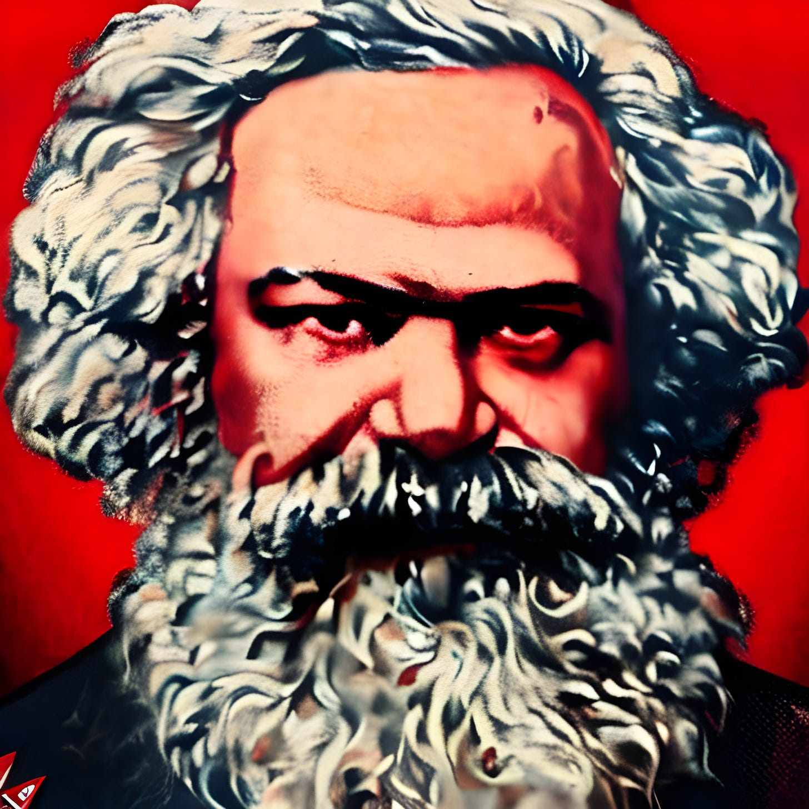
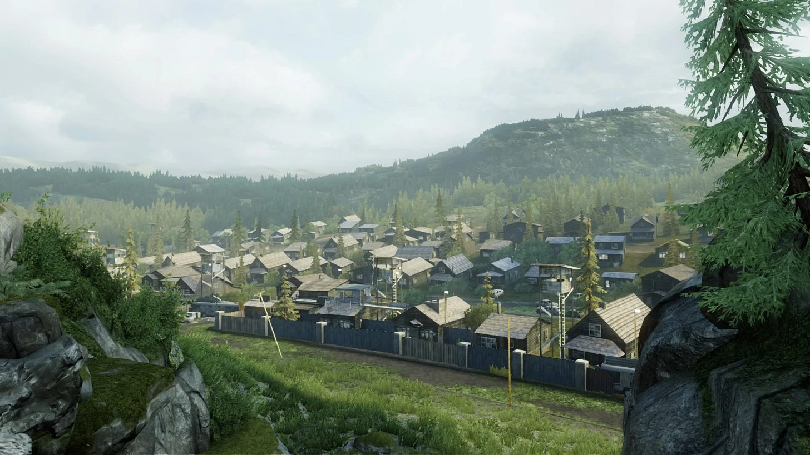
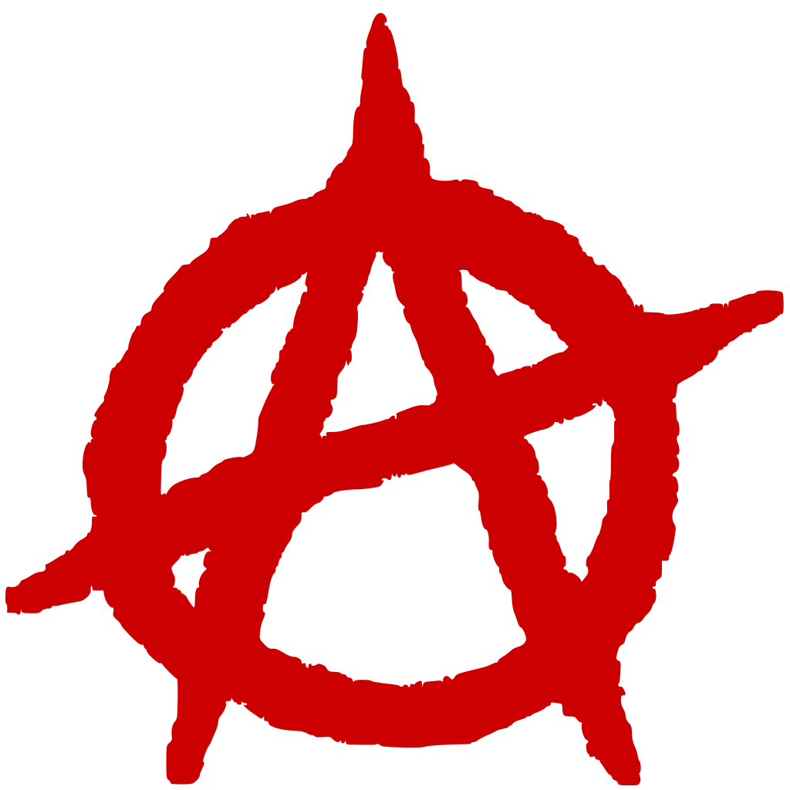
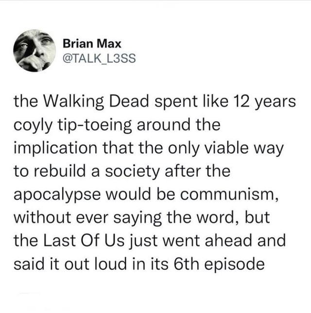

The Last Of Us, the popular video game and now television series, has never shied away from cultural and even political issues. As a game some right-wing players criticised its representation of gay relationships, just as some watchers of the television show did with its touching third episode. Its creators have not been afraid to challenge the legitimacy of despotic military rule either, and to call its enforcers out as Nazis.1 Much to the dismay of homophobes and fascists who consider this “woke-ness” and “political correctness.”

In the series we follow Joel, a jaded and disillusioned man who has fought dirty in the past to stay alive, but is now is trying to fulfil a deathbed promise to his partner to protect, Ellie, a precocious teen, who may be the cure to the plague which has ravaged humanity.

During their travels so far they have escaped the fascist FEDRA2 enclave of the Boston quarantine zone, and the militaristic dictatorship of Kansas City. In the latest episode - while searching for Joel's brother, Tommy - they encounter an entirely different kind of community in what was a suburb of Jackson, Wyoming.3 But after the collapse of the country, there is no more state of Wyoming, or United States for that matter.

After some initial caution is shown, Joel is reunited with Tommy, who with his partner, Maria, give a tour of the community they have helped build. It is a more peaceful, highly functional town, with more comforts than they have encountered so far, and Joel and Ellie are curious as to why that is. The dialogue describing the town functions and why that might be called have caused some controversy among commentators, for reasons that will become apparent from looking at the conversation between the visitors and their guides:

>  _Joel:_ How do you keep this place quiet? 
> 
> _Maria:_ Carefully. Being in the middle of nowhere helps. Not advertising what we have, staying off the radio. [Pointing to] House of worship, multi-faith. School. Laundry. Old bank works as the jail, not that we've needed it. 
> 
> _Joel:_ And you draw power from the dam? 
> 
> _Maria:_ Got that workin' a couple years ago. After that, sewage, plumbing, water heaters... lights. 
> 
> _Ellie:_ This place actually fսckin' works. 
> 
> _Ellie (to Maria):_ So are you, like, in charge? 
> 
> _Maria:_ No one person's in charge. I'm on the council. Democratically elected, serving 300 people, including children. Everyone pitches in. We rotate patrols, food prep, repairs, hunting, harvesting. Everything you see in our town ... greenhouses, livestock, all shared. 
> 
> _Tommy:_ Collective ownership. 
> 
> _Joel:_ So, uh, communism. _(scoffs)_
> 
> _Tommy:_ Nah. Nah, it ain't like that. 
> 
> _Maria:_ It is that. Literally. This is a commune. We're communists. 
> 
> _Ellie:_ No way!4

Tommy seems reticent to use the word Communist, especially around Joel who seems wary of the idea, whereas his partner Maria sees it as a plain and simple description of the type of community they are and the way it operates, and Ellie is delighted at the description. Not all viewers of the show were as amused.5

### Is The Town Of Jackson Communist?

This isn't a use of the word Communism people associate with China, or even of Cuba and Vietnam. This is a small community, a commune, where everyone lives “From each according to his ability, to each according to his needs.”6 So some have questioned whether this should be called Communism at all.

Karl Marx,7 its most prominent proponent, defined Communism as classless, moneyless, and stateless. That is without special privileges due to birth or wealth, without currency as a measure of value or a means of meeting needs, and without centralised rulers and power.8

Karl Marx

However, the word has often been associated with the Soviet Russia which was none of these. Why is this? Because Russia and China had revolutions in which a Communist party (a political group hoping one day to establish Communism) took power, and so in the public mind the word Communism came to mean what those countries became rather than the ideals their political parties were once founded on.

Yet those political parties never claimed to have ever achieved Communism9, and just promised to one day implement it. It could be argued that once they obtained power they took active steps to maintain their positions by preventing the Communist ideals they were founded on, although their supporters would say that if it weren't for outside opposition that they would have eventually achieved those goals.10

Either way calling something Communist doesn't make it Communist. The "Democratic Republic of North Korea" is not Democratic and arguably not a Republic. Likewise, America pledges itself to the ideal of "one nation, indivisible, with liberty and justice for all",11 but many people would agree still hasn't achieved that. Interestingly, the person who wrote those words in 1892, Francis Bellamy, was a Socialist, and hoped for a Socialist nation, but I doubt anyone would seriously argue that has been achieved either.

So this raises the question of has the community of Jackson achieved the ideals that those states did not? In order to answer this we need to look at each of the fundamental principles that define Communism one by one:

 **Is The Town Of Jackson Classless?** It would seem so. Maria tells us they have a “House of worship,” but is is “multi-faith.” So, there is no dominant religion dictating the rules people must live by. So it is not a theocracy.

Tommy tells us they have “Collective ownership.” So there are no landlords amassing property, collecting rent for their personal wealth, or giving them their crops like the feudal lords of old. Which leads us on to the next principle:

 **Is The Town Of Jackson Moneyless?** It would appear that this is the case too. “sewage, plumbing, water heaters” and “lights” are provided without any mention of them being based on ability to pay. 

And when it comes to access to these resources they are assured, “Everything you see in our town ... greenhouses, livestock, all shared.” This shared responsibility for essential services gives us another category that the town of Jackson may fulfil.

In Jackson, work isn't organised on the basis of wages, as Maria explains that: “Everyone pitches in. We rotate patrols, food prep, repairs, hunting, harvesting.” Everyone is involved and everyone benefits.12 Responsibilities are rotated as needed, and everything is shared according to need. This too is part and parcel of being a commune.

### Are Communes Communist?

The Town Of Jackson as imagined by the video game

The word commune comes from the french word for common, as in to have “all things in common” as the early Christians did in the book of Acts.13 Those in a commune live relatively closely together, and share resources and responsibilities. But unlike religious communes, which may have a leader and strict rules based on religious dogma, in other communes each member has equal say in decision-making.

> Joel: So, uh, communism. _(scoffs)_
> 
> Tommy: Nah. Nah, it ain't like that. 
> 
> Maria: It is that. Literally. This is a commune. We're communists. 

Is A Commune By Itself Communism? Communism ultimately is a commune of communes throughout the world, inter-related communities working with each other, without borders, and with the resources of the world shared responsibly between all. In that sense Jackson isn't achieving the full remit of Communism, but it is an embodiment of the ideal in practice. 

Who is to say that over time people from Jackson wouldn't start up other communities based on similar ideals, or help existing communities to follow Jackson's example, and all those communities cooperate together until Communism is established everywhere? If so there would no longer be any need for rulers or borders anywhere.

### Is The Town Of Jackson Stateless / Anarchist?

So is Jackson stateless then too? It seems probable. We are informed that: “No one person's in charge. I'm on the council. Democratically elected, serving 300 people, including children.” So even children aren't disenfranchised from having a say, and are considered part of the process.

Most Anarchists would agree that if a society is stateless & without rulers then it is anarchist.14 Anarchism simply means without hierarchy. It does not mean chaos, although some erroneously argue that without hierarchy that would be the inevitable result (a point I'll return to later). Many Anarchists, like Peter Kropotkin and Emma Goldman, were also Communists, meaning they didn't just want to remove rulers, but also money and classes.

To answer the question of whether the town of Jackson qualifies for this description fully we'd need to know what position and role the committee fulfils, and if they are given any special privilege or benefits, but seeing the emphasis given on everything being shared we may presume there is no distinction between co-ordinators and workers, clergy and laity, masters and servants. But it would be good to have answer to the question of “Who - if anyone - do they claim to represent?”, “What powers - if any - do they have?”, and “Can they be recalled and replaced immediately?”15

It could be argued that the isolation and outside threats, as well as the walls, operate as a defacto border. When it comes to their safety “Being in the middle of nowhere helps.” But is the fence for protection or is it a political border to keep people in, and is there any indication that they prohibit people going elsewhere? That Tommy could easily ask the gate to be opened for Joel, and that he was prepared to travel to Salt Lake City instead, would indicate they are primarily trying to keep the infected and raiders out.

The one thing that may give pause is that there is a prison, somewhere presumably a person is locked up against their will (at least for a brief period). But the description of it is telling: The “old bank works as the jail, not that we've needed it.” It has never been needed, and may never be.

So how is this all achieved? Surely, some would argue, wouldn't Anarchy - having no rulers - inevitably lead to chaos? To answer this we need only look at the famous Anarchist graffiti of an A surrounded by a circle. The circle is actually an O, standing for Organisation. For Anarchism to work within a community it needs a high level of involvement by everyone to have their say, to question and challenge, to make their contribution, and share accountability and responsibilities.16

Is such an autonomous community as Jackson all by itself Anarchist? Some would say that Anarchism isn't fully achieved its ideal - like trying to achieve communism in just one commune - when it is surrounded by outside forces which could undermine, limit and threaten it.

But an individual can believe in Anarchism, can exercise their autonomy and make decisions and take actions themselves individually, without regard or subservience to rulers and regimes. However, in the world we live in that can come with serious consequences, if the rights they exercise come up against the limitations a state places on them.

### Are Towns Like Jackson Possible?

So is this all just pie in the sky thinking then? Is it just an imaginative exercise? Why couldn't such a place exist?

The slogan “A better world is possible” has become a popular one, seen on graffiti, banners, and book titles. It stands against the nihilism of “capitalist realism” which claims that "there is no alternative" and this is as good as it gets.17

Yet humankind develops scientifically, evolutionarily and socially over time. It learns new techniques, and tries new forms of living, and some work better than others. Although, sometimes it may be in the interests of the rich and power for some solutions not to work, and some dysfunctional systems to continue.

Communities, even whole countries, which are based on cooperation and meeting essential needs are not only possible, they have existed in the past and - to some extent - are happening now. Historical examples include the Revolutionary Ukraine and Spain, and stateless areas such as Zomia.18 Present day Marinella, Spain would be a current example similar to fictional Jackson, and there are many such towns in Chiapas, Mexico and Kurdish Rojava.19

Some, like Sociologist David Graeber, believe that Anarchist co-operative communities have been the default for most of human history,20 and that this is the way the majority of our personal interactions are still carried out between family and friends in society today.21

For the director of this episode, Jasmila Žbanić, the town of Jackson was rooted in their experience of the siege of Sarjaevo:

> “We had to be on alert, we had to survive, we had to learn how to live without anything, without civilisation. There was no electricity, no food, nothing. But we managed to survive because of solidarity, and the way the city was restructured. You have to start from zero. That experience for me was something that I felt very close about Jackson. Its a community that functions, and I find it really beautiful and hopeful because I really believe even in the worst catastrophes, like war, I survived. People are able to keep the society. They are not always the enemy to each other.”22

Her experience showed her the worst and best of society, and that the most insecure of circumstances could lead to the best motivations and qualities of others. Likewise, The Last Of Us shows us that we are not just capable of our worst selves in the face of panic, fear and insecurity, but also capable of our best with co-operation, kindness and empathy. History has many examples of communities becoming closer as they face and deal with dangers and disasters.23

A better world, without the worst excesses of greed, hunger for power, and selfishness is not just a theoretic or fictional ideal, but a real and achievable goal. Although seeing and building it may just risk us being labeled Communists in the process.

 _If you are interested to learn about other Television Anarchists:_

Subscribe

[Share](https://peacefulrevolutionary.substack.com/p/the-last-of-us-town-of-jackson?utm_source=substack&utm_medium=email&utm_content=share&action=share)

 _#The Last Of Us #Communism #Communist #Commune #Anarchism #Anarchy #Anti-Capitalist #Anti-Capitalism #Socialism #Socialist #Utopia_

 **Footnotes**

1

Frank: “You live in a psycho bunker where 9/11 was an inside job, and, and the government are all Nazis.” Bill: “The government are all Nazis!” Frank: “Well, yeah, now! But not then!” (The Last Of Us, Episode 3, "Long, Long Time", 29 January 2023, HBO.)

2

Federal Disaster Response Agency.

3

The town of Jackson was not shown in the first game, although it was referred to. The game makers lacked the time and budget to include it then, but begin the sequel in the town. Luckily the television show wasn't under such constraints, and used the real town of Canmore, Alberta as the setting.

4

The Last Of Us, Episode 3, “Kin”, 19 February 2023, HBO. Written by Craig Mazin, based on the game and story by Neil Druckmann (2013)

5

Two articles were notable exceptions to this: “The Escapist's Darren Mooney and Inverse's Dais Johnston applauded the recognition of communism in Jackson as a refreshing subversion of post-apocalyptic stories.” Kin (The Last Of Us), Wikipedia entry.

6

August Becker, first wrote this phrase in his book, “What Do The Communists Want?”, in 1844, and described it as “the basic principle of communism.”

7

Karl Heinrich Marx (1818-1883) was a German philosopher and economist best-known for his 1848 pamphlet, "The Communist Manifesto." 

8

See Marx, Private Property and Communism, 1844 & Critique of The Gotha Programme, 1891.

9

“The Soviets didn't establish communism. They thought about it, but never did it.” Richard Wolff, as quoted in "USSR strayed from communism, say Economics professors", Daniel J. Fitzgibbons, The Campus Chronicle, 11 October 2002. This point is elaborated upon in "Class Theory and History: Capitalism and Communism in the USSR."

10

Vladimir Lenin began using the phrase "State Capitalism" to refer to part of the Soviet economy, at a Session of the All-Russia C.E.C. in 1918. 

11

Pledge Of Allegiance, Wikipedia entry. Note: Despite being written by a Christian minister, the words "under god" were not added until 1954.

12

This is also Socialism, which is “a political and economic theory of social organisation which advocates that the means of production, distribution, and exchange should be owned or regulated by the community as a whole.” (Google’s English dictionary, provided by Oxford Languages)

13

Acts 2:44 “And all those having believed were together the same, and having all things in common.” (Berean Literal Bible)

14

“The etymological origin of anarchism is from the Ancient Greek anarkhia, meaning ‘without a ruler’, composed of the prefix an- (‘without’) and the word arkhos (‘leader’ or ‘ruler’).” Anarchism, Wikipedia entry.

15

Democracy is seen as inadequate description for the direct involvement of people in the political process in Anarcho-Communism. Democracy as it is practiced in the world today is a system imposed by the state and limited to representatives who are often from or serve a ruling class.

16

But there is no obligation to be part of such a community, as the right not to be involved and to disassociate from others is part of Anarchism too.

17

“The widespread sense that not only is capitalism the only viable political and economic system, but also that it is now impossible even to imagine a coherent alternative to it.” Mark Fisher, Capitalist Realism: Is There No Alternative? 2009. The concept comes from Margaret Thatchers “There is no alternative” slogan, Conservative Women's Conference, 21 May 1980.

18

Revolutionary Ukraine (Makhnovshchina, 1917) and Spain (1936), and stateless areas such as Zomia (Southeat Asia). See the Wikipedia “List Of Stateless Societies” & “List Of Anarchist Societies.”

19

Marinaleda, Spain (1977) would be a current example similar to fictional Jackson, and there are many such towns in Chiapas, Mexico (1994) and Kurdish Rojava (Northeast Syria, 2012).

20

The Dawn of Everything: A New History of Humanity, David Graeber & David Wengrow, 2021, Penguin.

21

“[Are You An Anarchist? The Answer May Surprise You!](https://theanarchistlibrary.org/library/david-graeber-are-you-an-anarchist-the-answer-may-surprise-you)”, David Graeber, 2000.

22

‘The Last of Us’ Director on That Major ‘Part II’ Connection, Jordan Moreau, Variety, 19 February 2023.

23

Humankind: A Hopeful History, Rutger Bregman, 2019.

