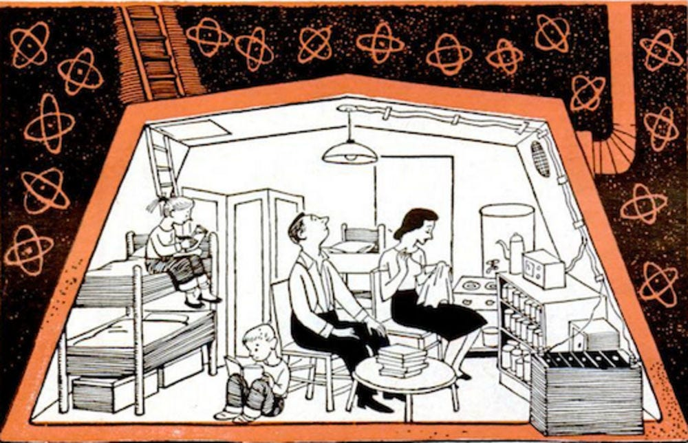
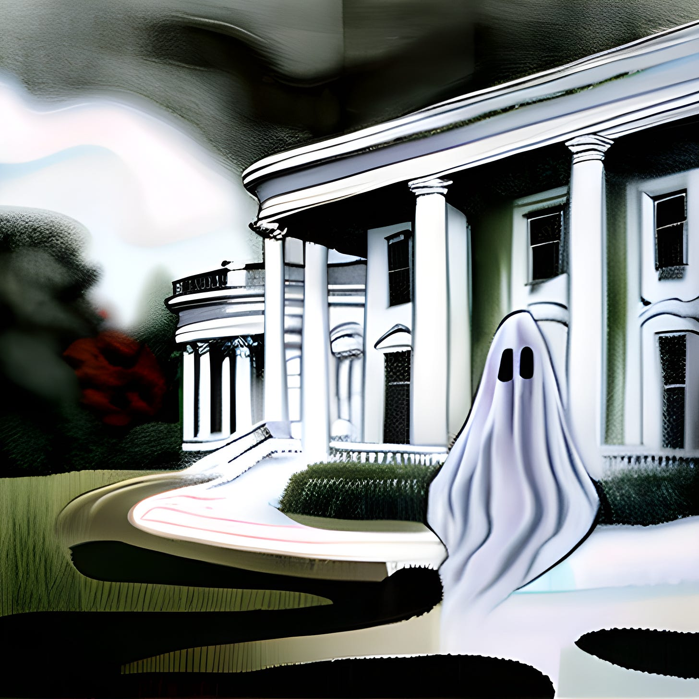
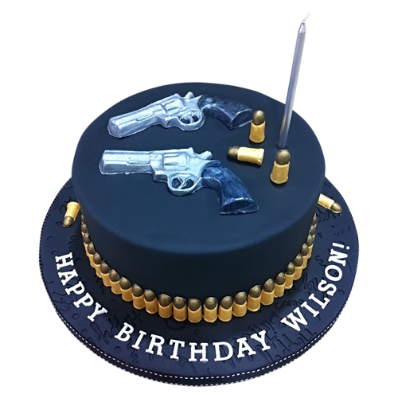
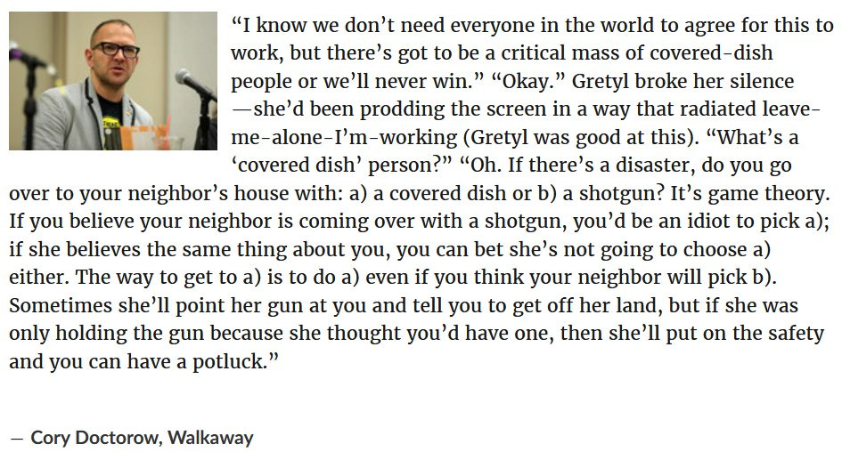
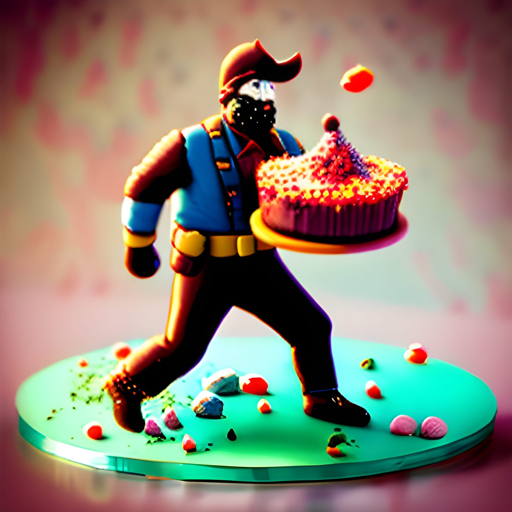
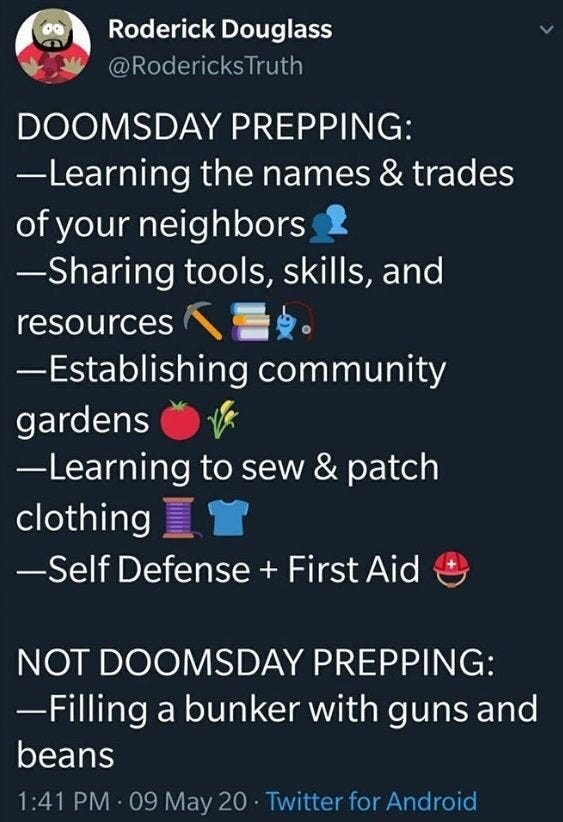
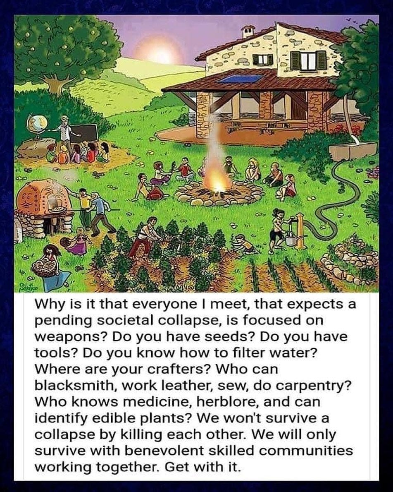
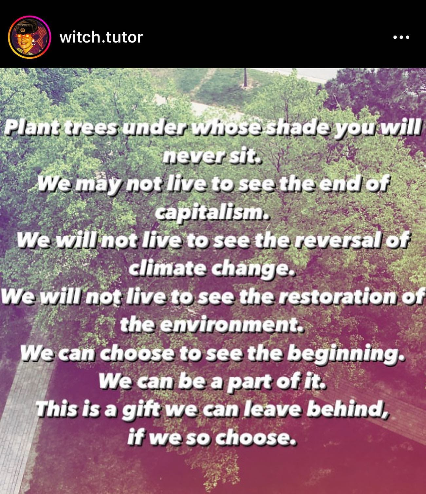
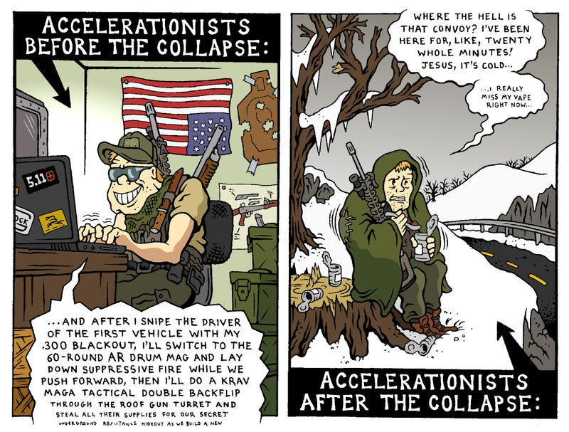

It seems like every film and television show at the moment has either superheros (including the TV script I just wrote which tries to subvert the genre) or people trying to survive some apocalypse, often one full of zombies. The video games I've been playing recently are both set after some societal collapse or worldwide catastrophe. In one I spend my time taking care of irradiated refuges in little communes I try to help them build, in another I play a cat winding gracefully through the wreckage of the ruined world, stopping to lick my paws and purr in between avoiding killer robots!1 Likewise the TV show I've been watching, The Last Of Us, which is based on a game of the same name, is about an America infected by a fungus, and a man protecting a young woman who may be the cure.2

## Post-Apocalyptic Bunker Blues

It seems I can't get away from these themes myself. I entered a competition to write my own adventure game and the theme was being stuck in an airlock, and the idea that came to mind was being initially trapped in a nuclear fallout shelter, having to find and fix the materials necessary to survive in the wasteland.3 Here is the opening line of the game to give you some idea what it is like to play:

> “You wake up alone, surrounded by the metal walls of the airlock, with only the dim emergency light overhead. You’re not sure how many hours It has been since Joe pushed you in the airlock, and you passed out through the effects of the smoke from the fire. He said he was still going to try to put it out, and deal with the damage from the earthquake that started it, now you worry now that he might not have made it. But the air in here won’t last forever, the survival suit you threw on had no helmet, and there is no way to open the external door without electricity, even if you dared to enter the wasteland without more protection.”

Most stories like this end up with warring factions, people barely avoiding getting eaten, and scavenging for the necessities of life. However, Rutger Bregmen in his book, Humankind, shows that is not what usually happens in real life when communities are faced with an emergency, in fact the opposite is true: they tend to pull together, co-operate, and survive by helping each other.4 But that doesn't make for as interesting a story it seems, although I've read a few recent books that show that more positive possibility.

Yet, people still seem to fear the worst, and I wonder if that has more to say about the world we live in now and what we have to do to adapt and survive in it, rather than how we'd live in a world where we could build ourselves (even if from the wreckage of the old one).

## The Day The Politicians Disappeared

This came to mind when I recently read an article predicting chaos for society without a government to rule it, which the author called an “anarchist thought experiment.”5 As an Anarchist myself the title caught my attention, but I was disappointed to find that they were using the word as synonym for chaos, and that the results they predicted of politicians disappearing were far worse than the dysfunctional world we live in now.

I began by asking, “So all the organisations that helped supply food, water, and electricity are still there? And there are no cataclysms that the populace is distracted with?”

Then gave my (admittedly hopeful) reply that: 

_[If we were to suddenly loose our politicians]_ ... it seems to me that people would just get on with keeping things running. The needs are still there, the resources are there, and the know-how is still there.

It is true that some groups (that have relied on certain luxuries due to inequality in money, property and privilege) will not be pleased and will try to undermine the new state of affairs, probably using the previously paid police and soldiers, and that would be the biggest threat. That would be a greater danger than some initial chaos.

But the people have the capacity to standup for themselves collectively, and I'd like to think they'd now feel empowered to organise and do so in a more direct manner than law ever allowed them to beforehand.

People still won't want children abused or gangs intimidating people etc., so they'll organise locally to prevent this. But most of the ‘crime’ comes from our economic system (drugs, inequality, lack of access to essentials, as well as people being disconnected from their local communities), so ultimately there should be a lot less to deal with.

We still have the means to protect ourselves 'nationally' too, and it would still be in our interests - maybe even more so - for us not to let those weapons be abused.

 _[And speaking particularly of the maintenance of Apple products (which the author seemed particularly worried about)]_ ... us geeks will still want to geek, and those who love their gadgets will still want them running, and over time we can re-establish the processes to maintaining a more sustainable tech ecosystem, with less of the environmental and social cost.6

Isn't this an unrealistic and overly idealistic way of looking at the end of the (modern) world? I'm not convinced it is. The Covid Pandemic led to empty streets that looked like scenes from a zombie movies, but behind the scenes networks of mutual aid sprang up, and the best instincts of people were seen in ensuring the needs of the elderly and vulnerable were met.

Peter (or Pyotr) Kropotkin, the prince turned evolutionary scientist turned revolutionary, showed from nature that all creatures survive and thrive through the kind of co-operation he called Mutual Aid. This was in contrast to Thomas Hobbes idea of “solitary, poor, nasty, brutish, and short” idea of a mankind that needed to be ruled, Herbert Spencer's “survival of the fittest” economic narrative of history (later embodied by Ayn Rand's “Virtue Of Selfishness”, or Thomas Huxley's “nature, red in tooth and claw” view of natural selection. Yet it has been proven true by eminent biologist Stephen Jay Gould, and even admitted to by Richard Dawkins in a revision to his book, The Selfish Gene.7

We are beginning to see modern science fiction literature looking at the near future reflect this kind of optimism too, which novels such as Station 11, The Fifth Sacred Thing, Engine Summer, and Ecotopia, as well as the new Solarpunk literary movement.8

Some political commentators too have seen the possibility of collapse as a potential opportunity in the long term process of creating a better world. The book Desert speaks to this idea and develops it.9 Of course it would be wonderful to avoid the end of the world as we know it, and failing that to be perfectly prepared for it, to even have another system ready to take over the old one (ideally before the world ever gets apocalyptic), but there is nothing like catastrophe to spur people into action.

## Cake vs Gun

My philosophy is that if we are scared and insecure we will tend to focus on dangers and be cynical of others, to expect the worst and to anticipate conflict. This brings me to my “Cake vs Gun” theory of post-apocalyptic survival. I thought I heard this somewhere, but since I can't find a source I'm going to claim it as my own:10

Imagine society has collapsed and you have been separated from other people. You have a little food, but not enough to last for long without venturing out. You realise that you will need to find more provisions to survive, so you set out to explore the old neighbourhoods around you. You are unsure how many other are alive and may still be there, and have a choice to make: You can take your old rusty shotgun with you, holding it ready to fire, showing that you are ready for a fight; or you can take some of your remaining ingredients and bake a cake, holding it in front of you, showing that you come in peace and in hope of friendship. 

So which do you choose? If you choose the shotgun you'll be ready for someone if they try to attack you, but they will see someone coming toward them with a shotgun and will feel threatened, and decide you are a threat too. However, if you come bearing cake, everybody loves cake, and no one ever felt scared by cake, and cake can be shared, makes friends quickly, and says we're in this together. So I believe if you want to live in a world of cake take a cake!

Now of course some will argue that you can always be tough first and negotiate cake later, but that just creates a feeling of fear and suspicion, and to live in that state creates anxiety and makes it harder to feel and peace and be happy. There will always be some who hate cake, some who hate others, and some who will take a cake without asking, but they are the minority. You can always make another cake, but when you choose to share that cake you are deciding the kind of world you want to live in.

PostScript -

I think I discovered where this idea came from:

Subscribe

[Share](https://peacefulrevolutionary.substack.com/p/cake-vs-guns?utm_source=substack&utm_medium=email&utm_content=share&action=share)

To those discouraged with humanity, this might be a good follow up article - <https://peacefulrevolutionary.substack.com/p/were-we-born-evil-or-did-capitalism>

1

Fallout 4, Bethesda Game Studios, 2015.   
Stray, BlueTwelve Studio, 2022.

2

The Last Of Us, Naughty Dog Studios, 2013. A scene from the television adaptation of the game was the topic of my previous article: [The Last Of Us' Utopian Town Of Jackson](https://peacefulrevolutionary.substack.com/p/the-last-of-us-town-of-jackson).

3

[Puny Inform Jam #3](https://itch.io/jam/punyjam-3).

4

Humankind: A Hopeful History, Rutger Bregman, 2019.

5

[Goodhart’s Law](https://medium.com/@goodhartslaw/the-anarchist-thought-experiment-6ed05f24ca50), Medium, 14 April, 2020. 

6

Edited for readability.

7

Mutual Aid: A Factor of Evolution, Peter Kropotkin, 1902.  
For the views of Hobbes, Spencer, Rand and Huxley see Wikipedia entries under their names.   
Apologies to Tennyson for misquoting his poem In Memoriam LVI, but I felt it characterised Thomas Huxley's view of evolution quite well.  
See Gould, “[Kropotkin Was No Crackpot](https://philpapers.org/rec/GOUKWN)”.

8

Station 11, Emily St. John Mandel, 2014.  
The Fifth Sacred Thing, Miriam Simos, 1993.  
Engine Summer, John Crowley, 1979.  
Ecotopia, Ernest Callenbach, 1975.

9

[Desert](https://theanarchistlibrary.org/library/anonymous-desert), Anonymous, 2011.

10

Let me know if you find the source and I’ll give credit where it’s due.

Update: Looks like the concept came from Cory Doctorow’s novel, “Walkaway”

