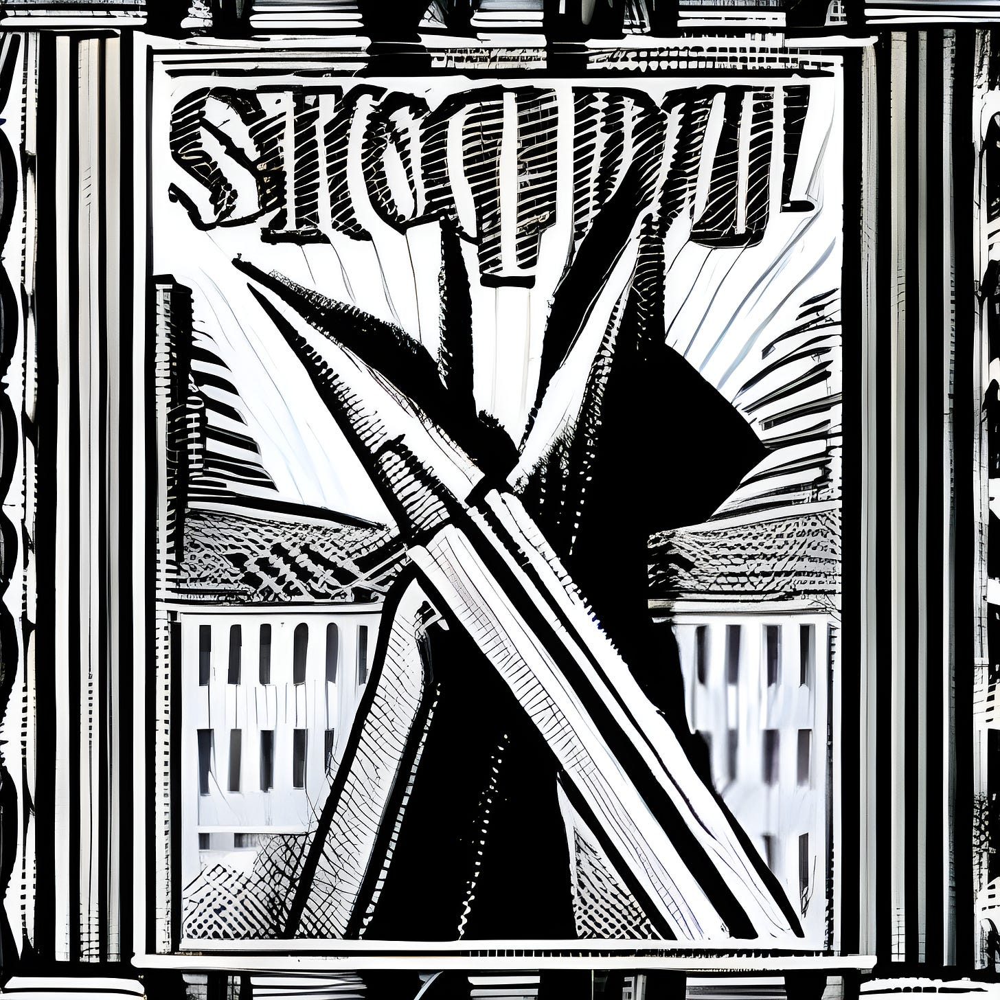

The offending article — Is this a Capitalist or Socialist pencil?

You may have heard the story of how NASA spent millions developing a pen that would write at any angle in the weightlessness of space, or that the Russians saved the money and just used pencils instead.

It is a great story of American ingenuity versus Soviet practicality. The one story is used to sell a certain make of pens;1 the other is used to humorously point out that ingenuity doesn’t always lead to solutions that are better or cheaper.

However, neither story is true.2

Economist Milton Friedman, would have loved the first story: He came up with a very similar one about how only capitalism could produce a pencil. I’m guessing he didn’t hear the Soviet pencils part of the story, or just chose to ignore the existence of pencil factories in Russia.3

Milton argued that because making a pencil required materials and people gathering them from different parts of the world, brought together without being under the command of one central organisation, this showed how efficient and harmonious the capitalist free market was:

>  _“Look at this lead pencil. There’s not a single person in the world who could make this pencil. Remarkable statement? Not at all. The wood from which it is made, for all I know, comes from a tree that was cut down in the state of Washington. To cut down that tree, it took a saw. To make the saw, it took steel. To make steel, it took iron ore. This black centre — we call it lead but it’s really graphite, compressed graphite — I’m not sure where it comes from, but I think it comes from some mines in South America. … Literally thousands of people co-operated to make this pencil. People who don’t speak the same language, who practice different religions, who might hate one another if they ever met! When you go down to the store and buy this pencil, you are in effect trading a few minutes of your time for a few seconds of the time of all those thousands of people. What brought them together and induced them to cooperate to make this pencil? There was no commissar sending … out orders from some central office. It was the magic of the price system: the impersonal operation of prices that brought them together and got them to cooperate, to make this pencil, so you could have it for a trifling sum. That is why the operation of the free market is so essential. Not only to promote productive efficiency, but even more to foster harmony and peace among the peoples of the world.”_4

Supposedly at each point of this perfect chain there were no child workers, no sweatshops, no prison labour, no unsafe conditions down the graphite mines. At least he doesn’t mention them. Just everyone voluntarily working for low wages, without doing so under the fear of starving or losing their homes.

He even claimed that this system made the world more peaceful. Ironically, Mr. Friedman supported the dictator Augustus Pinochet who overthrew the democratic country of Chile,5 so maybe we shouldn’t take his views on peace and freedom too seriously.

When it comes to the process of making pencils in the modern world he is right: this is how the typical pencil is manufactured today. But they weren’t always made that way, their history predates the existence of capitalism by several hundred years.6 Yet Milton didn’t let inconvenient facts get in the way of a good story.

 **Why pencils? Because everyone has used one.**

It may have been when they were at school, or because they are easily and cheaply available, and the ones his readers were most likely to be acquainted with went by American manufacturer’s names (even the ones made in China or Soviet Russia).7

Milton borrowed this tale from his Libertarian economist mentor, Leonard E. Read,8 and it has since been turned into a children’s book to inspire a new generation of young capitalists.

One can imagine a school boy in Florida being told this story as part of their mandatory school class on anti-Communism (the only required class in the whole school curriculum)9 looking down at the pencil on their desk, and thinking “Wow, I’m lucky to live in a country that made this possible.” Maybe he’ll go on to fight in Vietnam for that freedom, unaware that the Viet Cong are using Communist pencils to draw up their plans against the American army they’d ultimately defeat.

Most pencils are cheaply-produced low quality writing instruments, the filament breaks easily as does the wood around it. But they work well enough for occasionally jotting something down, and aren’t used enough for many people to care (or to perhaps seek out a better solution).

Pencils have several advantages over pens: they are easily erasable, you can shade with them, they are better for the environment, and they are like worms: you can break one in half and you’ll have two of them that both work (once you sharpen the other half — which is something you shouldn’t do with worms, or break them in half for that matter).

People who take pride in writing great amounts by hand — not the calligraphers who write very little but do so beautifully, but those writers who fill pads of paper with their novels — are very particular about their pencils. They pay a premium for a higher quality pencil. Pencils that travel more easily when pressed upon a blank page, which are less likely to smudge and are easier to erase, that can take more sustained use and work better under whatever pressure the hand exerts, and that even give more rewarding feedback with every stroke.10

Even the most ardent Socialist would admit that it takes a lot to make a pencil these days, and here is where Milton might say “gotcha”. For if it takes a world to make a pencil, and we live in a capitalist world, he would argue it must therefore prove it take a capitalist world to make it possible.

A world without pencils wouldn’t be worth thinking about would it? Yet mankind somehow survived without them for the majority of its history. Writing began on tablets of the clay and occasionally stone variety, then eventually moving to chalk tablets in early American schools, which often have tablets of a more digital form today.11 So in both ancient and modern times parents complained they just couldn’t get their kids off their tablets.

But pencils certainly are convenient and have served an important purpose. I may have even used a commercially made one in the writing of this, so surely have no right to criticise them. Yet, who knows what other, and maybe better tool for recording our thoughts, we might have created in a more co-operative world, perhaps something more easily made locally, more sustainable, and more reliable.

 **Making A Socialist Pencil**

This is where Milton’s arguments fall flat. There is no reason that socialism — even a decentralised version — couldn’t make a pencil if it wanted to, and I’d argue they’d have more incentive to make a better one, without the lives of those at each part of the process being exploited.

Socialists like to write — this is evident by all the pamphlets, articles, books, and wordy broadsides they make to explain their positions. Who hasn’t heard of the Communist Manifesto, with at least half a billion copies out there?12

Not every socialist has access to a printing press. People talk about freedom of the press, but not everyone can afford one, and even if they could, writing starts off with one person putting words down on paper, and they want to be able to do so as quickly as the thoughts leave their brain, so prefer an easy and affordable tool to achieve this.

So if we take it for granted that a pencil is the ideal entry-level piece of writing equipment, then how would a pencil get made in a decentralised Socialist world?13 Where would the materials come from? What would the incentives to make one be? And how would it be distributed and be made accessible?

Mining graphite is a messy business. If done in an open pit mine, it scars the earth, and if done below ground it endangers workers. The mines are primarily in China, Brazil, Canada, India, Mozambique, Ukraine, and Russia.14 That covers every continent, and every kind of political system (that they have mined under at one time or another).

For people to do such arduous and risky work, surely they must be paid handsomely and their work limited to ensure safety? Yet we find that actually it is an industry that often involves children as young as 7, some of whom have been sold into slavery.15 Capitalism doesn’t seem to mind buying the product of their labours so cheaply, but Socialism, at least the kind that lives up to its co-operative ideals, demands a democratic workplace in which the labourers equally share in the work, management and profits of their labour.16

This would entail adults making the decisions that impact them, instead of acting out of fear of task masters or starvation. Undoubtedly the owners of the mine currently take the lion’s share of the profits, but these would be shared more equitably to everyone who takes part in the process.

The miners would still have an incentive to mine graphite because they are performing an important task the world needs, but would do so more safely and happily, knowing their children spend their days using pencils at school, instead of being forced to work alongside them.

Likewise the loggers would be remunerated better, work more safely, and would ensure a more sustainable wood supply. Then the factory workers would bring these elements together to produce pencils they could be proud of.

I’d argue that not having to make profits every step of the way might keep the waste and costs down. No-one would destroy pencils when there was a glut in the market to keep the price higher, no advantage in pencil production would be out of reach because of restrictive patents, and a workforce that feels more involved and invested in, would make higher quality more reliable products.

Yet if graphite was too costly on human health to produce then we’d just have to find other alternatives, but under Socialism there would be the human incentive to do so even if it cost more.17 Maybe the price of a pencil would go up (if we were still using money to determine value), but then the result is that we might see what the true cost of producing a pencil humanely might be.

This same principle would apply to computers. It’s the same process with a few added layers: Reliance on the skills and resources of many from across the world. But in Socialism there is the incentive to do this sustainably, instead of being focused on short term high returns for shareholders that may lead to destroying health, communities and the environment.

Who knows how much more could have been achieved if we took the need to satisfy and pacify the super rich pencil factory owners out of the way? If we invented and made things for their human benefit and not the ability of the rich to profit off of them? We might have surpassed the pencil long before now, or maybe we would have focused more on what it was capable of, and would have realised it’s potential as an instrument of expression far more than we have already.

Subscribe

#Capitalism #Capitalist #Socialism #Socialist #Milton Friedman

 **Footnotes**

1

The Fisher Space Pen.

2

Americans original used pencils and Soviets ultimately used pens too. <https://en.wikipedia.org/wiki/Writing_in_space>

3

Founded in 1926, Krasin Pencil Factory is the oldest Russian manufacturer of writing instruments still in operation today.

4

Milton Friedman, Free To Choose, Episode 1, 1980.

5

<https://en.wikipedia.org/wiki/Miracle_of_Chile>

6

<https://en.wikipedia.org/wiki/Pencil>

7

There was an American pencil factory set up by Armand Hammer in Russia during the cold war. More than half of pencils come from China.

8

 _I, Pencil,_ was first published By Read in 1958.

9

<https://www.edweek.org/ew/articles/1983/05/18/03200014.h02.html>

10

High end pencils include by makers such as Palomino, Mitsubishi (no not that one), Tombow, Dixon, and Koh-i-Noor.

11

<https://en.wikipedia.org/wiki/Clay_tablet> & <https://en.wikipedia.org/wiki/Slate_(writing)>

12

<https://en.wikipedia.org/wiki/The_Communist_Manifesto>

13

For the sake of brevity I have not included the erasers that often live at the end of school pencils within this article. Pencils didn’t always have erasers (or rubbers as they are called in England). It could be argued that they are better off without them: Erasers not only remove accountability and history, there is no undo or redo button for them, no tracking of changes, no creative editing marks around mistakes, no way to see the mental process that produced what’s on the page.

14

<https://en.wikipedia.org/wiki/Graphite>

15

<https://www.theguardian.com/global-development/2016/jan/19/children-as-young-as-seven-mining-cobalt-for-use-in-smartphones-says-amnesty>

16

“so’cialism _noun_ The theory, principle, or scheme of social organization which places the means of production of wealth and distribution of that wealth in the hands of the community.” _(Chambers dictionary, 13th edition)_

17

Subsequently to writing this article I discovered that ‘everlasting’ pencils do exist. Da Vinci used a silver version, but the modern ones are made of aluminium or other alloys (such as tin and bismuth), the cheapest cost £2 / $2 each and last as long as 100 normal pencils, whereas more expensive ones will last a lifetime.
