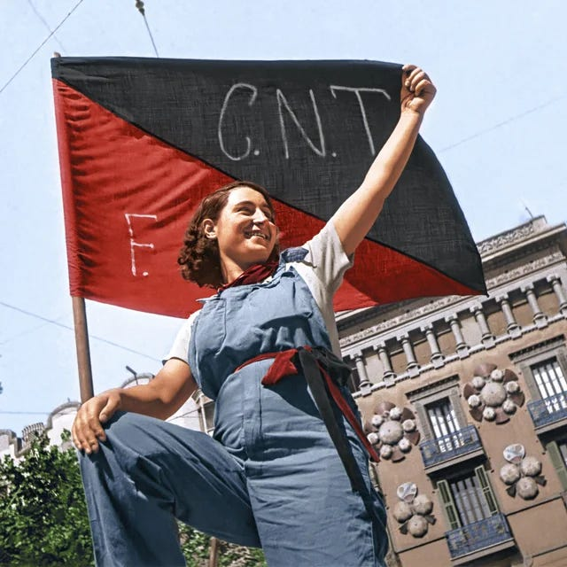

This May Day was supposed to be different. Millions of people had planned to commemorate it with a march on Washington. Then there were the rumors that it wasn’t going to stop at the steps of the capital, but carry on into the chambers of power themselves. There was also talk of a sit-in at every major government institution, that would last until power was turned back to the people.

But the planned revolution didn’t happen. It was cancelled due to lack of interest. At least that is the story being told in the few major news outlets covering this at all. 

CNN stated that local solidarity marches on state capitals had disappointing turnouts, but that constituents had sent an unusually high number of letters to their representatives, who promised to listen carefully to their grievances.

MSNBC interviewed a Democratic party spokeswoman who commented that the “Progressive surge” that was once predicted had turned out to be more of a whimper, just as she always expected.

Fox News spoke of a few paid protestors who had made it as far as the nation’s capital, but were arrested quickly for causing public disorder. But no other network even mentioned the disturbance.

An earlier draft edition of the Washington Post had the headline of “Dissent Descends On D.C.” But this reporter has failed to obtain a copy of the text that accompanied it, and the lead story that replaced it related to Amazon’s new headquarters, with no mention of objections to that either.

Earlier in the week it seemed that every social media platform was full of talk about how the oligarchs and their lackeys would be removed from their places, but nothing seemed to take place beyond words, and even those words are hard to find now. I have searched my own news feeds, which I thought were full of such sentiments a few days ago, and can only find fleeting references now, which seem to have been much tamer than I remembered them.

I tried contacting the different organizers of the planned events, but have yet to receive a response. When I asked friends I found that they each told a similar story:

> “I posted the details to the Facebook group, but somehow most of the members didn’t see it.”
> 
> “I tweeted about it, but my tweets seem to have gotten buried by other posts that I guess my readers felt were more important.”
> 
> “Gmail categorized emails I was sent about this as Spam, so I just didn’t see them.”

Others complained about signal outages on their Verizon or AT&T network, and power outages in some areas that prevented them seeing any messages.

Even when a wireless connection was not a problem (as it had been on CenturyLink) some apps which they used for chatting would stop working, but then again such devices are not always reliable, and several web providers like GoDaddy were having problems with their servers which affected many protest websites too.

But others did receive messages: about Meetups and marches being cancelled, about other important things that demanded their attention.

Several people were annoyed at being asked to travel hundreds of miles at the same time gas prices just went up, or set out only to be turned back by warnings of major accidents or unusual weather reported on the roads via Apple Maps.

One state had sent children home due to an unexpected health scare, with one charter school even having to send the child of one leading protestor to hospital for additional checkups.

But maybe others just found it more tempting to stay in for the surprise Star Wars movie marathon on Xfinity.

Bloggers seemed to busy to blog, podcasts were a little delayed, but Youtube was full of a new series of funny cat videos that kept teens distracted.

But what if there had been a revolution? When it came to that possibility the answers from those I asked were less equivocal:

> “If it had been announced on social media I would have gone.”
> 
> “If the news had reported it I would have done something.”
> 
> “if I’d received a message a day before then I would have at least considered going.”

The revolution wasn't televised, but it wasn't posted online either, and so no one took it seriously, no-one knew about it, and no-one showed up. Somehow the messages didn’t get through the invisible digital pathways that connect us all, and one wonders what might have happened if they had, or if we’d instead relied on networks of people, human social networks, as we did in ages past.

Yet, as a statement from the newly reformed White House Council on Technology affirmed today, “it is a good time for innovation and deregulation”. It’s signatories, which include such notables as Zuckerberg, Bezos, Musk, and Cook, are speaking of a new era of cooperation for their corporations and the government. But that news may be little comfort to the many who struggle working two jobs to pay rent and put food on the table, and who, for a little while earlier this week, imagined taking more radical steps toward a better America.

 _[You know we can’t publish this so why waste your time trying. It’s a non-story. - Ed]_

Subscribe

 **See** —

  * https://rdi.org/twitters-dictator-problem/

  * https://www.middleeasteye.net/opinion/twitter-complicit-repression-middle-east

  * https://www.washingtonpost.com/news/democracy-post/wp/2018/04/13/why-dictators-love-facebook/

  * https://www.abc.net.au/news/2021-04-29/facebook-whistleblower-sophie-zhang-government-manipulation/100103408

  * https://www.newyorker.com/tech/annals-of-technology/google-search-results-dictator-not-found

  * https://journals.sagepub.com/doi/full/10.1177/0010414020912278

Colourised image credit: https://www.reddit.com/r/SocialistRA/comments/uwnodr/this_colorized_pictures_of_the_spanish_revolution/

Tags: #revolution #censorship #privacy

Thanks for reading Free Society! Subscribe for free to receive new posts and support my work.

Subscribe
