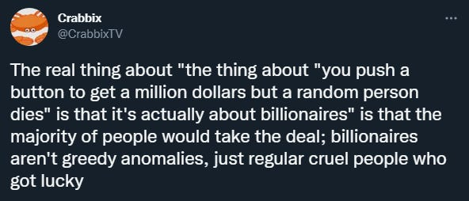
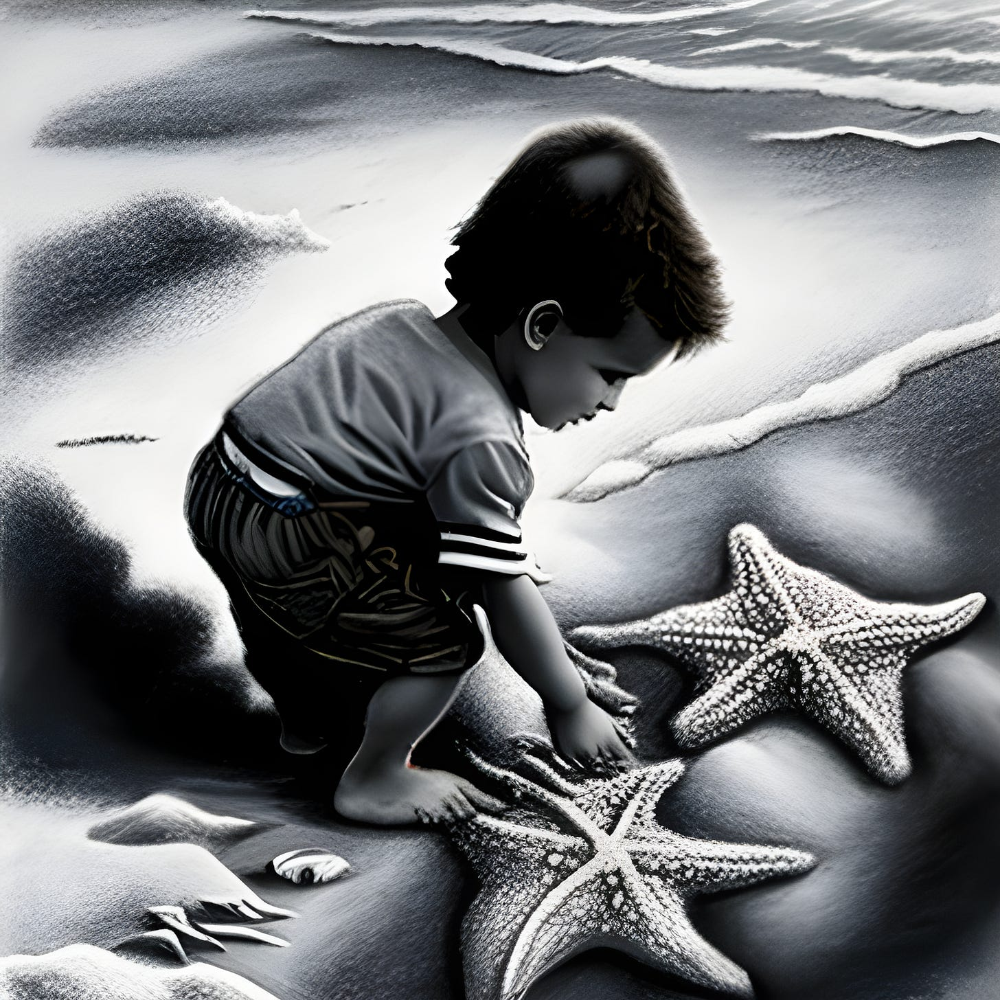

I saw a post on Reddit that reminded me that hope can be hard, yet is a defiant, rebellious action. Someone brought up that they believed everyone would do wrong if there were no consequences for them, no way of being found out, and I objected to that idea.1 I told them:

>  _I don’t agree that all or even most people are sociopaths or that selfish. I believe Sociopaths and Narcissists tell themselves that to justify their actions._
> 
>  _Our capitalist society leaves us insecure and fearful and that encourages anxious and reactive behaviours, but there are lines I’d like to think that the average person wouldn’t cross – at least not without some kind of coercion (as per the Milgram experiment etc.)._

They weren’t convinced, so I elaborated further:

I see the world’s worst problems as caused by a relatively small number who are too blindly selfish to see or care about the damage of their actions, and who are supported by those whose fear leads them to uphold such people (which sadly includes most of us to a certain extent).

But I hold out hope because there are more of us than there are of them, and each day we perform acts of love and kindness that don’t enrich and empower them: loving and helping our significant others, our children, friends, and even sometimes strangers – without pay or status from it. This undermines the sociopaths who have taken power, who have stolen it and resources (such as materials, time, and work) from us.

The problem with sociopathic power is that it is never satisfied, it always needs to take more, to the point that it will risk its own existence rather than stop grasping for greater wealth and power. So I believe it will ultimately collapse under its own weight (ideally with us being prepared and ready and maybe helping that process). 

I’d agree that the current situations society finds itself in don’t bring out the best in us. That seems to be the whole point of the Anti-Work / Anti-Capitalist / Pro-Environment / Pro-Equality / Co-operate movement – that bad conditions lead to bad outcomes, that we have an internal sense of goodness and fairness that knows that this system isn’t right for us or others. But this means that the reverse is true – good conditions lead to good outcomes. So if we can meet hate with kindness, selfishness with generosity, alienation with acceptance then there is reason for hope. 

Hopefully we keep enough goodness in us to co-operate together when they fall, and enough wisdom to ensure such people aren’t given the chance to rise again. There is a lot we can do to undermine their power and to be ready for (and make) opportunities to obtain power collectively when we can. If we can grow in solidarity, in combining our efforts, in providing alternatives we can leave the rulers and hoarders of wealth and power behind.

But either way I believe that their days are number, our numbers are growing, and our time is coming. The alternative doesn’t bear thinking of.

## Human Nature

In the original post a tweet was shared that said:2

But, if the majority of people were so selfish as to be willing to kill someone else for a million dollars by pressing such a button - then it would still be in everyones interest for the button to be destroyed (because the button could kill anyone).

Likewise a system in which there are only few billionaires at the expense of almost everyone else being poor is a system which shouldn't exist either, because there is no need for anyone to be poor as there is more than enough if not hoarded by a few, and no-one wants to be poor (even if it were true that most want to be millionaires).

If we are as cruel as the author claims then it would be better if the system / society did everything it could to restrict such cruelty, greed and selfishness, for the sake of the vast majority who are more likely to be victims than perpetrators?

But those with the billions try to convince the rest that there is no other way, that anyone can be a billionaire someday, and that such a button (capitalism, imperialism, coercion, exploitation) is an inescapable evil. Of course it is in their interests to say that.

## Fears & Fighting Them

I have fears too — Capitalism could survive for a lot more generations if it acted more in its own long term interests (if it wasn't so determined to eat it's own children, especially the ones needed to support and buy from the capitalists to produce their profits).

We could enter a stage of neo-feudalism for a while serving our corporate overlords, while living in their company towns and buying from their company stores. So much for their lauded (by largely illusionary) 'free' market if that happens.

The fascists could win and enforce some kind of totalitarianism. I think this quite unlikely - especially in the long term - due to so many of the environmentally minded people I know having at least left-wing ideals and disgust of right-wing ones. But the left has been co-opted before, and maybe this could be a new rationale to do it under.

Or in the midst of collapse - even with mutual needs and co-operation being the best and most practical way to survive - the long term effects of capitalism upon us will leave us too frightened to work together and to insecure to share, even if it means us dying alone rather than living together.

But this puts the responsibility on me to raise awareness of the positive possibilities, the practical good alternatives, and to try to be in place to be part of the solution and help with whatever solutions I can now.

That is why — We have to start building the alternatives and be prepared for the opportunities and grasp hold of and enjoy the freedom we can gain and maintain already.

We can join and have solidarity with those like-minded comrades already doing this, help educate others and expand awareness, support cooperative and collective alternatives to oppression, coercion and exploitation, resist and subvert the current system and lessen it's power, and undermine it's dictatorial structures through prefiguration, dual power, and direct action.

The people and movements I admired in history were those who opposed slavery and helped free slaves, or those slaves who rose up and fought back, or escaped and helped others to escape. They were fighting against a system that claimed to be divinely appointed, supposedly majority supported, without which it was argued would lead to financial collapse.

To those slaves who found allies, supporters and fellow fighters against slavery the efforts of those who fought the system made all the difference, and the world changed – although we still have a ways to go.

## Making A Difference

But what if there are only a few of us? Can we still make a difference?

>  _Once upon a time, there was an old man who used to go to the ocean to do his writing. He had a habit of walking on the beach every morning before he began his work. Early one morning, he was walking along the shore after a big storm had passed and found the vast beach littered with starfish as far as the eye could see, stretching in both directions._
> 
>  _Off in the distance, the old man noticed a small boy approaching. As the boy walked, he paused every so often and as he grew closer, the man could see that he was occasionally bending down to pick up an object and throw it into the sea. The boy came closer still and the man called out, “Good morning! May I ask what it is that you are doing?”_
> 
>  _The young boy paused, looked up, and replied “Throwing starfish into the ocean. The tide has washed them up onto the beach and they can’t return to the sea by themselves,” the youth replied. “When the sun gets high, they will die, unless I throw them back into the water.”_
> 
>  _The old man replied, “But there must be tens of thousands of starfish on this beach. I’m afraid you won’t really be able to make much of a difference.”_
> 
>  _The boy bent down, picked up yet another starfish and threw it as far as he could into the ocean. Then he turned, smiled and said, “It made a difference to that one!”_
> 
>  _ **(The Star Thrower, Loren Eiseley)**_

Subscribe

[Share](https://peacefulrevolutionary.substack.com/p/reasons-to-be-hopeful?utm_source=substack&utm_medium=email&utm_content=share&action=share)

 _I’d encourage you to read “Humankind” by Rutger Bregman, or “Survival Of The Nicest” by Stefan Klein, or “Mutual Aid” by Peter Kropotkin to see a different view of the world._

 _Some more thoughts on my hopes -_

1

https://www.reddit.com/r/antiwork/comments/xruvko/a_counterpoint/

Original comments edited into this article.

2
