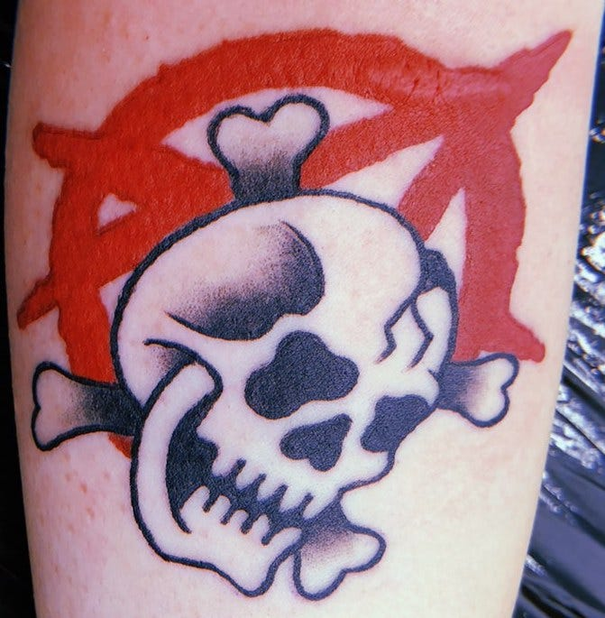
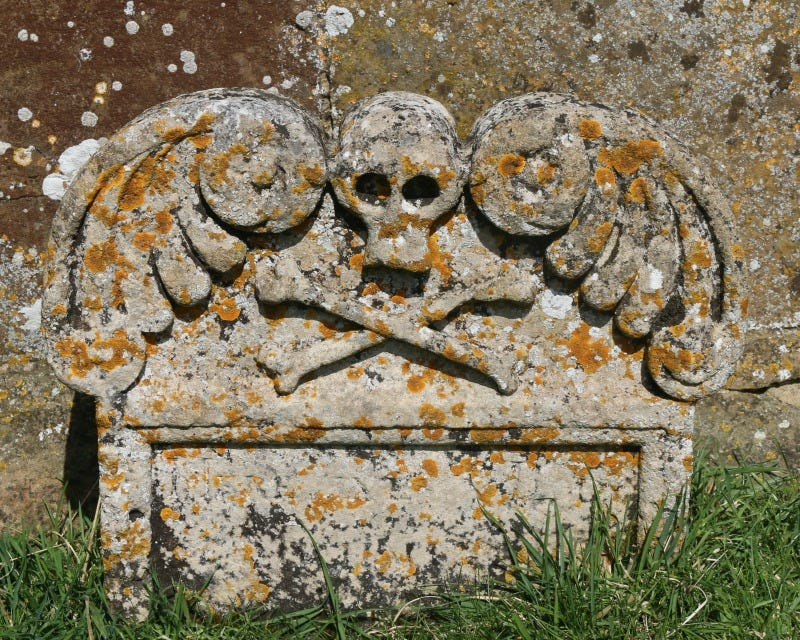
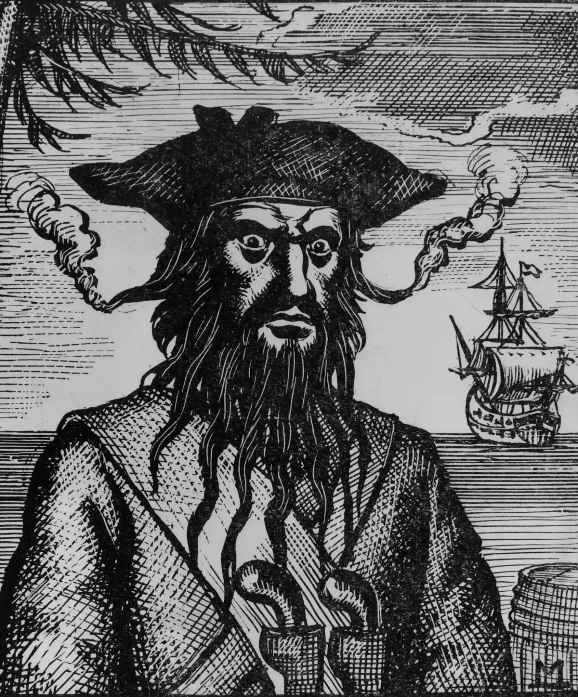
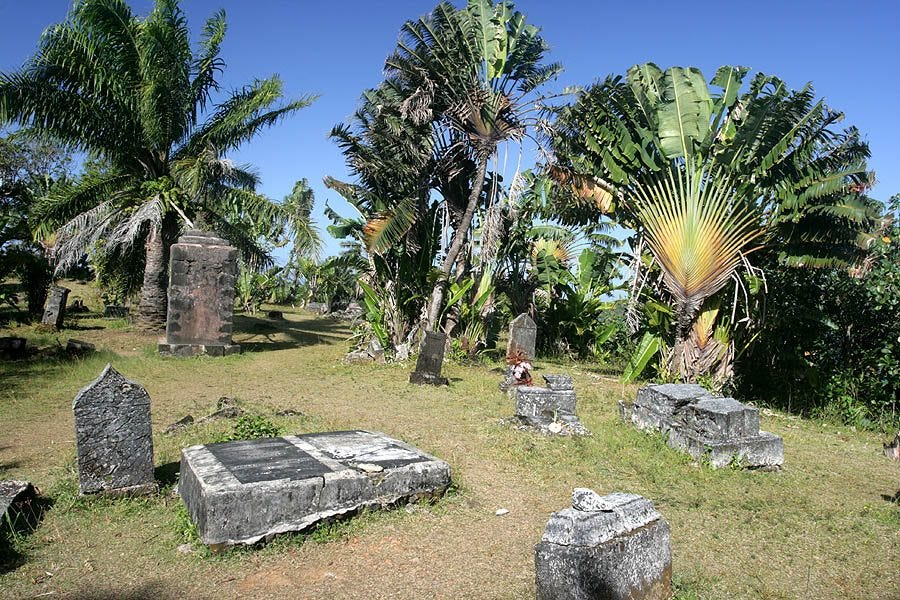
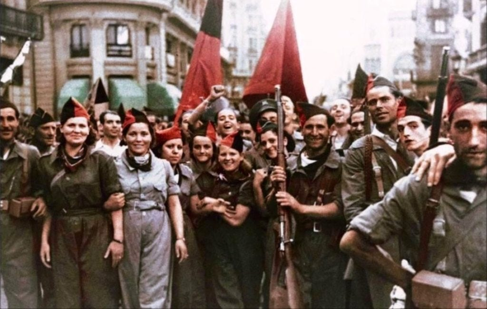
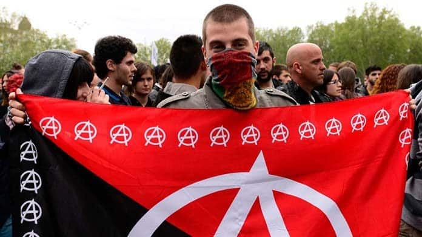

This time of year my arms are hidden underneath a warm coat, but when the sun comes out and it is t-shirt weather you might just glimpse a tattoo underneath my left arm. It is a black Skull and crossbones resting on a red A surrounded by a circle. It was designed by my cousin [Craig](https://www.instagram.com/sandztattoo/), who usually does more elaborate body art, but I wanted something simple that symbolised my outlook on life.

The Skull & Crossbones is usually identified with pirates, although it was first used in the Middle Ages on gravestones. The pirates took it as their own emblem upon their Jolly Roger flags, which they didn’t fly all the time, but hoisted up the flagpole just before attacks. The idea was that other ships shouldn’t fight back or they might face death. However, contrary to many popular portrayals, most pirates would avoid bloodshed if they could.

I’ve had a curiosity about pirates ever since I learned that Blackbeard was from my home town of Bristol. His real name was Edward Teach, and I discovered recently there is no indication that he ever killed anyone. He, like many other pirates were ahead of their time in many ways: the captain was chosen and could be removed democratically, the treasures seized were shared among the crew equally, the crew often contained many black (and occasionally women) sailors, and if a crew member became injured or was considered too old for their duties they received a generous pension. It seems that the pirates were far more civilised than the countries that hunted them.

I have a particular fascination with the pirate kingdom of Libertatia, in Northern Madagascar, where the sailors lived peacefully without money, and when they went to sea it was primarily to free slaves. I’m working on a historical utopian novel on this subject this year, and although it’s hard to say how much was myth and how much was reality, the pirates and their islands were definitely more advanced socially than most of the rest of the world around them was at the time.

The pirate cemetery at Île Ste-Marie, Madagascar.

Before they used the Jolly Roger pirates flags were either Red or Black. The Red flag was used by the Jacobins during the French revolution, and has often been associated with Communism. Whereas the Ukranian Anarchist partisans used the Black flag during the Russian revolution. On the flag was embroidered “Liberty or Death”. Emiliano Zapata, the Mexican revolutionary, used a black flag adorned with a skull & crossbones, as well as the slogan “Land & Liberty”. It was also used by the Paris Commune of 1871.

The red and black flags have been used interchangeably and often combined, such as by the Anarcho-Syndicalists during the Spanish Civil War, but also in revolutionary France as in the Les Miserables, song:

> Red – the blood of angry men!  
> Black – the dark of ages past!  
> Red – a world about to dawn!  
> Black – the night that ends at last!

As for the red letter A on the tattoo, that stands for Anarchy. Anarchy is not chaos, it just means without rulers (anti-hierarchy). It represents the way humanity lived for most of its history, and even many communities have and still do live in the modern world. Most of our friendships and other relationships have no hierarchical structures, they are not dependent on money or status, and are voluntary and freely enjoyed. Most of us don’t do good because of the reward we will get, or avoid bad because of a punishment, but we value love and kindness and the support of others above anything else. But sadly insecurity and fear, powerful abusers and rich rulers sometimes get in the way. So it is good to imagine and work toward a world where people are put first, rather than profits. It is a rebellious and defiant act, like the kind a pirate might perform.

This is where the O comes in: it stands for organisation. We need to work together and stick together and help each other. We need to ensure everyone’s needs are met, and that no-one is left out. The pirates of Libertatia showed such a world is possible, as have others throughout time. This is the sort of optimism and hope I hold on to: that kindness, love, and co-operation will ultimately win – instead of selfishness, greed, and cruelty. That’s the world I want to help build, but for now I’m trying to do it inside myself – by rejecting insecurity and fear and all that is petty, by cultivating love and kindness. Maybe all I have in my power is my thoughts and words, but I’m going to try to make them mean something. I hope you can build your own island of calm and peace even in whatever situation you are in, and I look forward to us working together to help build a better world in the future.

Subscribe
