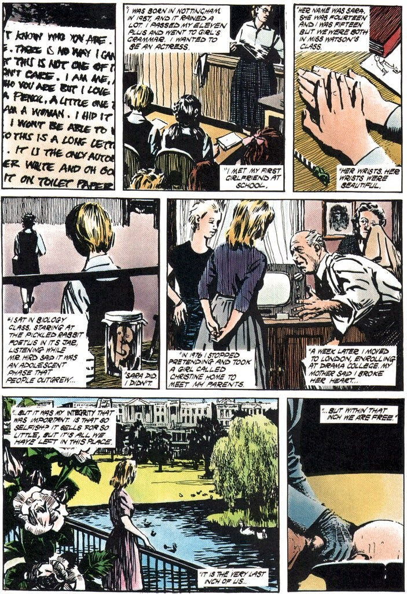

A few weeks ago I wrote a triptych of poems from the points of view of three characters from V for Vendetta1 who spent time in a jail cell, and about how they learnt something there and passed that message on to us.

The first of these is based on Valerie Page2, once an actress and then an inmate at “Larkhill Resettlement Camp.” To V she was the woman in room 4 (IV) who gave him hope, to Evey she was the woman who gave her strength, and to me – when I read it as a young man – she was someone who spoke without shame when I myself was full of insecurities, although her inspiration took a while to come to fruition in my own life.

Even in her darkest moment she held on to “An inch. It’s small and it’s fragile and it’s the only thing in the world worth having. We must never lose it, or sell it, or give it away. We must never let them take it from us.”

Here is part of my poetic version of her letter:

She pushed the paper through the wall  
with no idea if it would be read at all  
But faith despite reason spurred her on  
when all other hopes had gone

Her life had been full of hope before  
When she had all she could wish for  
Her love and the stage was her world then  
Now she would never see either again

Throughout three long warm summers  
they inhabited a world without corners  
Their future was as open as their hope  
and no possibility was beyond their scope

She’d previously tried to give her heart  
To another who didn’t want any part –  
of her beyond her warmth in the night  
til the world said it just wasn’t right

She might have given up and complied  
to the world and denied what was inside  
But she wasn’t content to put on the shelf  
all that made her true to herself

So she embraced the new love she found  
though society upon them frowned  
And she wouldn’t never apologise to anyone  
even when fate she could no longer outrun

For each day then she had a scarlet rose  
Happiness uninterrupted without any woes  
That blossomed and bloomed every day  
til the last petal dropped and blew away

Still she held on to their lasting memory  
no matter how dark her world might be  
The fragrance still lingered on the air  
as if a part of her was still there

And she retained that part of herself  
That lasted longer than her health  
“They cannot take that last part of me  
I’ll keep the last inch of my integrity”

They can erase the record of you on earth  
Scrub even the mention of your birth  
But some things they can never take from you  
that remain yours no matter what they do

Behind any mask you wore for your defence  
it is who you are beneath any pretence  
Don’t let them take that inch, don’t give it away  
Hold tight on to it each and every day

Remember no matter how hard they pinch  
to keep yourself even if but an inch  
For that inch is your refuge, your sanctuary  
and whatever changes it is who you’ll always be

She discovered that is the key to staying free inside: “But it was my integrity that was important. Is that so selfish? It sells for so little, but it’s all we have left in this place. It is the very last inch of us, but within that inch we are free.”

She ended her letter speaking to you, “I don’t know who you are. Or whether you’re a man or a woman. I may never see you or cry with you or get drunk with you. But I love you.”

She began her letter saying “I don’t know who you are but I love you” and ended her letter with just an X. This lead me to write a freeform poem:

Her last symbol was an X  
It often is used to cross out  
to erase what was there before  
But it also signifies a kiss  
A last declaration of affection  
It is the hope that someone will see it  
And feel touched by it  
  
Whether on the cheek or the lips  
Whether meant romantically  
or taken platonically  
it can be a defiant act  
the love she felt was forbidden  
the love she shared with that x  
would have been erased and forgotten  
except that it wasn’t  
  
It survived to be seen by you  
and recognised by you  
for what it is  
the hope that love can live on  
even long after this broken, beaten  
worn out dying body is gone

I don’t plan to post the other two poems I wrote - this one was bad enough!

Subscribe

[Share](https://peacefulrevolutionary.substack.com/p/v-for-poetry?utm_source=substack&utm_medium=email&utm_content=share&action=share)

An excerpt from the graphic novel:

1

V For Vendetta, 1988, DC Vertigo Comics, Alan Moore, David Lloyd, and Tony Weare.

Adapted into the 2005 film of the same name by Lana and Lilly Wachowski.

2

<https://vforvendetta.fandom.com/wiki/Valerie_Page>
