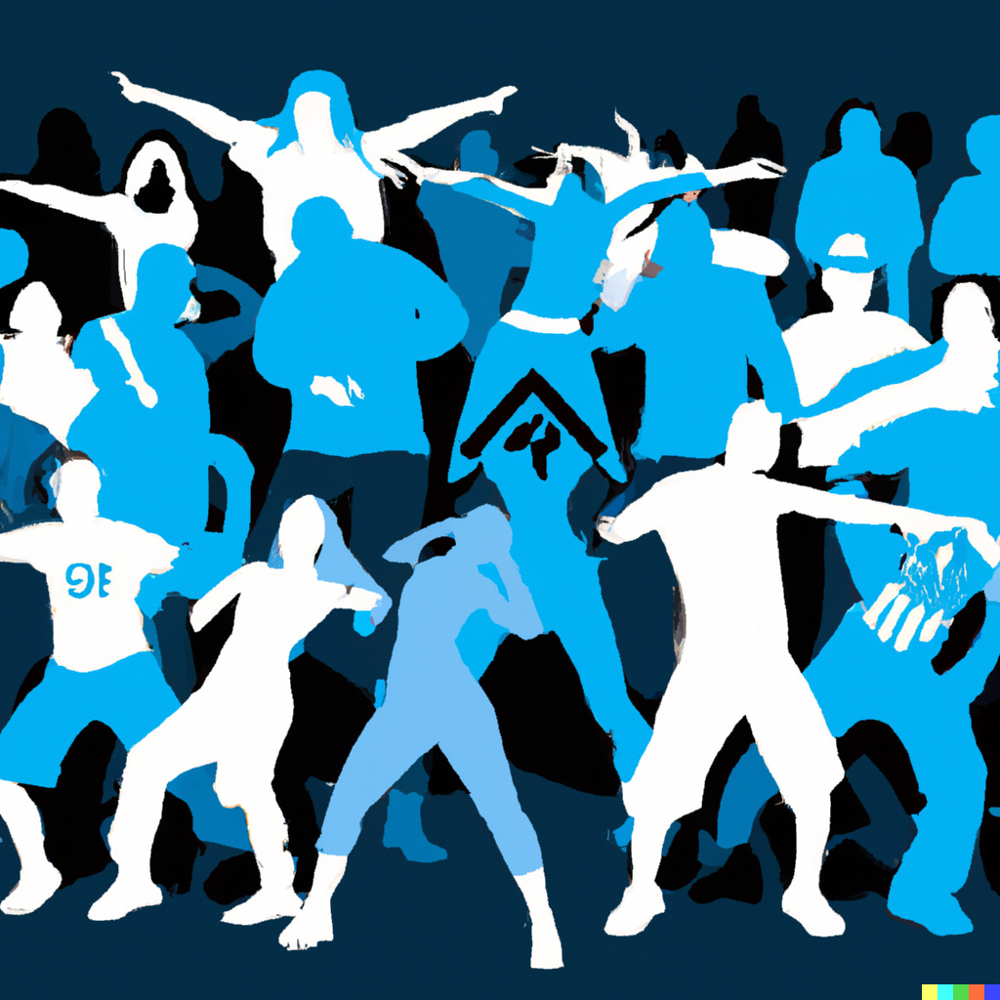

We had quite a party. The best I could ever remember. Fun was had by all, and it was a night none of us would forget.

Everyone’s musical tastes were represented and everything seemed to be in perfect harmony.

Not only was the alcohol flowing, but by early morning, the ideas began to flow on how to make the world a better one. A planet in which every person and every good song would have a place.

Some people leave when such subjects start and others come alive. It is the upper some people are waiting for in the wee hours, while it sends others to sleep.

At such times those of us who stay up to solve earth’s many problems are always amazed by how clueless the radio DJs sometimes are, how simple and melodious the real answers seem to be, and how powerless we feel to change anything, especially the din and dirge that makes up much of our lives.

But some of us retain hope and look forward to better days and future dances.

So we decided the next day to carry on the party and see if we could come up with real proposals and plans for making real changes.

The response was amazing, we had double the turnout the next night, and before we knew it there were branches of the party going on throughout town.

It seemed that our little city was just an outlet for one giant ongoing party in which everyone was invited.

All our ideas and ideals, musical and otherwise, which had once seemed unrealistic, if only because of our fewness in numbers, now seemed not only possible but inevitable.

We had a varied soundtrack of different kinds of music that accompanied all of it: our dancing, talking, working, teaching, cleaning, love making, and sleeping.

I wish we could have rode those rhythms together forever, but we had to break away from dancing to talk practicalities.

Up until then everyone was welcome at the party, but of course not everybody was there for the same reason or agreed with each other.

It was argued that we couldn’t accommodate everybody, so we settled on working with those who agreed and just those who shared our ideals: the same outlook and styles of life and music.

I thought this was sad because by challenging us others had often made our ideas better and also gave us new tunes to appreciate, but I suppose it just wasn’t practical to try to accommodate everybody and make the whole world our venue.

Getting messages to and from the different communities proved difficult too, so we had to pick representatives, those who had the extra time and money to meet together to play and talk across larger distances.

This broke up friendships and I feared it would strain relationships, but the new representatives of our musical movement explained it was all for the good. They committed to including some of the old favourites as well as some new songs in similar styles, so I just went along with it, thinking everything would turn out sounding okay.

The challenge was that those who ran the big venues already had their own established party, one that usually only played once genre of music.

To get in to even talk with them we had to bring a bottle. No home-brew was allowed, and nothing considered too cheap or common for them would gain us entrance.

Some of us couldn’t afford such luxuries, and so we had to ask people who didn’t share many of our musical ideals to help us out with the cost.

However, this arrangement didn’t come without any strings attached. Our sponsors wanted a say too --- on their preferred tracks and on what words and sounds they felt it was most important to focus on.

It wasn’t long before our own party required an entrance fee, had an approval process, and was willing to sacrifice some ideals in order to party with others who didn’t even want to dance. It ceased to be a party at all and became a club.

But a club can be okay right? We may not own the club, we may have to each buy our liquor or look to richer friends to do so, and maybe we don’t decide all the music, but we can occasionally make special requests, and we can still sometimes dance can’t we?

Then one day the kind of music played there became a genre I didn’t particularly like and wasn’t even sure how to move to. Rather than being as easy going it had been, there were all of these special regimented moves I had to memorise. I felt (and probably looked) terribly out of place and eventually I didn’t want to be part of the club anymore.

I forgot about it for a number of years. I’d hear things in small gatherings about some of the good they were doing but heard just as much about who they had excluded lately and what songs they had dropped or lyrics they had changed.

For a long time I just listened to the old music on my own. No-one left to party with and no club where I felt at home.

I gave up hoping for a better party until one day I heard of a new DJ who was going around small venues and playing the music that had brought us to the party in the first place.

I wasn’t the only one who was intrigued by them, and soon there was quite an audiophile following, with many others gathering around him who shared the same musical tastes. The party was back on!

He played far and wide and loud, and invited people who had never come to our parties before as well, as those long since excluded from the official parties. He reminded us of the old classics and found new sounds which reminded us that music with heart and soul was still possible.

We worked hard to help him get a spot as a a guest in the club downtown and we would go there to hear him there too. We began to believe it could be a place for everyone to find something that resonated with them once again.

But I suppose it couldn’t last forever. The club had it’s own DJ’s who supported everything the club did, whether the patrons liked it or not, because their jobs depended on it.

They played only the music they were told to by the owners and those who made or brought the drinks.

They made sure that this new DJ only got limited play, although he really represented what the people wanted and got more of the young out on the floor than the club had ever seen before.

When we protested the owners said they had a club to run and the world of music didn’t work that way, that it was their rules and we had to follow them or get out, although their rules didn’t really give us a fair way to change things.

Now here I stand with the sounds still fresh in my ears, wanting to dance and wondering what should I do next? Keep trying to get the club to change? Start a new party? Try to DJ myself? Wondering if there any venue left where the music had the same soul and all were welcome?

Or is there only the club, the rules, and the establishment?

Subscribe
