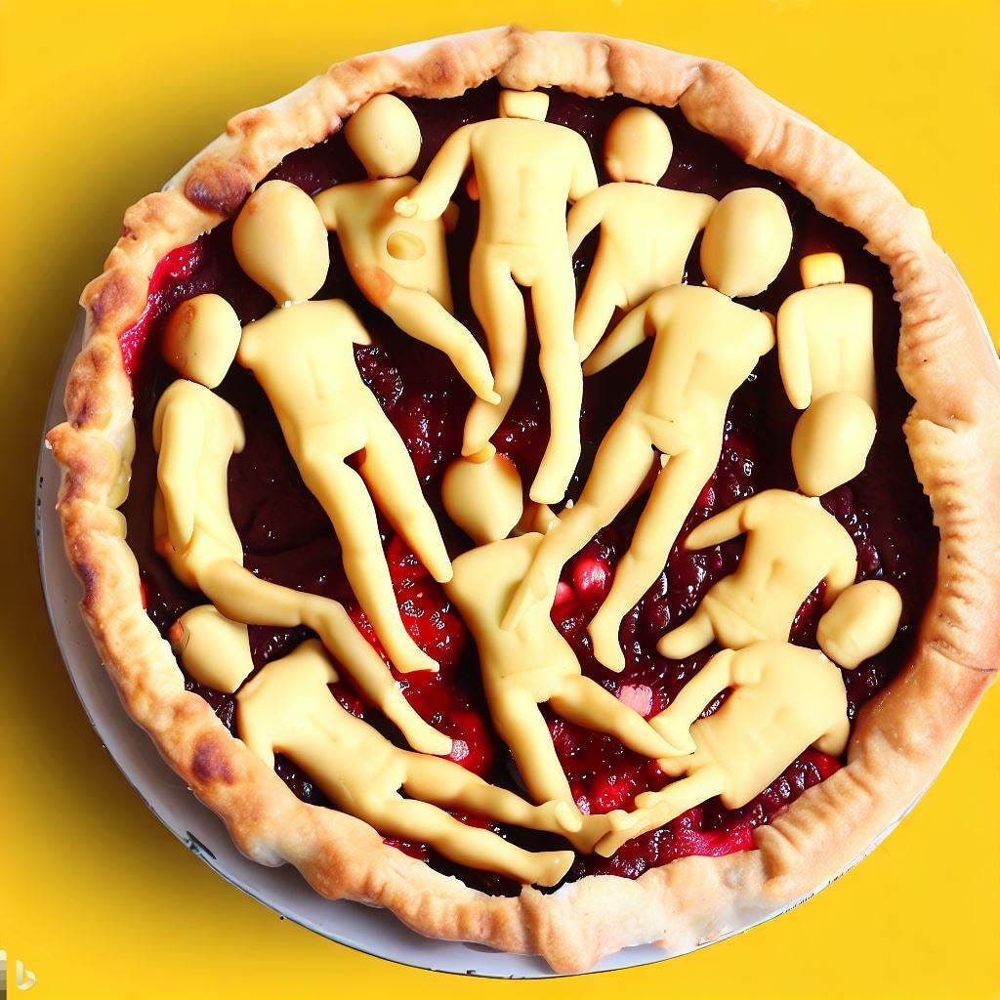
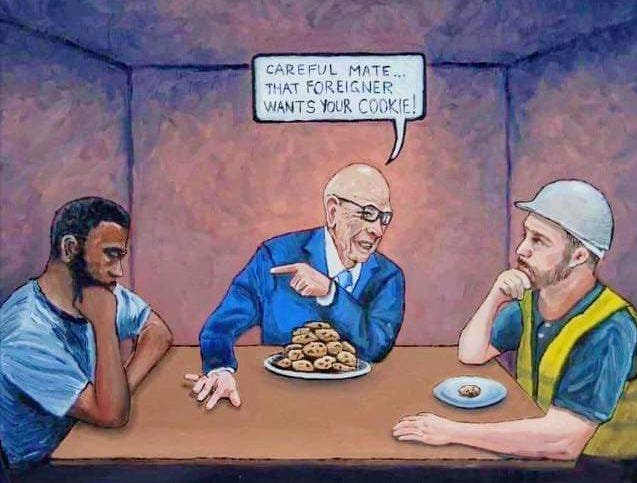

## The Pie Cutting Lesson

As any parent who has baked a pie for a party knows, children above a certain age will notice if there are very different sized slices. One technique they use to discourage greed is to get one child to cut the pie as evenly as possible, and get another to select the first piece (perhaps with the one cutting getting the very last slice chosen). This encourages the child doing the cutting to cut very carefully, as otherwise he risks some getting more and them getting less. It is a lesson in being considerate of others, in sharing and fairness.

This is a pattern that often continues to adulthood, even when we have no parent watching over us to ensure we are getting it right. So why wouldn't you save half the pie for yourself? Because you know it is fair to share it. Why wouldn't you cut it into odd sizes and give out large and small ones randomly? Because it wouldn't seem right for someone to get far less, and another person to get much more.

In the world we live in that is not the way the food we eat is divided, or the land we live on is allocated. If we reduced all the money in circulation into one hundred different promissory paper dollar notes, and divided all the people in the world into a hundred different regions we'd see that the money is not shared evenly. The same would be true if we did the same experiment within a particular country, or took a representative cross-section of one hundred people and put them on an island.

## A Bigger Piece Of The Pie

If we were divide all the money in the world into a pie chart we'd quickly see that some groups and even individuals have much larger pieces than others, and a great numbers were sharing very small slices or even barely a crumb between them.

What lead to such an inequality in our money pie? Was it based on how hard each person worked to get a piece? Did those with a ninety-nine times bigger piece of pie work ninety-nine times harder? Or ninety-nine times longer? Or are they ninety-nine times better in some way: smarter, stronger, prettier? 

No. Some people work incredibly hard but receive meagre compensation (mere crumbs) for their efforts. Smarter people may have some advantages, but most geniuses are still only obtaining a small slice.

What about those who have the largest share of the pie? Are they proud of how much they have? Do they show it off? Do they think they deserve it, that they have somehow earnt it and have a right to it? Do they believe that those with crumbs only deserve that much? Some do.

What if people started pointing out how much pie you had compared to most other people? Would you try to hide it? Would you be embarrassed? What about those who inherited their large piece piece from their parents? Why should they have a larger piece?

## The Pie Hoarders

We know what happens when some people have substantially more than others. A few may hide themselves and their hoard away and pretend the rest of the world doesn't exist, and a few share some of their pie (albeit often in return for fame or other favours). But many hold up their pie as an example of what anyone can achieve if they just work hard enough (or get enough people to work hard for them).

They say, “keep dreaming of my large slice of pie”, “a piece like this could one day be yours too”, “those who would want to force me to share my pie might one day come for yours too.” And if you complain they'll remind you “that life isn't fair, and the allocation of pie isn't a perfect process, but it is better than forcing everyone to have an equal amount, which might lead to you missing out if you win the pie lottery.” 

Others are determined for you not to focus on their pie at all, and to only think about your own small slice. “It is a bigger piece than your father had”, “pie envy is evil, you should appreciate your own pie more”, “others elsewhere have smaller slices”, “those poor people over there don't even deserve the little slice they have”, “watch out for those with crumbs because they might try and steal your slice!”

What those with large slices of pie fear is that you will start asking, “why do they deserve so much?”, “why should others have so little - especially when others have so much to spare?”, “who decided that pie should be allocated this way and is it really fair?”, and maybe, “what can we do to make sure everyone has a decent sized slice?” The pie hoarders may see this as just jealousy, as the lazy wanting what they didn't work for, but is it envy or anger at injustice of the whole pie system?

The simple truth is that there aren't enough hours in the day, strength in the body, synapses in the brain for someone to work substantially longer, harder or smarter than someone else. Twice as hard in one area maybe, perhaps three times as hard at a stretch, but nobody can work or think a hundred times harder.

The real reason for the inequality is that there are those who are not satisfied with having enough pie, for whom no single slice can ever be big enough, and their insecurity leads to them finding ways to get others to have over parts of their pieces, even when the poorest are down to a few crumbs.

Some will argue that their large proportion is down to providing some good or service that others value and are willing to share some of their pie to obtain. That they are providing a benefit to society and should be rewarded accordingly. But where do the means - the ingredients - for them to be in control of the pie process come from?

## Pie Origins

It takes wheat to make the pastry, fruit from trees to make the filling, and milk from cows to make the whipped cream. Did some pastry deity say this person (or set of people) should be responsible for all pie production How did the pie owners (and distributors and sellers) get exclusive access to these elements? 

Once upon a time one of them put a fence around the crops and animals needed to make pie, and said to people if you come and harvest for me, then I'll give you a few crumbs after you put these ingredients together for me.

Before that time everyone had access to what they needed to make pie and share it, but all one person had to do was convince a few others to guard the trees to stop others getting to them, on the promise that the guards would get a little more pie if they did. 

Perhaps the first few times this was attempted people just overpowered the guards and took back the orchards, fields and animals. But ultimately a particularly determined and greedy individual promised enough favours, rewards, or made enough threats to seize control of the pie process.

They wanted so much pie - not just to eat more, or to show it off and to boast of having the most - but to control access to it, and to have powers over others because of that. They only have these goods and can only provide these services because taking from resources that were once available to everyone.

Now there are many pies, and some of the pie-owners may compete amongst each other, and compete for access to customers, but the pie-owners are in a different category and class to the workers. They may say “I eat pie just like you, the same way you do, so we are the same.” But they are the owners, and we are the workers. Or as we would have put it a hundred years ago: they are the (pie) masters, and we are reliant upon being their servants them to obtain our little piece of the pie. But it is the workers who grow the grain, harvest it, gather the fruit, mill, mash, mix, and bake. The workers are the real pie-makers, and yet the owners take most of it for themselves, and will even let countless pies going to waste in warehouses to keep the cost of slices up.

But we are kept busy and distracted by their pie propaganda (as it is the pie owners who own the television stations and newspapers and advertisers.). They tell us the pie is infinite, that it comes down from the sky, that it grows as needed (although always more for those who already have a lot of pie to begin with). But we live on a finite planet with limited land for growing and factories (which produce dangerous pollution as a side effect of their increasingly artificial pie making process).

## Pie For All

What happens if we should begin to question this arrangement? We are reminded that they are protected by the pie-owner policeman and armies, can be put in the pie-owner owned prisons, and they may even try to take our lives if we really threaten their position.

But we can take back the pie that was once ours, the pie we spend our lives growing the ingredients of, making and shelving for sale at their inflated prices. We can refuse to work for crumbs, we can refuse to work for them. They need us more than we need them, and we can take back our share. 

Then there will be pie enough for all, made with the best ingredients (because there is no incentive to use cheaper alternatives), made in harmony with nature (because pies won't be made to be destroyed and there won't be far more than are needed manufactured), and shared directly and fairly with our family and friends. Viva La Pie!

## The Fixed Pie Fallacy?

Some economists call this ‘The Fixed Pie Fallacy’ when it relates to currency, which they consider an infinitely replenishable commodity, except (conveniently for money lenders) when it comes to debt. 

A couple challenges to this argument are that: 1) Even if the overall pie grows, the benefits of this primarily go to those already wealthy. 2) The wealthy may become so or extend their wealth through creating artificial scarcity to raise prices by restricting the availability of the pie. 3) This leads to inefficiency in the distribution of pie, which would lead to more wastage, even if it means some going without pie altogether.

The problem is that the creation of pie, unlike fiat currency, is dependent on the earth’s limited resources. Some natural processes may be replenished if grown and replaced carefully, but may be endangered by pesticides, pollution, and clearing naturally diverse forests (to replace them with single crops which destroy eco-systems). But if we are careful stewards of the earth and share the pie fairly, then there is enough for all!

Long-haired preachers come out every night  
To tell you what's wrong and what's right  
But when asked how about something to eat  
They will answer in voices so sweet:

 **You will eat, bye and bye  
In that glorious land above the sky  
Work and pray, live on hay  
You'll get pie in the sky when you die.  
That's a lie**

And the starvation army they play  
They sing and they clap and they pray  
'Till they get all your coin on the drum  
Then they'll tell you when you're on the bum:

 _You're gonna eat, bye and bye, poor boy  
In that glorious land above the sky, way up high  
Work and pray, live on hay  
You'll get pie in the sky when you die  
Dirty lie_

Holy Rollers and jumpers come out  
They holler, they jump, Lord, they shout  
Give your money to Jesus they say  
He will cure all troubles today

 _And you will eat, bye and bye,  
In that glorious land above the sky, way up high  
Work and pray, boy, live on hay,  
You'll get pie in the sky when you die._

If you fight hard for children and wife  
Try to get something good in this life  
You're a sinner and bad man, they tell  
When you die you will sure go to hell

 _You will eat, bye and bye  
In that glorious land above the sky  
Work and pray, live on hay  
You'll get pie in the sky when you die_

Workingmen of all countries, unite  
Side by side we for freedom will fight  
When this world and its wealth we have gained  
To the grafters we'll sing this refrain:

 _Well, you will eat, bye and bye  
When you've learned how to cook and to fry  
Chop some wood, it' ll do you good  
You will eat in the sweet bye and bye_

 _Yes you'll eat, bye and bye  
In that glorious land above the sky, way up high  
Work and pray, and live on hay  
You'll get pie in the sky when you die  
That's a lie..._

Subscribe

[Share](https://peacefulrevolutionary.substack.com/p/the-metaphorical-pie?utm_source=substack&utm_medium=email&utm_content=share&action=share)

Another analogy about how the world works (and how we got into this mess):
