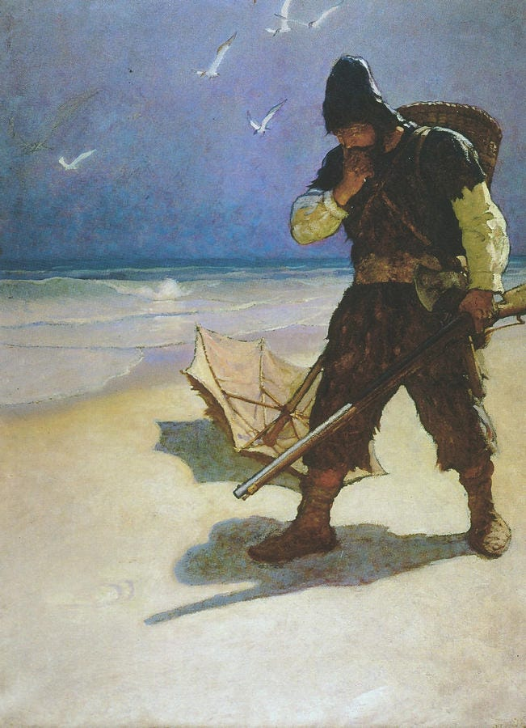

“Friday,” said Robinson Crusoe, “I’m sorry, I fear I must lay you off.”

“What do you mean, Master?”

“Why, you know there’s a big surplus of last year’s crop. I don’t need you to plant another this year. I’ve got enough goatskin coats to last me a lifetime. My house needs no repairs. I can gather turtle eggs myself. There’s an over-production. When I need you I will send for you. You needn’t wait around here.”

“That’s all right, Master, I’ll plant my own crop, build up my own hut and gather all the eggs and nuts I want myself. I’ll get along fine.”

“Where will you do this, Friday?”

“Here on this island.”

“This island belongs to me, you know. I can’t allow you to do that. When you can’t pay me anything I need I might as well not own it.”

“Then I’ll build a canoe and fish in the ocean. You don’t own that.”

“That’s all right, provided you don’t use any of my trees for your canoe, or build it on my land, or use my beach for a landing place, and do your fishing far enough away so you don’t interfere with my riparian rights.”*

“I never thought of that, Master. I can do without a boat, though. I can swim over to that rock and fish there and gather sea-gull eggs.”

“No you won’t, Friday. The rock is mine. I own riparian rights.”*

“What shall I do, Master?”

“That’s your problem, Friday. You’re a free man, and you know about rugged individualism being maintained here.”

“I guess I’ll starve, Master. May I stay here until I do? Or shall I swim beyond your riparian rights and drown or starve there?”

“I’ve thought of something, Friday. I don’t like to carry my garbage down to the shore each day. You may stay and do that. Then whatever is left of it, after my dog and cat have fed, you may eat. You’re in luck.”

“Thank you, Master. That is true charity.”

“One more thing, Friday. This island is overpopulated. Fifty percent of the people are unemployed. We are undergoing a severe depression, and there is no way that I can see to end it. No one but a charlatan would say that he could. And if any ship comes don’t let them land any goods of any kind. You must be protected against foreign labor. Conditions are fundamentally sound, though. And prosperity is just around the corner.”

 _(Source: Rebel Voices: An IWW Anthology)_

 _*Note: Under riparian rights, all landowners whose properties adjoin a body of water have the right to make reasonable use of it as it flows through or over their properties._

Subscribe

[Share](https://peacefulrevolutionary.substack.com/p/depression-comes-to-robinson-crusoes?utm_source=substack&utm_medium=email&utm_content=share&action=share)

 _Another fictional look at how value and resources are treated in our world:_

#Capitalism #Capitalist #Exploitation
