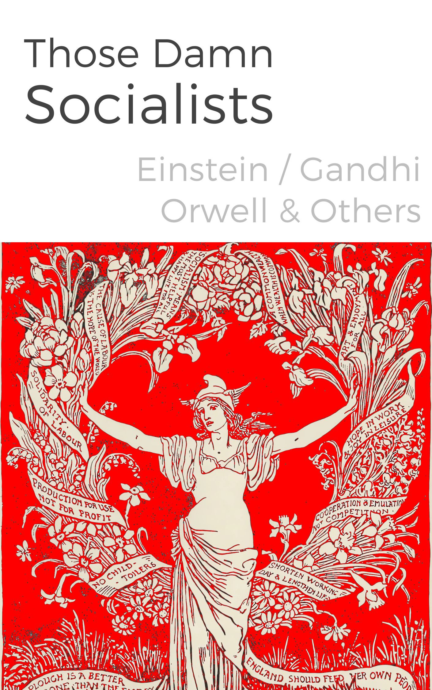

**Preface**

When I was setting out to write a preface for a book about the last century of Socialist thought, whose audience may include many non-Socialists, I wanted it to be accessible to those with no political persuasion, but found it challenging to know what to cover and exclude. I made the decision, (the wisdom of which I still question), to focus on only Socialism in broad terms, in the hope that readers unfamiliar with any political philosophies might find they shared some of it's ideals and principles, and then could later learn more about it's divisions and movements for themselves.

The resulting introduction was far too broad and I ended up cutting a couple thousand words, which made it more suitable for the book, but left me with a longer overview of Socialism that might never be seen. That may be for the best, but in case it is of any interest below is my essay in the form of an article.

 _(Note: An an Anarchist I sometimes have to point out that most Anarchist are Socialists, but many Socialists are not aware that Anarchists share the same belief in workers owning and managing their workplaces, and were historically fighting alongside other believers in Socialism and Communism to help form unions, strike for worker's rights, and helping establish social welfare programmes and civil rights changes.)_

 **Socialism – Why?**

Socialism was always a word which evoked strong emotions, either in favour or against it’s central tenets: that the power to make decisions which affect people’s economic well-being, and access to the necessities of life, should be shared and available to all on the basis of need, not ability to pay.

This was a challenge to what those on the right of the political spectrum considered the natural order, with the strong rising to the top and protecting the supposedly weaker majority (while reaping the rewards of a portion of their labour), as they believed the peasant class couldn’t be trusted to manage their own affairs when it came to land, riches and laws. Anyone who threatened to upset this order was seen as deluded, dangerous or even traitorous.

However, except to it’s detractors, Socialism was not a monolithic entity. Neither was it a spiritual movement with a holy text, organised by a hierarchy, with local branches, where everyone sang from the same hymnbook, and in which you were expected to follow a set form of personal religious obligations to stay in fellowship. It was a broad canopy under which a diverse group of workers and thinkers agreed on a few fundamental principles, but could have very different ideas about implementing them. To some it motivated their involvement in politics, in organising their workplace, and promoting their values. To others it was an intellectual ideal they shared in their writings, speeches and debates, but to socialists it embodied the hope of a better world.

Throughout it’s history the ideals of Socialism have been a powerful motivating force, even when only partially realised. Socialism motivated workers to lay down tools, form picket lines, take over access to factories, to protest for better conditions and to win them. It encouraged landless men, suffragettes, and colonised peoples to fight for the right to vote, many risking (and some losing) their lives to make their voices heard. They were a pain in the asses of their ‘betters’: the lords, masters, employers, politicians, investors, and bankers who stood to lose power as workers gained more secured rights through their collective actions.

Modern Socialism began as a response to that industrialisation of the 19th century, to the concentration of power and wealth, to the changing nature of work, and the new social and economic structures and inequalities that came from this. In England and France the peasant workers who had once been farmers had previously given some of their produce to lords on whose land they lived, and kept what they needed for themselves. But now under Capitalism they found that whatever they produced all went to the owners of the factories or mines they worked for, and they struggled to pay for their needs. Where they had once dealt with bad crops and greedy lords, now they had lost control over both their work and its products, and the new industrial masters gained more wealth and power at greater expense to their workers than ever before.1

This was an age in which a working man in England could not vote, because he held no property in his name, and women could not vote or hold property at all. In America the voting of Native Americans and African Americans was greatly restricted too, as well as access to lands and services due to racial prejudice.

Much of Dickens literary output was a commentary upon the penury and drudgery of this era: the workhouses, the debtors prisons, the privileged gentry, and unlikely escapes due to unexpected charity or inheritances. It was the situation that prompted Friedrich Engels studies into the lives of the working class, and led Robert Owen to introduce social reforms and co-operative practices into his factories.

However, working class Socialism was not just dependent on the lead or generosity of it’s more wealthy benefactors. Most of those sympathetic among the upper classes had never worked in factories. It took working men and women risking their livelihoods by striking to make this a movement, and from their ranks came authors, leaders and notables of their own.

Socialism walked hand in hand with the suffragette movement and made up many of it’s prominent members, it was behind the formation of unions and obtaining workers rights, with the campaigns to ensure universal human rights and broker peaceful resolutions to conflicts between nations, it formed the ranks of revolutions against dictatorships, and spurred the scientific and computing revolutions that have changed the world and continue to do so.

From the earliest days of Socialism there have been broadly two different approaches to achieving it’s aims (and many different ways to implement them): these could be divided into the state-based implementation of Socialism from above, and the community-based implementation from below.

Some Socialists express a hope for an eventual objective a future generation might achieve, while others call for a revolution in the near future. Some stress the individual benefits of Socialism, and others the collective benefits. Some focus on how much Socialism could free up individuals for creative pursuits, whereas others focus on the task of achieving a better world. Some emphasise the environmental impact of industrialisation, of the need to maintain a balance with nature, but others were unaware or more focused on the human costs of unequal benefits of mechanical and technological progress

Today we still benefit from the social welfare and civil rights achievements, literature and scientific advances that came from prominent Socialists and many less well known ones in the past, as well as those still coming from a new generation of Socialist authors, scientists, reformers. Apart from the technological advances that are part of our lives we still face many of the same challenges, issues and problems that people faced a hundred years ago. We live in a new gilded age with many of the same failings as the past one.

The post war world of the 1940s might have seemed an unlikely time for Socialism to make progress, yet it led to the establishment of social welfare programs under Franklin D. Roosevelt, Clement Attlee, and other leaders elsewhere in Europe who were inspired by Socialism, or served a population who pushed for it. This led to popular programmes guaranteeing housing, pensions and healthcare as universal rights in Europe. But Roosevelt’s death, prior to passing the Second Bill of Rights that would have enshrined these rights for Americans, shows how close a country can come, and how narrowly it came miss the opportunity.2

Yet the 1950s and 60s still saw workers rights expanding (although those gains were not equally distributed to all races) with high wages rising in line with union participation, but the advent of Neo-Liberalism in the 1970s as the guiding economic policy of Western governments put an end to this progress.3

We are still waiting for some of the solutions of Socialism to be fully realised. Unions, co-operatives, and mutual aid give us a glimpse, but not fully realise it’s potential for the transformation of society.

We still face opposition. An older right-wing generation (with some younger exceptions) is looking to revive the red scares of the Cold War, using words like Socialism, Communism, Anarchy and Woke (in ways which depart greatly from their dictionary definition) as label for everything they don’t like. But, although they cling on to power tenaciously, their era is fading.

There has been a resurgence of the word Socialism, with a new generation who views the word positively and is more open to its ideals, they have become aware of it by asking questions about their own situation and looking backwards in history for solutions, and more currently finding inspiration through the campaigns of Bernie Sanders and Jeremy Corbyn, the most popular avowed Socialist candidates for decades. Likewise there is cause for hope in the election of Socialist parties and presidents in South America – despite the Western military efforts to undermine or extinguish them – as well as local city and state Socialists winning political offices, sometimes in unlikely places and against much better funded, well-publicised opponents.

Nothing changes until someone cares about it. Many people do care that workers can barely get by, that they are faced with economic insecurities and that their rights and power are always in danger of being eroded, despite some welcomed wins. We will always be in a precarious position until the goal of Socialism is achieved. We’ve seen workers rights rise before and fail a generation later.

The solution is to not rely on election cycles, to not wait to go through slow political channels. The powerful won’t overlook small union gains indefinitely, and the corporation which poison the earth won’t voluntarily stop causing environment devastation that will hit the poor hardest unless forced to do so. We don’t have the luxury of waiting on others to represent us better, because they will always be competing and usually losing against the many politicians willing to serve the interests of the rich. To win, we must harness our collective power - not merely asking but demanding change, not settling for reforms but pursuing revolution, not just patching a broken system but transforming it entirely. Only then can we create a world where workers truly own what they build.

Subscribe

[Share](https://peacefulrevolutionary.substack.com/p/socialism-an-introduction?utm_source=substack&utm_medium=email&utm_content=share&action=share)

Unused alternative cover

1

This is not forgetting the instrumental role slavery played in the establishment of this new economic system, or the role that low paid exploited overseas workers still play in sustaining Capitalism’s exploitative nature.

2

And how dangerous dependence on one leader is!

3

With the rise of Neoliberalism among both the Democrats and Republicans in America and the Conservatives and New Labour in England.
