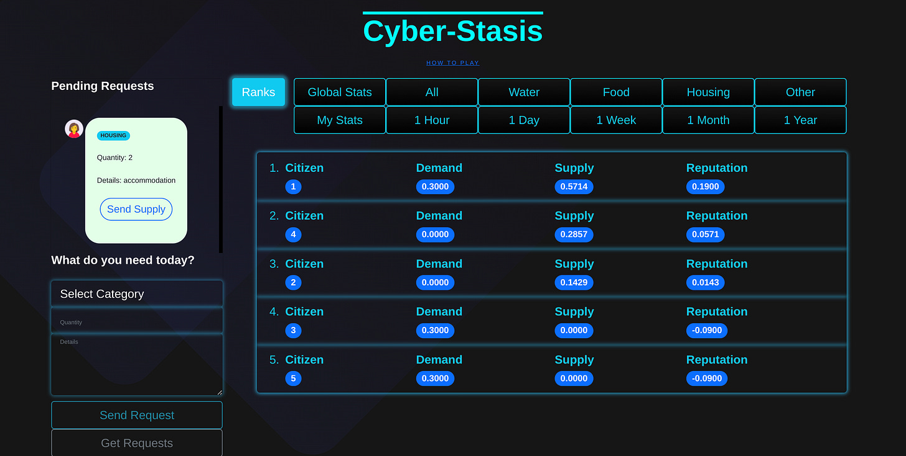

In my spare time I've been working on a novella about visiting aliens helping the world managing to narrowly avert environmental catastrophe, through convincing workers to abandon Capitalism and setup alternative sustainable structures. I've also been playing with the early stages of coding a game with an alternative path to bringing about the same ends.

As part of the local Utopian book club, I've been aware of and read many of the Utopian fiction that looks at non-hierarchal societies in which everyone essential needs are met. I've also been following with interest the Solar Punk movement, and was interested to see a link to a story in process covering much of the same topics as the one I'm writing. 

One thing many such stories skip over is the process of how a society changes from competition to cooperation, from hierarchy to consensus, and from currency to decomodification. In the story I began reading, titled “Autonomy”, the change began with games that imagined and apps that helped facilitate a moneyless economy, and I was surprised to find that the author had already created these apps and they were available online.

I don't know if I'll ever get around to finishing either my story or game, I have another story I already started on I need to finish first. But I'm glad that there are others out there already portraying better worlds and proposing paths to them. I though I'd share the first few parts of their story with my friends here, in the hope that they'll want to read more. (The original is in Bulgarian, but most web browsers give a fairly good translation).

# Autonomy

 _By mar1n3r0 / shanoshamanizum_

I woke up late. I had a vague feeling of something that I'm not sure if it was a dream or reality. I decided to check. I entered the web impatiently remembering only the keywords I searched for. “Cashless economy game”. There it is, I quietly rejoiced at my discovery. So it certainly wasn't a dream. It all started with a few random games from an organisation calling itself Stateless Minds. 

At first I said to myself, that's a suspicious name ... In fact, it all started with one particular game with a meaningful and insane description (in our previous old ideas): “[Cyber ​​Stasis](https://github.com/stateless-minds/cyber-stasis) \- a global simulator of a cashless economy in the form of a free game”. No matter how you look at it madly from everywhere - money was everything to us - it personified everything. We said the word money so many times a day, that it was hard to even think of a world without them. And this game denied them most brazenly and in one fell swoop. 

No one knew where it came from, but it had become an absolute hit within 24 hours of its appearance. Millions of people had accidentally discovered it in the free open source repository and decided to try it out. If nothing else for her provocative description. I read further. The game was created using such technology that it was spread from person to person like torrents of old. 

One of the conditions one had to agree to in order to play it was to automatically become its distributor. The idea wasn't anything new since decentralised apps came along, but it definitely explained how the game became so popular so quickly. I continued with the terms. It was made clear that this was an experiment with imaginary data. Actually fictitious data as all players were anonymous. The idea was simple and yet difficult to grasp in its entirety. At first glance - a global simulation of a market system without the presence of money and exchange. I stopped for a moment and thought. Supply and demand without money, does that mean there are no prices? I found the answer literally on the next line. All this, the author specified, only through the conclusion of a single contract for unconditional support and mutual assistance. 

I thought, how many contracts do we actually sign for a “normal” human life? Like any ordinary citizen, I had a cabinet with my most important documents from my birth certificate to my education documents. There followed hundreds of contracts for various services, receipts for paid bills, tax returns, guarantees, powers of attorney, certificates and a bunch of others that I didn't have the motivation to check. All in all, a big cabinet full of paper has a 40-year lifespan. I would say it weighed about 10kg and was several thousand documents. And those were just the paper contracts. And I had signed at least 10 times more online. I was horrified by the heavy reckoning and insight. Countless hours, days and months spent walking, signing, arguing, certifying, proving, haggling and ultimately wasting time. The only real resource I have - priceless time. I hadn't even thought about it. 

The next big hit was when I multiplied the numbers by 8 billion, the current population of the planet. Mmm, we were mired in the merciless bureaucracy of the state and corporate machine dying to have proof of everything, I told myself at first. Then I thought that the exact definition is not bureaucracy, in fact all these contracts are mostly for certifying private property and state property. That is, ownership led to all these contracts.

I went back to the game. She was offering to replace all that wasted time with a single, all-inclusive contract. It sounded wonderful, but hard to believe, even crazy in the moment after the reckoning. Below was an explanation of how this would be done.

  * “No private property”

  * “No countries”

  * “No money”

  * “No hierarchy”

Now I really needed time to catch my breath and let my stunted brain assimilate these four sentences that sounded so loud and absurd at the same time.

Another naive dreamer, I told myself - another fighter against the system. I had seen many of those. In my youth, I was more than once part of movements against the system, and they all ended the same way. With silent and constant failure. Sinking into nothingness as if they never happened. As the conservative and conformist environment of “normal society” had taught me - when you run out of money, food and shelter you will sing a different song. But here was something different from all the theories and experiments I had read about, seen, or participated in.

Maybe it was because of the current moment and context in which I came across the game. On the threshold of the new world order. After a “pandemic” that was anything but a pandemic in the medical sense. During the introduction of artificial intelligence that no one can even prove is intelligence, let alone that it is needed where it is being implemented. Although most people believed in automation and scientific progress, they were unanimous that it would only make sense to replace human labor in dangerous and boring conditions and environments. 

In fact, like all centrally planned transitions, the technology was always used for absurd purposes, incomprehensible to the mass population and propagated by the entire machine at the same time. At the same time, the entire media system also began to advertise gene editing in the most benign forms, but for the thinking and, above all, the historically literate, it was the good old eugenics from previous attempts. Repackaged, in new cellophane, with ribbons, but with the same goals and aspirations.

In the context of this absurd historical moment, the game's ideas seemed far more plausible to me than they would have been, say, 5 years earlier. It's just that we had already seen the true state of things and the ruthless plans of the elite, so we were open to much more comprehensive ideas for change.

I continued reading. In short, the game represented a concept of decentralised production and distribution of goods based on a "consumption economy" as an alternative to a “property economy”.

I became keenly interested in what the “consumption economy” means and how it differs from its current form. It represented the following – instead of buying every thing we need in life like a car, electronic devices, etc., we borrow them for the period in which we use them from public public landfills and return them there as well after we no longer need them. In the first place, this makes production, procurement and subsequent recycling much more optimised processes. Unlike the present where we accumulate goods in our homes until the space is full and then get rid of them in stages, in this new form of economy we do not keep anything superfluous in our home because we can go and get it at any time. 

At the same time, since every good is produced for repeated use, not for personal use, then planned obsolescence ceases to make sense. Every product is designed to last as many cycles of use as possible because we don't buy it. More importantly, these goods were produced not by the old powerful hierarchical corporations, but by horizontal cooperatives and individual autonomous units transformed by them. 

The most amazing thing was that nothing had a price. You just go - pick up, use and return to the same place at any time. I wondered how it was possible that there were no prices and how the resources for production were managed. It turned out that thanks to the previously mentioned treaty of unconditional mutual aid, we accept all the resources of the Earth for the common good with the unconditional right of use by everyone. When a resource was scarce and not available to all we resorted to a voting system through liquid democracy and methods such as rotation, priority use by vulnerable groups, lottery and other methods according to the specific resource and the number of people wishing to use it simultaneously. 

In many cases, it turned out that there was a way for it to be shared effectively and used at the same time. Coordination of supply and demand happened entirely online in the said peer-to-peer platform. We tried to meet our needs as much as possible as autonomous units. This happened freely, from each according to his ability and to each according to his needs. 

We were so scientifically and technically advanced that we could afford not to seek maximum efficiency in production, but maximum decentralisation at the expense of efficiency. At the basis of our new way of life lay the principle of equality, which replaced the previous ideal of maximisation formed by the economy of property. Gradually, we broke down the former corporations/today's cooperatives into smaller autonomous units in an effort to completely dismantle the previous forms of hierarchy and centralisation. 

Of course, there were also problems that we encountered along the way, but which we solved together again, through the platform for liquid democracy. In fact, every political decision regarding the distribution of goods was made through it. A major part of our problems came from our old way of thinking while we were transitioning to our new way of life. And these changes were many and everywhere. 

First of all, we became real nomads. The question of housing, which in the previous world was a source of constant conflict, did not stand here because everyone wanted to live all over the world, staying in a given place for a few weeks to a few months. We were driven by our desire to participate in various work and research projects as well as our innate curiosity and desire for the dynamics of the human mind. 

The world no longer had any borders - no countries, no properties, no fences, no authorities to control anything. When it happened that several autonomists wanted to live in the same place at the same time, they had several options - to share the place for the period in which the demand coincided, to coordinate in advance so that they did not overlap, or to pull a kind of chop (lottery). 

As we strived for egalitarianism in all its forms people with various types of physical problems were prioritised in such situations by universal consent without the need for law or vote. It was part of our eternal evolution. The one that was paused for so long during the period of ownership and hierarchy when we were pitted against each other through competition and group division. All interactions occurred publicly but anonymously. Gradually, we began to get rid of our harmful habits imposed on us from our previous life, such as envy, taking account of others and constant comparison. Anonymity made us free and constantly cooperating on the basis of ideas and goals, not on personality. 

_The original story is being serialised here -_

 _<https://forum.chitanka.info/viewtopic.php?t=6799>_

 _The apps and games mentioned are available here -_

 _<https://github.com/stateless-minds>_

Subscribe
