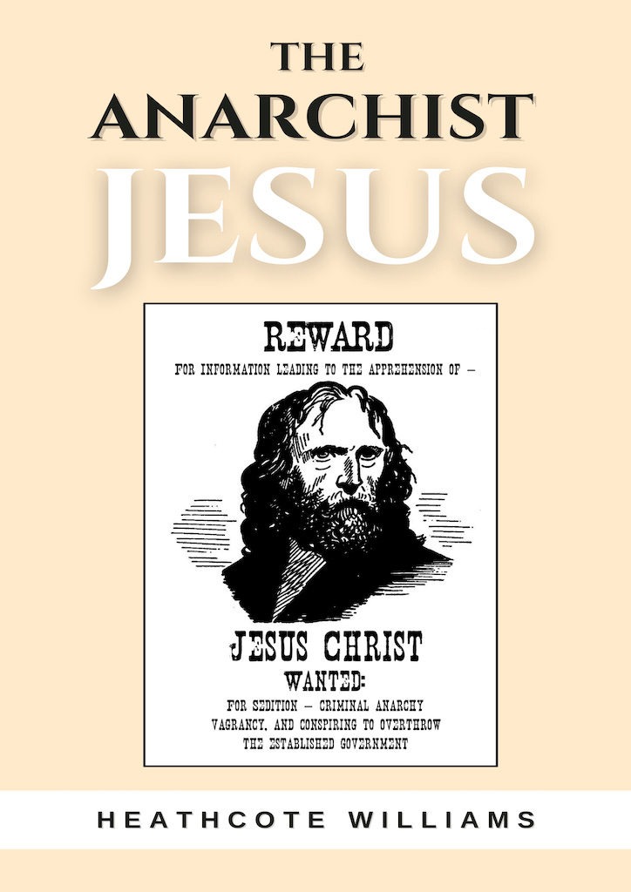

> “Christianity in its true sense puts an end to the State. It was so understood from its very beginning, and for that Christ was crucified.”   
> _(Leo Tolstoy, The Kingdom of God is Within You, 1894)_

I came across a recording of the poem, The Anarchist Jesus, a couple of years ago. Its author, Heathcote Williams (1941-2017), was a talented poet, playwright, and actor. He'd been working on this poem occasionally over several decades, but I was surprised to find that it had never been printed in full, and so I transcribed the words and edited it together as best as I could [for publication late last year.](https://pmpress.org.uk/product/the-anarchist-jesus/)

Although an atheist, Williams was an admirer of Jesus’ philosophy, and sought to apply those revolutionary ethical views to the issues raised by the modern world's conflicts and inequalities. He begins the poem by drawing attention to the ethical discordance between the peaceful teachings of Jesus and the actions of the so-called Christian nations that claim to follow him:

A billion minutes ago Jesus was alive preaching in Palestine,   
to a peaceful crowd shaded by leaves of date-palms.  
A billion dollars ago was just eight hours and twenty minutes,   
at the rate U.S. Christians spend money on arms.

In contrast, the Jesus that Williams sees in the Gospels is a fighter for freedom and peace:

If you live by the sword you’ll die by it,   
was the message he tried to spread.   
For if you believe in deadly solutions,  
that belief will soon see you dead.

He was brought up two-thousand years ago,   
in the poorest district of Galilee.  
When the Middle East was a Roman colony,   
whose people longed to be free.

Jesus emerged as the leader of a wandering gang,   
barefoot believers in man’s higher powers.  
Whose authority came not from using fear, nor by killing,   
but from the loyalties and friendships that flowered.

They prompted this carpenter’s son to declare independence,   
saying, “Welcome to the kingdom of love.  
Where we’re free as the wind in the eyes of God,   
and as equal on earth as in heaven above.”

Yet this pacifist Jesus wasn't afraid to use direct action when needed:

But it’s no crime for a hand to turn into a fist,   
nor for a bird to reveal its claws.  
No crime to use moral karate against depression,   
nor to break bad laws in a better cause.

For Jesus never said you should stand by and do nothing.   
He trashed a temple that tied the gullible in knots.  
Jesus often took direct action, but without taking a life,   
believing life’s not only man’s: it’s God’s.

One vivid example of which was his overturning the tables of the money changers in the temple:

He swept through queues of worshipers with a scourge,   
and challenged every dealer in death.  
He scattered their money tables, and he tore open their cages   
to let captive animals and joy freedom’s breath.

“The world requires mercy, not massacres”,  
Jesus cried and for “The meek to inherit the earth.”  
He was an activist, not a charlatan exploiting man’s fears,   
by trying to sell them their own rebirth.

He was an activist who destroyed church property,   
who used civil disobedience and verbal abuse.  
“Ye generation of vipers”, he’d shout to make his point,   
though violence was the one tactic he’d refused.

Unlike modern televangelists and prosperity preachers asking for money in return for salvation, Jesus condemned the rich:

Envying this whirlwind of unexplained power,  
a rich kid yelled, “Give me some of your magic.”  
“Fine,” Jesus said, “give what you have to the poor.”   
“No, no,” the boy turned away, “that would be tragic.”

But the strength the boy wanted came only from love,   
which is a gift that’s reduced by greed and by hate.  
Just as it’s stifled by murder and it’s suffocated by war,   
for what makes you feel big stops you being great. ...

For then as now the rich and the super-rich,   
failed to score when it comes to empathy.  
And honesty is superfluous to their career path,   
devoted to economic psychopathy.

He conjured up an image to suggest the enormity of the rich   
being such as social excrescence:  
“It is easier for a camel to pass through the eye of a needle,   
than for a rich man to enter heaven.”

By advising his followers not to lay up treasure on earth,   
he indicated how little money could really do.  
“Be warned you rich men weep and howl”,   
Jesus cried “for the miseries that shall come upon you.”

Jesus saw that man’s money mania reveals a malaise,   
where an economy replaces a heart.  
Giving and receiving becomes getting and spending,   
and extortion is admired as an art.

He tried to teach the rich they couldn’t serve God and Mammon  
yet they’d still sell their souls for its money’s worth.   
So he to try to undermine the stubborn masters of the universe,   
by saying, “The poor were blessed and would inherit the earth.”

He judged Mammon to be the arch-demon of greed,   
who feeds off inequality injustice and misery.  
Fuelling acquisition then competition and then war,   
with its devilish power to drive society crazy.

Jesus left little doubt as to his anti-Capitalist credentials:

There’s nothing in Christ’s Sermon on the Mount  
that suggests founding a religion of oppressive domination.  
Instead it’s anti-capitalist and it’s for loving kindness,   
and it’s born from an anarchic imagination.

“Don’t let yourselves be called rabbi or teacher,”   
Jesus said, “and equally let no one put you in your place,  
likewise don’t let any of you be addressed as master,   
for anyone exalting themselves shall be abased.”

Jesus also asked people to give to whoever asked them.   
If someone takes what’s not theirs not to mind.  
For when you learn all well is really held in common,   
how you share it should be easy to find.

“If you have an extra coat”, Jesus said, “just give it away.”   
He preached distribution according to need,  
and if you’re reluctant to share what you’ve been given,   
then you’re only promoting greed.

He and his disciples would take grain from the fields,   
saying, “Hunger overrules any law.”  
“So help yourselves to that special bread in the temple,   
for no one should keep food from the poor.”

He was against hierarchies, rulers, states and all the abuses of power are inherit in them.

To Blake he is “the greatest revolutionary of all time”.   
He describes him as “the supreme anarchist”.  
“His seventy disciples sent”, Blake excitedly chronicles,   
“against religion and government.”

Jesus saw all governments as robbers and thieves,   
propped up by lawyers and priests whom he despised.  
He started life as a fugitive, he ended life as a criminal.   
It was for his renegade politics that he died. ...

He foresaw a new kingdom of unconditional love,   
with everyone in it being a king.  
“If the kingdom of God is within you”,   
he thought, “no other state means a thing.”

Jesus was a supreme example of authentic anarchy,   
creative and vibrant, not an ineffective fable.  
He worked from the bottom up, not from the top down,   
he worked with the poor, enabling them to enable.

So how do we reconcile this Anarchist Jesus with the ‘magical’ Jesus that is so often focused on to the exclusion of his teachings? To Williams the secular poet the accounts of miracles are figurative, but powerful fables:

With a healing love rising above evil and slaughter,   
he was switching earthly laws for divine.  
Floating so free they’d say he could walk on water,   
and in his company water tasted like wine.

Far more important than the historical details of his life, the teachings and symbol of Jesus itself remain powerful:

To some Jesus has an otherworldly radiance,   
to others he’s identical to you or me.  
Either way his words have entered the language,   
though with messages few wished to see. ...

And even if it could be proved   
that Jesus Christ never existed.  
His presence is still going to be here,   
for atheists and believers alike.

Subscribe

[Share](https://peacefulrevolutionary.substack.com/p/the-anarchist-jesus?utm_source=substack&utm_medium=email&utm_content=share&action=share)

 _You may also appreciate -_
