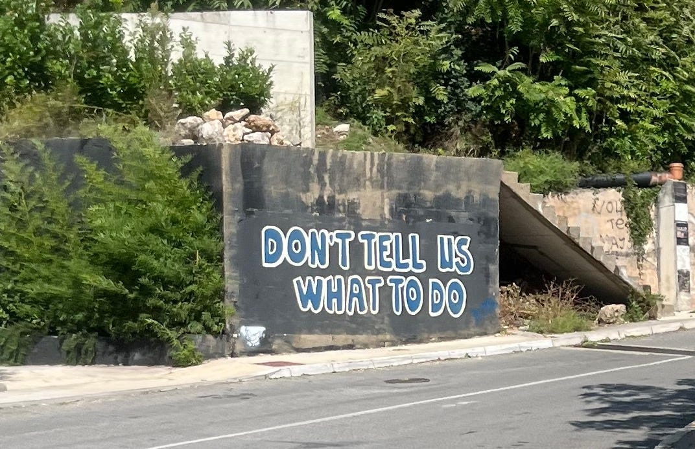

I often look out for Anarchist symbols and slogans when I'm visiting a different country. Almost every time I pass a wall with graffiti on it, or a lamppost covered in stickers, I see if there is an A with a circle around it, a red-and-black flag, or even the phrase “A better world is possible.” It gives me hope that there are others who are rejecting hierarchy, and striving for a future free from domination. In the last couple years I've begun to travel in Europe I've seen many such signs in France, Portugal and Greece. However, on my recent trip to Croatia I didn't see any, despite going out of my way to find them. That may be because they were quickly cleaned up in Dubrovnik old town, or simply because I didn't understand Anarchist slogans written in local languages.1

But when I was on a bus between Perast and Kotor I was happy to see the words, newly painted in large capital letters, “Don't tell us what to do”, which made me more at home. I felt satisfied that there were Anarchists in the region which was once part of Yugoslavia, at least in their intentions, even if they didn't associate themselves with that label yet. That may seem a lot to assume from a few words, but I believe it is a natural progression from “Don't tell us what to do”, to “You have no right to tell us what to do”, to “It is wrong for anyone to tell anyone else what to do.”

Now I'm not telling about some person saying to another who is in danger, “Don't drive that way because the bridge has collapsed.” Thats not the kind of telling what to do that the graffitist or I take issue with. I'm talking about someone presuming they have the right to tell (or even order or compel) other people to do this or that, or that other people should be obliged to do it because of the position or power of the person doing the telling.

If one believes in a god that appoints men to rule over others then you have a reason for believing someone can tell you what to do. Although no-one has ever proved they were sent by that god, or that god exists, or that they are infallible. Believers take such things on faith. However, if we look at history's popes, prophets, divine kings, and messiahs does seem to show a large failure rate in producing miraculous outcomes. Undoubtedly the faithful put that down to human imperfection, but if it was a deity who created us then perhaps he wasn't so perfect at doing so, and perhaps we shouldn't trust the fallible rulers this deity chooses any more than any others, as they still are imperfectly human after all.

If one believes that a system in which we vote for others to represent us, do they really believe we voted to give trillions from our taxes in subsidies to oil companies which they then use to destroy the planet? Do they really believe we wanted Billionaires and their corporations to be taxed at a lower rate than the rest of us, and even then to let them get away with avoiding much of that tax? Do we really believe that money and power won't always ultimately lead to politicians being corrupted by power and money, or the already corrupted getting into office due to the power and money of the powerful and wealthy?

Now there are such things as knowledge and skill, and we are often wise to respect someone who has considerable skill and knowledge in that area they are knowledgeable and skilful. They might tell us, don't do it that way, because they know it won't work, it might waste materials, and it might even be dangerous. But they are not telling us this to assert their power or extend it to areas they know nothing about, and we are still free to go to a different expert for another opinion, and to find out for ourselves if they are wrong, even at our own risk.

However, recognising we are responsible “for our own shit” as the saying goes is the heart of asserting our own power. We can do it respectfully, even politely if we wish, we can be considerate, and take advice, and be empathetic to others. We can even help as part of a community to clean up other peoples crap, but at the end of the day still say, “Don't Tell Us What To Do” and certainly don't try and force us to. We're Anarchists and don't put up with that sort of stuff.

Subscribe

1

There is now an Anarchist symbol in Kotor. I saw it on my third visit to the old town, as if it miraculously appeared.
