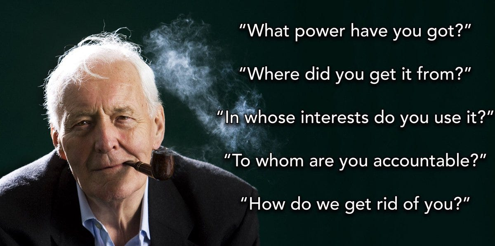

When I was younger and imagined that party politics might be a way to help change the world for the better, I admired Tony Benn (a British Labour party Member of Parliament) in a way I did few other politicians. He was a hereditary Lord who fought for the right to renounce his title, he made moral stands - such as against the Iraq war - when it wasn't popular and cost him standing, he seems to have acted with the noblest of intentions, and in many of his predictions of the consequences of governmental policies he proved to be right. When I used to have political discussions and people would say to me that all politicians were crooks I'd hold him up as one of the good exceptions, and even those who didn't agree with his policies seemed to respect his integrity. Even when I was beginning to question those who claimed the right to hold high political positions I found his Five Questions For Those In Power particularly impressive. He said that we should be able to ask these of anyone in any position over us:

>  **“What Power Have You Got?**
> 
>  **Where Did You Get It From?**
> 
>  **In Whose Interests Do You Exercise It?**
> 
>  **To Whom Are You Accountable?**
> 
>  **How Can We Get Rid Of You?”1**

I agreed with all of these questions wholeheartedly, and still do agree that people should be able to ask questions of power and expecting answers. But after he gave this list Benn went on to say, "Only democracy gives us that right" to ask these questions, and this is where he and I now disagree.

Of course a lot of this depends on what your definition of democracy is. Democracy to most of the Western world means hundreds of thousands of people selecting only one person to represent them, usually one who is from one of two or three political parties funded or favoured by the very wealthy or powerful interest groups. Whatever his personal views, Benn was still a politician, and part of that political system, for all its failings.

The problem begins once someone can answer the question “ **What Power Have You Got?** ” with “I have the power to tell others what to do” (and the power to force them to do it). At this point they already have too much power. They have a power no-one should ever have, and no-one is qualified to hold.

Of course few rulers would actually use such language. If someone is voted President or appointed Prime Minister and launches a missile attack or cuts a federal programme which some rely on to live, then he says he regrettably had to act to ensure the country's safety, or it's economic stability. 

A single representative might argue they have far less power, if any personally at all, and yet they will claim they speak for 100,000 people, and will vote on changes that affect those people, so in that way they have 100,000 times more power than a single person they claim to represent does. But they will claim that they are just a servant of the public. 

Which brings us to the second question: “ **Where Did You Get [Your Power] From?** ” To which they might answer: “I got it from the people, they voted me to be in this position!” But this is a distraction. 

In a ‘representative’ democracy the majority of eligible voters usually don't vote for the winning candidate. The winning candidate is the one with the biggest vote it is true, but if there are three candidates and one gets 30%, another 30%, and one 40%, then the one with 40% will win, even though he represents a minority of the voters. However, he will feel entitled to enact his policies despite this. 

And how did they become a candidate? Often they had to appease some rich donor with promises of promoting changes favourable to them, even when such policies are directly opposed to what their voters want. In political systems where such direct donations are not allowed then donations to political parties which have the same effect often are, and even if neither of these kinds of bribes existed then as long as rich people own newspapers and television and radio stations, or can promise political representatives some reward outside of their work or at the end of their term then they won't represent our interests first. Sometimes there may be an independent candidate or rebellious one who might, but they are rare and usually too outnumbered to make any substantial changes.

Likewise if there are two candidates and one receives votes from 15% of the population and another from 25% of the population, then the one with 25% will win, even though 60% of them didn't vote for either candidate. This is because such systems discount those who don't vote at all, those who don't believe any of the candidates represent their interests or that the system has any legitimacy. There is no choice to have no-one represent you. Very often this group are the biggest majority and they are ignored completely.

Yet this still does include another major group: those who cannot vote, such as those who are not adults, or (in some countries) those in prison. All these people will be ‘represented’ by a candidate who they have not voted for and be given substantial power that affects their constituents (and in the case of a presidential vote the whole country).

But even if the majority really did vote, would this give them power to appoint someone to rule over others, especially those who didn't support that choice? No, that would be mob rule, that would be a dictatorship, even if limited to one term, and so that is exactly what it is. Numbers do not give you the right to rule over those who don't consent to it. No-one can give to anyone else a power they shouldn't ever have and have no right to exercise over others. It doesn't matter how many vote for it. The whole notion of voting to put someone in power over others is problematic to begin with. If one man ruling over another is wrong, then one man ruling over twenty because four gave their permission is too.

How did this system get put in place? The story goes that there was a revolution and the people won. In England we have the “glorious” revolution of 1688, and in America the revolution of 1776. But these were not revolutions to replace the existence of a system of a small set of leaders over a greater number of people, just who were in those positions. In the case of England, it had a Parliament before these revolutions and after it, it was once the Parliament for America too (just as the American congress makes decisions on it's territories today). In both cases initially only land owners had a say in selecting representatives, but ultimately let working men and women vote. It didn't give them a choice to vote out the system though. No group in power ever does.

Originally someone took power by force and proclaimed themselves king. At some point they may have claimed the approval of deity, and the support of the church, but they took their office with violence and maintained it that way. Now that system of power may be somewhat divided, although still with very powerful Presidents and Prime Ministers at the head. Yet it is just a continuation of the same systems of power over others.

It is a modern fairy story that we choose to live in this kind of government. It existed before we ever cast a vote, and would carry on ruling even if no votes were cast. Knowing all of this we can easily dispense with the last 3 questions:

 **“In Whose Interests Do You Exercise [Power]?”**

I didn’t ask for them to act on my behalf, did you? Politicians can never exercise it in our interests because only we personally know our needs, and only we can accurately judge them. Maybe there are some broad points of agreement on certain principles, but there is a lot that can go wrong in the implementing of such principles - especially if we aren't personal involved with their implementation. Whereas there is so much incentive for them to implement policies that satisfy their rich friends, to extend their own power, and to remove themselves from scrutiny. Politicians rarely vote to give up their privileges or power, and often vote to gain more.

 **“To Whom Are You Accountable?”**

I’ve never felt that they listen to me, do you? Congressmen and members of parliament may be liable to be voted out once every 4 years, yet they remain completely unaccountable during their time in office. I'm not saying there aren't some disciplinary procedures possible - usually if they fall afoul of their parties priorities - but this is not the same as being accountable to us. We do have a mechanism for removing them, especially not for removing the existence of the position they hold and the system they have power within.

 **“How Can We Get Rid Of You?”**

This is the most important of all the questions. How do we get rid of not only those in power, but others having power over us, and the systems that enable and perpetuate this?

The ballot box is not enough. It makes us choose, often between two rich and privileged people, between the lesser of two evils, which are both evil. If we keep thinking voting is the path to positive change we will keep getting minor changes (if we are lucky) that will eventually be taken away in a future election by candidates more willing to serve the interests of the rich.

On rare occasions voting for a representative who strongly favours the removal of some previous restriction can lead to a change, if it is shown to be popular enough, without upsetting those with wealth too much, that it may happen. But this is just allowing something society has already accepted and is waiting for the state to legally allow. While fundamental changes that are needed go undealt with because they might undermine the power of the state.

Whereas voting usually just serves as a way of pacifying us, and depriving us of our power by letting us feel involved, while continuing to take away real power of the people to make choices for themselves.

Representative democracy is just a dictatorship with extra steps. It is authoritarianism with term limits. It is stolen power legitimised, and it is policed and enforced with the threat of violence, and imprisonment. To see the truth of this try to oppose the exist of the state and see how well your 'representatives' respond.

Ultimately we will never have our interests, our views, our needs, and our wants represented until we can take the power back, until we represent ourselves, and until the systems of power we now live under are removed. That is what we need to get rid of. Until then we will not get our own power back.

Subscribe

[Share](https://peacefulrevolutionary.substack.com/p/five-questions-of-power?utm_source=substack&utm_medium=email&utm_content=share&action=share)

 _A related article:_

### Hierarchy Series

If you liked this consider reading more of the **[Hierarchy Series](https://peacefulrevolutionary.substack.com/about#§hierarchy-series)**

1

See https://www.thenation.com/article/archive/tony-benn-and-five-essential-questions-democracy/

& https://theanarchistlibrary.org/library/anarcho-the-two-souls-of-democracy
