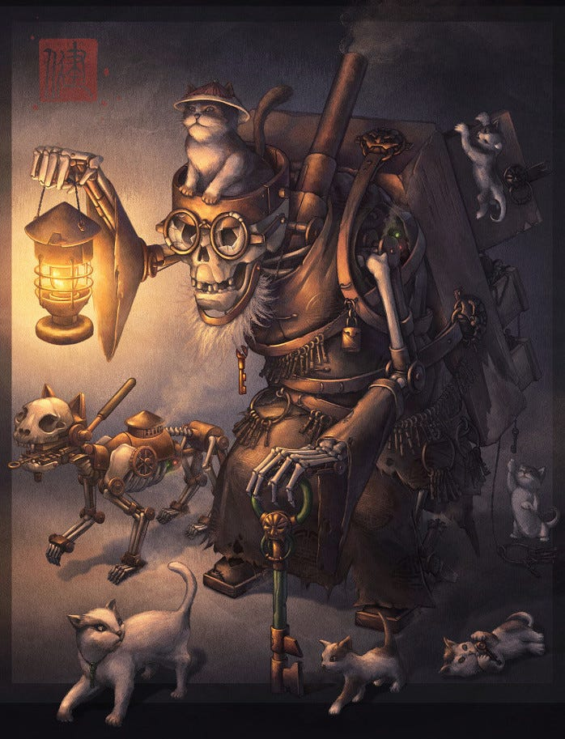

## Who Has The Right To Rule?

The golden question of Anarchism is - “what gives someone the right to have power over someone else?”

Who gives us the right to rule over ourselves? We do! We are born with that right, and can use it when we are old enough to make choices for our lives. But are limited in our choices when we act (or refuse or are unable to) due to fear, anxiety, and without knowledge and understanding.

What gives others the right over us? Nothing does! No-one has that right and never will. The consequences of someone ruling over another are more than anyone can foresee, the power is more than anyone can ever earn or deserve, and the dangers are greater than any possible benefit could ever bestow.

But what about those who know more? Should they rule over us? No! No amount of learning qualifies someone to rule over another. If they are an expert in their subject they may give very important advice, if they are a doctor we may want to trust their medical diagnosis far more than someone less knowledgeable, but it doesn't give them the right to take power over us.

But what about those who have our best interests at heart? No! Even those with the best intentions can make decisions on our behalf because they can never understand us completely.

But what about those who are stronger? No! No-one is that strong that it makes it moral. We may have someone carry us if we are hurt, but we still should be in control of our choices, including whether we want to be carried.

But what about people who voluntarily want to give over some of their power to someone else? Now, we have come to an argument that those who defend the idea of a state sometimes give: That we give up voluntarily some of our freedom in return for greater safety. This forgets the fact that historically most states are originally formed by force, and that modern states are still maintained by force. 

## The Key Keeper Parable

The Key Keeper, **[James Ng](https://www.artstation.com/jamesngart)**

Let’s go with this argument for a moment, let’s imagine our freedom is like the key to our house. It is something we own, that we can give freely, and that we are unlikely to give to someone unless they threaten us, or unless we are convinced that they will be able to handle it better than we will. 

## The Key-Keeper's Proposition

Suppose someone comes along and says, ‘if all of you on this street give me your keys, then I will make sure they don't get lost. You'll never have to worry about being locked out of your house, or thieves or nosy neighbours getting in if you forget to lock your door. Although, I'll be able to get in if you are in trouble and need my help, and I'll provide a protection service for the street to keep undesirables out.’ Some may be swayed by this proposal, especially that they may now be fearing what might happen if they didn't have him to protect them from undesirables, your lesser-known neighbours and even your forgetful self.

All this new key-keeper asks for is a little tribute, a small portion of what you work for and earn. Isn't it worth it for the peace of mind? Oh, and some loyalty too. They ask that you don't speak badly to your other neighbours about them. You can question whether the key-keeper should be someone else, but if you try to replace the key-keeping system that is completely unacceptable and you will be brought into line by force if necessary. But isn't that just showing respect for their position? (The degree to which you can question may differ from one country to another, but in even the most liberal country there is a point at which proposing an alternative could get you into trouble).

## The Consequences of the System

So everything goes fine for a while. You feel lucky that you are safe from these undesirables you hear about, and that the key-keeper is providing this valuable service. But then one day one neighbour decides they don't need the key-keeper and they ask for the key back, not realising this wasn't part of the bargain. Most people think they are crazy, so crazy that they should be locked up for their own good. I mean who would willingly put themselves outside of the protection of the key-keeper? They must be mad, and you guess they must have been, because they soon disappear, perhaps taken to the asylum.

Another day the rates are raised and someone claims they can't afford it. Some urge charity and ask for allowances to be made. But others say, maybe they just aren't working hard enough. Surely they should be made to, or lose their home as they are making the costs go up for everyone if they don't pay them. Maybe they can work in prison to pay off their debt, where they won't be a freeloader, and thats what ends up happening. But people soon forget about the incident.

## Personal Struggles Within the System

And then the day comes when it is you who is struggling to pay the key-keeper rates. But you promise the key-keeper's payment collector you'll find the money, and he 'kindly' lets you stay for now, but just to make sure you know how serious this is he shuts off your water from the outside. You forgot he always had the right to do this, he has the key to your water service panel, you gave it to him for safe keeping. 

You still struggle. It seems that all the best, highest paying jobs belong to key-keepers and their enforcers, and those who buy and sell the houses your neighbours have been kicked out if. Your kids are now working too when they can, but you can scarcely keep up with the debt repayments. So your electricity is shut off too, and then a few weeks later they use the key to come in and take your furniture, and finally after a few months they kick you out, and won't let you back in.

## The Illusion of Choice and Consent

You protest, “This is my house, it belongs to me.” They say you should have read the fine print. “Right there in tiny lettering”, it says if you couldn't pay they'd take what you had up to and including your home to pay for their services. “But I didn't know that was what I was agreeing to when I signed.” “Too bad,” they say, “this is the system, you agreed to it.” “But what about my kids, they didn't agree to it?” “Well, you shouldn't have had kids if you couldn't afford them.” “But they still didn't agree to it.” “Well, you agreed to it for them, and if they live long enough they'll get jobs and rent places and pick key-keepers for themselves and in this way show that they agree to it.” 

You protest, “So what you are saying is that me and my children must suffer, and their descendants forever because of my mistake?” “Yes, that is the way the system works, and we think it is fair. Look at us we are thriving, and if you had been smarter, stronger, or richer you would be too.”

So some argue that we have a choice, or at least the population of our country did collectively once, and that we re-make that choice every time we engage in the system we are born in through voting, or paying taxes, (or by not overthrowing the state). In a sense they are right, we are complicit in keeping the system going, but the alternate is opposing it and facing the violence that they will retaliate with if we do.

So even if people could willingly give up their freedom, even part of it, they always do so expecting something different than the worst possible outcome. They would be making a bet, one which the person they are betting with may profit from if they fail, just like any gambling den which supplies the cards and sets the odds usually does.

## The Argument Against Meritocracy

There are others who argue that people rise over others because of merit, that they possess some skill or higher degree of intelligence than most of us. Maybe they claim they are genetically better suited to rule over others, or that some deity appointed them. But even if this were true would it give them a right to be in positions of power?

You can show someone how to do something, you can share with them the reason they might do it, you can help them if they lack the strength to do it for themselves, but you have no right to threaten or force them to do what you want them to, no matter how much you think it might be in their benefit to do it, no matter how much you feel they may enjoy doing it, no matter how much you may want them to join you in doing it, you still have no right to tell them what to do.

## The Core Principles of Anarchism

Understanding and accepting this is a large part of what makes someone an Anarchist, and respecting and speaking up for this is what makes you an activist.

Anything that establishes inequality of power and a hierarchy of power and an exercise of power over others is a form of coercion. Forcing someone to do something through fear - even if it is fear of the consequences of not obeying - is a form of violence. It hurts people, it hurts their dignity, their safety, their security, and sometimes can physically hurt them too.

We need to keep hold of the keys to our own lives, and not let others possess them, for when they do they are unlikely to give them up willingly. We need to avoid hierarchy, inequality of power, and coercion wherever possible. But living in a world where all those things are an inextricable part of the state we live under, we have to carve out what freedom we can, subvert the system when and where we can, and help others to see their situation, until we can all change it.

Subscribe

[Share](https://peacefulrevolutionary.substack.com/p/the-key-keeper?utm_source=substack&utm_medium=email&utm_content=share&action=share)

## Questions

  * How does the metaphor of ‘freedom as a house key’ represent how governments and societies function?

  * How does the ‘key-keeper’ narrative relate to real-world hierarchies and the concept of consent in modern ‘democracy’?

  * What alternatives can we pursue and support to make others power and structures irrelevant?

### Hierarchy Series

If you liked this consider reading more of the **[Hierarchy Series](https://peacefulrevolutionary.substack.com/about#§hierarchy-series)**

 _Also see the previous article which prompted this one -_
