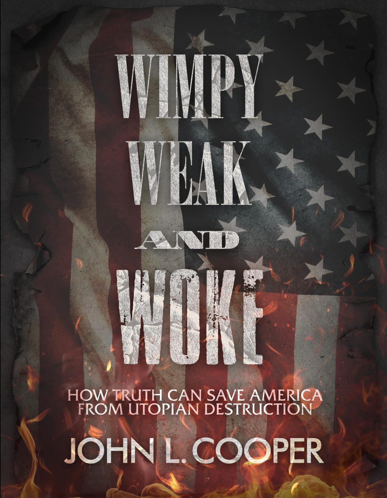

Today I came across the first book I've ever seen that explicitly states it is fighting against all things “Utopian”. It is by John L. Cooper, and is titled, “Wimpy, Weak and Woke: How truth can save America from Utopian destruction.” Cooper is the American vocalist of the Christian rock band Skillet, and he is on a campaign against what he calls Far-Left ideology, including “Utopianism” (as well as Marxism, Critical Race Theory, and Social Justic, whatever those things mean to him).

I haven't been able to get hold of the book to see what his definition of Utopia is, and whether it is just secular Utopias he is against or religious ones like those of Tolstoy, the Hutterites, Jewish Kibbutzim, Thomas More, St. Augustine, or Francis Bellamy, the author of the Pledge Of Allegiance. My guess is that he is happily anticipating the cataclysms predicted in the Book Of Revelation, and personally hoping for some ambiguous heavenly state of existence, but would rather take a theocratic kingdom over a voluntary decentralised form of Anarcho-Communism, whether Christian in character or not.

As for the exact definition of Utopian I'm not in a position to redefine words. Sometimes I wish I was. I'd love to take the word Libertarian back to its left-wing origins. Although I don't believe in a god, I think the word Christian would be better going back to it's early communalistic and social justice roots. But I started searching the web for other Anti-Utopian books, discovering that many people have classified all Dystopian books as “anti-utopian”, and it struck me as the wrong definition. 

Now I admit I tend to put books about the future into either the Utopian or Dystopian category. They are either have a positive or negative setting. It's an easy way to classify them. The word Utopian for many (like me) has come to mean a future that has positive possibilities, even if it is imperfect and a work in progress. The word Dystopian always refers to the kind of place no-body (except perhaps sadomasochists) would want to live in.

With this in mind I don't think all or even most Dystopias qualify as Anti-Utopian. Many Dystopias are just one or several bad aspects of society amplified, but that doesn't mean that a better world isn't possible within the context of many of these stories. In fact quite a few of them are making the point that life is worse if we let this part of society or this kind of power grow beyond reason, and some end with that power being defeated or at least the hope that it will be so.

But for something to really qualify as Anti-Utopian, (it seems to me) it needs to be arguing that Utopia isn't only not possible (as a process or goal), but would require Dystopian means to attempt it, or would inevitably lead to Dystopia in the process.

Lord Of The Flies is anti-utopian in this definition, but (I'd argue) Nineteen-Eighty-Four isn't. Because Flies assumes that the worst instincts and outcomes are inevitable, and only kept in check by violence or the threat of it (reflecting the views of its author). Whereas 1984 takes authoritarianism and fear to extreme levels, but it is an artificial and imposed system.

Planet Of The Apes (either the book or film, despite the differences in setting) would be classified as Anti-Utopian, because it is based around a (fictional) inevitable cycle that sentient beings supposedly fall into. Yet Brave New World wouldn't be, because people are engineered and conditioned into their state of being.

Then there are some books set in the future which selectively Anti-Utopian for the majority of people, but Utopian for a minority. Atlas Shrugged and the Time Machine comes to mind, as does Mein Kampf (if its second half is considered a work of speculative fiction, albeit an evil one).

It is arguable that Marx's rejection of Utopian Socialism wasn't based on Nihilism1, but Marx’s work primarily focused on a practical analysis of the economic world as it was. Marx believed that Socialism was an inevitability in the progress of mankind, so could hardly could be called Anti-Utopian.

Evolution itself has been used by Anti-Utopian philosophers, such as Thomas Huxley, but equally used to prove Utopian seeming principles of co-operation, mutual aid, and even Communism by Peter Kropotkin (and to some extent Stephen Jay Gould). 

Anti-Utopianism is the credo of “don't dare to dream” because it will only lead to disappointment, if not devastation if you try to put it into practice. It is a religious belief, just as much as the Calvinist doctrine of “total depravity”, and finds its most ardent proponents in those who accept that philosophy or those influences by it, such as Nietzsche (inheriting it from his Lutheran origins). 

Utopianism is to think in defiance to “the way things have always been and always will be”, it is to imagine change happening, and even potentially to act in the process of seeking to bring about such change. There may be wisdom in accepting the world as it is, there may be anger and disappointment in considering how much better the world can be, but the world has got better in some ways at some times because people believed it was possible and fought for it.

Some of the most devout Christians were ardent Utopians such as Gerard Winstanley and of course Thomas More, from whom we get the term, and was canonised as a Catholic Saint. Modern Christians such as Dorothy Day, Eberhard Arnold, Martin Luther King, and Ammon Hennessy were Utopian Socialists. As was the Fabian society in it's early years, of which many famous modern authors and intellectuals (including secular ones such as George Bernard Shaw, H. G. Wells, Bertrand Russell, and George Orwell) were a part.

However, Utopianism is not a set ideology with a specific set of beliefs. The only proposition all it's manifestations has in common is a belief in the possibility of positive change. It makes me feel sorry for the Calvinists, Nihilists and John Coopers of this world who fight against this notion, who are so determined to believe in the evil of their fellow beings as to consider it impossible for them to reach higher and do better (at least without divine intervention). I consider that a nightmare as bad as any idea of hell anyone has come up with, so in my own way I'll keep fighting for something a little more heavenly here on earth. 

Subscribe

1

It is arguable whether Hegel who inspired Marx can be classed as Nihilist.
