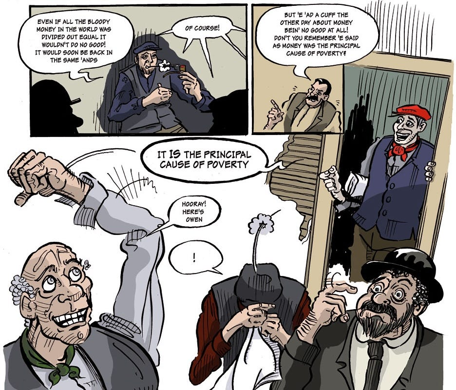

‘Come on 'ere,’ cried Philpot, putting his hand on Owen's shoulder. ' **Prove that money is the cause of poverty.** '

‘It's one thing to say it and another to prove it,’ sneered Crass, who was anxious for an opportunity to produce the long deferred 'Obscurer' cutting.

‘Money _is_ the real cause of poverty,’ said Owen.

‘Prove it,' repeated Crass.

‘Money is the cause of poverty because it is the device by which those who are too lazy to work are enabled to rob the workers of the fruits of their labour.’

‘Prove it,’ said Crass.

Owen slowly folded up the piece of newspaper he had been reading and put it into his pocket.

‘All right,’ he replied, ‘I'll show you how the Great Money Trick is worked.’

 _Image from the full comic version -<https://www.avine.co.uk/great-money-trick/>_

Owen opened his dinner basket and took from it two slices of bread, but as these were not sufficient, he requested anyone who had some bread left to give it to him. They gave him several pieces which he placed in a heap on a clean piece of paper, and having borrowed the pocket knives they used to cut and eat their dinners with from Easton, Harlow and Philpot, he addressed them as follows:

‘These pieces of bread represent the raw materials which exist naturally in and on the earth for the use of mankind; they were not made by any human being, but were created by the Great Spirit for the benefit and sustenance of all, as were the air and the light of the sun.’

‘You're about as fair speakin' a man as I've met for some time,’ said Harlow, winking at the others.

‘Yes, mate,’ said Philpot, ‘anyone would agree to that much: it's as clear as mud.’

‘Now,’ continued Owen, ‘I am a capitalist; or rather, I represent the landlord and capitalist class. That is to say, all these raw materials belong to me. It does not matter for our present argument how I obtained possession of them, or whether I have any real right to them; the only thing that matters now is the admitted fact that all the raw materials which are necessary for the production of the necessaries of life are now the property of the Landlord and Capitalist Class. I am that class: all these raw materials belong to me.’

‘Good enough,’ agreed Philpot.

‘Now you three represent the Working Class: you have nothing. And for my part, although I have all these raw materials, they are of no use to me; what I need is the things that can be made out of these raw materials by Work. But as I am too lazy to work myself, I have invented the Money Trick to make you work _for_ me. But first I must explain that I possess something else besides the raw materials. These three knives represent all the machinery of production: the factories, tools, railways, and so forth, without which the necessaries of life cannot be produced in abundance. And these three coins’—taking three halfpennies from his pocket—’represent my Money Capital.’

‘But before we go any further,’ said Owen, interrupting himself, ‘it is most important that you remember that I am not supposed to be merely “a” capitalist, I represent the whole Capitalist Class; you are not supposed to be just three workers, you represent the whole Working Class.’

‘All right, all right,’ said Crass, impatiently, ‘we all understands that. Git on with it.’

Owen now proceeded to cut up one of the slices of bread into a number of little square blocks.

‘These represent the things which are produced by labour, aided by machinery, from the raw materials. We will suppose that three of these blocks represent a week's work. We will suppose that a week's work is worth one pound, and we will suppose that each of these ha'pennies is a sovereign1. We'd be able to do the trick better if we had real sovereigns, but I forgot to bring any with me.’

‘I'd lend you some,’ said Philpot, regretfully, ‘but I left me purse on our grand pianner2.’

As by a strange coincidence nobody happened to have any gold with them, it was decided to make shift with the half-pence.

‘Now this is the way the trick works—’

‘Before you goes on with it,’ interrupted Philpot, apprehensively, ‘don't you think we'd better 'ave someone to keep watch at the gate in case a slop3 comes along? We don't want to get runned in4, you know.’

‘I don't think there's any need for that,’ replied Owen; ‘there's only one slop who'd interfere with us for playing this game, and that's Police Constable Socialism.’

‘Never mind about Socialism,’ said Crass, irritably, ‘get along with the bloody trick.’

Owen now addressed himself to the working classes as represented by Philpot, Harlow and Easton.

‘You say that you are all in need of employment, and as I am the kind hearted capitalist class I am going to invest all my money in various industries so as to give you plenty of work. I shall pay each of you one pound per week; you must each produce three of these square blocks to represent a week's work. For doing this work you will each receive your wages; the money will be your own to do as you like with, and the things you produce will of course be mine, to do as I like with. You will each take one of these machines and as soon as you have done a week's work you shall have your money.’

The Working Classes accordingly set to work, and the Capitalist Class sat down and watched them. As soon as they had finished, they passed the nine little blocks of bread to Owen, who placed them on a piece of paper by his side and paid the workers their wages.

‘These blocks represent the necessaries of life. You can't live without some of these things, but as they belong to me, you will have to buy them from me. My price for these blocks is one pound each.’

As the working classes were in need of the necessaries of life and as they could not eat, drink or wear the useless money, they were compelled to agree to the kind Capitalist's terms. They each bought back and at once consumed one third of the produce of their labour. The capitalist class also devoured two of the square blocks, and so the net result of the week's work was that the kind capitalist had consumed two pounds' worth of the things produced by the labour of others, and reckoning the squares at their market value of one pound each, he had more than doubled his capital, for he still possessed the three pounds in money and in addition four pounds' worth of goods. As for the working classes, Philpot, Harlow and Easton, having each consumed the pound's worth of necessaries they had bought with their wages, they were again in precisely the same condition as when they started work—they had nothing.

This process was repeated several times: for each week's work the producers were paid their wages. They kept on working and spending all their earnings. The kind-hearted Capitalist consumed twice as much as anyone of them and his pile of wealth continually increased. In a little while—reckoning the little squares at their market value of one pound each—he was worth about one hundred pounds, and the working classes were still in the same condition as when they began, and were still tearing into their work as if their lives depended upon it—which they did.

After a while the rest of the crowd began to laugh, and their merriment increased when the kind-hearted Capitalist, just after having sold a pound's worth of necessaries to each of his workers, suddenly took their tools—the Machinery of Production—the knives—away from them, and informed them that as owing to Over Production all his store-houses were glutted with the necessaries of life he had decided to close down the works.

‘Well, and wot the bloody 'ell are we to do now?’ demanded Philpot.

‘That's not my business,’ replied the kind-hearted Capitalist. ‘I've paid you your wages, and provided you with Plenty of Work for a long time past. I have no more work for you to do at present. Come round again in a few months' time and I'll see what I can do for you.’

‘But what about the necessaries of life?’ demanded Harlow. ‘We must have something to eat.’

‘Of course you must,’ replied the Capitalist, affably, ‘and I shall be very pleased to sell you some.’

‘But we ain't got no bloody money!’

‘Well, you can't expect me to give you my goods for nothing! You didn't work for me for nothing you know. I paid you for your work and you should have saved something: you should have been thrifty like me. Look how I have got on by being thrifty!’

The unemployed looked blankly at each other, but the crowd only laughed; and then the three unemployed began to abuse the kind-hearted Capitalist, demanding that he should give them some of the necessaries of life that he had piled up in his warehouses, or to be allowed to work and produce some more for their own needs; and they even threatened to take some of the things by force if he did not comply with their demands. But the kind-hearted Capitalist told them not to be insolent, and spoke to them about honesty, and said if they were not careful he would have their faces battered in for them by the police, or if necessary he would call out the military and have them shot down like dogs.

‘Of course,’ continued the kind-hearted Capitalist, ‘if it were not for foreign competition I should be able to sell these things that you have made, and then I should be able to give you plenty of work again. But until I have sold them to somebody or other, or until I have used them myself, you will have to remain idle.’

‘Well, this takes the bloody biskit5, don't it?’ said Harlow.

Subscribe

 _Something else which touches upon this theme is Kropotkin’s ‘Our Riches’:_

1

Ha’penny: Half penny. One Sovereign was worth 20 shillings, or one Pound sterling. £1 in 1914 is worth £144.61 today.

2

Piano.

3

Slop: a police officer, the police.

4

“Runned in” is a colloquial way of saying “arrested”.

5

Biscuit (US: Cake). The worst (or best) of a situation.
