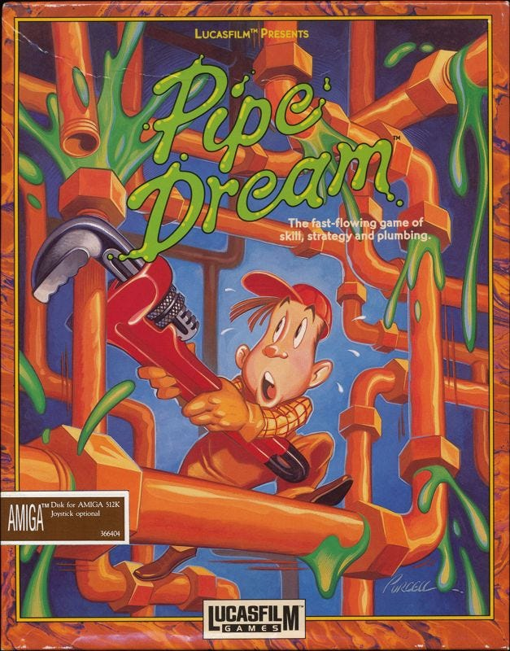

> ‘If they can get you asking the wrong questions, they don't have to worry about answers.’ _–Thomas Pynchon, Gravity's Rainbow_

We've become so accustomed to using money for everything that it's hard to imagine a world without it. Yet, for most of our history, money didn't exist. Ancient cave etchings show that while our ancestors spent much of their time hunting and gathering for survival, they also dedicated moments to creating art, music, and enjoying each other's friendship — all without the need to earn a wage, pay bills, or rent. So do we really need money getting in the way of all that now?

Yet it is hard for many to imagine a world in which needs are prioritised instead of profits. Some argue that abandoning money wouldn't be practical. They ask, ‘But who will do the dirty jobs? Who will fix the toilets or unclog the drains? After all, the world will still need plumbers, and they wouldn't do it without being well paid, would they?’

This often serves as a ‘gotcha’ question, highlighting the seeming impossibility of a society without money. Essentially, it asks, ‘Why would anyone spend their days dealing with crap (especially of the literal kind) when there's no financial incentive?’1 This implies that:

  1. People are primarily motivated by financial rewards in their career choices.

  2. Individuals only opt for undesirable jobs if the pay is high enough (and plumbing becomes a preferable choice over poverty).

  3. People are choosing plumbing over other skilled professions due to lack of intelligence or unwillingness to work harder for better-paying roles.2

Under capitalism, this question seemingly has one simple answer (‘they'll do it for the money’). However, there are problems with the answers simplicity. Money requires a system, and this system relies on questionable and costly forces to function. Many factors influence how and why individuals handle sewage within a capitalist framework, yet the messy and complicated aspects of this journey are often overlooked.3

For those who believe people act similarly to donkeys, motivated either by carrots or sticks, this scenario presents a carrot of ‘look at this money we'll give you if you do this awful thing,’ or the stick of , ‘look what will happen to you if you don't do this awful thing.’ But is this the only practical way for individuals and society to operate? This argument raises multiple problems and contradictions, each of which deserves closer look.

##  **1\. Believing that only within Capitalism would people want to be plumbers is not a realistic or accurate argument.**

The capitalist argument for people becoming plumbers is this: ‘People want more stuff and greater comforts, plumber gets paid more because few people want to deal with the crap, so plumbers can afford more stuff, therefore enough people want to become plumbers for the stuff.’ But is this true?

Lets go with the first premise that plumbers are paid better. It makes sense that plumbers would be able to demand more money under capitalism, because a home cannot be completed without the work they do with pipes, toilets, and taps. Such skills are especially sought after in an emergency, when the plumber can remove smelly problems that would make life at home unbearable. Even when the problem isn't quite as pungent, a plumber is often the only one who can fix problems with blocked pipes, broken toilets, and issues relating to showers and taps, all of which when broken can seriously impairs your quality of life. 

Just as you are grateful to have a painful tooth pulled when you need it, because you look forward to being out of pain, people value what plumbers do when they desperately need them to fix a burst pipe, and are prepared to pay a premium for it. So it does indeed often pay more than other manual labour such as construction work.

(I'm not arguing that money isn't ever an incentive - our whole system is designed to make it so. I'm not arguing that it may not sometimes incentivise dirty jobs more, or claiming that difficult jobs don't typically pay more. I'm not disagreeing on those points. While we have bills to pay, then more money means less worries, and even after our needs being met extra luxuries are desired by some.)

There is still often the question of the time and effort it takes to become a plumber. It takes three years of training, often initially at a much lower apprentice's wage, to eventually be able to work on your own, and expect a higher pay rate. But does that mean that plumbers make more money than other ‘clean' manual professions that take as long to train in? 

If we compare electricians with plumbers, as the training is of similar length, then on average in America plumbers are paid better than electricians. However, in every other 'Western' countries this is actually the other way around. In Europe there are roughly the same number of vacancies for electricians and plumbers, but electricians are paid slightly more. So at least in Europe under the capitalist argument there is no financial reason to be a plumber rather than an electrician, and in some (so called) third world countries plumbers get paid poorly precisely because it is seen as a dirty job.4

So why do people in countries where they can earn similar or more doing other cleaner jobs with a similar length of training still choose plumbing? Why do people in countries in which there is free education, free housing, free medicine, and decent social welfare for the unemployed still choose to be plumbers? The simple answer is that it is possible to have people doing dirty / difficult jobs when money isn't the only incentive to do that. Money is not the only factor in deciding why people do that and other dirty jobs.

People become parents knowing they'll have a duty to wipe their children's backsides, but they don't get paid for that task at all. Sometimes those children grow up to care for their parents and wipe their backsides when they are old and infirm, but they don't get paid for that either. 

Some may argue that if these people could pay for others to do this job they would. However, when those with babies or infirm parents can afford paying someone else to clean them (a nanny or carer), those jobs are often low paid. So we already have people doing the dirtiest jobs for no or low pay already in our society.

My mother cleaned people's messy backsides, as a care worker, for most of her life, for relatively little pay. I'm sure she would have rather skipped that part of the job, but she wouldn't have wanted to have seen the elderly people in her care suffer, so she did it with as much grace as such a task allows, because it had to be done so that those people maintained some dignity.

Is it possible that people do such work because they don't like to see others uncomfortable or suffering? Because they (at times) find it emotionally rewarding, or feel that it is their duty? (All of which require no money, and would still be done without the existence of money.) Wouldn't those needs still exist and the incentives be the same without capitalism?

##  **2\. Capitalism creates and maintains the conditions in which plumbing must be done this way.**

When it comes to the amount people get paid for any job it is argued by capitalists that it is not them, but the ‘free’ market that decides. This implies that the market is an impartial arbiter, simply reflecting demand for services and value of goods. However, for a market to exist there needs to be several parts already in place. Just like a traditional market needs land on which to place the stalls, tables on which to place your wares, tarpaulins to keep out the weather, things to actually sell, and materials and people to make those things; a modern market requires a transport network to move people and goods, and a means of exchange with which to buy and sell what is produced. There is no modern ‘free’ market system without currency, and there is no currency without government to guarantee it's value (and ensure it isn't counterfeited).

Governments are not impartial in this process. Their interests often represent those who have financed their political parties and campaigns, the lobbyists and private contracts, and legislation regarding regulation and taxation often reflects the interests of the corporations behind this process. Likewise they influence the minimum wage, the social benefits available, and put limits on the power of unions to make demands on pay and work conditions.5

So when people say the market decides, aren't they really saying that we can rely on some choosing plumbing (or care work etc.) as a profession, because it is an alternative to the capitalist-induced threat and fear of starvation? Some may argue, that's just the way the world and work is, but there is a problem with this if you are a proponent of capitalism. The same capitalists who argue that people wouldn't be plumbers if it wasn't for the financial reward of doing it under capitalism, also often argue that if people are poorly paid under capitalism they just need to train for a better paid job. (They say this as if there is no financial barrier to such training and no lack of availability of better paid jobs.)

This raises the question of why doesn't everyone train for the better paid jobs leaving no-one to do the dirty ones? Which often leads to a (grudgingly admitted) defence by capitalists of the idea that some people are just born dumb, and therefore somehow deserve a lower wage. Yet they argue that plumbers demand a higher wage than so called unskilled ‘dumb’ people, because they are highly trained, but still too ‘dumb’ to do other work which would be less dirty and pay them better. But, if all it takes is ‘dumb’ people to do such dirty work wouldn't there be ‘dumb’ people without capitalism too?

If you try to say a group of people together could share the responsibility of doing the plumbing, then supporters of capitalists will revert back to telling you that they can't because it is a highly skilled job. The capitalists seem to believe in a kind of Schrödinger's Plumber: a plumber who is too dumb to do anything else, but too smart for anyone else to do their job, yet still not smart enough to do a less dirty job.

This where capitalism veers into the territory of eugenics, in which the rich are genetically superior and the poor genetically inferior. Where some deserve to hoard wealth and goods and others deserve to starve. It is a politer form of racism which comforts the man in his mansion, who can argue that it may not be fair, but life isn't fair, even though such unfairness is exploited by the system which gives him his wealth. It is a pseudo-scientific conspiracy theory which no reputable scientist takes seriously. But then most scientists aren't very well paid, which is another reason for the capitalist class to dismiss their research, except when they pay for it and it supports the views of the rich.

So, lets say that - despite these contradictions - you are still convinced people are doing plumbing due to some dubious special monetary benefits, this raises the simple question: Could some of those things - experiential things - also exist within a system without money? Couldn't there be some other way of a community / society showing their gratitude and rewarding those who do dirty / difficult work?

 _Continues with in the[second part](https://open.substack.com/pub/peacefulrevolutionary/p/who-will-do-the-dirty-jobs-after-7f3?r=25vj2b) of this series._

Subscribe

[Share](https://peacefulrevolutionary.substack.com/p/who-will-do-the-dirty-jobs-after?utm_source=substack&utm_medium=email&utm_content=share&action=share)

1

Of course there have been even Anarchists who have suggested using money or labour vouchers, at least transitionally.

2

I'm not sure how much plumbers like capitalists implying that they only do their job because they are both greedy, but also fairly dumb.

3

Capitalism didn't need to prove it could implement a successful plumbing system for people to become capitalists and implement capitalism.

4

In America on average plumbers are paid better than electricians, in most other countries it is the other way around. It takes about 3 years to fully train to be either. https://www.payaca.com/post/who-makes-more-plumbers-or-electricians . In the UK there are roughly the same number of vacancies for electricians and plumbers https://www.hvpmag.co.uk/Plumbers-are-third-most-in-demand-tradespeople-in-the-UK-/16875. But electricians are paid slightly more - https://www.hitchcockandking.co.uk/h-k-news/average-salary-for-tradespeople-in-the-uk/

5

Government exists to enforce property rights, property (and corporations) owners have a major influence on the funding of political parties, selecting of candidates, and what legislation (usually to their benefit) gets promoted and passed. Of course most skilled professions are taught and qualified by university which receive most of their funding from the same people, including whole economics and business departments staffed with people defending this system as the only rational one. So does the market decide? and even if it does is it good that it does (for example it decides that a few Wall Street execs make as much in a years as all the rest of the workers in America put together on the profit of products they don't make).
