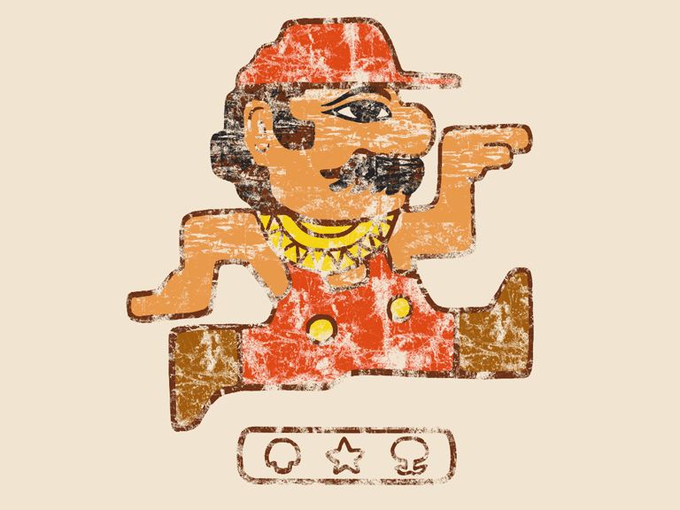

_Following on from[Part One](https://peacefulrevolutionary.substack.com/p/who-will-do-the-dirty-jobs-after) of this series._

##  **3\. The idea that plumbers require money to work contradicts ancient examples to the contrary.**

Believe it or not, plumbing existed before money. Plumbing was around at least 4500 years before capitalism. Not rudimentary wells and baths, but archeologists have found that early pre-money civilisations such as the Indus, Minoans, and Incas had advanced indoor and outdoor plumbing including: pipes, drains, aqueducts, heated water, showers, indoor toilets, and sewage treatment. However, this knowledge was lost when their cities were invaded, or became extinct through natural disaster. Yet their plumbing advances had to be reinvented later, some only very recently (my grandparents had an outside toilet, and used kettles to heat their bath).

The Indus Valley civilisation is perhaps the most interesting of these, because it is the oldest (3300 B.C.), and lacked any evidence of hierarchy, priests, slaves, or soldiers. Yet it included around six million inhabitants in an area covering Pakistan and part of India and Afghanistan. The homes in cities like Mohenjo-daro were all of similar size, without palaces or temples, but with many of the same conveniences we enjoy today. Keeping the water flowing and drinkable, and the waste draining and being disposed of in a sanitary fashion, must have taken many people with advanced skills in plumbing. Yet there was no monetary reward for this work, no fear of police or prisons compelling them to do it, and no religious obligation to carry out such duties.1

If this could work for whole cities and civilisations - which didn't use money - five thousand years ago, and lived without our modern technology and tools, why couldn't it work for other cities in our day? Why did people perform dirty plumbing and sewage work before there was money to incentivise them to do so? If they could keep the sewers functioning and the cities clean without paying people - couldn't we?

Later the Chinese and Romans had similarly advanced water systems, although primarily for the private homes of wealthy citizens. In Rome plumbers trained through apprenticeships, and they were able to maintain relatively high standards and wages through their trade guild (so avoiding having to compete against each other). Yet they still earnt similar to blacksmiths and masons, which were less dirty jobs, but still choose to be plumbers despite this.

During the Spanish Revolution plumbers in the republic were part of the plumbers collectives which helped organise their work. Some of this work was done for pay, some for trade, and some to support the ideals of the revolution. They were ultimately working toward a moneyless society but the fascists (and Leninists) brought an end to that before it could fully happen.

In some modern cooperatives and communes in which there are no wages (or they are equally distributed) they still carry out the plumbing, as this interesting modern example from the book Anarchy Works shows:

‘The Christiania “free state” is a quarter in Copenhagen, Denmark, that has been squatted since 1971. Its 850 inhabitants are autonomous within their 85 acres. They have been taking out their own trash for over thirty years. The fact that they receive about one million visitors a year makes their achievement all the more impressive. The streets, buildings, restaurants, public toilets, and public showers are all reasonably clean — especially for hippies! The body of water that runs through Christiania is not the cleanest, but considering that Christiania is tree-covered and automobile free one suspects most of the pollution comes from the surrounding city that shares the waterway.’

##  **4\. The idea that people are only motivated to do plumbing by money contradicts evidence regarding human motivations.**

This brings us to the controversial and much disputed topic of human nature. It has long been accepted by evolutionary scientists that there are genetic benefits to cooperation and altruism. Anthropologists can trace through archeological findings to modern society behaviours which favour being considerate of others and acting kindly. Even some philosophers who have questioned the reasons behind such actions and have wondered if they are secretly selfish, still admit that people can and do act in such ways, whether out of seeking recognition or genuine desire to help others.

A large part of our lives (our personal relationships), and for most of the world's history we did things just because we need each other, and our kindness was rewarded with friendship and acceptance. People still do wonderful things without any hope of monetary reward: We love, and spend time with friends, and enjoy many ways to pass the time that don't cost anything. In fact we will do things that do cost money to help others, but which don't give us any personal benefit beyond the good feelings that come with our kindness. 

Wouldn't most people - if they grew up with safety and security and were educated with the values of kindness and empathy - be more inclined to do more difficult and dirty tasks if necessary?

If you believe the religious assumptions of Calvinism, that people are born sinful, that nothing they do is ever really good, and that we all deserve to be destroyed (or even tortured forever), you have a theological reason for believing that people are evil. Then you might argue that people should be coerced through fear of damnation (or starvation) to avoid doing something bad, or compelled (by threat of hell or violence) into do something good.

However, even if people are naturally inclined toward selfishness and to act in their own self interest, this doesn't mean that - even without money - society couldn't be structured in a way where it offers the most selfish reasons to do dirty work during part of their week.

Those who bring up the example of plumbing do so because it is something they would never do (unless forced to), and can't believe anyone else would ever do voluntarily. Maybe they have an extreme aversion to dirty work, maybe there will always be such people who would never entertain the idea of cleaning up certain things, and would go to extremes to avoid even the possibility of doing it. So maybe those people would never be the one doing such jobs.

But is it possible that them not being able to imagine others doing such dirty jobs (without financial incentive and the fear of poverty) may just show more of their personal repulsion of such work, and a lack of imagination and understanding of others motivations for doing it? Aren’t they just saying, ‘because i wouldn't do this I can't see why anyone else would?’

Still, we live in a world full of competition rather than cooperation, of insecure living situations that make us cling to whatever safety and security we can find, and in a system in which helping others is sometimes seen as a weakness or luxury. So, lets say - for arguments sake - that everyone is selfish, let us presume maybe we are all out to get something, then the question becomes what could be offered to us without capitalism to ensure these things still get done.

 _Continues with the[third part](https://open.substack.com/pub/peacefulrevolutionary/p/who-will-do-the-dirty-jobs-after-f7b?r=25vj2b) of this series._

Subscribe

[Share](https://peacefulrevolutionary.substack.com/p/who-will-do-the-dirty-jobs-after-7f3?utm_source=substack&utm_medium=email&utm_content=share&action=share)

1

Due to the lack of money, weapons, or larger buildings for the wealthy within the Indus valley, as well as everyone having good quality plumbing, we know that plumbing occurred, that people didn't do it for the money, and that it is unlikely people did it for religious reasons or because they were forced into it. We can't know 100%, but this is what several historians, archeologists and anthropologists have concluded based on the evidence.
