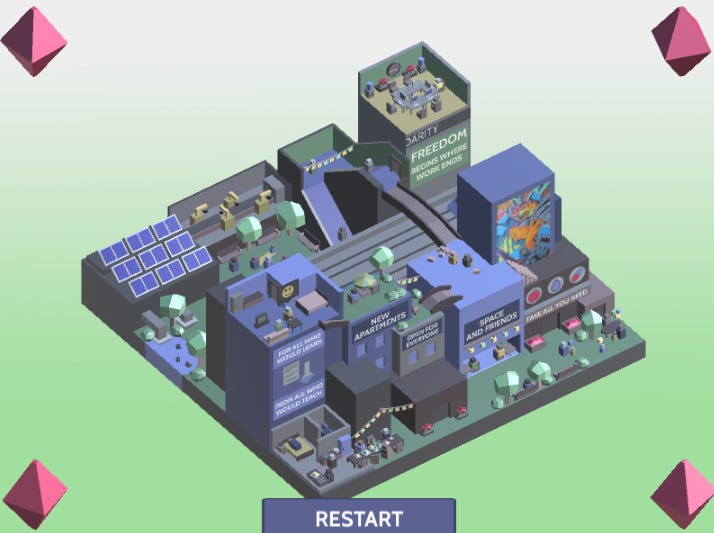

_Following on from[Part Two](https://open.substack.com/pub/peacefulrevolutionary/p/who-will-do-the-dirty-jobs-after-7f3?r=25vj2b) of this series._

##  **5\. Saying that everyone is selfish ignores other incentives and ways of dealing with this even if it was true.**

No-one knew how everything would work under capitalism when it first began 300 years ago. It just needed to be done, and people found ways to do it under that system. The evidence shows that the plumbing and sewage work did get done before them, when there wasn't a monetary incentive, and dirty work still does get done now when it is poorly paid. So, why did people do dirty work in a world without money. and why might they still do it in a future in which money was not on offer?

For those who believe that we are naturally lazy, it is easier to conclude that no one would do anything unless they had a strong reasons and rewards to do so. Although some scientists even argue that laziness is a learnt and largely modern habit, which is rare in some societies even now. Sure, there may be a few people who aren't embarrassed by doing nothing and still taking all the benefits. But, we have a whole class of people who do nothing of value now and take far more than their share of benefits (share holders, landlords etc.)

Yet because a society lacks money doesn't mean that it lacks incentives to encourage people to the dirty work. There will be several kinds of incentives in a post-money world. It will be a world without the worry of affording housing, food, clothing, healthcare, education, and entertainment, which are possible because everyone is working together without the need to satisfy the voracious appetite of the rich.

But there are additional incentives particular to difficult and dirty work, which fall into three categories: emotional (empathy, vocation, ego), reputational (friendship, status), and special perks (unique benefits). According to social scientists these first two have the potential to be more powerful than getting bits of paper and exchanging them for things (and worrying about not getting enough of them). The last of these would work as a substitute for the things money might have bought anyway.

###  **Emotional Incentives**

For a short time one of the highest paid worker in the Birmingham City Council was once one of it's lowest paid: a street sweeper. They were known for how much they loved their work, before they were paid very much for it, and because of this love and them going above and beyond what was required of them, the Council decided to reward them by paying them more than most of its other workers. This proved to be politically unpalatable, and the amount the street sweeper was paid was reduced to their old rate. Whereas people who produce nothing, but have inherited property, are often the most wealthy, despite offering little to society. But this was a person who swept streets with the fervour and talent similar to Michelangelo painting the Sistine chapel, even when he wasn't paid much for it.

Many people like to be useful, they like to fill their time with doing something, especially something they consider useful or that benefits others. Some take a particular pride in their work, knowing they have a talent or skill, that they have developed into expertise. Others feel they are called by the universe or suited by nature to particular tasks, and a few find they do very well at work others may not wish to do, and cannot understand their love of. 

Although it may be hard to believe, there are some people who seem to genuinely like doing dirty or difficult work. Maybe they like proving their strength, maybe they like the recognition, maybe they just like sparing someone else from having to do it. The work has to be done by someone. They may even resent doing the work, but rather than a toilet not get unlocked or a backside go unwiped they'll do it, because they feel that the results of not doing it are worse.

This is my personal attitude. It need to be done? No one else will do it? Then I will do it. Why not? If no one else will someone has to. I'd rather do it than force someone else to. Its the least I can do to help bring about a better world, and I'm betting I could get a lot of people to join me.

Maybe - if we are being cynical - we might conclude that they like the praise and recognition, or perhaps it is just the good feeling of doing a job well, but whatever the reason it is something other than money that motivates them. If this is true for a poorly paid street sweeper dealing with common refuse could it not be true for some future plumbers in a world without money?

###  **Reputational Incentives**

People work now. They work to pay bills. Would they be less inclined to work when they are working to help their community? Does working always require the stick or is the carrot ever good enough? If laziness really proved to be a major problem, and there needs to be some consequences what form might that take?

Some things we do because we know we are doing them for others, for people we want to please or impress. or just simple help out of kindness or camaraderie. We are social animals (when costs aren't a barrier to this) and plumbing is a more social job than many. When we help out in a community we show we are a part of that community, and we become someone important in that community.

This is different than when work is just done for money and people, when you work for just employers or customers. We wipe our children's bottoms now because we care for them, living in a community will extend the range of our caring and of who we consider our family and friends. We will see the inter-reliance we have on each other more clearly, and will have our efforts bring a more direct benefit to those we know personally, and they express their appreciation more directly too.

The desire to be part of something and to maintain respect and a good reputation becomes a sort of currency of its own. We will have the respect of friends, family and colleagues, as well as the reciprocal kindness you receive from others we help.

Likewise, ignoring others needs, especially those who are part of your community, would not only potentially leave you very unfulfilled, but also possibly lonely, as few may want to associate with someone not doing their part.

A world without money would still require organisations and expectations. Every society will come with some potential for social pressure even if it is just in the form of reputation and respect, and the possibility of social praise and acceptance.

Because of plumbing work being more challenging plumbers work may be more venerated and valued, and could come with higher social capital. Perhaps todays plumbers are the superstars of tomorrow's communal world, where their efforts are lauded more greatly than that of celebrities.

Maybe sanitation workers won't end up being heroes, but without money the dependency and inter-relationship between us and others will be more apparent without hierarchy and money getting in the way, as will the need to fulfil such roles, and the value we place on those who can and will do the jobs some other people can't or wouldn't want to.

###  **Special Benefits**

If all else fails in encouraging people to become plumbers then perhaps there is a case for greater non-monetary material benefits as incentives for doing the dirtiest jobs, especially in the early days of moving to a non-monetary system.

You could give greater benefits to those who make greater sacrifices. This could come in the form of more time off, a better positioned place to live, or the first choice of rare luxuries. Maybe for a week every month they get access to sail around on a yacht, go skydiving, or receive some other gift that the community can supply. If the price of having a plumber is that they are first in line for a waterfront apartment, or for a gourmet meal, or a cool truck to drive as part of their work, then a community may be willing to make such things a priority, to show their appreciation, or to give as an extra incentive.

Under the Mutualist / Collectivist / Parecon forms of Anarchism labour vouchers will be issued by syndicates for work, and more or special labour vouchers may be issued to incentivise people to do more dirty / dangerous jobs, such as plumbing. These could be exchanged for certain luxuries.

Within a Market Anarchist system there would be money but it would be created through labour and not capital, and there might also be means to limit its accumulation. The idea is that money is still used to track what is needs, as well as being a means of fulfilling individual wants, and as an incentive for doing essential but difficult work.

These kind of perks are not dissimilar from the kind that someone might buy under capitalism if it still existed. But it is far preferable to the large human costs of current capitalist system. So why wouldn't such special benefits be incentive enough for some people to do the dirty work?

##  **6\. Different factors and incentives would exist under a non-capitalist society.**

In a post-capitalist world money would be only one of the elements that would change. A world which was exactly the same, but suddenly without any currency, would have to go through a difficult adjustment period, especially if this happened suddenly, without any other systems being put into place. This is not what anyone wants.

So there is a lot that would have to change culturally. Luckily we have good examples that this is possible, but getting to there from here would come with growing pains. Likewise, it will take time to unlearn the insecurities, fears, and selfishness capitalism has encouraged in us, but humanity has existed without them for most of its history.

Of course in times of upheaval it takes a while to get things back to a reasonable level, and if the change is rapid it may take time to adapt to the new norm. It will involve education, and is sure to take some adjustments, but it isn't an untried or new experiment. 

Schools in an anarchist world would train people in practical skills as well as intellectual knowledge. At some stage children will get to be exposed to different types of work - creative and manual, and may discover a talent or be drawn to a certain kind of occupation. As they reach adulthood they will have opportunities to take part in apprenticeships or do academic work etc. They will be aware of what type of work is needed for the survival of the community, some of which can be done by everyone part time, but others will need more in depth training. There may be many reasons they may select plumbing (given the possible incentives already mentioned), and the community will decide together how many plumbers are needed. Maybe there'll be so many applicants that they ask some to work in another area for a while, perhaps there'll be fewer than expected an extra incentives might be offered.

Monetary incentives are a relatively modern invention that have only existed for the working class for perhaps 2-300 years (before that time a poor worker rarely ever saw money personally).

We are brought up now to value money, to be engaged in competition for it, and fear of not having enough of it. Imagine if we didn't have these insecurities, and were brought up to value cooperation just as much. But that is not the world we now live in.

Capitalism works in a way that benefits a certain small and exclusive group: the the owners (or takers) at the cost of a the majority: the workers (or makers). It incentivises some essential tasks like plumbing, albeit far more poorly than non-essential ones such as stock brokers. Capitalism also incentives destructive tasks, it creates problems and then tries to monetise them, to get people to pay with their taxes and services for the crap (such as pollution) which the businesses created. 

So much of our money goes towards going up the corporation's waste in one way or another, something they rarely pay to have cleaned up, leaving us to pay for that at our expense (and often at the expense of our health). In economics this is called externalities, and it hides the true cost of capitalism upon us and the world.

This raises the question of, ‘Could it be capitalism is what is keeping plumbing as dirty as it is now?’ What would plumbing look like if money wasn't an issue? Under capitalism there is little incentive to build more reliable sewage systems if it costs more in the short term and those costs can't be profited from (and may eat into the profits of the manufacturers, builders etc.). Likewise, there is little incentive to replace some plumbing work with automation until it is cheaper and more profitable than getting a human to do it.

Where profit is not the motive, and resources are not restricted to maintain artificial scarcity to drive up prices, then human need and safety can be prioritised. Because it doesn't need to satisfy any shareholders, only those who use the goods and services, which are distributed according to need instead of return on investment.

There'll be more reasons to divide the dirty work, to have two or four workers dividing the time dealing with the crap, where there is one dealing with all now. Someone who may hate the idea of 6 hours down the sewers every day might be okay with a couple hours a week helping out, knowing that lots of other people are doing it, and that it is essential for the running of their community.

There will also be far less crap produced. Corporations will not be overproducing it, and over time the ways it is dealt with will be standardised according to what is healthy and safe, instead of using cheap materials in the hope of making more money. Ask any plumber now and they'll tell you about the corners cut, the shoddy materials used, and the bad planning and fitting that they encounter and have to deal with, that makes their jobs harder and more messy. The financial incentive to keep it so dysfunctional won't exist any longer without the accompanying profit motive.

###  **In Conclusion**

The question of how will we will do X without capitalism is looking at the problem upside down, as if it could only be solved by people at the top solving it. Which begs the question of, in whose interest is it for us to believe that we can’t survive and take care of dirty work without capitalism?

Plumbing already happens in our dysfunctional society where it is arguably less valued and made more difficult by the system it happens in. That system creates the situation of having to pay a bit more to incentivise people to do such an unpleasant job, rather than either spreading the work amongst more people, or addressing the problem of why it has to be done in such a difficult and dirty way. The problem of plumbing exists (or as at least much worse) because of capitalism, and the incentives to change it to be better are much lower because of capitalism.1

There are many different ways we have mentioned already that the problem of plumbing could and might be addressed (and probably were addressed in ancient times), but it requires a bit of imagination to envisage how it was done previous and could be done differently in the future. The responsibility for proving why this couldn't work again is on the person who questions it. It has happened, can happen, and will happen again given the opportunity. Why couldn’t it happen again? 

_Continues with the[fourth part](https://open.substack.com/pub/peacefulrevolutionary/p/the-plumbing-revolution?r=25vj2b) of this series._

Subscribe

[Share](https://peacefulrevolutionary.substack.com/p/who-will-do-the-dirty-jobs-after-f7b?utm_source=substack&utm_medium=email&utm_content=share&action=share)

1

I suspect that if capitalism couldn't implement anything like our modern plumbing, then capitalists would have just put up with worse plumbing, as their priority is primarily on making a profit wherever they can.
