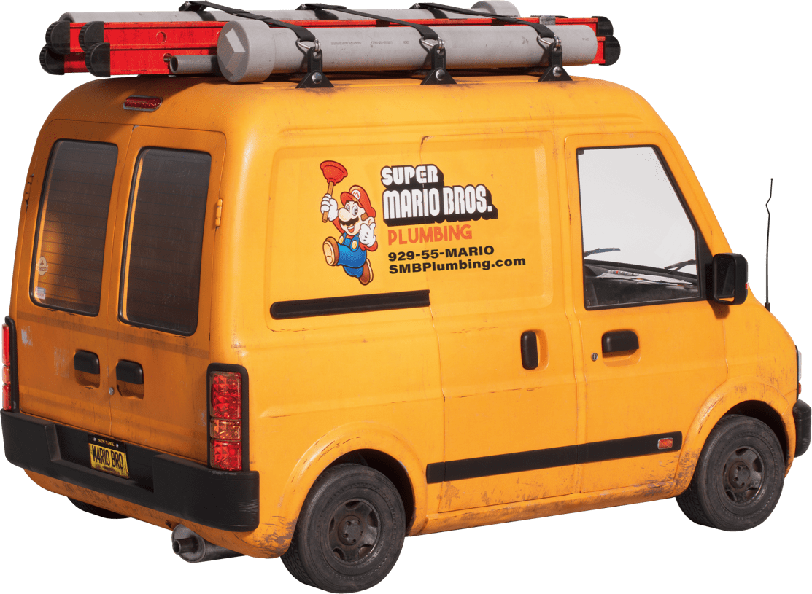

_The grey-haired lecturer stood at the front of the hall, paused for a moment, knowing he was nearing the culmination of his lesson, and looked to see if he had the students attention before continuing:_

Although, looking back now it seems that it was inevitable, no-one at the time imagined that it would be the plumbers who'd start the revolution. Many people thought the plumbers had it good when it came to pay and the comforts that can come with the extra money. That had been true for a while, but it was a situation that couldn't last forever, as other manual jobs became less profitable due to automation, there was within a few years a glut of people training and working in the profession. This drove down both wages and quality, and some older plumbers who remembered when things were better, along with some of their younger apprentices facing a less prosperous future, saw that the situation wasn't financially stable decided something had to be done.

Around this trying time a lecturer in sanitation sciences shared a series of PeerTube videos on the history of plumbing in ancient times, including detailing the Roman plumbers guilds and how they maintained high pay and high standards. Plumbers had already increasingly worked as part of plumbing co-operatives to deal with rising costs, so local guilds became the logical next step. 

Unlike, unions which couldn't offer pensions, healthcare, or enforce certain standards, a guild was just a collection of individuals voluntarily co-operating and leveraging their collective efforts and resources. The guilds offered training, their own qualifications and standards, their own pension and injury insurance plans, which granted you special rates at guild-aligned plumbing supply co-ops. They also insisted on higher pay, especially from corporate contracts. 

Some city council departments began insisting they would only employ guild-certified plumbers, likewise many construction-related workers began insisting that they would only work with plumber's guild members in solidarity with them. (There were still unions, which acted as the respectable public face of such manual workers, but the guilds were not bound by their legal constraints.)

In right-wing news outlets critics quickly arose, condemning the tactics of the plumber's guilds, saying it was an affront to the idea of a free market, that it was tantamount to having cartels and price fixing. This has always been part of government contracts with private contractors, but which corporations had never opposed (unless they were outside of the cartels) until then, and so the politicians they made donations to hadn't previously done much to stop it.

There was no way that the capitalists would let that last. Capitalism had relied on people doing dirty jobs being able to charge just enough of a premium to incentivise them doing the job, but not so much as to irk the rich. Now the corporate owners were put out, and they weren't going to let the idea of workers taking back their power go unchallenged and spread to others.

New laws were drawn up, with stiff financial penalties to stop this "guild conspiracy". The laws were fought against on the basis of free association, free assembly, and free speech, but ultimately still passed with the help of even seemingly sympathetic politicians who didn't want to fall afoul of the media or their benefactors.

Plumbers in unions polled their members and went on mass strikes, which left many sewers backed up, burst pipes undealt with, and the taps to government departments mysteriously stopped working. Plumbers still carried out works at hospitals and other essential places, but steadfastly refused to work for business and government.

The government ruled the strikes illegal, but then unofficial guild actions began taking place, with the majority calling in sick, even if it was primarily the government and their corporate masters they were sick of. Although other manual workers striking in solidarity was strictly illegal, many of those in the building trade refused to work where they couldn't guarantee their health and safety due to lack of plumbing support. Many offices found themselves empty of workers too when they couldn't fix a problem with the water, such as guaranteed access to flushing toilets and running taps. There were accusations of sabotage, but nothing ever conclusively proved.

A lot of other plumbing work still went on officially during this time, but it was primarily of plumbers helping out friends and neighbours, and the guild alerting its members to where the elderly and poor needed help, and other workers needed their services, sometimes in return for untraceable cash or goods or services in kind.

The government reached the point where it was considering pairing policeman and soldiers with plumbers, and creating a mandated and enforced plumbing allocation system, which would focus on government buildings first, followed by corporate offices, then high paying clients, and finally others as resources allowed (which would probably mean hardly ever). The threat of this intimidated some, but the majority of plumbers remained steadfast.

An old Italian plumber, known by his friends and colleagues as Papa Mario, who had immigrated many decades earlier, could see that this was not only a threat to plumbers, but ultimately to anyone who hoped that their hard work should guarantee them a roof over their head, sufficient food and clothing, and time off to relax and recuperate from their dirty work. He didn't consider himself much of an orator, but voiced what many were feeling. His passionate call to all workers throughout the country to lay down their tools, even reached some who had not realised how much the ills of the system they lived under hurt poor workers, who then joined the movement too.

His voice was joined by a multitude of others. Of course many had always understood well the problems of their situation, but felt powerless and were unsure and about how to do anything to change it. The plumbers, however, had shown them the way. The systems of co-operation which had kept the plumbers going and helping their neighbours extended to other jobs and services. When people realised they didn't really need money to meet one need they quickly saw that other needs could be met without it too. 

(I'm skipping several steps in between here and what happened next, but they are covered well elsewhere in my lessons on the periods of mutual aid, prefiguration, dual power, and insurgency. Suffice it to say that all of this ultimately came to a potential violent stand off.)

When tens of thousand soldiers and police are met by several million people on the street, with tens of million supporting them, then it didn't take the soldiers long to foresee the potential human cost and futility of threatening to attack their relatives and neighbours, and that they would be better off joining with them. The politicians fled, only to find that similar movements were happening all over the world. But the people didn't care about the politicians and corporations any longer, they had the skills and means to keep the world working - including and especially the plumbing - without them, they always did.

 _The aged teacher came out from behind the lectern, still holding the microphone so everyone could hear him, and stood in front of his students. Although they had heard this story before they were attentive, and interested to hear his personal thoughts next:_

Now kids, thats the story as I remember it. That's why we have this one day a year, Plumber's Day, when we remember their sacrifice. They not only risked their comforts, but their lives, in standing up to those who'd taken for granted their work, and that of other workers on who the world relied on to keep civilisation going. It's hard to believe now that there was a time when people were compelled by poverty to work, and that some workers died just to obtain an eight hour day and five day work week, and now we consider working that long too much.

But we won the revolution, and we keep winning it by holding true to the ideals those brave plumbers and other workers fought and some died for. (I was just a simple university lecturer in sanitation studies at the time, but I like to think I played my part back then, and that all of you today still do too.) Now we live in the world they envisaged, without rulers, money, and landlords. Without having to pay for food, housing, education, or healthcare. 

Yet we are a world that still needs plumbers. As you know we lost Papa Mario a few days ago. Sorry, I should have phrased that better; Not lost as in died, but as in he has retired, and has settled down near the seaside. We are sad to see him move away, but he kept on doing the work he loved for as long as he could, because he enjoyed it so much and took pride in his work. Luckily for us, he didn't keep those skills to himself, he trained up many apprentices, quite a few who live and work in nearby communities. They will help us out whenever they can, but now it is time for us to train some more plumbers to work here in our town. 

Most of you are finishing your schooling this year, some are going to university to train in highly specialised areas, or to do important medical and scientific research. Others already feel a calling to developing and offering your talents in creative or practical pursuits. But I wondered if any of you have considered continuing Papa Mario's legacy in plumbing, here in this community?

Before you answer I want to remind you that sanitary work isn't as dirty as it once was, at least not for as large a proportion of the work, with all the new technology and automation involved, and because people don't create as much chemical or other waste, as part of our recycling and composting processes. But I won't pretend that it still can't sometimes be a dirty job at times. With all that in mind, do I have anyone here interested? 

_He looked out across the lecture hall with a smile on his face, when he saw the number of students who seemed to have been inspired by the example of the plumbers of the past._

Thats a good number of hands, but have any of you been thinking of this as your main vocation for a while? A couple of you. That's great. There are opportunities for lots of you to help with it, but I want to speak specifically to those two who seemed keenest. I don't know if all of you could see whose hands shot up quickest, but I suppose it should come as no surprise that it was young Mario and his brother Luigi. Chips off the old block as they say. Could you both explain why you are so enthusiastic?

I don't know if everyone at the back heard that. I'll try to summarise as best I can. Mario got to see first hand the value Papa's work brought to the community, how valued he was, not just for his role in the revolution, but for helping the people in his neighbourhood. He had wanted to try his hand at learning and doing lots of different things, but after years of doing that realises that it really is what he always wanted to do, and has some new ideas of better ways to do it. He looks forward to helping you all out with his plumbing skills, and will be happy for any help you can offer him on any especially tricky jobs, or just for the companionship.

His brother Luigi's motivations are maybe a little more unusual than we often see these days. He wants to feel and be important, essential to the community, and to enjoy the chats and cups of tea that seem to come before and after the plumbing work. I don't know if there is such a thing as altruistic vanity, but he also thinks he looks cool wearing overalls, with a wrench in his hand, and envisages driving the Super Mario Bros plumbing van, which he considers a classic of it's kind.

Class, there is a lot to learn from all of this. When most people - except the rich - only worked for money, the idea of doing work for the love or even the need of it, (without the fear of starvation or the promise of luxuries) would have seemed ridiculous to many. Even though those same things were done without money or compulsion in ancient civilisations, as we covered in a previous lesson. But why do people do such jobs today, without the promise of money in return? Mario, could you could share with us your personal answer to that question?

For those who didn't hear he said that, if no-one did the plumbing then eventually the pipes would back up and burst, the whole village would smell badly, and there would be a much bigger mess to deal with. Do any of you want to risk that? No I didn't think so. Thats why Mario said, (if I can quote him correctly), 'I'll have wished someone did something before then. I'll wish I'd done it. I work best with my hands, I'm not so completely selfish so that I can't see that it is in my interests (as well as everyone elses), and I know it is an important job that is respected, and I'll have the satisfaction of doing it well. So, why wouldn't I do? A little smelliness occasionally? I have that living with my brother Luigi already.'

 _The teacher rolled his eyes recounting Mario's last remark, but Luigi took his joke in good humour, knowing it was good natured, and retorted with his own remark about Mario’s bad habits. With that the lesson ended. The plumbing continued to be done. The community continued to work together to see everyones needs were met, and the idea that plumbers (who had been so important to the revolution) were once not as highly respected as they were today, became a part of history, which people were reminded of on every Plumbers Day, and were forever grateful for._

 _See Parts[One](https://open.substack.com/pub/peacefulrevolutionary/p/who-will-do-the-dirty-jobs-after?r=25vj2b), [Two](https://open.substack.com/pub/peacefulrevolutionary/p/who-will-do-the-dirty-jobs-after-7f3?r=25vj2b) & [Three](https://open.substack.com/pub/peacefulrevolutionary/p/who-will-do-the-dirty-jobs-after-f7b?r=25vj2b) of an article looking into “The Supposed Problem Of Plumbers Without Capitalism” & I’ve added a follow up article, “[Plumbing The Depths](https://peacefulrevolutionary.substack.com/p/plumbing-the-depths)”_

Subscribe

[Share](https://peacefulrevolutionary.substack.com/p/the-plumbing-revolution?utm_source=substack&utm_medium=email&utm_content=share&action=share)
