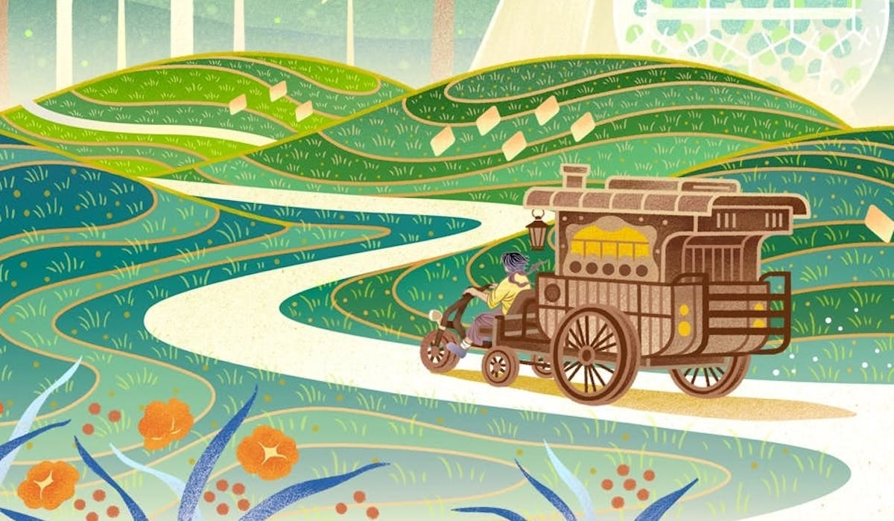
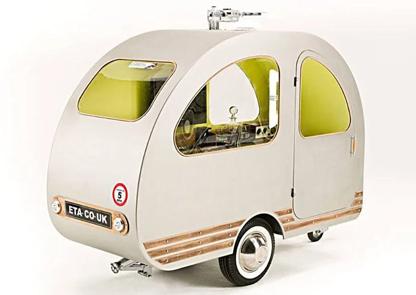

_Continuing on from[Part 1](https://peacefulrevolutionary.substack.com/p/a-guide-for-prospective-tea-monks?r=25vj2b)_

## Practical Preparations

>  _‘On the tea route, they spent far more nights camped out than they did in village guesthouses. But there, they had their wagon, their boundary against the world. Here, listening to the rain fall, watching the light vanish, Dex began to understand why the concept of inside had been invented in the first place.’_

On Panga tea is supplied freely without cost, from the leaves to the equipment needed to brew it and mugs to drink it in. Panga has a gift or reputation economy: Pebs.1 But lack or abundance of Pebs are not a barrier or means to receiving necessities which are available freely, it works as a system of both showing gratitude and identifying needs. Hence, when Dex receives Pebs following a Tea Service no-one is deprived of anything they may need to get what they need, and Dex doesn't have any more wealth than they had before. I'm not aware of any current system / app which facilitates this kind of exchange, although I would love to see some form of appreciation token be created - as long as it wasn't just another money-making scheme.

For now, under Capitalism on Earth, someone has to pay for tea.2 Corporations pay those who harvest it, sell it in tea bags or loose leaf in stores, from there people buy it to make it themselves, or pay a cafe to make it for them. Each step along the way a profit is made. So for someone to offer tea freely they need to rely on the kindness of strangers donating the money needed to cover the costs involved3, or they need to cover those costs themselves - for the tea and to support yourself if needed.

Tea Service - giving a cup of tea and spending time listening - should always be free4, as should access to where you are giving free tea & chats. Otherwise people who can't afford it will be prevented from accessing it, and people will think that you are a worker performing paid work out of a desire to make money (if even for a token amount). Such donations can be received, but not solicited. Donations may be enough, if there are a few tea lovers with deeper pockets, or many giving a little extra, but the wages and economy may be such that this is not the case, and either your own savings, an affluent sponsor, or doing part time work on the side may be required if you want to be a Tea Monk full time. Your need for money may be quite low if you are living in a tent and travelling by bicycle, but quite high if paying off a mortgage and driving a car, in which case being a Tea Monk may be something you do occasionally on a weekend or vacation as you can afford it.

Perhaps you have work you can do from anywhere as an artisan or online digital contract worker. Maybe you can do seasonal work around harvest time to cover when you aren't working. Maybe there is a local housing co-op with a spare room, or a friend with a sofa who believes in what you are doing and can help you cover the basics. You could learn your area well and give tours for tips, or you could play an instrument or sing in a busy downtown corner. Maybe your tea making unit could double for making hot dogs during lunch times, and afterwards you could go back to your tea duties. Maybe you'll just get by, or maybe you'll do well and will have extra to pass on to the homeless.

### Tea Equipment

>  _‘Dex had acquired a few things for the day: a folding table, a red cloth to cover it, an assortment of mugs, six tins of tea, and a colossal electric kettle. The kettle was the most important bit, and Dex was happy with the one they’d found. It was joyfully chubby, with copper plating and a round glass window on both sides, so you could watch the boiling bubbles dance. It came with a roll-up solar mat, which Dex spread out beside the hot plate with care.’_

The equipment to be a Tea Monk is not very expensive: A kettle, teapot, and cups are all you need to make tea, and some people skip the teapot entirely. Chairs and maybe a table are all you need to sit around on, and not even those if it is a sunny day and you are near grass or a bench.

Presuming you are covering your living costs somehow already, or find you can do so reliably through some of the means just mentioned, and have the equipment you need and means to carry or move it, then your next biggest cost will be the tea itself. It might be tempting to use as cheap a supplier as possible, but by doing so you may be in danger of supporting child slavery or buying pesticide poisoned tea. To ensure that you are getting tea of sufficient quality, without the worst extremes of exploitation you should see if the tea has been certified by the Rainforest Alliance, Fairtrade, UTZ Certified, or other such organisations. Where possible you should try to buy it locally too, to minimise extra shipping, and to support local tea suppliers.5

How you brew that tea is a matter of convenience. If you use tea bags it may be simpler and easier, but then there is the question of whether they are biodegradable, recyclable or reusable. If you want to make custom blends then you have to decide whether you will use strainers, tea balls, tea presses, or a filtered teapot. Then there is the question of how many kinds of leaves (black, green, rooibos) and herbs (camomile, mint etc.) you want to store and carry. There are also milks, sweeteners, juices and roots (ginger, liquorice) that might be added. Even the same kind of tea may have different ways of preparing and serving it, such as Matcha Thick Tea (Koi-cha) and Thin Tea (Usu-cha). Most people will be happy with a few simple varieties, although curious to try others as you learn to make them and if you have the ingredients.

### Tea Transport

>  _‘Dex pulled into an unclaimed spot in the circle, kicked down the ox-bike brakes, and locked the wagon wheels. Unruly hair tumbled into their eyes as they released it from their helmet, hiding the market from view. There was no hope for hair that had been locked in a helmet since dawn, so they tied a headwrap around their scalp and postponed the mess for later. They ducked into the wagon, peeled off their damp shirt, and tossed it into the laundry bag that contained nothing but garments of red and brown. They dusted themself liberally with deodorant powder, fetched a dry shirt from the shrinking stack, and retied the headwrap in respectable symmetry. It would do.’_

A full time Tea Monk carries everything with them, either in a backpack or in a trailer / caravan. They don't wish to disturb nature and wish to be as sustainable as possible. The bicycle is the perfect vehicle for this purpose, pedal powered, or battery assisted, as is going by foot where the distances aren't too great and public transport is easily available and you can frequently and easily replenish your stock (a day at a time if needed). However, where towns are great distances apart and there isn't an extensive rail network to get you there, you will have to think more carefully on the logistics of getting from place to place, and how you will get by in between. 

It's amazing how much you can fit in a large backpack. A simple Tea Service and camping setup can be all squeezed into a 100 Litre pack (or a smaller one if you don't need a week's change of clothes, food etc.). This would include: A portable camping table, portable camping chairs, either a solar-powered kettle or a gas-heated kettle (and gas canister), a teapot, or maybe an urn if cold brewing, cleaning basics (cloths & soaps), and tea cups or mugs. If you need to look after your own shelter then you would add a tent, a sleeping bag, and miscellaneous hygiene essentials.

The pedal powered caravan Tea Monks use in Panga is the ideal, and bike caravan makers have come close to creating something that would work for that purpose (if not particularly cheap) -6

### Tea Set Up & Schedule

>  _‘The production began. Dex went back and forth between the public space outside and the home within, ferrying all that was needed. Boxes were carried, jars arranged, bags unpacked, kettle deployed, cooler of creamers at the ready. These were placed on or around the folding table, each in their usual spot. Dex filled the kettle from the wagon’s water tank, leaving it to boil as they artfully placed carved stones, preserved flowers, and curls of festive ribbon around the table’s empty spaces. A shrine had to look like a shrine, even if it was transitory.’_

The ideal place to set up your tea table would be somewhere that is regularly traversed by people walking to and fro. Downtown shopping areas, popular public parks, and markets tend to be quite busy, but may also have restrictions on what you can do there. In a park you might be able to set up a picnic blanket, a tea urn, and put up a little sign ‘free tea & chat’, but in other areas you may find store owners or stall holders might object to your presence.

On Panga the Tea Monk’s role is already well known, so people realise what they are doing there and what to expect from a visit with them. However, on Earth this would be an unusual idea at first, and might require a little poster or flyers to invite people to take part. Maybe something like ‘Sip & Support’ (or ‘Brew & Natter’ for us Brits).

So it is important to scout out where to pitch up, maybe asking locals, and getting permission if needs be. You could approach local community centres, farmers markets (if you afford a stall or can get one at a discount), or alongside other vendors who'd be happy for you to be there. Free outdoor events and gatherings may also work out, including free music festivals, and even protests rallies and marches.

A Tea monk might set up for four afternoons a week, or maybe just one day on the weekend. If travelling is not an option you could start in your neighbourhood, on your own front garden / lawn, or that of a friend, especially if the area is a walkable one. You could then try a day downtown (or somewhere with frequent foot traffic), and could increase the days and distance from there if you wanted to. But you probably want to plan carefully if going to another country, where travel visas may be needed and the laws and customs are different.

If you are bound to the house or wish to serve from your home, then you could invite people inside if you feel comfortable doing so, or could let others know you are available online to make a video appointment using social media, or some sort of events / services page perhaps. But there are many different ways to try out and develop the Tea Service craft.

### Tea Service Checklist

Being a Tea Monk will always be an exercise of faith to some extent, and nothing is completely reliable, especially the weather, but it is better to follow the old Boy Scout motto and be prepared where you can. To this end here is a basic checklist of things you may wish to consider:

  * Do you want to do this occasionally or for a period of dedicated time? Adjust your plans and preparations accordingly.

  * Do you have a way to support yourself or have good reason to believe you could?

  * Do you have a way to stay sheltered - at least at night if you need to?

  * Do you have a way to travel - by foot or bike might be sufficient in some places, but others may require covering the cost of buses, trains or cars.

  * Have you found a good place to set up your tea table?

  * Do you have a sign to indicate to passers by why you are there?

  * How will you heat the tea? (presuming it isn't cold brew and if it is, what will you carry it in?)

  * How will you wash the cups?7

  * In case those you speak to need additional help - have you found out what local organisations might be available to aid them?

  * Do you have an escape plan - if you are moved on suddenly, or decide to give up being a Tea Monk entirely.

  * Does someone know where you are in case you need help? (Millions of students backpack across the world with no incidents, but often with another person)

  * If you have another person with you (friend, sibling, apprentice, partner, whatever) then are their needs covered? (Perhaps they are off doing their own thing some of the time, or they are helping you, but do they need time and adjustments made for them too?)

  * Are you prepared for changes in the weather? Such as keeping warm in winter, dealing with the heat in summer, as well as unexpected storms.

In countries in which rain may start unexpectedly you may want to keep an eye on the sky (or weather reports) if you can. Be prepared to bring out a big umbrella or a couple of smaller ones, be ready to quickly cover the tea making tools, and to take shelter if you can)

### Legal Considerations

If you are moving from place to place, with no fixed abode and not staying in a house, hotel, hostel or campground you may run afoul of vagrancy laws if you aren't careful. Some countries have free or cheap sites set aside for itinerant travellers, so you may wish to look online or contact the local traveller community to discover where they are. If you aren't somewhere easily seen from the road you may be able to camp / shelter for quite a while, but if you are found you may be told to move on.

Fortunately sharing a cup of tea for free is not against the law in any country, at least not until a policeman interprets it as serving food without a licence. If they ask about what you are doing it is best to explain it calmly and politely, even if you don't feel their inquiry is legitimate, and to avoid trouble with the police where possible, even though you are within your rights. If you have the means (paying for a lawyer, fines) to contest them telling you to cease your activities then by all means do so, but don't give them room to arrest you on another charge. Your local Food Not Bombs group (if there is one) should be able to give you advice on where and how they have operated and avoided issues.

## Conclusion

>  _‘Dex gave a tiny smile and extended their mug. “Can I have another cup?”_
> 
>  _The robot poured. Sibling Dex drank. In the wilds outside, the sun set, and crickets began to sing.’_

I wrote this because I thought the concept of Tea Service being performed freely by Tea Monks was a beautiful idea, and got carried away with imagining what it might look like in our world. Of course people perform acts of kindness everyday without being paid to do so, and at their own expense help others in a multitude of ways - through mutual aid, charities, and just when they see a need and are able to help.

I did dream this could be a potential weekend hobby for myself in the future, but if anyone stumbles on this guide and takes it seriously please let me know. I would love to chat with you, and if you do try it out I would be fascinated to hear about your experiences. If suddenly one day in the future there are dozens of Tea Monks around the world then someone should let the author Becky Chambers know8, to thank her for the idea, and hopefully she'd be pleased to discover that someone applied her concept in reality and that others benefited from it.

 _For those who don’t already have them you can buy  
Becky Chambers Monk & Robot novellas here -_

  *  _[A Psalm For The Wild Built](https://www.otherscribbles.com/#/a-psalm-for-the-wild-built/) , 2021_

  *  _[A Prayer for the Crown-Shy](https://www.otherscribbles.com/#/a-prayer-for-the-crown-shy/) , 2022_

My recent ‘Utopian Languages’ series for Just Utopias may also be of interest:

  * <https://justutopias.com/fictional-utopian-languages-part-i-utopian-houyhnhnm/>

  * <https://justutopias.com/fictional-utopian-languages-part-ii-speedtalk-pravic/>

  * <https://justutopias.com/fictional-utopian-languages-part-iii-asapili-laadan/>

Or possibly my series on ‘Who Will Do The Dirty Jobs After The Revolution?’

  * <https://peacefulrevolutionary.substack.com/p/who-will-do-the-dirty-jobs-after>

  * <https://peacefulrevolutionary.substack.com/p/who-will-do-the-dirty-jobs-after-7f3>

  * <https://peacefulrevolutionary.substack.com/p/who-will-do-the-dirty-jobs-after-f7b>

  * <https://peacefulrevolutionary.substack.com/p/the-plumbing-revolution>

  * <https://peacefulrevolutionary.substack.com/p/plumbing-the-depths>

Subscribe

[Share](https://peacefulrevolutionary.substack.com/p/a-guide-for-prospective-tea-monks-67b?utm_source=substack&utm_medium=email&utm_content=share&action=share)

If you liked this you might also like an excerpt from the book:

1

See <https://peacefulrevolutionary.substack.com/p/pebs>

2

Although there are money free barter systems like LETS (Local Exchange Trading Systems), and systems in which work itself produces value (Labour Vouchers, Parecon). We learn from ‘Doctor Strange in the Multiverse of Madness’ (2022) that very few planets have Capitalism: ‘Food's free in most universes, actually. It's weird you guys have to pay for it.’, and Star Trek teaches us that humanity matures beyond this economic system by the late 21st century: ‘The acquisition of wealth is no longer the driving force in our lives.’ (First Contact)

3

Begging is illegal in some countries / states, but usually overlooked if done discreetly, but there is no law against someone offering you money as a thank you or putting it in a ‘tip jar’.

4

The word ‘service’ has been bastardised by computer subscriptions, so that something we do for free has turned into something we pay for on a regular basis.

5

If you are on the North-West side of America my friend at Nil Organic Tea - <https://nilorganictea.com/> \- may be able to help you out.

6

<https://gentletent.com/en/b-turtle>  
<https://widepathcamper.com/campers/bicycle/>  
The QTVan - <https://www.doityourselfrv.com/smallest-caravan/>

7

See <https://www.instructables.com/How-to-wash-dishes-with-very-little-water/>

8

Her author web page is here - <https://www.otherscribbles.com/>
