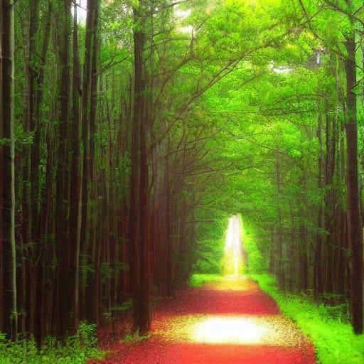

## Living In A Box

We are part of a system. We like to think that we're not, or - if there is one - that it has no effect on us.

If we were born into a big box we wouldn't know anything else. We could only see as far as the other side of the box, and could only travel within its confines.

Maybe we'd imagine what might be outside the walls that surround us, but unless something broke out or broke in we'd have no reason to believe there was anything outside, and if we tried to imagine anything else it would probably be in terms of other walls, as that is all we've ever known.

Now let us expand that box a little. Let's make it the size of a town. Now we interact with others, hundreds of them. We walk or cycle or drive around its roads, and we see houses, shops, fields, sky, plants and animals.

There is a local newspaper, a library full of books written by residents. Among them we make friends, fall in love, and have children. Maybe we work in the diner, or as a mechanic, or a teacher at the school. We have varied experiences, many of them meaningful and fulfilling.

But we are still in a big box. Maybe this box lets in the light of outside, maybe we glimpse the stars. But the roads never lead far out of town, and at the edge just wrap around. We will always be limited by the knowledge of what is available and possible in our town. Although we might imagine more, our imagination will (usually) be limited by what we can conceive.

In either of these scenarios it might be possible to break through the walls. With enough force and persistence they might crack open. However, since we have no concept that they are walls, that there is anything beyond them, and that they are breachable, then most people would never think of doing so, or - if they did - wouldn't risk trying for fear of what is beyond, and if it might expose them to danger.

Most people will just accept the world as they see it and make the best of it. But there will be a few who feel confined, even if they don't know why, who will sense there is more, even though the system assures them there is not.

This may be just a niggling suspicion or it might be an idea they can't let go of, which might drive them mad, wondering what else there might be beyond the confines they are kept in. Or others may be dismissive of them for raising such a strange possibility of the concept of outside. Some may seek to change their minds through reason, they may wish to save this person from their delusions. A few may even see the believer in an outside as dangerous, and seek to silence them, or confine them where their ideas can't get out.

Now let us expand this box to a whole country: A place you can spend days walking from one end to another to get to the edge of; Somewhere you know there is an end to, because there is ocean, or walls, or lines that say you can't go any further. In such a setting you might imagine there are other such places across the sea, over the walls, or past the lines. However, you are still dependent on the people, books, television within your country to find out what other places are like, and to learn about the ideas they have there.

But suppose you discover some ideas that are completely new to you, ideas that question the truth of all you have been told, maybe even the reality of the world you've been presented with.

## Breaking Out

Maybe someone breaks through the walls, wanders in to your town, or falls from the sky into your back yard and into your life. They tell you that you are being kept hostage, not in literal chains, or behind literal bars, but behind walls, town limits, state borders, behind the limited knowledge you have been exposed to, and that this makes it far more difficult to see what is possible beyond these barriers.

You might conclude they are mad. You may question their intentions. They speak your language, but in a way you haven't heard before. They use words you know in unfamiliar ways, and they use terms and references completely new to you, but outside of your limited knowledge and experiences.

(However, if you do take the time to listen to them) They do their best to translate unusual concepts like freedom. It is a word you have heard all your life, but your understanding has been confined to carefully bordered choices: which product to buy from the approved selections, which career path to follow from the standard options, which neighbourhood to live in from the designated areas, and which carefully scripted lifestyle to pursue. Even your choice of relationships and how to live them follows pre-approved patterns.

But their idea of freedom sounds more like chaos. It lacks the heights and widths of your box, or the confines of your town or country. It involves ways of thinking and living that you have never seen before. It doesn't come with the rules, guard rails, marked out paths, and points on the map you are used to using to navigate safely.

So let's say you don't call the authorities, and you don't just walk (or run) away from them. Lets say you entertain their crazy notions, because the idea of more freedom sounds good, the idea that you've been presented with only a partial picture and limited options sounds plausible, and the idea that it has been in someone's interest for you to accept the world you've been presented with may just have something to it. So you begin to see the system behind the way things work, and for whose benefit they are working.

Or maybe no one suggests any of this to you and you figure it out on your own. Either way, some people will think you are crazy for believing it, some may even think you are dangerous. But this has always been the fate of those who see the walls for what they are, who dare to question why they exist, and who begin to imagine what lies beyond them.

Are you satisfied with the box you are stuck in, within the walls you've been given, or are you one of those who longs for a life beyond the confines of what the system presents you with, and imagines something better than what the system allows you to see?

Subscribe

[Share](https://peacefulrevolutionary.substack.com/p/escaping-the-system?utm_source=substack&utm_medium=email&utm_content=share&action=share)
