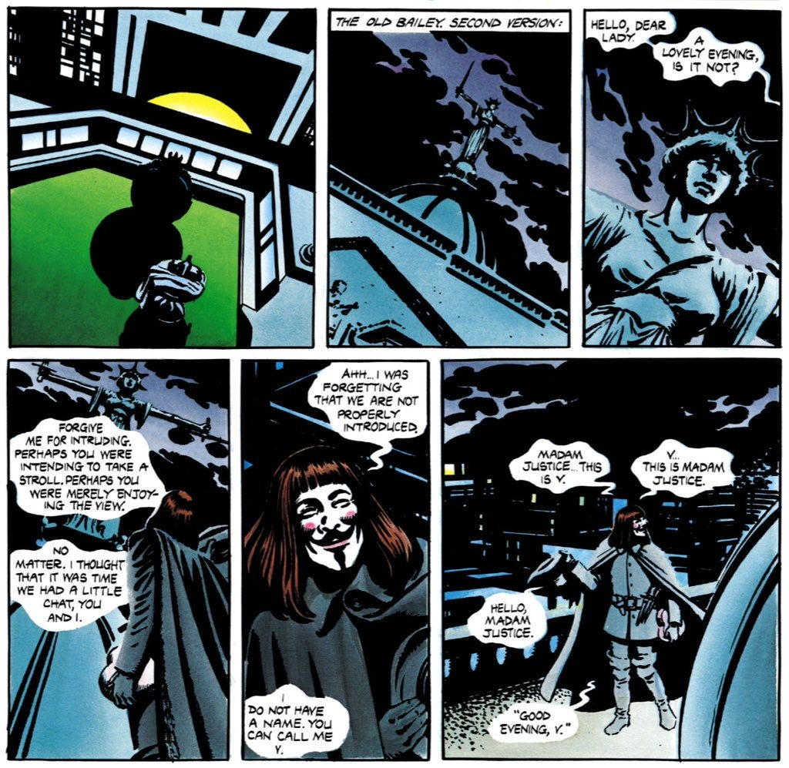

_Although I believe the film adaptation of V For Vendetta was sincere, it lacked some of the explicit references to V’s political philosophy, including his conversation with Madam Justice, who sits atop the Old Bailey criminal court._

 _V:_ Hello, dear lady. A lovely evening, is it not?

Forgive me for intruding. Perhaps you were intending to take a stroll. Perhaps you were merely enjoying the view.

No matter. I thought that it was time we had a little chat, you and I.

Ahh…I was forgetting that we are not properly introduced.

I do not have a name. You can call me V.

Madam Justice … this is V.

V … this is Madam Justice.

Hello, Madam Justice.

 _Madam Justice:_ “Good evening, V.”

 _V:_ There. Now we know each other. Actually, I’ve been a fan of yours for quite some time. Oh, I know what you’re thinking…

 _Madam Justice:_ “The poor boy has a crush on me … an adolescent infatuation.”

 _V:_ I beg your pardon, Madam. It isn’t like that at all.

I’ve long admired you…albeit only from a distance. I used to stare at you from the streets below when I was a child.

I’d say, to my father, “Who is that lady?” and he’d say, “That’s Madam Justice.” And I’d say, “Isn’t she pretty.”

Please don’t think it was merely physical. I know you’re not that sort of girl. No, I loved you as a person. As an ideal.

That was a long time ago. I’m afraid there’s someone else now…

 _Madam Justice:_ “What? V! For shame! You have betrayed me for some harlot, some vain and pouting hussy with painted lips and a knowing smile!”

 _V:_ I, Madam? I beg to differ! It was your infidelity that drove me to her arms!

Ah-ha! That surprised you, didn’t it? You thought I didn’t know about your little fling. But I do. I know everything!

Frankly, I wasn’t surprised when I found out. You always did have an eye for a man in uniform.

 _Madam Justice:_ “Uniform? Why, I’m sure I don’t know what you’re talking about. It was always you, V. You were the only one…”

 _V:_ Liar! Slut! Whore! Deny that you let him have his way with you, him with his armbands and jackboots!

Well? Cat got your tongue?

Very well. So you stand revealed at last. You are no longer my Justice. You are his Justice now. You have bedded another.

Well, two can play at that game!

 _Madam Justice:_ “Sob! Choke! Wh-who is she, V? What is her name?”

 _V:_ Her name is Anarchy. And she has taught me more as a mistress than you ever did!

She has taught me that justice is meaningless without freedom. She is honest. She makes no promises and breaks none. Unlike you, Jezebel.

I used to wonder why you could never look me in the eye. Now I know.

So goodbye, dear lady. I would be saddened by our parting even now, save that you are no longer the woman that I once loved.

Here is a final gift. I leave it at your feet.

The flames of freedom. How lovely. How just. Ahh, my precious Anarchy… “O beauty, ’til now I never knew thee.”

 _V For Vendetta, Alan Moore, p. 39–41, 1982._

Subscribe

[Share](https://peacefulrevolutionary.substack.com/p/v-speaks-to-madam-justice-on-anarchy?utm_source=substack&utm_medium=email&utm_content=share&action=share)
