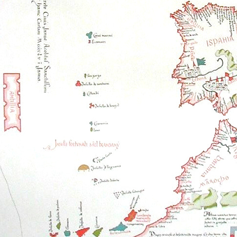

## Background

 _Ursula K. Le Guin's novel, The Dispossessed, imagines a possible Anarchist Utopia on the alien moon of Anarres,1 following the story of Shevek, a scientist who has discovered a new method of interstellar communication. He brings technology and trouble with him on his visit to the capitalist planet of Urras, the place where his Anarchist philosophy (as taught by Leia Asieo Odo) started, but was so violently rejected in the past, leading to the Anarchists being exiled to another planet._

 _The Odonian ideals the people of Anarres believe in and practice have been embodied in our own planet's history through the[Indus Valley](https://anarchyinaction.org/index.php?title=Indus_Valley_Civilization) (3300–1300 BC), Iceland (930–1262), Fresia (800–1523), Cospaia (1440–1826), [Zomia](https://anarchyinaction.org/index.php?title=Zomia) (2000 years), and currently by the [Zapatistas](https://anarchyinaction.org/index.php?title=Zapatista-run_Chiapas) in Mexico and [Rojava](https://anarchyinaction.org/index.php?title=Kurdistan_democratic_confederalists) in Syria. But such societies and movements have been extinguished by those who saw them as a threat to their power or wealth. But what if – like the Odonians – the Anarchists had been sent or escaped to a place they could live their ideals freely?_

 _Imagine that in the late 19th century Anarchists were all sent to an island, which for the purposes of this contrivance we shall call Antillia._2 _A land on which nobody lives, with a fertile coast, in which strange animals reside within the hostile interior. What if an American reporter went there thirty years later what would he find?_

 _And so, on to our little story from the reporter’s point of view:_

## Introduction to Antillia

I've taken many unusual assignments over the years, but being sent to Antillia, the land of Anarchists, was one of the strangest. A place that some people claimed didn't even exist. This unusual and largely unknown land had been inhabited in the 6th century and appeared in maps showing its cities throughout the 13th century, but it had long been abandoned since its rediscovery by John Cabot in 1497.

I'd heard the names in the news when I was a boy in the 1890s: William Morris, Peter Kropotkin, H.G. Wells, Emma Goldman, Lucy Parsons, and Leia Odo.3 Their faces on mug shots like those in the old wanted posters I'd seen in my Western comic books. Outlaws, hunted down, in their case not shot, but sent away to a strange new land, along with (I learnt later) tens of thousands of others from Britain, Spain, France, America, Japan, Korea, Russia and elsewhere.

When I was old enough to be nostalgic for my youth and old enough to have access to a university library, I began to wonder what crime those men and women committed and discovered that they were Anarchists, persecuted for their Syndicalist union forming, attempted regime overthrowing, philosophical and fiction writings, and supposedly for their corrupt morals. The nations of the world, in a rare act of unity, had decided that all Anarchists must be exiled to some remote place where they would cause no more trouble.

That they might still exist at the edge of the world was something that continued to intrigue me, and I sought out what information I could on what had happened since then, but found most of it to be unreliable and often contradictory propaganda. “An inhospitable land peopled by criminals”. The more sensational press said that without the benefit of Western civilisation they had all turned on each other and even hinted they may have become cannibals.

## The Journey to Anarcho-Antillia

But when the opportunity arose to go there and find out for myself I didn't hesitate. I was used to challenging political norms, often with humour and a hint of seriousness underneath. Perhaps the publisher let me go because not everyone took me seriously, or maybe it was because everyone else was too scared to.

But while the rest of the world left Anarcho-Antillia alone, perhaps because it has no valuable resources and poses no threat, or because it took such a long journey to get there, I was excited - if not without some trepidation - to be visiting three decades after the first exiles were sent there. Getting to the island turned out not to be that easy, luckily for me the Russians were sending a ship containing a sizeable group of Ukrainian Anarchists who the Bolsheviks wanted to rid the Soviet union of, among them Nestor Mahkno, who had been in the news of late, as well as notable Spanish Anarchist Buenaventura Durruti, with several thousand of those who were part of the same movement, and were escaping the fall of their republic.4

Speaking no Ukrainian (or Russian) and very little Spanish I couldn't make out what the other passengers were saying, but I could see that the feeling of losing their home was a sad one, even if they took solace in being safe. After a few drinks they would sing songs, some mournful, but many which sounded hopeful, and at one point turned to dance as an impromptu band played along to some rousing tune. They clinked glasses with me and even got me up to dance for one number, but I was none the wiser at the end of it all. Of course a few of my fellow travellers spoke English, but being in such close quarters I worried about getting on the wrong side of an argument, and so apart from that one evening I kept pretty much to myself, which was a hard thing for a man who enjoyed being social so much to do. 

## First Impressions of Antillia

It seemed like the journey would never end, but eventually the horn blew signifying our arrival, and I quickly gathered my things to see this peculiar place for the first time from the forward deck. To my surprise the port was as modern and well kept as the ones in San Francisco or Manhattan. This would be the first of many signs that even the less sensational accounts I had heard were still purposefully negative. For a moment I wondered whether I might be in Antillia at all, but the Anarchist red and black flags waving and the sound of The Internationale anthem playing left me in little doubt that this was the right place. Welcomed ashore, amongst the immigrants, as if I was a fellow comrade, I thought it better to allow others to assume that until I was sure what they thought of journalists in this place.

There was no question of where to go next. Accommodation was going to be provided, and fortunately for me those on the "settling in" committee spoke English, albeit with an unusual twang. I was ushered into a dormitory, where people choose their own beds. It was not so different from a soldiers barracks, but no guns to clean or drill sergeants to wake. The room I was in was for both men and women, but looking around I saw that there were single gendered dorms too.

## Settling In and Orientation

At dinner I was able to be among a group of younger English speakers in the canteen, and to begin to ask questions, albeit cautiously at first. I learned that this living situation was the norm for most in Antillia, though those at the table didn't know if it started that way due to scarcity or ideology. They had some difference of opinion about whether it would always stay this way, or if - as resources allowed - there would eventually be more private dwellings, but said they already had the opportunity for privacy in some rooms set aside for the purpose, that were often used by young couples or the less social. I was tempted to retire to one of those myself, but amongst the others I could better observe how they adjusted to this new land, and perhaps learn some things of interest to my readers at home too.

Upon waking the next day I saw that a survey was being taken of the new arrivals, and I listened in on the questions while avoiding answering them myself. They were being told there was no pressure to start any work or studies any time soon, that they should wait until they felt ready, and even then there was no obligation as all work was voluntary. The surveyors began collecting a list of what skills or interests each person had, what languages they spoke, and what special considerations they might want to be taken into account, so they could be made aware of which syndicalist workplaces might be best suit them, although - they emphasised - it was up to them if they felt more comfortable elsewhere doing something else. Surely, I wondered, if you didn't have to work if you didn't want to, why would anyone work at all?

To each person they gave a large bag containing new clothes, some personal toiletries, and for them to keep any personal effects in, anything of either practical or sentimental value. This was in line with their very different conception of property than ours in America, here a person may have what they can personally use, but nothing that might be needed for someone else's survival. So as a consequence there are no landlords, and everyone is responsible for common buildings.

This last point was illustrated practically when they brought out members of the dormitory federation: the cooks, cleaners, and maintenance workers. “These are your comrades, not your servants,” we were told, “they are not here to pick up after you, although they often will rather than things be left dirty. Please reach out to them if you need another blanket, have a special diet, or need something fixed. But remember that like you they do this work because they either like it, or they believe it is important work that needs to be done. So please do not make their lives more difficult.”

## Infrastructure and Work in Antillia

The induction continued with trips to local facilities to see how water was treated, electricity was generated, and food was cleaned and distributed. This wasn't too dissimilar to how it was in most countries, except that there were no competing companies providing or billing for such services, no time clocks to check in and out of, and it seemed that their managers (co-ordinators as they are called here) didn't spend their time watching what the workers were doing, but worked alongside them.

I couldn't help myself and in a moment when we were waiting for some people to catch up I asked one of the workers why they worked there, and discovered that they had been at their job for about a year and worked six hours per day and six days in every ten (Antillia had a metric calendar), because they liked simple but important work, said that they could chat all day to their fellow workers while picking and sorting, and didn't have to worry about their work come the evening. This raised the question of, “how did they know the work needed doing?”

It was almost as if the guides knew what I was wondering, for their next visit was to the local office of what was known as the PDC: Production and Distribution Coordination. It was here that which resources were needed and where they needed to go was tracked, along with the work and skills required to produce them. They used a large machine to help make these allocations called an Analytical Engine, and others of these were used through different settlements and somehow connected together, so that they could co-ordinate at least the essential needs of the communities.

I had heard of such machines in theory, but never expected the Anarchists to be so advanced technologically. It seems that a British scientist named Turing had brought the theories, and that when the potential of the machine was understood substantial resources were brought together to build it.5 They were hoping to share the plans with other nations when the time was right, but worried it might somehow be used for violent purposes, although I couldn't conceive how it could be put to such use.

## Education and Meeting Alex

Next up was a school, at least what passed for one in such a place. The classrooms were not arranged toward a teacher's desk, there was no cane to keep the students in line, and some of the rooms had adult students in them. They seemed to follow something close to the Socratic method, question and answer form of teaching, except when their learning wasn't based on projects - things they'd create themselves or as a team, or practical skills they needed to master. 

The group was introduced to an Alexander Berkman, or rather to an Alex as he insisted we refer to him, (who some of the new arrivals already knew and called out his full name upon seeing him). He was one of the co-coordinators at the school that day, but had some time to give us between classes, to explain how education worked there. Learning was a lifetime pursuit, but with the young they paid special attention to their social and moral skills (albeit not of the religious kind, except perhaps the Golden Rule).

I ventured a question about whether schooling was compulsory and this was enough for Alex to ask if he could spend some time with me, as the rest of the group returned to the dorm. I was worried I'd been discovered, as turned out to be true, but had no need to worry for my safety or status there, as to Alex I was just a matter of curiosity. Alex explained to me that some of the others probably picked up on me not being an Anarchist too, but presumably avoided mentioning it to not make me feel unwelcome or uncomfortable. But he was interested to learn about what had been happening in the world since he had left America thirty years earlier.

We spoke about technological advances, some of which Antillia had matched or exceeded, but others which were new or unusual concepts to Alex. We also spoke about the state of the world, the Great War which had not long happened and the ongoing Great Depression. He was saddened to learn that in matters of progress peace had not generally increased, nor had the treatment of the poor become much better.

## Agriculture and Development in Antillia

In the days that followed I met with Alex several times. On the next occasion we met at a farm where vegetables of all kinds (and some kinds I had never seen before) were grown. He told me when they first arrived they brought every skill needed to survive, but struggled initially with growing and irrigating suitable crops, as they weren't sure what was edible at first. 

From basic beginnings - makeshift tents and shacks - they had come to build shared homes and establish the medical, social and scientific resources needed to live and adapt, and adapt they did; Taking whatever they could from the land, careful to ensure whatever they used would be resown so that a natural balance was kept, they now had sufficient food, wood, and even some ores were mined. Through trade - gold for whatever they couldn't produce - they had many modern conveniences (except their damn toilets which composted the waste instead of it going directly to their sewage). But there was nothing of the wastefulness that the Western world was now beginning to see with mass manufacture, nor the luxuries that define status. In fact there was no money at all, no coins, no promissory notes, no hours worked on a ledger, either sold or traded to buy expensive trinkets or grant special favours, or to compel someone to do work they didn't want to. No taxes, no bankers, no insurance, and no fares to pay on the rails, trams, and buses that took them between settlements.

The streets were lined with native bushes and wide enough for automobiles, but beside the trams which ran through some streets, I didn't see any personal vehicles whilst I was there besides bicycles. Children played freely in the streets, and if they got hungry snacked on pickles from the seemingly continually replenish pickle barrels which were on each street corner.6

I was still suspicious of how such a society could function without compulsion, the threat of punishment, rewards for work, or competition. I could see that it was not a facade and did work somewhat and somehow, but asked Alex to share with me what the secret really was.

Alex replied, “I am a teacher, although here teachers aim to be more like mentors, encouraging a student's own abilities, but I do what I do because it brings me joy and purpose.” I was not convinced as Alex could tell, so he continued, “Of course I chose this work, I chose this belief that the world could work differently, which cost me friendships and led me to be exiled, whereas some were not so lucky and were killed. I'm sure they expected us to die here or at least fail and beg to go back, but we were sure that such a place as this was possible. You've seen for yourself that it is possible and practical and purposeful (forgive my alliteration, I used that list recently in a lesson and liked it). Whether it was our determination to prove the world wrong, or to justify ourselves by making it work, either way it worked.”

## Antillian Society and Principles

My questions did not end there, I wanted to know and was told about how they tried to teach the children at the school to value selflessness above selfishness, altruism above competition, as well as how (as a society) they had learned ways to incentivise doing good and rewarding it through means other than with money or power. 

He told me that they all agreed on certain principles as far as how their society and work should be organised. Especially, what they are against and would not tolerate: There should be no rulers, no single person in change of anything, but themselves; There should be no commercial (profit or rent making) property of any kind; There should be no currency, except what is kept from trade with outside nations; There should be no prejudicial distinctions by class, race, gender, sexuality, or age; There should be no police or prisons or punishments.

And they agreed what they were in favour of: There must be decentralised leaderless organisations covering every need to ensure everyone has food, clothing, and shelter available; These organisations will not have exclusive rights to what is needed nor to how it is distributed, as people can organise with others differently or opt out of any organisations without being deprived of the essentials need to live; There will be resources used and targeted toward education, research, defence, care of the infirm, in ways that respects the freedom and dignity of all involved.

(He mentioned that there had been some disagreement between the Anarcho-Syndicalists and Anarcho-Communists about the best way to organise the work and communities, with the latter fearing that the Syndicates might undermine the communities. In this he sided with his friend Odo, but it was an ongoing debate, although more a question of tactics than of principle.)7

## Addressing Concerns and Challenges

After this it was a matter of practical application, how work and education and living arrangements were organised. But, I asked, “what about motivation? Selfishness? Human nature?” He replied it was his belief that environment encouraged some behaviours and discouraged others, and that this could be planned and accounted for. Just as the rest of the world followed philosophies of competition and justifications for inequality because it suited a few people in power, people could be encouraged to share and cooperate for everyone’s benefit instead.

I asked if this was just another form of coercion to which Alex admitted he was afraid it sometimes was, but that he would rather he would rather someone do something good to maintain a good impression, than them be indifferent to and inconsiderate of how others feel. Likewise he would prefer a man avoid doing something bad - like hurting someone else - because he feared the disapproval of those he knew well, than just a fear of prison. 

Which reminded me that I hadn't seen any police, guards, or army while I was there. Alex informed me there was a defence force, and that most underwent some basic defence training, but that they focused on de-escalating conflicts, mediating and resolving disagreements peacefully, and restorative and reformative forms of justice. But they had arms and plans should they be invaded, unlikely as most thought that to be.

“But surely some just won't take part in society or are too dangerous to be part of one?” I quizzed. It was true, Alex admitted, there were - on rare occasions - those who were violent, and to keep others safe had to be kept away from most people (except those trained to deal with such difficulties). It was seen as a medical issue which could often be resolved in time, and if not some lived as nomads. Others took the return journey on ships bound for other countries, if they felt the rest of the world might offer them something better suited to them. In some cases a few people were encouraged to go and a few returned when they discovered it was not quite what they expected.

This didn't answer every possibility, and I suspected that in more extreme cases more extreme measures (which Alex was loath to talk about) might have been taken, but I didn't want to press the point, and moved on to another. “So, people have no complaints?”, I asked.

“They have plenty, but the primary complaint is of bureaucracy, of meetings, of planning, of coordinating, but less so of sharing or lacking anything they need. Most people wouldn't trade their comparatively minor inconveniences, with your life full of financial insecurity and political instability. Here they have access to much of the same things as you do, even if some of them may have to wait for longer than if they were in another country and were richer.”

## Cultural Life and Debates

Seeing that I was still searching to be able to reconcile these contradictions – between America and Antillia, Capitalism and Anarchism, competition and egalitarianism – Alex invited me to a debate that evening at the local cultural hall. The topic was on “defending the revolution”, with Nestor Mahkno and Errico Malatesta taking opposing sides. They had very different approaches, and it was a heated exchange, but at the end of it all both men decided to settle it with a drinking game at a nearby tavern.

The port tavern was the rowdiest place I had been to during my visit, due in part to it being built for the benefit of the sailors coming into port on trading vessels. Which meant it was the only establishment which didn't close late at night, and had enough in stock to not risk the chance of the alcohol running out. Alex and I talked and drank the night away, and no matter how inebriant Alex got he never wavered from his love of his new land or his belief in its future. Although he had fears that one day the rest of the world might not see them as just an odd curiosity best overlooked. He mentioned one scientist there, Shevek, had created a new kind of radio transmission system, which he reckoned could spread Anarchism across the whole world (at least audibly to those who decided to tune in on their radios), and worried that it could cause a backlash from authoritarian nations. But for now, and for as long as they remained safe, this was his utopia, and I had to admit it wasn't such a bad one.

## Departure and Reflection

I woke in the morning with a sore head and a longing for something more greasy to combat my intolerant stomach, and again found this in the same tavern, which in the day doubled as a cafe. My last meal in this land, before returning back to the country of my birth. A young couple, the woman holding a sleeping baby – seeing that I had two chairs free – asked if they could join me. They had just come on the boat themselves, the one I was going back on, and were anthropologists looking to spend several years studying the Antillians. They would undoubtedly produce a more scientific paper than my own article, but I was glad that others would get to have a similarly unique experience (even if their readers only could vicariously). As I got up to leave the little girl woke and rubbed her eyes, I wished them goodbye and waved to the infant, who they’d called Ursula, wondering what her experience there would be and what stories she yet might tell.8

Subscribe

[Share](https://peacefulrevolutionary.substack.com/p/antillias-utopia?utm_source=substack&utm_medium=email&utm_content=share&action=share)

## Questions

  * Would you like to have lived in Antillia?

  * How realistic or possible do you believe a place like Antillia is?

  * What isn’t covered in this story that you’d like to see in a sequel? 

If you liked this article you might also like - 

## Dispossessed Article Series

\- [How Anarres Works](https://peacefulrevolutionary.substack.com/p/how-anarres-works)

\- [The Utopian Pravic Language](https://peacefulrevolutionary.substack.com/p/the-utopian-pravic-language)

\- [Odonian Hymn Of The Insurrection](https://peacefulrevolutionary.substack.com/p/hymn-of-the-insurrection)

\- [Antillia’s Utopia (Anarres On Earth)](https://peacefulrevolutionary.substack.com/p/antillias-utopia)

1

https://en.wikipedia.org/wiki/The_Dispossessed

2

https://en.wikipedia.org/wiki/Antillia

3

I left out many others who might have been named such as: Leo Tolstoy, Oscar Wilde, Charles Chaplin, Voltairine de Cleyre, Margaret Sanger, Louise Michel, and Itō No. I would have loved to have added more famous Anarchists alive at the time, and explore the stories of some of them, but felt like it would have taken what was already an unexpected detour into a different direction.

4

Perhaps Berthold Brecht, George Orwell and J.R.R. Tolkien made the trip too.

5

This doesn’t say Turing was in Antillia, but that they somehow were aware of his theories (and those of Charles Babbage). Although we know little of his politics, apart from his distaste for fascism, it is my hope that Turing could have found in Antillia an outlet for his skills and a place for the life he longed to live, away from British prejudices of the time.

6

 _Reporter:_ If you could make a change to anything you’ve written over the years, what would it be?  
 _Le Guin:_ In The Dispossessed, I would mention the communal pickle barrels at street corners in the big towns, restocked by whoever in the community has made or kept more pickles than they need. I knew about the free pickles all along, but never could fit them into the book. (https://www.the-tls.co.uk/articles/twenty-questions-ursula-le-guin/)

7

This is an area where The Dispossessed receives criticism from ‘AnComs’ (like me) and Bookchin.

8

Ursula K. Le Guin, who wrote The Dispossessed in 1974, was an infant around this time.
