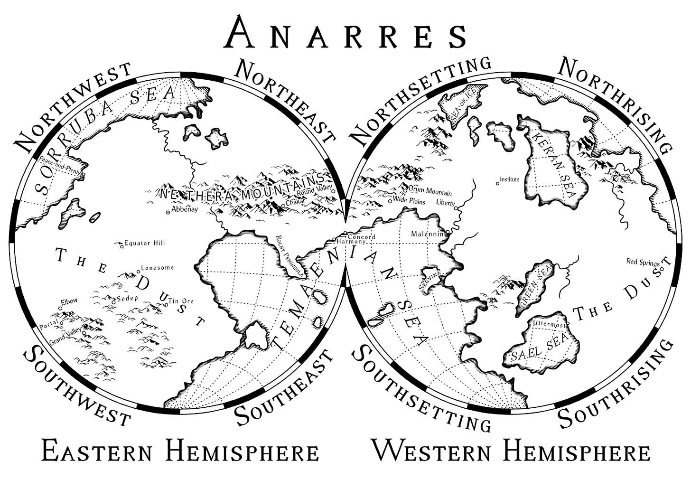
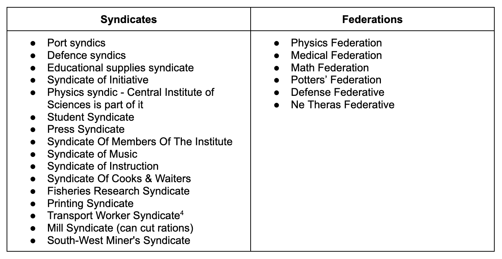
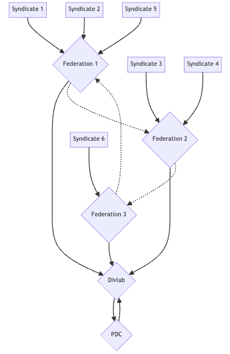

Thank you for your interest in coming to Anarres. Along with other instructions you would have received on Odo's teachings, the Pravic language, our history, and geography, this guide is here to help you adjust to the way we Odonians work (including you if you decide to stay with us).

Everyone in Anarres is a free agent, responsible for themselves, and if they choose, they may also be responsible for others in the sense that they may contribute to their welfare by making something, providing a service, doing research that may benefit others (or just expanding our understanding)1, not to mention involvement with others in ways that don't fit under the umbrella of work.

>  _‘The law of evolution is that the strongest survives!’ ‘Yes, and the strongest, in the existence of any social species, are those who are most social. In human terms, most ethical.’_2

## Motivations

There may be many reasons you want to contribute to building, maintaining and advancing Anarresti society. We are grateful for them all and the extra pair of hands to help with the process.

>  _‘After all, work is done for the work’s sake. It is the lasting pleasure of life. The private conscience knows that. And also the social conscience, the opinion of one’s neighbours. There is no other reward, on Anarres, no other law. One’s own pleasure, and the respect of one’s fellows. That is all. When that is so, then you see the opinion of the neighbours becomes a very mightly force.’_

We find that most Anarresti - especially those born and brought up here are motivated by:

  * A philosophical ethos of altruism and cooperation, in the form of the teachings of Odo.

  * A desire to contribute, being taught that their skills are needed.

  * A vocabulary engineered for them to focus less on the self.

  * A sense of responsibility, that others are relying upon them, and they shouldn't let them down, or face criticism for not doing enough.

  * An association with those who are contributing, and undoubtedly a desire to maintain those associations, which is more likely to happen if they live and work alongside them.

  * A social reputation, a desire to be thought of well, and avoid being criticised.

  * A sense of achievement that will come through doing something well and being appreciated.

## Organisation

On Anarres, you will often hear the words syndicates, councils, federations, institutes, Divlab, and the PDC. All of these relate to the way we organise work and workers.

>  _‘It was a community, not a society. It was the community of the Syndicate of Initiative.  
>  There was no government. The crew met once a decad to decide matters. Work was parcelled out by lot or preference; everyone was expected to do his share,   
> but not everybody cared to do certain kinds of jobs.’_

Anarres is an Anarcho-Syndicalist planet.3 Individuals belong to Syndicates - self-organised, self-coordinated horizontal groups of workers (or students, social groups, etc.). Those Syndicates combine and represent relevant areas of industry, arts, research that can meet and cooperate together. Anyone - worker or not - can take part if they have an interest and wish to be involved, but a syndicate cannot compel a syndicate member (syndic).4

>  _‘An Odonian undertook monogamy just as he might undertake a joint enterprise  
>  in production, a ballet or a soap works. **Partnership was a voluntarily constituted federation like any other. So long as it worked, it worked, and if it didn’t work it stopped being. It was not an institution but a function.** It had no sanction but that of private conscience.’_

Federations are groups of Syndicates, often based on regions or larger aspects of our society. A federation can help coordinate resources that need to be distributed, scale up larger projects, as well as spread information and make needs known. They have a council which includes delegates from the different syndicates. Anyone can become a delegate, and anyone can be recalled at any time if it isn't felt they are accurately representing the needs of their syndicate. But a federation doesn't rule over a syndicate - the relationship is voluntary, and a syndicate may be a member of different federations for different reasons.

Federations help Divlab - the Division of Labor - to identify what extra work and resources are needed for different Syndicates when it comes to larger work projects (and Syndicates can make individual requests too for their local/specialised level).

>  _‘It’s not an order, Oiie. He goes to Divlab—the Division of Labor office—and says,  
>  I want to do such and such, what have you got? And they tell him where there are jobs.’_

These requests, as well as a database of workers and skills, are managed by the PDC (Production and Distribution Coordination). It's a computer-based system for making workers/researchers etc. know where they might be needed or useful.5 It also handles the broader tracking and availability of essential resources (including trade with Urras) to ensure equality, especially as some important items are scarce on the planet.6

>  _‘The network of administration and management is called PDC, Production and Distribution Coordination. They are a coordinating system for all syndicates, federatives, and individuals who do productive work. They do not govern persons; they administer production. They have no authority either to support me or to prevent me. They can only tell us the public opinion of us—where we stand in the social conscience.’_

## Work & Choices

So how does this look on an individual level? As you know, there are no wages, no bonuses, no positions in which someone can order someone to do something, and no coercion to work that might deprive someone of what they need to survive.

>  _‘Doing work that was meaningful to others, being in some way useful, that was the main thing.’_
> 
>  _‘He had never been assigned work; he had always found it where he wanted it, where he thought it ought to be done.’_

If you are don’t mind what you do, and just want to continue, then when you have finished your schooling you could:

  * Go to the Divlab and see what work was available.

  * Being able-bodied and willing to do most manual things, there are lots of options.

  * Maybe choose the ones that keep you with those you are familiar with or keep you close to the places you like.

  * Or maybe you want a fresh start or a new experience and choose something further afield.

  * Then whatever you choose, you'd volunteer, and if accepted, go wherever you need to.

>  _‘Most Anarresti worked five to seven hours a day, with two to four days off each decad. Details of regularity, punctuality, which days off, and so on were worked out between  
>  the individual and his work crew or gang or syndicate or coordinating federative, on whichever level cooperation and efficiency could best be achieved.’_

 **Specialised Skills** \- If you have a practical skill - let's say plumbing - you still would go to Divlab. The opportunities might be less or more focused - they are more likely to mean moving and adjusting if you want to do something more specific to your skill set. Maybe if you are starting a new area, you might help to form a syndicate and council, to be in contact and liaise with a larger federation, and ultimately Divlab to get more support in the form of work or resources.

 **Creative Work** \- This isn't much different if your desires are artistic - you'd gravitate to where the environment best fostered your talents vs where you'd get the most experience or reach the kind of audience you wanted.7 Creativity and entertainment are also an important part of Anarresti society, and the Pravic word for work is the same as play.8

>  _‘The separation of work and life was a false dichotomy, an Odonian concept rejected by the Settlers. Work was a part of life, not something separated from it.’_

 **Research** \- If you are someone for whom a lifetime of learning is your desire, you would look for institutes that are doing similar research or may have the resources you need. It may be possible you are treading new ground and may need to ask for new space to be set aside, new resources to be obtained, and you might need to help set up a new department, and work with those in publishing to have your results printed etc. You may come against different personalities not as convinced about the importance of your work, but they wouldn't be able to stop it, as it is your choice what you do, but you may not be able to rely upon their help either. But if others believe this work is important, they may join with you and help start a new syndicate to help push it forward.

>  _‘She had studied biology at Northsetting Regional Institute, with sufficient distinction that she had decided to come to the Central Institute for further study. After a year she had been asked to join in a new syndicate that was setting up a laboratory to study techniques of increasing and improving the edible fish stocks in the three oceans of Anarres. When people asked her what she did she said, “I’m a fish geneticist.” She liked the work; it combined two things she valued: accurate, factual research and a specific goal of increase or betterment. Without such work she would not have been satisfied.’_

## Life On Anarres

But whatever you choose your life is likely to involve some of these aspects -

  * Setting up a bunk in the local dormitory.

  * Meet new people at work, in the food hall, and at different entertainments.

  * Form friendly and romantic relationships.

  * Occasionally take space and time aside to focus more privately on a relationship in a private room.

  * Maybe even ultimately have a child which the nursery raises (with as much or as little involvement from you as you like).

  * You are mentored in your work if needed, partner with others if the work needs it, maybe rotate to different jobs in the same area to keep the work interesting.

  * But you may only be working maybe 6 days in every 10, for about 6 hours a day. If you choose to.

  * Maybe in your spare time, you play a game, an instrument, take part in some amateur dramatics, or maybe you are content to be entertained or just converse.

  * Maybe you'll become a delegate, serve on a council, or as a mentor as you become established.

  * You may form a long-term relationship, or perhaps that doesn't suit you.9

  * At some point in the future, you may reduce your work time, do whatever you need to for your health, even perhaps ultimately needing the care of others if you become less able.

Yet there is nothing you can’t opt out of or not take part in if you don’t want to. There is nothing to stop you from building a little hut, going along to the dorm to get free food. You could probably even arrange to pick it up directly from the distributor storehouse.10 You could still hang out, watch plays, play games, whatever. But there might be social pressure either in the form of comments or missed social opportunities in not being more involved in the community.

>  _‘The economy of Anarres would not support the building, maintenance, heating, lighting of individual houses and apartments. A person whose nature was genuinely unsociable had to get away from society and look after himself. He was completely free to do so. He could build himself a house wherever he liked (though if it spoiled a good view or a fertile bit of land he might find himself under heavy pressure from his neighbours to move elsewhere). There were a good many solitaries and hermits on the fringes of the older Anarresti communities, pretending that they were not members of a social species. But for those who accepted the privilege and obligation of human solidarity, privacy was a value only where it served a function.’_

## Advantages vs Other Systems

So what are some of the advantages of this over the Urras (or even Terran) systems?

Although in the Western world of Urras (and the country of A-Io), people enjoy certain luxuries that aren't available in Anarres, those luxuries come at a high cost to other people and themselves. They require a slave (or subsistence) class to work in sweatshops, mine ores, create things cheaply in dangerous situations, for long hours, receiving very little pay, and sometimes none. 

> _‘And the strangest thing about the nightmare street was that none of the millions of things for sale were made there. They were only sold there. Where were the workshops, the factories, where were the farmers, the craftsmen, the miners, the weavers, the chemists, the carvers, the dyers, the designers, the machinists, where were the hands, the people who made? Out of sight, somewhere else. Behind walls.’_

Even those in more affluent countries still have their homes and food and access to much of society dependent on the threat of homelessness or starvation. This system is overseen by self-appointed owners, the politicians which support them, and arbitrarily appointed managers in the workplace. All so that a small class can exploit and profit from others' labour, and so that the populace can be kept compliant through the fear of police and imprisonment.

>  _‘But what is the law? What is it based on, what is its source and sanction? He knew well what it was on Anarres: mutual aid, solidarity, the common good. Here [on Urras] it seemed to be property, or power, or maybe just force.’_11

In contrast, Anarres offers a society built on equality, mutual aid, and personal freedom. While life may be simpler and resources scarcer, the burdens and benefits are shared by all. Work is a voluntary contribution to the community, not a coerced necessity for survival. And while social pressure exists, it is not backed by the threat of state violence or economic deprivation.

>  _‘The Settlers of Anarres had left the laws of man behind them, but had brought the laws of harmony along.’_

Of course, Anarres is not perfect. Scarcity can lead to hardship, and the pressure to conform can risk stifling individuality. But compared to the stark inequalities and structural violence of capitalist societies, Anarres represents a radically different vision of what human life and work can be.

Comrades, welcome to Anarres!   
We look forward to living and working with you   
in the ongoing experiment of building a truly free society.

>  _‘The bond that binds us is beyond choice. We are brothers. We are brothers in what we share. In pain, which each of us must suffer alone, in hunger, in poverty, in hope, we know our brotherhood. We know it, because we have had to learn it. We know that there is no help for us but from one another, that no hand will save us if we do not reach out our hand. And the hand that you reach out is empty, as mine is. You have nothing. You possess nothing. You own nothing. You are free. All you have is what you are, and what you give. …’_
> 
>  _‘We have nothing but our freedom. We have nothing to give you but your own freedom. We have no law but the single principle of mutual aid between individuals. We have no government but the single principle of free association. We have no states, no nations, no presidents, no premiers, no chiefs, no generals, no bosses, no bankers, no landlords, no wages, no charity, no police, no soldiers, no wars. Nor do we have much else. We are sharers, not owners. We are not prosperous. None of us is rich. None of us is powerful. If it is Anarres you want, if it is the future you seek, then I tell you that you must come to it with empty hands. You must come to it alone, and naked, as the child comes into the world, into his future, without any past, without any property, wholly dependent on other people for his life. You cannot take what you have not given, and you must give yourself. You cannot buy the Revolution. You cannot make the Revolution. You can only be the Revolution. It is in your spirit, or it is nowhere.’_

Subscribe

[Share](https://peacefulrevolutionary.substack.com/p/how-anarres-works?utm_source=substack&utm_medium=email&utm_content=share&action=share)

## Dispossessed Article Series

\- [How Anarres Works](https://peacefulrevolutionary.substack.com/p/how-anarres-works)

\- [The Utopian Pravic Language](https://peacefulrevolutionary.substack.com/p/the-utopian-pravic-language)

\- [Odonian Hymn Of The Insurrection](https://peacefulrevolutionary.substack.com/p/hymn-of-the-insurrection)

\- [Antillia’s Utopia (Anarres On Earth)](https://peacefulrevolutionary.substack.com/p/antillias-utopia)

If you liked this article you might also like - 

1

‘But his real pleasure was the thought that the work might, ultimately, in some way he could not foresee, serve not only physics but the cause of humanity.’

2

All quotes from The Dispossessed by Ursula K. Le Guin, 1974, unless otherwise stated.

3

Anarcho-Syndicalism - As Le Guin wrote of her research for the book: ‘This led me to the nonviolent anarchist writers such as Peter Kropotkin and Paul Goodman. With them I felt a great, immediate affinity. They made sense to me in the way Lao Tzu did. They enabled me to think about war, peace, politics, how we govern one another and ourselves, the value of failure, and the strength of what is weak. So, when I realised that nobody had yet written an anarchist utopia, I finally began to see what my book might be.’ (“Introduction” from Ursula K. Le Guin: The Hainish Novels & Stories, Volume One”) In a letter she sent to Murray Bookchin she said that many of the philosophical underpinnings and ecological concepts came from his book, Post-Scarcity Anarchism (1971).

4

‘The job of cleaning the streets and workshops and lavatories, a vast, never-finished job, was rotated between the different syndicates.’

5

‘As for PDC, yes, it might become a hierarchy, a power structure, if it weren’t organised to prevent exactly that. Look how it’s set up! Volunteers, selected by lot; a year of training; then four years as a Listing; then out. Nobody could gain power, in the archist sense, in a system like that, with only four years to do it in.’

6

A simplified diagram follows. There were local PDCs too, and DivLab was a federation as well. ‘Divlab was supposed to be equal to all the other regional coordination federatives, but in fact it was the most equal, the first among equals.’

7

However, consider Salas:

> ‘What’s your listing at Divlab?’ he asked, puzzled.
> 
> ‘General labour pool.’
> 
> ‘But you’re skilled! You put in six or eight years at the Music Syndicate conservatory, didn’t you? Why don’t they post you to music teaching?’
> 
> ‘They did. I refused. I won’t be ready to teach for an-other ten years. I’m a composer, remember, not a performer.’
> 
> ‘But there must be postings for composers.’
> 
> ‘Where?’
> 
> ‘In the Music Syndicate, I suppose.’
> 
> ‘But the Music syndics don’t like my compositions. And nobody much else does, yet I can’t be a syndicate all by myself, can I?’

8

‘Pravic, which used the same word for work and play’

9

‘He knew from Odo’s writings that two hundred years ago the main Urrasti sexual institutions had been “marriage,” a partnership authorised and enforced by legal and economic sanctions, and “prostitution,” which seemed merely to be a wider term, copulation in the economic mode. Odo had condemned them both, and yet Odo had been “married.”’

10

However: ‘What happens to a man who just won’t cooperate?’ ‘Well, he moves on. The others get tired of him, you know. They make fun of him, or they get rough with him, beat him up; in a small community they might agree to take his name off the meals listing, so he has to cook and eat all by himself; that is humiliating. So he moves on, and stays in another place for a while, and then maybe moves on again. Some do it all their lives. Nuchnibi they’re called.’

11

‘To make a thief, make an owner; to create crime, create laws.’
