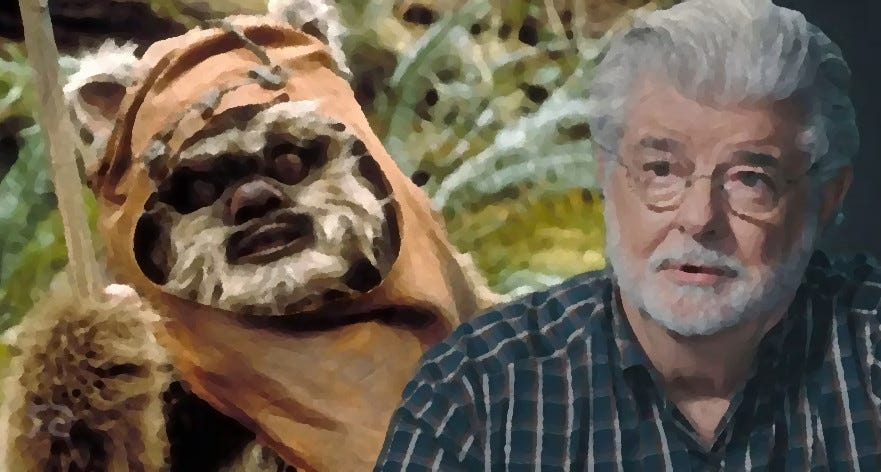
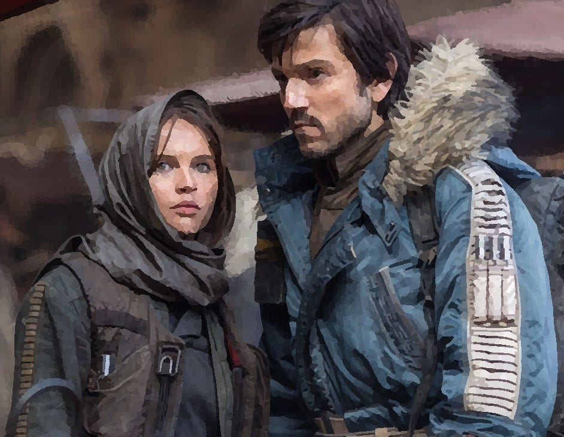
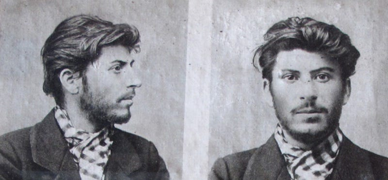
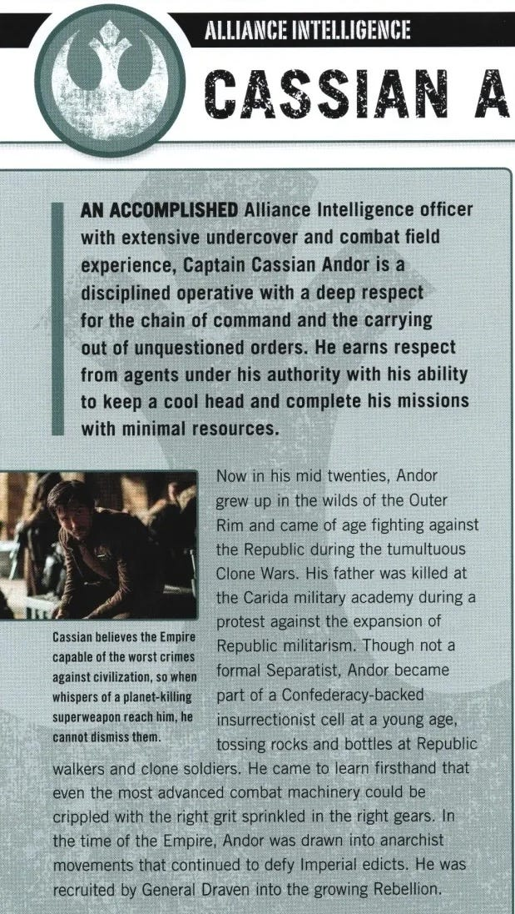
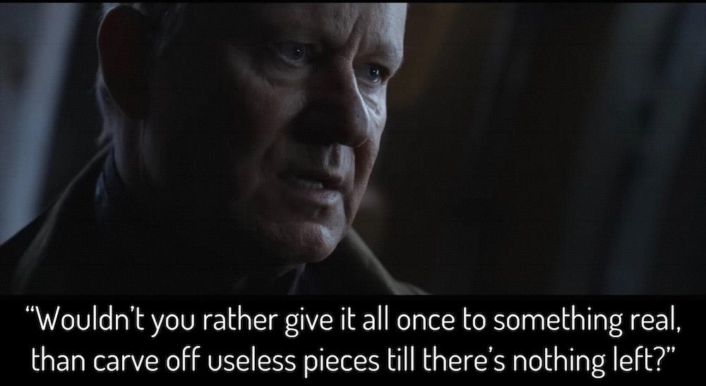

Other articles in this series:  
 _[Andor’s Political Inspirations](https://peacefulrevolutionary.substack.com/p/andors-political-inspiration)  
[Nemik’s Anarchist Manifesto](https://peacefulrevolutionary.substack.com/p/nemiks-anarchist-manifesto)  
[Nemik’s Manifesto Origins](https://peacefulrevolutionary.substack.com/p/the-origins-of-nemiks-manifesto)   
[Anarchist Saw Gerrera](https://peacefulrevolutionary.substack.com/p/saw-gerrera)   
[Radical Star Wars Conclusions](https://peacefulrevolutionary.substack.com/p/radical-star-wars-conclusions)_

## The Star Wars - Vietnam connection

Not so long ago in our little corner of the galaxy not so far away, a film director named George Lucas wrote a screenplay titled Star Wars and changed movie history forever. It spawned sequels, prequel, side-quels and became the one of the most successful franchises of all time.1

But this wasn't just a simple story of a whiny moisture farmer who got caught up in a galactic rebellion against an evil empire ran by his deadbeat dad2, it was an allegory for the Vietnam war, with Nixon leading the bad guys, and Luke on the side of the Viet Cong.3 It used the imagery associated with the Nazis to represent the Empire's soldiers, and based the rebellion's noble Jedi order on ancient Chivalric knights.

The connection between Star Wars and the Vietnam war may sound far-fetched, but we have a very reliable source for it.4 In 2005, Lucas articulated that Star Wars ‘was truly about the Vietnam War, and that was the era when Richard Nixon was seeking re-election for a second term, which prompted me to ponder historically about the process of democracies transitioning into dictatorships. Because democracies aren't forcibly overthrown; they are willingly relinquished.’5 And just in case someone suspects this was a later reinterpretation there is support for this view in the 1973 draft for the film, where Lucas explicitly referenced an autonomous planet likened to North Vietnam, and portrayed the Empire as ‘America 10 years from now.’6

## Star Wars Rogue One

Star Wars in all of it’s manifestations has been about rebellion against an empire (even when it featured cuddly Ewoks). In the first of the Star Wars trilogy7 the rebellion has got their hands on some plans to the evil empire's combo mega-weapon and shopping mall: the Death Star.8

They are told that getting hold of these plans came at a great human cost, but the full story of their sacrifice came a few decades later in the form of the film, Rogue One, which revealed the previously unsung and uncredited heroes and told tragic their tale.9

With this new prologue in the Star Wars canon we are introduced to Rebel Alliance intelligence officer Cassian Jeron Andor, who, along with Jyn Erso, the daughter of the DeathStar designer, obtained the legendary plans that would one day free the tyranny of the empire (for a little while anyway, until they built another Deathstar).

However, the CEO of Disney downplayed any comparisons between the film and the Make-America-Great-Again crowd, telling the Hollywood Reporter that this film about freedom fighters bringing down fascism wasn't ‘in any way, a political film. There are no political statements in it, at all.’10 This was a message the co-writer, Chris Weitz, didn't seem to get when he tweeted that ‘the Empire is a white supremacist (human) organisation.’ a tweet he was made to delete shortly afterwards.11

Maybe it’s me, but opposing state approved oppression does seems to me to be a political act. Perhaps not necessarily a party-political act, maybe not even an act necessarily grounded in a complex ideology. But the idea that people should be free and not silently compliantly submit to state oppression is an idealogical belief, and one often tied closely to someone's political views.

## Andor The Series

As for the character of Andor, however, we aren't given much of an insight into his political views or how Andor became part of the rebellion in Rogue One. Yet he proved to be such an interesting character12 that the movie making gods of the Star Wars extended universe decided to tell his tale in a serialised television form, and this is where we find a more jaded (and selfish) Cassian unexpectedly acting as mercenary for the rebellion, and follow his journey each week on Disney Plus to him becoming a fully committed (and ultimately self-sacrificing) rebel.

This tale is told by the talented Tony Gilroy, who had previously been hired by Lucas to rewrite portions of Rogue One, and returned as the show-runner of Andor, with help from his brother Dan.13 Tony was previously best known for his remake of the Bourne trilogy14 and was a best director academy winner for his film Michael Clayton. His brother Dan, also Academy nominated for his Nightcrawler screenplay. Dan's twin brother, John, also did the editing on three of the episodes of Andor.15

Although many of their past screenplays deal with different political issues, it seems they usually shy away from sharing their personal political views in interviews.16 This does not mean however that they are averse to admitting - like George Lucas before them - that they were inspired by particular political figures.

## Young Stalin

Cassian Andor begins his television show, set five years before the events of the film, as a smuggler and reluctant hired mercenary for the rebellion. There is no shortage of historical and fictional rebels that the writer of the series could have based the character on, but Tony revealed that he had a particular controversial character in mind, when he found inspiration in the book ‘Young Stalin’ by Simon Sebag Montefiore:17

‘The opening chapter is [like] this incredible movie sequence where Stalin is part of staging a major bank robbery in a Georgian town in 1907. It involves 15 people and hookers and teamsters and all these things. Stalin was Lenin’s financier. He was a thief. And the reason Lenin loved him so much was he kept bringing the money. They needed money. This shit all costs money. People gotta eat, they gotta get guns.’18

However, there are fundamental differences between the direction Stalin's life took and the one Andor takes. Stalin ultimately believed that the evil empire he fought against should be replaced with another empire he was the head of, but Andor never sought such a role or power over others at all.

So that precludes Andor from being a Marxist-Leninist like Stalin was. If we want to find out what political ideology Andor did adhere too we have no better place to look than the official, Star Wars Rogue One Visual Dictionary:

‘Now in his mid twenties, Andor grew up in the wilds of the Outer Rim and came of age fighting against the Republic during the tumultuous Clone Wars. His father was killed at the Carida military academy during a protest against the expansion of Republic militarism. Though not a formal Separatist, **Andor became part of a Confederacy-backed insurrectionist cell** at a young age, tossing rocks and bottles at Republic walkers and clone soldiers. He came to learn firsthand that even the most advanced combat machinery could be crippled with the right grit sprinkled in the right gears. In the time of the Empire, **Andor was drawn into anarchist movements** that continued to defy Imperial edicts.’19

## Andor The Anarchist

Andor is an insurrectionary Anarchist! The Anarchists in Star Wars were part of stateless coalition of rebel dissidents. Some rebels aligned with governments and represented particular sectors of the galaxy, but others, Anarchists such as Andor, rejected the concept of hierarchy and states altogether, just as modern Earthly Anarchists do. The word Anarchist literally meaning ‘anti-hierarchy’.

Anarchists also had a major part in the early days of the 1905 Russian revolution, as they had a common enemy in the form of the Tsar, and were often part of the Soviet councils, until Stalin disbanded the co-operative system and opposed the Anarchists.20

However, Andor almost didn't get involved in the rebellion at all. Seeing the cost it had exacted on his family already he wasn't eager to suffer as they had. Yet Luthen Rael, leader of the rebel spy network sees Andor's potential and when recruiting him challenges him to commit to the cause, ‘Wouldn’t you rather give it all at once to something real than carve off useless pieces till there’s nothing left?’21

He isn't entirely convinced at this point, but as his relationship with the empire and rebellion becomes more personal so do his views and involvement, until he becomes fully committed to the rebels aims himself.

Cassian Andor is played by Diego Luna in both the film and television series, and unlike some of the writers hasn't shied away from admitting to the political nature of the show's themes, insisting there wouldn't be a series at all without them, and that the themes are still relevant to us now: ‘We’re telling the story of the awakening of a revolution. There’s no way not to be political. If you wanted to avoid it, there wouldn’t be a show. Clearly, the show talks about oppression. The show talks about the context needed for a revolution to be born. That is always going to resonate because the need for change is constant for humanity. ... For me, this story is saying a lot of what worries me and what I care about.’22

But how does a smuggler become an Anarchist? What influenced him to go from avoiding conflict to confronting and facing it? Was there anything in particular that inspired his beliefs and actions? This question is answered — at least in part — through the influence of a young freedom fighter by the name of Karis Nemik.

 _In[the next article](https://peacefulrevolutionary.substack.com/p/andors-political-inspiration) I will look into Karis Nemik's influence on Andor and why (I believe) he taught an Anarchist view of politics and revolution, and later who his character may have been inspired by._

Subscribe

[Share](https://peacefulrevolutionary.substack.com/p/star-wars-radical-origins?utm_source=substack&utm_medium=email&utm_content=share&action=share)

1

Behind Marvel but ahead of Harry Potter & James Bond in terms of viewers. It is also the third longest ongoing sci-fi series (1977), after Doctor Who (1963) & Star Trek (1966).

2

“No, I am your father.” Empire Strikes Back spoiler.

3

Not so flatteringly represented by the Ewoks. ‘In the audio commentary for the 2004 re-release of Return of the Jedi, as well as the documentary Empire of Dreams: The Story of the Star Wars Trilogy, Lucas also cited the Viet Cong as being the primary inspiration for the Ewoks, particularly their defeat of the Galactic Empire.’ (<https://starwars.fandom.com/wiki/Ewok#Behind_the_scenes>)

4

James Cameron: “In Star Wars the good guys are the rebels, they're using asymmetric warfare against a highly organized empire, I think we call those guys terrorists today.”

George Lucas: “When I did it they were Vietcong. … That was the whole point." (James Cameron’s Story of Science Fiction, 2018)

5

Time magazine, 22 April 2002. Archived here - <https://web.archive.org/web/20020423000824/http://www.time.com/time/sampler/article/0,8599,232440,00.html>

6

According to J.W. Rinzler’s ‘Making Star Wars’, a draft screenplay for Star Wars: A New Hope from 1973 identified the Empire as a stand-in for “America 10 years from now”.

7

In order of release, albeit Episode 4 chronologically.

8

Yep, the Death Star really had a shopping mall! <https://starwars.fandom.com/wiki/Death_Star/Legends>

9

It is the highest non-animated IMDB rated film after the original series. 

10

<https://www.hollywoodreporter.com/movies/movie-features/disneys-bob-iger-rogue-one-are-no-political-statements-955047/>

11

Ibid.

12

Or the others proved to be much less interesting.

13

<https://www.imdb.com/title/tt9253284/> \- Tony Gilroy wrote the first three and last two (11-12) episodes, Dan the next three (4-6).

14

I didn't know it was a remake, did you? The first adaptation is a 1988 television film starring Richard Chamberlain.

15

<https://en.wikipedia.org/wiki/Michael_Clayton>  
<https://en.wikipedia.org/wiki/Nightcrawler_(film)>  
<https://en.wikipedia.org/wiki/John_Gilroy_(film_editor)>  
They are sons of Tony Award winning playwright, Frank Gilroy, who was also a successful writer for television and film, so I guess their writing skills are genetic, or benefitted from their father's example and training, if not also his contacts.  
<https://en.wikipedia.org/wiki/Frank_D._Gilroy>

16

‘no one sits around thinking about what we should do politically. It just happens instinctively.’ - <https://www.indiewire.com/features/general/andor-not-political-disney-plus-tony-gilroy-interview-1234780620/>

17

<http://www.simonsebagmontefiore.com/young-stalin/>

18

<https://www.rollingstone.com/tv-movies/tv-movie-features/andor-explained-season-1-finale-season-2-preview-1234626573/>

19

‘Andor’ entry, Star Wars Rogue One Visual Dictionary, 2016.

20

‘Anarchism or Socialism?’ Joseph Stalin, 1907.

21

Episode 4: Aldhani.

22

<https://www.vulture.com/article/diego-luna-on-andor-interview-finale-narkina-prison-break.html>
