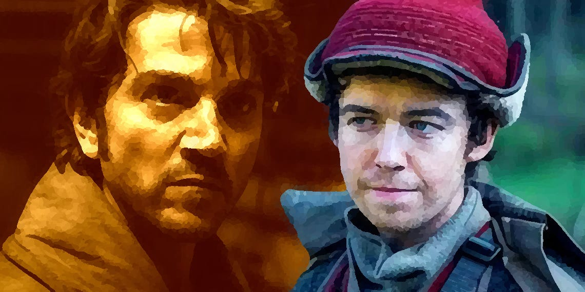
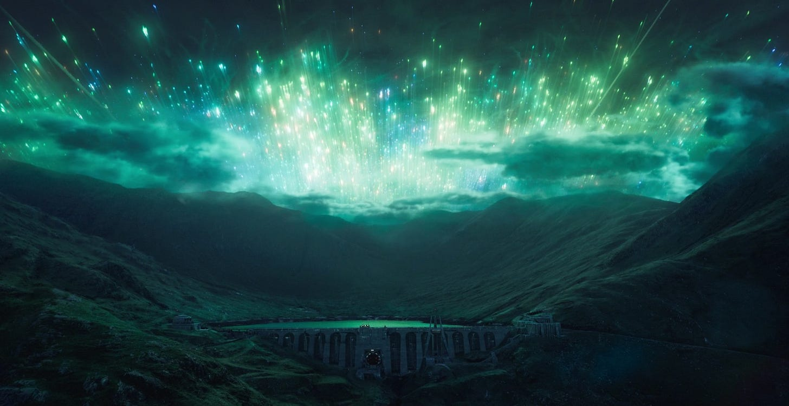
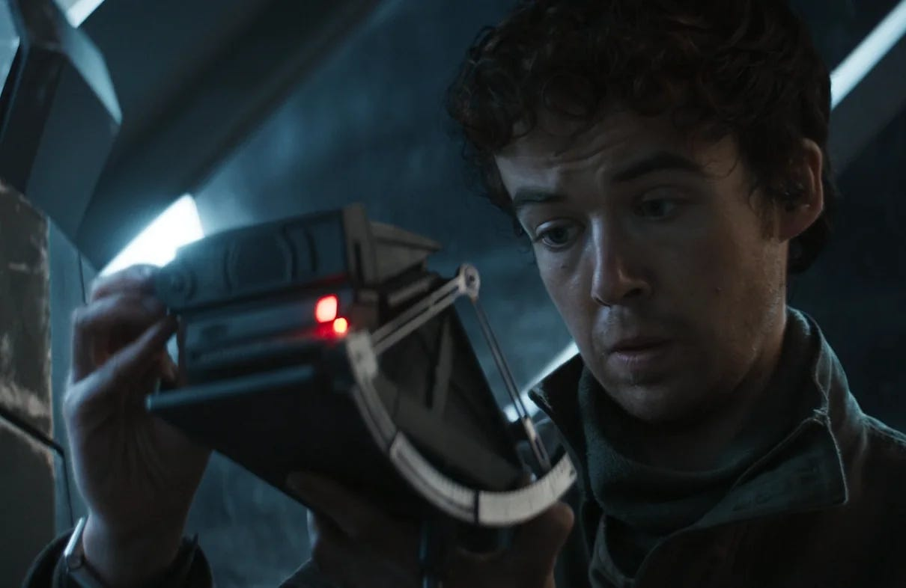
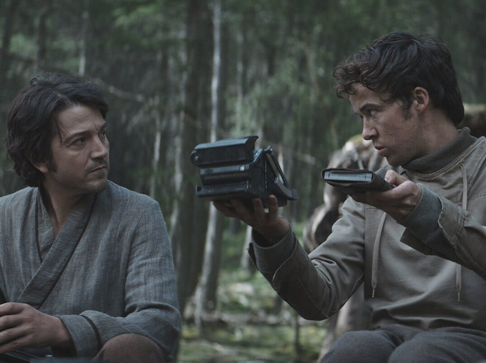
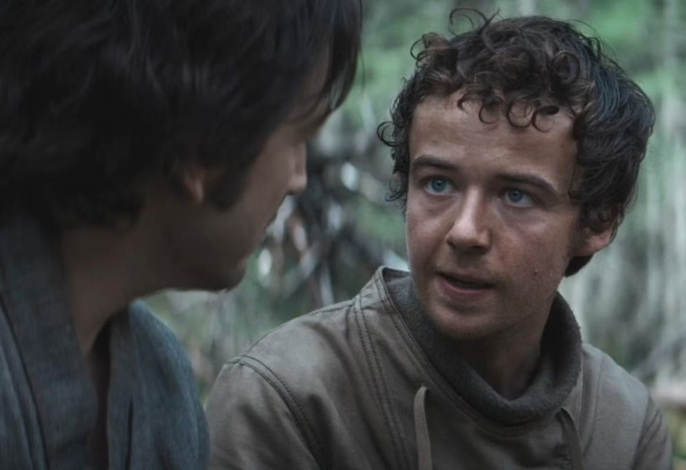
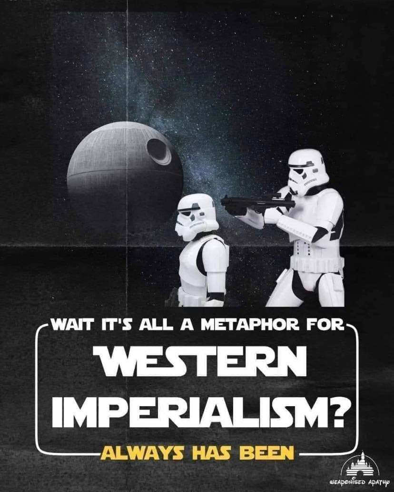

In [the last article](https://peacefulrevolutionary.substack.com/p/star-wars-radical-origins), we explored how Star Wars was originally inspired by the pro-Communist Viet-Cong’s fight against the Capitalist American Empire, and how its prequel Rogue One, featured a major Anarchist character, Cassian Jeron Andor.1

From the first to the third episodes of the Andor streaming series, Cassian is avoiding both the Empire and the Rebellion. He doesn't want the trouble that comes with the former or the idealism (and subsequent trouble) that comes with the latter. Although his adoptive mother has a more radical involvement in their community, he stays away from such distractions. His friend maintains contact with the Rebellion, but Cassian is happy to be kept out of it until he needs their help – and they also need his.

This is how Cassian finds himself as a paid mercenary, on the planet of Aldhani as part of a robbery intended to deal an economic blow to the Empire.2 It is here, in the fourth episode, named for the planet on which it takes place, where he meets young idealist Karis Nemik, portrayed by Alex Lawther. 

Lawther, who plays Karis, like his Star Wars character, is not shy about sharing his own ideals. In 2023, he joined more than 1,000 artists in the British film industry in signing an open letter demanding a permanent ceasefire in Gaza, and has also been involved in climate activism with Extinction Rebellion.3

## Aldhani

We first see Nemik asleep, while he is supposed to be on watch, his rifle resting on his lap. A blaster is brought to his face by his fellow insurgent, Arvel Skeen, to awaken him and remind him of how easily he could have been taken by surprise by an enemy. He apologises for his lapse of concentration, and picks up the binoculars through which he was supposed to be keeping a watchful eye, and for the first time sees Cassian in the distance with his team leader, Vel Sartha, but at this point he has no idea who this stranger is.

The next time we see Nemik he is being introduced to Cassian (under the moniker of Clem), who Nemik welcomes wholeheartedly: ‘Good to have you, Clem. We'll take all the help we can get.’4

The rest of the team, however, are more reticent than him, and not all of them are convinced by Cassian’s convictions, as we discover when they get a moment to discuss his unexpected arrival in private:

>  _Gorn:_ ‘How do you know him?’
> 
>  _Vel:_ ‘He comes highly recommended.’
> 
>  _Skeen:_ ‘So you don’t know him.’
> 
>  _Vel:_ ‘I know that we need him. That’s all I’ll say. Anything else is a violation of security.’
> 
>  _Gorn:_ ‘No, he’s got brass. You… You can feel it. And we can use a hand, but this late in the game?’
> 
>  _Vel:_ ‘As opposed to when?’
> 
>  _Skeen:_ ‘You trust him with our lives?’
> 
>  _Vel:_ ‘That’s my call to make.’
> 
>  _Nemik:_ ‘He’s committed. I’m feeling that. I want to.’
> 
>  _Skeen:_ ‘Feel what?’
> 
>  _Nemik:_ ‘His belief in the cause. When it comes down to it, that’s all I need to know.’

Nemik seems to be making quite an assumption at this point, but he knows that the odds are already against them completing the mission, that it could cost them their lives, and that another hand could help give them a greater chance of success and make the difference. I think this scene also shows that Nemik isn’t interested in Clem (Cassian) meeting some specific ideological purity test, but believes that people are more likely to be trustworthy if you treat them respectfully and place trust in them. After all, Cassian is being expected to trust them too and they'll have to trust him to succeed in their plans.

Nemik isn’t looking for Cassian to have any party affiliation, or for him to make any ideological oaths, meet any loyalty tests, or to undergo any inductions or initiation rituals. It’s all too late in the plans for any of that anyway. The ‘belief in the cause’ he is interested in is just that the Empire is evil, that they have to be fought against because they are trying to control others, to rule them through fear and violence, and that they should be stopped.

For Nemik this isn’t a hobby, it isn’t party politics, it doesn’t wait upon officials to convene conferences and bring up topics for discussion. He isn’t going to wait to go through legally approved channels for making complaints, and he isn’t putting his faith in waiting for elections to pick political representatives. He knows that such tactics are irrelevant to the Empire, except to show them who to silence.

Cassian has no love for the empire either, as he has been just as hurt by it. He may not be fully committed to the cause as yet, but he and the rebels have overlapping goals even at this point. He has tried to avoid conflict with the Empire to avoid the problems and dangers that come with that, but has still come up against them, and is now on the run from them. At this point Nemik seems to see the potential of Cassian before Cassian does, that he can be an important part of the cause to oppose and defeat the Empire, even if Cassian has yet to realise this.

Later, at a meeting to plan the heist we see that Nemik has made a detailed model of the base they’ll be infiltrating, which they hope will undermine the Empire’s finances and bolster those of the Rebellion, harkening back to the bank robbery Stalin made in 1907 to support the Russian revolution. Although he apologises that his model is ‘obviously it's not to scale’, and that the ‘rain gets into’ the fragile pieces it is made from.5 The group runs through the plans together, and it is revealed that they rely on an astronomical anomaly that happens every three years, known locally as the Mak-ani bray Dhani (The Eye of Aldhani), which Nemik describes with some enthusiasm:

> ‘It’s not really a meteor shower. It’s a recurrent band of crystalized, noctilucent micro densities. Billions of crystals. Very heavy but small and unstable. As the planet passes through the belt, they swarm the atmosphere, heat up, and explode. From the ground, it’s a thing of beauty. In the sky, it’s chaos. We’ve calculated an escape trajectory that gets us out just before the Eye closes. This happens in three days’ time.’

Although Nemik pays special attention to the details, to the scientific side of the phenomena, he also expresses a recognition of its beauty, the wonderful spectacle which will allow them to escape with their stolen cargo if all goes to plan. A plan which Vel gives Cassian one last chance to bail out of: ‘Now, you’ve got a lot to learn and very little time to do it, so what we need to know is, are you in all the way?’ To which he commits with, Let’s get to it.’

## The Axe Forgets

In the next episode, ‘The Axe Forgets’ the team is making the last few preparations for their heist.6 The rebels believe that they have a right to do what they are doing, not just because of the effect it will have on weakening the Empire, but because they believe they are taking back what the Empire has stolen. However, the Empire wouldn’t see it that way. 

The Empire makes and enforces the laws in this and on other worlds they ‘colonised’, so they consider that the millions of credits they have taken in resources from the worlds they have colonised are rightfully their property. Of course the inhabitants who have been invaded and conquered don’t see it that way. When a government takes power and steals money or goods it is called taxes (or if they take land it is called Eminent Domain), when an army does it they call it Commandeering or the Spoils of War. Both are seen as legitimate and legal, but when revolutionary rebels do it it is called Expropriation, and is seen as theft. 

The question is what entitles a state or corporation (or person for that matter) to have more than they need and what do they intend to use it for? In the case of these payroll credits, the Empire intends to use them to pay its Storm Troopers. Even though Storm Troopers are largely clones at this point, created for the purpose of fighting the Empire’s wars, they do receive pay, time off, and even occasionally retire if they live long enough. An army may run on its stomachs, but it seems that if they have some extra spending money then they are better motivated to do their jobs, even if that is being programmed to kill anyone who stands in the Empire’s way. 

So taking that pay away is likely to cause some unhappy less cooperative Storm Troopers, or - if they still get paid from other funds - take money away that was intended for buying the weapons the Empire might have used against the Rebels, who now could buy similar weapons to defeat the Empire with (albeit probably made by the same weapons companies). 

However, to carry out this plan will take a great deal of commitment and skill from the small Rebel team. Whereas the team are worried about Cassian’s dedication, Cassian isn’t certain about whether Nemik is strong enough, which he expresses to Arvel Skeen when they have a moment to talk at the rebel camp:

>  _Cassian:_ ‘It always breaks at the weakest point’
> 
>  _Skeen:_ ‘Oh, you're worried about the kids. Nemik's a surprise. He's green, but he's all in. He's a true believer. Nothing but the cause for him.’

### Nemik’s Beliefs

Initially, Nemik is characterised as a true believer in the cause, wholly dedicated to opposing the Empire. However, his belief extends beyond mere ideology; it encompasses a pragmatic understanding of the tools necessary for liberation. As we learn when Cassian comes up to Nemik while he is repairing a navigational tool for him to use:7

> ‘That's an old one. Old and true. And sturdy. One of the best navigational tools ever built. Can't be jammed or intercepted. Something breaks, you can fix it yourself. Hard to learn. Yes, but once you've mastered it, you're free.’

Nemik's emphasis on self-reliance, as demonstrated by his navigational tool, underscores the Anarchist principles of autonomy, decommodification and decentralisation.8 It is reminiscent of recent court battles in America over the ‘Right To Repair’ the technology you own, against the wishes of corporations who want to force you to use their service programmes or let your old equipment become obsolete by design.9

Nemik laments that they have ‘grown reliant on Imperial tech, and we've made ourselves vulnerable.’ Just as black feminist and rights activist, Audre Lorde, recognised, that when it came to revolutionary change ‘the master's tools will never dismantle the master's house’. Nemik also speaks of ‘a growing list of things we've known and forgotten,’ This is because the Empire’s only free information is its state controlled propaganda.

The Empire's Imperial Board of Culture categorised artistic works into three tiers based on their perceived alignment with Imperial values:

  * Banned works were considered overtly anti-Imperial and strictly prohibited.

  * Scarlet works were deemed neutral, neither promoting nor disparaging the Empire.

  * Pro-Imperial creations were actively endorsed and disseminated to the public.

Furthermore, the Empire only permitted the production, consumption, and distribution of 'pure' artistic expressions (holovids or books) created solely by Humans without any assistance from nonhuman entities.10

Then there was deliberate misinformation the Empire used to divert or discourage anyone who might think of rebelling, these were what Nemik called the ‘things they've pushed us to forget. Things like freedom.’ However, Skeen thinks Nemik too idealistic, adding that, ‘Nemik sees oppression everywhere.’

Nemik sees oppression everywhere because it is everywhere. The system is oppressive, oppression is woven into its very fabric as is the case with any top-down hierarchical system. It is a coat everyone must wear, whether it fits or not, even if it constricts some and ‘drowns’ others. Someone less concerned with freedom, less impacted by its injustices might adapt to it, even feel comfortable in it, as it inconveniences them less. But Nemik doesn’t just think about and care about himself, he acts out of concern and sympathy for others too.

This longing for fairness and justice is what drives Nemik, not just in action, but to share his thoughts and feelings, as Skeen reveals, ‘He's writin' a manifesto. Did he tell you? Apparently, the only thing keepin' us from liberty is a few more ideas.’

Skeen laughs at this idea. To him it is a joke, like the one in Thor: Ragnarok where the insurgent Korg says he didn’t succeed in his revolution because he ran out of pamphlets. But there are times words - in the form of leaflets or manifestos - can defeat empires. One need only look at the influence of Thomas Paine’s Common Sense, Marx’s Communist Manifesto, Kropotkin’s Mutual Aid, or Darwin’s Origin Of The Species, that started revolutions political and scientific that changed the world.11

> But Nemik carries on despite Skeen’s mocking: ‘It's so confusing, isn't it? So much going wrong, so much to say, and all of it happening so quickly. The pace of repression outstrips our ability to understand it. And that is the real trick of the Imperial thought machine. It's easier to hide behind atrocities than a single incident.’
> 
> Yet through this fog of war he sees clarity: ‘But they have a fight on their hands, don't they? Our elemental rights are such a simple thing to hold, they will have to shake the galaxy hard to loosen our grip.’ In saying this he foretells what the Empire's reaction will be, and why it will ultimately lose.

## Andor Revealed

Although Cassian starts off as Clem, when he joins the team, hiding his role as a paid mercenary, Skeen catches him out and he admits why he really joined them. When this is brought before the team, the rebel Storm Trooper Taramyn Barcona questions Vel Sartha about this, and she tells him that Luthen Rael insisted that she include ‘Clem’ or he would call off the mission. Cassian says that he is only willing to take the risk with the mission because of the money. But he also has his own reasons to hate the empire and to strike a blow against it, even if he doesn’t subscribe to any particular political ideology.

Now Nemik, despite his initial faith in Clem (Cassian), is no longer entirely sure of his intentions, asking ‘I'd like to hear what Clem believes, or is it Andor?’ To which Cassian replies, ‘I know what I'm against. Everything else will have to wait.’

This doesn’t discourage Nemik who tells him, ‘You're my ideal reader. Haven't titled [the manifesto] yet. I've been waiting. It's a work in progress, and I know that there's a great deal left to say.’

> He returns to the navigational tool as a symbol of what he believes, ‘I mean, look. Right here. Fresh inspiration. Two seemingly random objects, and yet this charts an astral path, this maps the trail of political consciousness. Both systems based on truth, both navigating toward clear and achievable outcomes.’

Nemik believes there is clarity to be found amid the chaos the Empire produces, that their power, while sometimes seeming overwhelming, can be overcome if people can become conscious of their power and how to use it.

Despite their differences, Nemik remains steadfast in his commitment to the cause, guiding Cassian through the intricacies of resistance. At a site overlooking the Empire’s base they continue their conversation, with Nemik confident the Empire will, ‘soon see, surprise from above is never as shocking as one from below.’

This is an insurrectionary action - they represent the rebellion against the empire, but not in any official capacity. The Empire are the officials they are fighting against. They are the terrorists or freedom fighters depending on which side you are on. This is an act of individuals working together as a small team to strike a substantial blow to the otherwise seemingly unstoppable Empire. 

However, Nemik doesn’t hide his disappointment though, when Cassian later admits ‘I’m being paid to be here’, asking him, ‘it’s really only the money?’

To which Cassian replies, ‘To take a risk like this? Come on.’ To this Taramyn accuses him of being afraid, and he retorts, ‘Of course I'm afraid. But there's a difference between fear and losing your nerve.’

Cassian does keep his nerve, and despite reservations, the rebels proceed, driven by a combination of ideals and necessity, and Cassian comes to ponder Nemik’s words - especially his manifesto - a great deal more through the events that follow.

These episodes featuring Nemik were written by Dan Gilroy, brother of Tony Gilroy. Dan Gilroy also wrote the Academy award nominated screenplay for Nightcrawler, which could be considered a cautionary tale about the risks posed by capitalism, especially where the media and truth are concerned.

In [the next article](https://peacefulrevolutionary.substack.com/p/nemiks-anarchist-manifesto), we'll witness the culmination of Nemik's beliefs and their impact on Cassian's journey. Through Nemik's words and actions, we'll gain further insight into the enduring struggle for freedom in the face of tyranny.

[Share](https://peacefulrevolutionary.substack.com/p/andors-political-inspiration?utm_source=substack&utm_medium=email&utm_content=share&action=share)

Subscribe

1

Of course Communism - if fully achieved - is Anarchist, because it has no state, no classes and no money.

2

This episode was first released 28th September 2022.

3

Lawther's portrayal of Nemik is a marked contrast from the unsavoury roles he played as Kenny in ‘Shut Up and Dance’, an episode of the Netflix anthology series Black Mirror (2016), and as the (albeit endearing) psychopath James, in the Channel 4 series ‘The End of the F***ing World’ (2017–2019). 

4

Clem was his adoptive father’s name. https://starwars.fandom.com/wiki/Clem_Andor

5

This is a trope perhaps first introduced by ‘Back To The Future’ when Doc Brown says, ‘Let me show you my plan for sending you home. Please excuse the crudity of this model. I didn't have time to build it to scale or paint it.’ But it is also a call back to Rogue one and Star Wars A New Hope in which the Death Star attack plans are rendered with simple CGI models.

6

‘The axe forgets, but the tree remembers.’ Says Arvel Skeen, ‘Now it's our turn to do the chopping.’ Original broadcast 5th October 2022.

7

The prop for this navigation tool was created from a Polaroid SX70 -  
https://www.reddit.com/r/Thatsabooklight/comments/xwbtsq/tv_andor_2022_polaroid_sx70_used_as_a/

8

Decommodification refers to essential goods needed for living no longer restricted by cost or sale.

9

https://www.cambridge.org/core/books/abs/right-to-repair/right-to-repair/

10

https://starwars.fandom.com/wiki/Imperial_Board_of_Culture

11

The American, Russian, Spanish and Evolutionary revolutions respectively.
