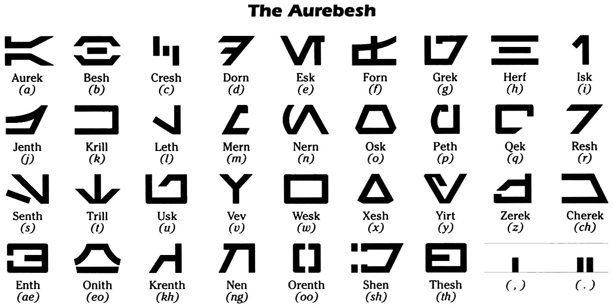
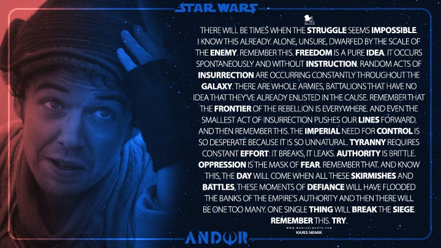
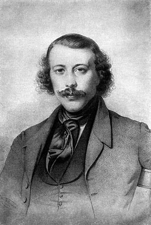
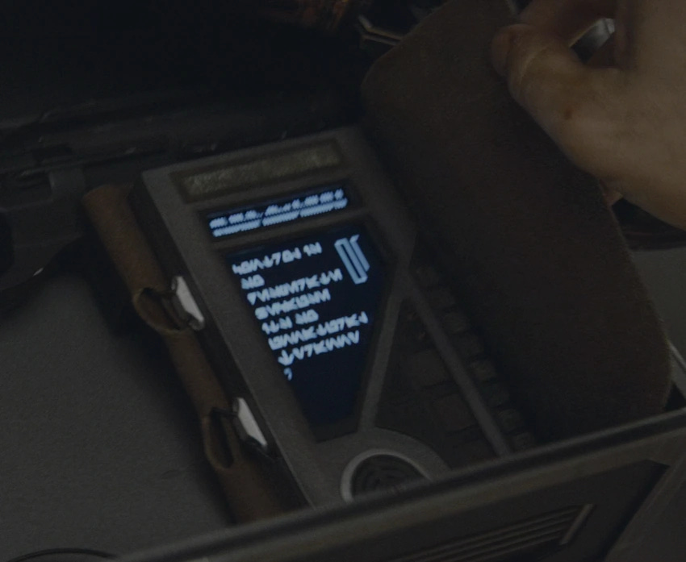

_You may wish to read[the first article](https://peacefulrevolutionary.substack.com/p/star-wars-radical-origins) & [the second article](https://peacefulrevolutionary.substack.com/p/andors-political-inspiration) in this series if you have not already._

In the sixth episode of the Andor television series the time for the heist of the Empire base which the Rebel team has been planning has finally come, as the ‘The Eye’ of Aldhani phenomenon they hope to use as cover for their escape is only hours away.1

We return to see Cassian Andor sitting outside in the early morning, Karis Nemik brings him a drink, as he couldn’t sleep either. But Nemik is worried that he won’t be at his best when the time comes, to which Cassian assures him that he will do well enough during the mission when the adrenaline rush kicks in. But this doesn’t fully comfort Nemik:

> ‘I'm struggling to understand why my faith doesn't calm me. I believe in something. Why am I so unsettled? I mean you have nothing, you sleep like a stone. I write when I can't sleep. Wrote about you last night. Not you specifically, not “Clem.” Although I'm assuming that's not your real name, anyway. “The Role of Mercenaries in the Galactic Struggle for Freedom.” My conclusion is simple. Weapons are tools. Those that use them are, by extension, functional assets that we must use to our best advantage. The Empire has no moral boundaries, why should we not take hold of every chance we can? Let them see how an insurgency adapts.’

In saying this, after he has discovered that Cassian (Clem) was hired to help them, he is finding a way to incorporate Cassian (and mercenaries like him who might not have the same ideals) into the revolution, to still see him as an asset, a tool, and a weapon that can be used against the empire, even if their intentions are not the same.

Insurgencies exist when there are no other channels left for the oppressed to fight for their freedom, they work outside of political processes, and do not ask politely for their rights back (this having already proved to be fruitless). To the officials of conquering empires insurgents are terrorists, to the people affected by the empire’s rule they are freedom fighters. They use guerilla warfare, because they are unable to match the empire’s firepower directly, and hope to use ambush, sabotage, and raids to wear down and outlast their enemies.2 The need for such tactics in that fight is something Cassian agrees with Nemik on, but not without some reservations:

>  _Cassian:_ Well, you're half right. The Empire doesn't play by the rules.
> 
>  _Nemik:_ And how am I wrong?
> 
>  _Cassian:_ They don't care enough to learn. They don't have to. You mean nothing to them.
> 
>  _Nemik:_ Perhaps they'll think differently tomorrow.
> 
>  _Cassian:_ Be careful what you wish for.
> 
>  _Nemik:_ So you think it's hopeless, do you? Freedom? Independence? Justice? We should just submit and be thankful? Just take what we're given?
> 
>  _Cassian (glaring at Nemik):_ Do I look thankful to you?

Cassian isn’t convinced by the ultimate success of Nemik’s ideals, but he is more than aware of the cost of the Empire’s beliefs being enforced on the galaxy, as it has come at great personal cost to him and his friends and family.

When it comes to the actual heist not everything goes exactly to plan. The Rebels including Andor, Sartha, and Kaz ambush the Imperial base led by Commandant Beehaz, taking his family hostage to force him to unlock the vault containing the sector's payroll. After a tense standoff use explosives to access the vault's cylinders containing the payroll. They load the cylinders onto a freighter amid a firefight where several were killed, including Gorn and Taramyn Barcona. During the ensuing escape through the launch tunnel pursued by TIE fighters, and Nemik was crushed by shifting payroll cylinders and seriously injured, leaving him unable to feel his legs. Despite this, Andor pilots the freighter into the comet-filled sky using instructions from the seriously injured Nemik, escaping the fighters, and successfully fleeing with the payroll.

As part of their contingency plan they had a doctor ready for such an emergency, but despite his best efforts Nemik succumb’s to his injuries. Cassian shows up to discover Nemik dead, and tells Vel Sartha that he has killed Skeen, who was trying to leave with the money, although she isn’t convinced by his story. Before Cassian leaves with his cut, Vel hands him Nemik’s Manifesto, ‘He said to give this to you.’ But Cassian tries to decline it, taking after Vel says, ‘He insisted’, and Cassian heads off with it.

## Nemik's Manifesto

Cassian eventually sought refuge on the planet Niamos, storing Nemik's manifesto in a box hidden in a hotel room. However, he was soon arrested by the Empire over a minor confrontation and imprisoned. After escaping, Andor returned (in the episode, ‘Daughter Of Ferris’) to Niamos to retrieve the box from the hotel room, where someone else was sleeping. As he checked the box, he opened the manifesto, which began playing Nemik's recorded content briefly before he closed it to avoid disturbing the sleeper. 

We briefly see the text written upon the datapad too, written in Aurebesh, the 34 letter alphabet of the ‘Galactic Basic’ language which most of the human characters in the Star Wars galaxy speak (rather than the English we hear, although we never get to hear it).3 However, it is not until the last episode, ‘Rix Road’, that we get to hear a complete passage from it.4

We hear Nemik’s words in his voice, reciting the opening of his Manifesto. While we see images of Andor’s friend Bix Caleen in a cell between interrogations, Luthen Rael by himself in the offset of a storm.

> ‘There will be times when the struggle seems impossible. I know this already. Alone, unsure, dwarfed by the scale of the enemy. 
> 
> **Remember** this. Freedom is a pure idea. It occurs spontaneously and without instruction. Random acts of insurrection are occurring constantly throughout the galaxy. There are whole armies, battalions that have no idea that they've already enlisted in the cause.’

Then we see Cassian listening to the manifesto on Nemik’s device, having returned to his home planet for the funeral of his mother, Maarva Carassi Andor.

> ‘ **Remember** that the frontier of the Rebellion is everywhere. And even the smallest act of insurrection pushes our lines forward.
> 
> And then **remember** this: the Imperial need for control is so desperate because it is so unnatural. Tyranny requires constant effort. It breaks, it leaks. Authority is brittle. Oppression is the mask of fear. 
> 
> **Remember** that. And know this, the day will come when all these skirmishes and battles, these moments of defiance, will have flooded the banks of the Empire's authority and then there will be one too many. One single thing will break the siege. 
> 
> **Remember** this. Try.’

Nemik's Manifesto’s title is, ‘The Trail of Political Consciousness’, and what we have heard is just the opening to it.5 We know it has a section on, ‘the role of mercenaries in the galactic struggle for freedom’ inspired by Cassian, but we can imagine it speaks a great deal about the ideals and methods of the insurgency, in a way intended to inspire others to rebel and instruct them in ways to do so.

The words, ‘Political Consciousness’ used in the title have been associated with Socialist movements since the mid-19th century, with the first using the phrase being, Anarchist Mikhail Bakunin, in his critique of Karl Marx titled, ‘Marxism, Freedom and the State’, written in 1867. But it is five years later before he gives a fuller explanation of the term, when he uses it to specifically speak of Anarchist ideals:

> ‘Now to discuss the question whether by means of propaganda it is possible to make a people politically conscious for the first time, we must specify what political consciousness is for the masses of the people. I emphasise _for the masses of the people_. For we know very well that for the privileged classes, political consciousness is nothing but the right of conquest, guaranteed and codified, of the exploiter of the labour of the masses and the right to govern them so as to assure this exploitation. But for the masses, who have been enslaved, governed, and exploited, of what does political consciousness consist? It can be assured by only one thing — the goddess of revolt. This mother of all liberty, the tradition of revolt, is the indispensable historical condition for the realisation of any and all freedoms.
> 
> We see then that this phrase political consciousness, throughout the course of historical development, possesses two absolutely different meanings corresponding to two opposing viewpoints. From the viewpoint of the privileged classes, political consciousness means conquest, enslavement, and the indispensable mechanism for this exploitation of the masses: the coextensive organisation of the State. From the viewpoint of the masses, it means the destruction of the State. It means, accordingly, two things that are diametrically and inevitably opposed.’6

Mikhail Bakunin

To put it simply, for the oppressed masses, true ‘political consciousness’ means realising the need to revolt and destroy the state apparatus that enables their exploitation by the ruling classes. For the masses, the ‘tradition of revolt’ against oppression is the essential historical condition for achieving any real freedom and ‘political consciousness’ in the liberating sense.

This fits in perfectly with the preface to Nemik’s Manifesto, wherein he speaks of freedom as something that is naturally occurring ‘spontaneously and without instruction’ in its unsullied ‘pure idea’ form. That when freedom is curtailed ‘acts of insurrection’ occur randomly, even among those who ‘have no idea’ they are already taking part ‘in the cause.’ This is because the yearning for freedom is universal, as is the desire to rebel against whatever restricts it. Insurrections are armed rebellions, not just protests, but include the possibility of meeting the Empire’s violence with violence returned in defence of the freedom of the conquered. 

Returning to the Manifesto’s preface second half, Nemik observes that

> ‘The Imperial need for control is so desperate because it is so unnatural. Tyranny requires constant effort. It breaks, it leaks. Authority is brittle. Oppression is the mask of fear. Remember that.’ 

Having control over others is unnatural. Some will argue over whether the desire to rule over others is natural, but that’s not what Nemik is concerned with, it is when some achieve that desire and do rule over others, thus depriving them of their freedom. That kind of control is unnatural because no one is born able to control anyone else. Even the newborn son of a king needs a regent or a council of nobles to carry out the systems of power that have already been established by force and maintained by ‘fear’. Empires may justify oppression as necessary inconveniences for the protection of its citizens, but it is always primarily for the protection of the privileges of those that rule. Being an Emperor and ruling the Empire isn’t genetically determined. It requires ‘constant effort’ and is ‘brittle’ and liable to ‘break’. But it often needs a little help to be eliminated completely. As Nemik confidently predicts:

> ‘And know this, the day will come when all these skirmishes and battles, these moments of defiance, will have flooded the banks of the Empire's authority and then there will be one too many. One single thing will break the siege. Remember this. Try.’

The authority he speaks about here is not expertise. It is not an authority given and maintained by consent. No-one has enough expertise to rule over another, and no one could consent to give up their right to freedom. The Empire is authoritarian, it is a totalitarian dictatorship, and the centralisation of its power structure is a weak point that acts and ‘moments of defiance’ can culminate to overthrow.

Unlike Yoda who said ‘there is no try’, Nemik says ‘try’, because he is not speaking to Jedi, he is speaking to the ordinary oppressed people suffering under the Empire’s control. To the Jedi the Force is a matter of will, it influences reality primarily through the exercise of the mind. But, although, rebellion may start in the mind, if it is limited to that it will not change anything. Real change takes changing minds, but also usually takes physical force to overthrow the structures of power.

Unlike the other episodes which featured Nemik, this one was written by the showrunner, Tony Gilroy, who presumably was the author of this Manifesto too. He later expressed how it was one of the things he was most proud of in the show:

Tony Gilroy

> ‘One of our happiest, proudest things in the show is when Diego is listening back to [Nemik's] manifesto. He opens Nemik's manifesto that night before the funeral. And Nemik is, in the manifesto, saying, 'We're going to win because oppression is unnatural, and freedom is a natural [thing].' And he has a whole big speech about how acts of rebellion are springing up all across the galaxy. All the people that are out there trying to make a rebellion, and they're all atomized and spread apart. And so the show is really about watching this thing coalesce, and in the end we will coalesce into Yavin [Prime, where Rogue One takes place]. The consequences of that are good and bad for the people who've contributed the most to making it happen.’7

## The Manifesto’s Future

As for the future of the Manifesto in an interview Tony Gilroy says the manifesto will likely make an appearance in season two:

> ‘But yeah, once the manifesto was in play, it'd be pretty hard to give it up. That's the gift that keeps on giving. We may not be done with it yet. It's material.’8

Some have speculated that Cassian continued to carry the Manifesto on him up until his end in Rogue One, speculating that it is the book-like object on his jacket in this image:

Whether it is the Manifesto or not in this picture, its words played a pivotal part in setting Cassian on his journey, and the sentiments it shares, echoing the words of similar idealists and revolutionaries, will continue to resonate as long as there is injustice and the desire for freedom.

 _Read[the next article in this series](https://peacefulrevolutionary.substack.com/p/the-origins-of-nemiks-manifesto)._

Subscribe

[Share](https://peacefulrevolutionary.substack.com/p/nemiks-anarchist-manifesto?utm_source=substack&utm_medium=email&utm_content=share&action=share)

1

‘The Eye’, Episode 6, 12th October 2022.

2

https://en.wikipedia.org/wiki/Insurrectionary_anarchism 

3

The Empire co-opted it as ‘Imperial Basic’

4

‘Rix Road’, broadcast 23rd November 2022.

5

https://starwars.fandom.com/wiki/The_Trail_of_Political_Consciousness

6

‘On the International Workingmen’s Association and Karl Marx’, 1872.

7

https://www.starwars.com/news/tony-gilroy-andor-season-1-interview

8

https://www.networkisa.org/script-magazine/view/writing-andor-a-conversation-with-tony-gilroy
