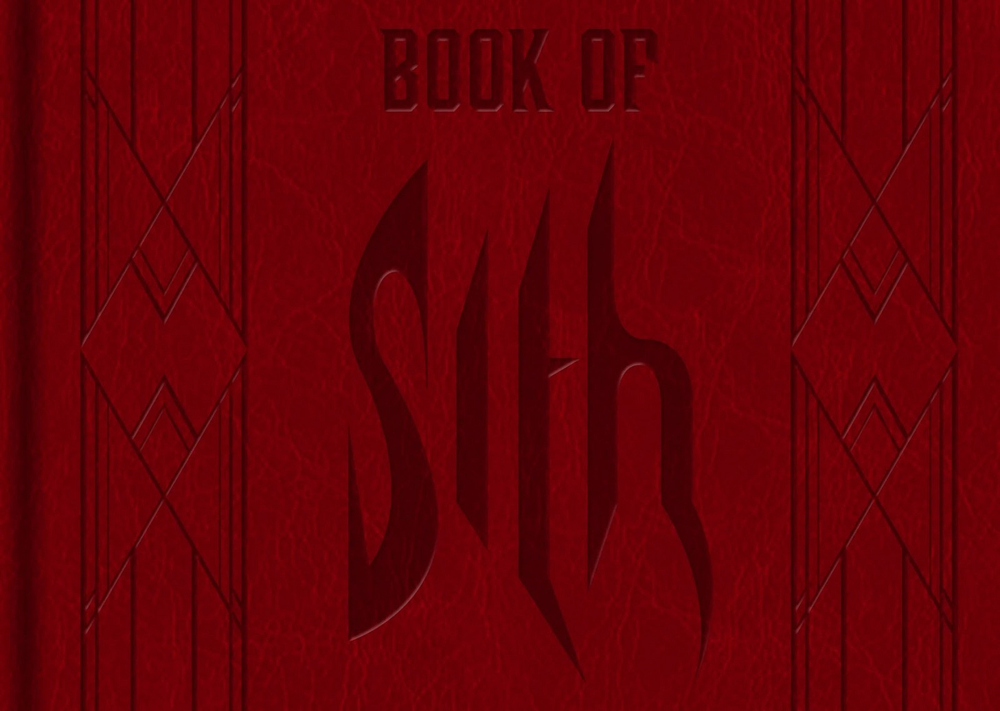
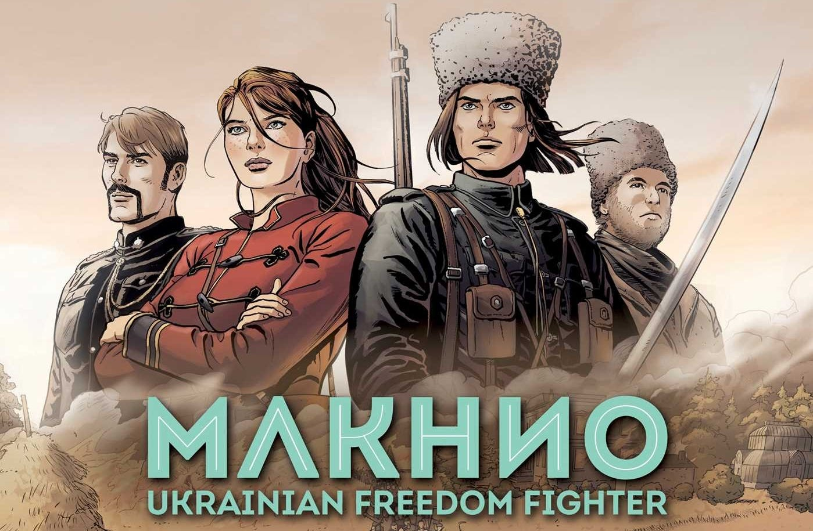
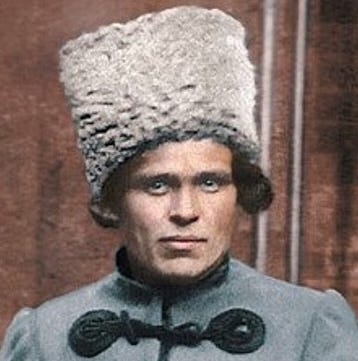

_You may wish to read[the first article](https://peacefulrevolutionary.substack.com/p/star-wars-radical-origins) , [the second article](https://peacefulrevolutionary.substack.com/p/andors-political-inspiration) and [the third article](https://peacefulrevolutionary.substack.com/p/nemiks-anarchist-manifesto) in this series if you have not already._

## Tony Gillroy’s Manifesto

Initially, Tony Gilroy had no intention of creating a prequel to the movie ‘Rogue One,’ which he co-wrote. However, by 2018, Lucasfilm began developing a TV series that would explore the life of Cassian Andor before the events of the film. 

Although Gilroy was not involved in this project, the studio sent him the script. Despite professing a lack of interest in the job, Gilroy wrote ‘a long forensic manifesto’ for Lucasfilm, outlining why the proposed approach wouldn't work and suggesting an alternative idea that he considered ‘radical’ and ‘out there.’ This idea eventually became the basis for the series Andor.

As the showrunner, Gilroy uses Cassian's story to meticulously depict the intertwined lives of ordinary people caught up in the formation of the Rebel Alliance, drawing parallels to the intricate storytelling style of Charles Dickens.

To quote an interview with Gilroy, he ‘wanted to do it about real people. … there’s a billion, billion, billion other beings in the galaxy. There’s plumbers and cosmeticians. Journalists! What are their lives like? The revolution is affecting them just as much as anybody else. Why not use the Star Wars canon as a host organism for absolutely realistic, passionate, dramatic storytelling?’ And this emphasis gave us the story of Karis Nemik and his manifesto.1

## Absolute Power, The Book Of Sith

In direct contrast and conflict with Nemik’s Manifesto, is the manifesto written by Emperor Palpatine (Darth Sidious), known as ‘Absolute Power’ which is included in ‘The Book Of Sith’, about his personal philosophy and and political and violent means that marked his rise to power and established the Empire.2

The Empire would argue for a different kind of freedom, the kind that is obtained and maintained through power over others. They seek 1) Peace through war against worlds that resist being conquered, 2) Freedom (through incarceration of those who may upset the current order), 3) Justice (through immediate punishment of any hint of opposition), and 4) Security (through the protection of the elite). It is typified by the Sith Code: ‘Through strength, I gain power. Through power, I gain victory. Through victory, my chains are broken. The Force shall free me.’3

 _On Earth this is similar to the philosophy of Ayn Rand’s Objectivism, which she described as ‘the concept of man as a heroic being, with his own happiness as the moral purpose of his life, with productive achievement as his noblest activity, and [selfish] reason as his only absolute.’_4 _To her selfishness is the only reasonable motivation and conquering others (such as Native Americans) was a virtue, as she believed the strong, smart and wealthy had priority over the rest of the population._

But as we see in Star Wars A New Hope, and ultimately in Return Of The Jedi, the power of the Sith was not unassailable and their victory was ultimately illusory, because of others following the principles Nemik spoke about in his Manifesto. After pondering over the Manifesto, Cassian attends his adoptive mother Maarva's funeral procession on Ferrix, which turns into an uprising against the Empire when she delivers a recorded message urging rebellion. Chaos ensues as protesters clash with Imperial forces, leading to Cassian freeing his friend Caleen from prison, escaping with others off-world, and being recruited by Rael after confronting him to take him in or kill him. We will have to wait until the next season to discover more about his ideological journey, but he has begun to act on the ideals Nemik believed were already in him and which will lead to him being instrumental in the Empire’s defeat.

## A Karis Nemik / Nestor Mahkno Connection?

We learnt in our previous article that Cassian - at least at the point he is part of the rebel heist - was inspired by a young Stalin, but some have speculated that Nemik may have been inspired by a real life revolutionary too.

Nestor Ivanovich Makhno, was an Anarchist, and the commander of the Revolutionary Insurgent Army of Ukraine during the Ukrainian War of Independence. He helped establish a mass movement by the Ukrainian peasantry to establish anarchist communism in the country between 1918 and 1921. Although his forces once fought alongside the Bolshevik Red Army, once Lenin’s ambitions included taking over free Ukraine the two sides fell out and fought, until Russia ultimately prevailed, and Makhno escaped to Paris, where he continued to speak out until his death from tuberculosis at the age of 45.5

One of the reasons for comparing Karis Nemik and Nestor Makhno is that their names share the same letter in the same order: Karis NE-MIK contains the letters N, E, M, and K found in NEstor MaKhno.

Another more tenuous reason is that Nestor and Nemik both wear very unique hats. Makhno wore a distinctive Papakha or Kalpak hat. However, Nemik’s red hat is similar to a Budenovka, a military hat from the Russian Civil War following the Russian Revolution. Although that hat wasn’t peaked nor originally red, the hat was painted red by some of the Moscow Troops in 1917. This hat was later replaced in Russia by the Ushanka, which could be seen as a combination of the two styles.

But it is in the teachings of Makhno and Nemik that we find the most similarities. Mahkno wrote his own Manifesto, The Anarchist Communist Manifesto in the 1920s, and explained and defended his beliefs in many writings that were later compiled into books.6

Among the similar themes between the two men are:

  * Both express strong anti-authoritarian and anti-oppression views, railing against tyranny and the subjugation of the common people by the powerful. 

  * Both call for rebellion, revolution and the complete destruction of state power and authority as the path to liberation.

  * Both have a bedrock belief in individual freedom and the right to self-determination, free from coercion.

  * Both employ rousing, defiant language calling the ‘oppressed’ masses to rise up in revolt. For example, Nemik says ‘To rebellion!’, while Makhno declares ‘Rebel!’

They share the same core beliefs, rhetorical styles and revolutionary spirit in their respective struggles against tyranny and for human liberation. They share a conviction that true freedom and equality for the people can only be achieved through the destruction of dictatorial power structures.

However, there are differences in their positions: Makhno developed a much more comprehensive anarchist vision for the reorganisation of society on the basis of free soviets (communes), workers' self-management, and voluntary federation. In the few excerpts we have, Nemik's critique appears less developed and more abstract by comparison, but of course we don’t know what else was said in Nemik’s Manifesto.

Overall though, in their opposition to all forms of oppression, their faith in the revolutionary potential of the downtrodden masses, and their emphasis on individual freedom, there are common threads running through the perspectives of both men. Their words reflect some of the key and enduring concerns of the anarchist tradition.

Yet, for all the Anarchist concepts and phrases Nemik uses, he never explicitly says he is an Anarchist, and unlike Andor no-one else calls him that either, but there is another character in the Rogue One movie and Andor show who is an Anarchist and is inspired by another historical figure, and I will cover him in the next article.

 _Read[the next article in this series](https://peacefulrevolutionary.substack.com/p/saw-gerrera)._

[Share](https://peacefulrevolutionary.substack.com/p/the-origins-of-nemiks-manifesto?utm_source=substack&utm_medium=email&utm_content=share&action=share)

Subscribe

1

<https://variety.com/2022/tv/news/star-wars-andor-tony-gilroy-diego-luna-1235348148>

2

‘The writings I have collected in this volume appear in their original forms. Many are fragments of what once were longer works, but the preservation of what remains is less important than the recognition of how they led me to my new vision of the Sith order.’ - Darth Sidious

3

<https://starwars.fandom.com/wiki/Code_of_the_Sith>

4

<http://aynrandlexicon.com/lexicon/objectivism.html>

5

<https://anarwiki.org/Nestor_Makhno>

6

<https://www.marxists.org/reference/archive/makhno-nestor/works/1920/anarchist-communist-manifesto.html>
