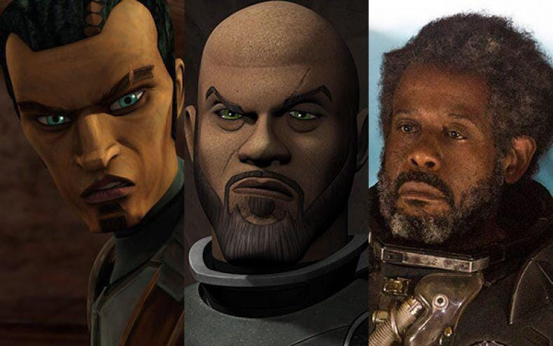
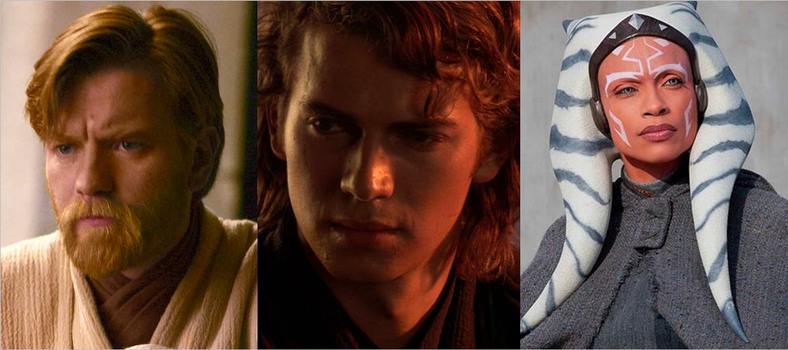
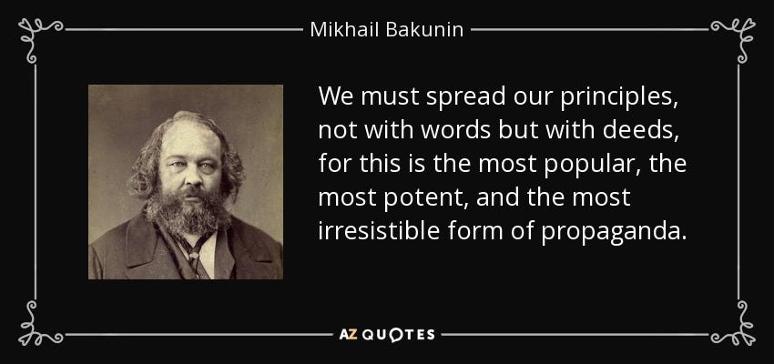
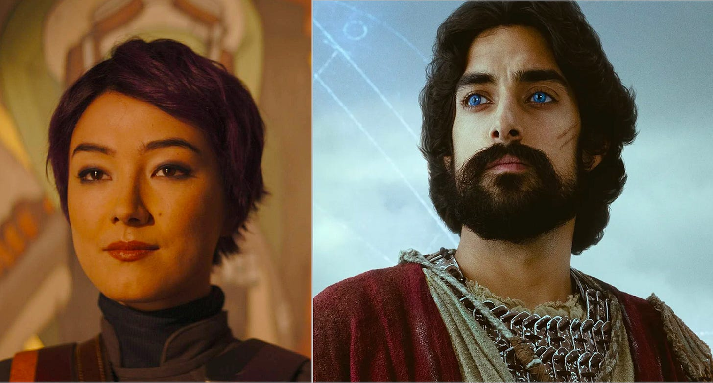
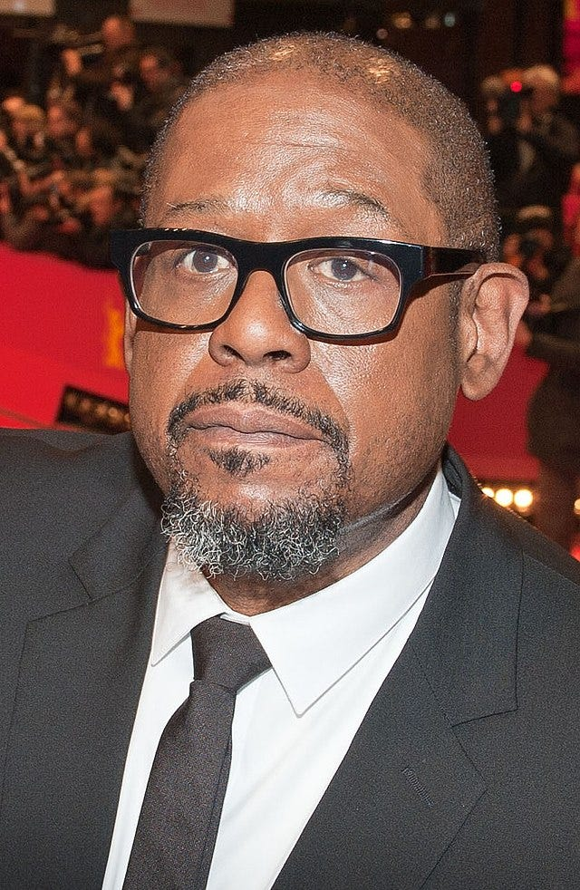

_You may wish to read[the first](https://peacefulrevolutionary.substack.com/p/star-wars-radical-origins), [second](https://peacefulrevolutionary.substack.com/p/andors-political-inspiration), [third](https://peacefulrevolutionary.substack.com/p/nemiks-anarchist-manifesto) and [fourth article](https://peacefulrevolutionary.substack.com/p/the-origins-of-nemiks-manifesto) in this series if you have not already._

Although Cassian Andor is called an Anarchist in the ‘Rogue One Visual Guide’, only one character has actually been called that on screen, and that is the rebel Saw Gerrera. Gerrara is a resistance fighter who will stop at almost nothing to make the galaxy free again, even if sometimes his methods come at a high human cost. He appeared previously in the movie Rogue One, but was originally introduced as a character in the animated series The Clone Wars.1 Returning to live action drama in the eighth episode of Andor, ‘Narkina 5’.2

In this episode revolutionary leader Luthen Rael, has come to see Gerera on the pirate planet of Segra Milo. We learn that Gerrera may have also been in the Aldhani Heist that Cassian was involved in (although he refuses to confirm this or deny it). Yet he expresses he is reluctant to help with Luthen’s plans, as he is unwilling to be a mercenary or risk his men for someone else. Something, which makes Luthen question Gerrera’s commitment:

>  _Gerrera:_ ‘What are you, Luthen? I’ve never really known. What are you?’
> 
>  _Luthen:_ ‘I’m a coward. I’m a man who’s terrified the Empire’s power will grow beyond the point where we can do anything to stop it. I’m the one who says, “We’ll die with nothing if we don’t put aside our petty differences.”’
> 
>  _Gerrera:_ ‘Petty? I am the only one with clarity of purpose.’
> 
>  _Luthen:_ ‘Well anarchy is a seductive concept. A bit of a luxury I’d argue to a man who is hiding in cold caves, and begging for spare parts.’

Gerrera doesn’t correct Luthen we he is called an Anarchist. He doesn’t want a state or rulers. The Anarchy Luthen is speaking of here isn’t chaos, although the word anarchy has come to be associated with disorder and mayhem. Chaos isn’t a concept by itself, it is the lack of one. Chaos has no seductive principles, because it has no principles at all. Whereas Anarchy is a political philosophy

Anarchy is the situation when hierarchy doesn’t exist, where there is no nation state or other kind of ruler, not even elected ones. Anarchism is the belief that individuals and society are better off being able to make their own decisions about themselves without hierarchy, that hierarchy is not only unnecessary for organising and meeting people's needs, but that people ruling over and having power over others (the state) is fundamentally wrong, as are any special societal privileges (due to age, class, gender, wealth, race, or religion), that any such hierarchies are dangerous because they require violent force (police and prison) to maintain, and that anyone living under a hierarchical system (including capitalism) is oppressed to some extent and not entirely free.3

But Gerrera didn’t begin life as an Anarchist. He was born on the jungle planet Onderon during the last years of the Galactic Republic, and greatly respected the monarch, King Ramsis Dendup. But when the benevolent king was overthrown and another installed in his place, Gerrera lost faith not just in the concept of the monarchy, but ultimately in rulers altogether.

Saw rebelled against the puppet ruler over his planet and the forces that had installed him who were spreading their power throughout the galaxy, and became the de facto leader of the Onderon rebels during the Clone Wars. Yoda promised Gerrera help in his fight, and - although they could not be seen to publicly be siding with Gerrera - Anakin Skywalker, Ahsoka Tano, and Obi-Wan Kenobi aided his troops with training and other support, and ultimately joined him in the battle.4

Here it is worth pointing out that Anarchism isn’t necessarily against the concept of leaders like Gerera, if by leaders you mean someone who by experience and skill can safely show the way forward, and can rally and inspire others with their enthusiasm for the cause. It is only when such people claim the right to make decisions for others, or expect special treatment that this strays into the territory of hierarchy. Early humans (and some tribal ones that have existed to the present day) have had honorary chiefs who have been respected for their wisdom, but don’t have any special wealth or power. Likewise some pirates followed a captain in the moment of battle, but were free to collectively decide to replace him when safe on shore.5

After the Republic became the Galactic Empire, Saw Gerrera's militia was labelled as rebels. Seeing the Empire as a threat to everything they had fought for, Gerrera and his militia started resisting the Imperial powers, and - despite some losses and setbacks - he rallied his partisans:

> ‘These have been hard years. We've lost comrades, friends, family...to the Empire. Dark times. And yet the fire still burns. Hope still burns. The Jedi are not yet lost. We are not yet lost. Kashyyyk is not yet lost! For the cause!’6

## Rogue One

Which brings us to the events leading up to ‘Rogue One’: After her mother was killed and her father Galen was taken to work on the Death Star, Gerrera sought to protect a young Jyn Erso, rescuing her and bringing her to his outpost on the planet Wrea. As Jyn grew older and Saw became increasingly paranoid over time, he feared she would eventually be recognized as the daughter of an Imperial collaborator and exploited to be used as leverage against her father Galen. He was constantly worried about others finding out who Jyn really was, so when she turned sixteen, he abandoned her in a bunker with only a knife and blaster, telling her to wait until morning before he disappeared. He justified this decision to himself and later to Jyn by saying she was already one of his best soldiers and could survive on her own. But to Jyn, at the time it felt like a betrayal that left her disillusioned with Saw and the rebellion itself.

It was not long after this that the meeting with Luthen Rael we began with took place. But over a month later, Gerrera changed his mind and met with Rael again, agreeing to join in the attack on the Spellhaus power station, which is crucial to supplying energy to Imperial facilities.7 However, he insisted on providing air support only, without taking tactical orders from Anto Kreegyr, who was leading the attack. With the attack just a day away, Rael said it was too late, the situation had changed as the Imperial Security Bureau had learned about the plan and would be waiting for the rebels at Spellhaus. However, Luthen did not want the Empire to know they had an Imperial spy, and was prepared to let Kreegyr’s men continue the attack and die to keep the secret. Luthen left the decision about whether to warn Kreegyr up to Gerrera, but advised that in doing so they’d lose valuable intel, and Gerrera ended up going along with Luthen’s plan, agreeing that it is, ‘For the greater good.’:

> ‘Call it what you will.’
> 
> ‘Let's call it…war.’
> 
> ―Saw Gerrera and Luthen Rael

## Mon Mothma

Gerrera was not one to wait around to get involved when he felt he had a chance to make a strike at the Empire. In ‘Star Wars Rebels’ Season 4, Episodes 3 to 4 (‘In the Name of the Rebellion’) the Rebellion is considering tapping into an Imperial relay to gather crucial information about their plans, and Mon Mothma, the leader of the Rebel Alliance who also features in the Andor series, urges a cautious approach. However, Saw showed up and called them cowards for not doing what it took to win. After Mon Mothma cut him off, Saw planned to destroy the relay himself. Mothma, however, was not impressed with his tactics, even when he achieved his aims and the rebellion benefitted from them:

>  _Gerrera:_ ‘If you continue to allow this war to be fought on the Empire's terms, not yours, you are going to lose.’
> 
>  _Mothma:_ ‘I will not be lectured on military strategy by a man who has proven himself a criminal.’
> 
>  _Gerrera:_ ‘The Empire considers both of us criminals. At least I act like one.’
> 
>  _Mothma:_ ‘You target civilians! Kill those who surrender! Break every rule of engagement! If we degrade ourselves to the Empire's level, what will we become?’
> 
>  _Gerrera:_ ‘There she is! That's the leader the Rebellion needs! Where is that fire? That passion when your people need it most? I hope, Senator, after you've lost, and the Empire reigns over the galaxy unopposed, you will find some comfort in the knowledge that you fought according to the rules.’8

Later, the now bald-headed Gerrera orchestrated a bomb attack on Moff Quarsh Panaka's residence, successfully killing the Moff, who was said to be one of the Emperor's most loyal servants. The bombing narrowly missed taking out Princess Leia Organa of Alderaan as well, and further alienating him from some of his rebel allies.9

His campaigns against the Empire becoming increasingly brutal, the Alliance High Command censured Gerrera at Mon Mothma's urging and cut all official ties with the Partisans. By then, Gerrera had lost his right leg, struggling with a basic cybernetic replacement. His lungs were also damaged, confining him to an armoured suit with a breath mask for supplemental oxygen.

> ‘We are not insurgents. We are partisans. We are a rebellion. I bring battle-hardened fighters. I bring experienced tacticians. I bring pilots, a squadron of them. I bring the means with which to fight back. I am inviting you, both of you, to join me in this.’
> 
>  _―Saw Gerrera to Baze Malbus and Chirrut Îmwe_

## Propaganda Of The Deed

Most Anarchists do not take such a violent approach. So what kind of Anarchist was Saw Gerrera? We never hear about his hopes beyond the overthrow of the empire, perhaps because he felt that organising that future world would be left to other people during a time of peace he was trying to help make possible. But it seemed Saw Gerrera followed a form of ‘Propaganda Of The Deed’, a strategy where anarchists used dramatic acts of violence and terrorism to inspire further revolt among the masses for their cause, rather than just expressing ideas verbally. Gerera’s bombings were part of this pattern of deploying dramatic violence to spark insurgency against Imperial control aligns with this.

Proponents of insurrectionary anarchism in the late 19th and early 20th centuries embraced Propaganda Of The Deed tactics like bombings, assassinations and arson targeting the state and ruling class. One such revolutionary, Mikhail Bakunin, stated that ‘we must spread our principles, not with words but with deeds, for this is the most popular, the most potent, and the most irresistible form of propaganda.’10

These terrorist acts aimed to ignite a ‘spirit of revolt’ by showing the State and elite were not omnipotent, while also provoking escalating repression that could radicalise more people. Between 1881 and 1913 eleven Presidents, Prime Ministers, and Kings were killed. Leading to Anarchists being rounded up and imprisoned, whether there was any suspicion that they were involved or not.11

However, such tactics were ultimately abandoned as ineffective and counter-productive. Yet Gerrera never seems to learn this lesson, if it is indeed appropriate for his situation.

## Sabrine Wren & Ezra Bridger

In the episode mentioned previously, Ezra Bridger and Sabine Wren - who later appear in the streaming show Ahsoka - are saved by Saw Gerrera during an ambush by Imperial forces. Saw invites them to join him in investigating an Imperial cargo ship. They discover the ship is transporting prisoners and Kyber crystals for the Empire's superweapons. Tensions rise when Ezra confronts Saw about his violent methods. Ezra argues for maintaining ethical standards, while Saw insists that extreme measures are necessary to win against the Empire. Despite their disagreement, they work together to escape the ship and save the prisoners, but although Gerrera argues he did what he had to in order to accomplish their mission, Ezra is not impressed by his methods:

> ‘I'm fighting for you and everyone else not to lose what they've got. And I won't apologise for how I do it.’
> 
> ‘Then you're no better than the Empire.’
> 
>  _―Saw Gerrera and Ezra Bridger_

And Gerrara has been compared with Darth Vader, including by the actor who played Gerrera himself, not just because of breathing difficulties and mask but also for extremeness.12 Perhaps such evil needed a counterpart on the other side of the political spectrum, to fight dirty against the Empire’s fascism, and it couldn’t find someone more committed than Saw Gerrera.

## Forest Whitaker

Gerrera is played by Academy-award winning actor Forest Whitaker. Whitaker is no stranger to playing divisive characters, he won his Best Actor award for his portrayal of Ugandan dictator Idi Amin, in 2006’s The Last King of Scotland, and also portrayed anti-apartheid campaigner Archbishop Desmond Tutu in 2017's The Forgiven. Outside of acting he has co-founded the International Institute for Peace at Rutgers University, and was inducted as a UNESCO Goodwill Ambassador for Peace and Reconciliation. In 2009 he was given a chieftaincy title in Imo State, Nigeria where his ancestors were from before being sold into slavery.13

However, unlike Whitaker, Gerrera is less interested in peace - at least while the Empire still rules. Perhaps some clue to his behaviour is in his name itself. Saw Gerrera's name is a ‘mnemonic riff’ on the Argentine revolutionary Che Guevara who himself is a controversial figure even on the Left of the political spectrum.14 Although Guevara was not an Anarchist, like Andor and Gerrera he was an insurrectionist, and insurrectionism itself began as an Anarchist strategy for overthrowing oppressive states, and proved to be an effective strategy in the Cuban revolution, if not always so elsewhere.15

In the next article we will return to Gerrera and Luthen Rael, and where Gerrera’s methods ultimately lead him.16

 _Read[the next article in this series](https://peacefulrevolutionary.substack.com/p/radical-star-wars-conclusions)._

Subscribe

[Share](https://peacefulrevolutionary.substack.com/p/saw-gerrera?utm_source=substack&utm_medium=email&utm_content=share&action=share)

1

The character of Saw Gerrera was voiced in the animated Star Wars: The Clone Wars and Star Wars: The Bad Batch by Andrew Kishino, and in Star Wars Rebels and Star Wars Jedi: Fallen Order by Whitaker.

2

First broadcast 26th October 2022. It was written by Beau Willimon, who was the showrunner for the series, ‘House Of Cards’, a very political show in its own right, and screenwriter for the 2018 film, ‘Mary Queen of Scots’. 

3

This is my own definition, but it is similar to others. My favourite one is given by Peter Kropotkin, in the 1910 edition of The Encyclopaedia Britannica: ‘Anarchism (from the Gr. ἀν, and ἀϱχἠ, contrary to authority), the name given to a principle or theory of life and conduct under which society is conceived without government – harmony in such a society being obtained, not by submission to law, or by obedience to any authority, but by free agreements concluded between the various groups, territorial and professional, freely constituted for the sake of production and consumption, as also for the satisfaction of the infinite variety of needs and aspirations of a civilised being. In a society developed on these lines, the voluntary associations which already now begin to cover all the fields of human activity would take a still greater extension so as to substitute themselves for the state in all its functions. They would represent an interwoven network, composed of an infinite variety of groups and federations of all sizes and degrees, local, regional, national and international – temporary or more or less permanent – for all possible purposes: production, consumption and exchange, communications, sanitary arrangements, education, mutual protection, defence of the territory, and so on; and, on the other side, for the satisfaction of an ever-increasing number of scientific, artistic, literary and sociable needs.’

4

https://starwars.fandom.com/wiki/Saw_Gerrera

5

Tolkien, who considered himself an Anarchist, imagined Aragorn to be this kind of symbolic figurehead, with no real political power, but an inspiring leader in times of war. He believed that, ‘the most improper job of any man … is bossing other men… Not one in a million is fit for it, and least of all those who seek the opportunity. … My political opinions lean more and more to Anarchy (philosophically understood, meaning the abolition of control not whiskered men with bombs)—or to ‘unconstitutional’ Monarchy.’ Letter to Christopher Tolkien, 1943.

6

Star Wars Jedi: Fallen Order, 2019.

7

Andor, episode 11, ‘Daughter Of Ferrix’, first broadcast 16th November 2022

8

Star Wars: Rebels (TV Series), In the Name of the Rebellion: Part 1 (2017)

9

Star Wars: Princess Leia #2 comic.

10

‘Letters to a Frenchman on the Present Crisis’ (1870) 

11

1881 - Tsar Alexander II of Russia  
1894 - President Sadi_Carnot of France  
1897 - Prime Minister Antonio Cánovas del Castillo of Spanish   
1898 - Empress Elisabeth of Austria-Hungary  
1900 - King Umberto of Italy  
1901 - President William McKinley of The U.S.  
\- King Carlos I of Portugal  
1911 - Prime minister Pyotr Stolypin of Russia  
1912 - Prime Minister José Canalejas of Spain  
1913 - President Manuel Enrique Araujo of El Salvador  
\- King George I of Greece 

12

https://ew.com/article/2016/08/11/rogue-one-forest-whitaker-saw-gerrera/

13

https://en.wikipedia.org/wiki/Forest_Whitaker

14

Revealed in The Art of Rogue One: A Star Wars Story

15

https://en.wikipedia.org/wiki/Insurrectionary_anarchism

16

The first draft of this section was around 1000 words, and was part of the previous article. It has now grown to about 4000 words, as I discovered more interesting aspects of the Saw Gerrera character, and so I’ve had to split it into two so it doesn’t exceed email subscriber size limits.
