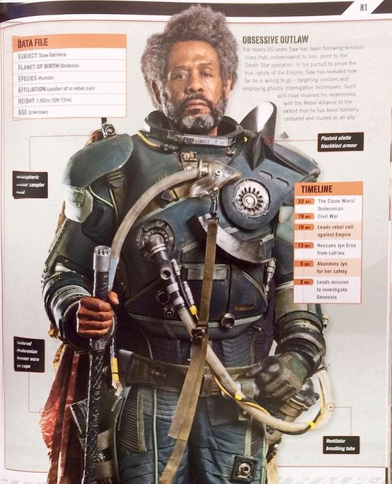
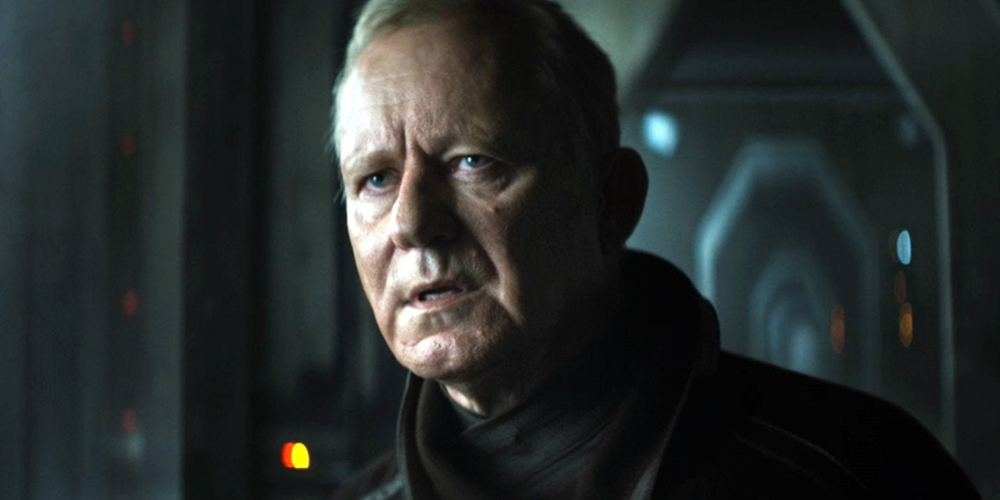
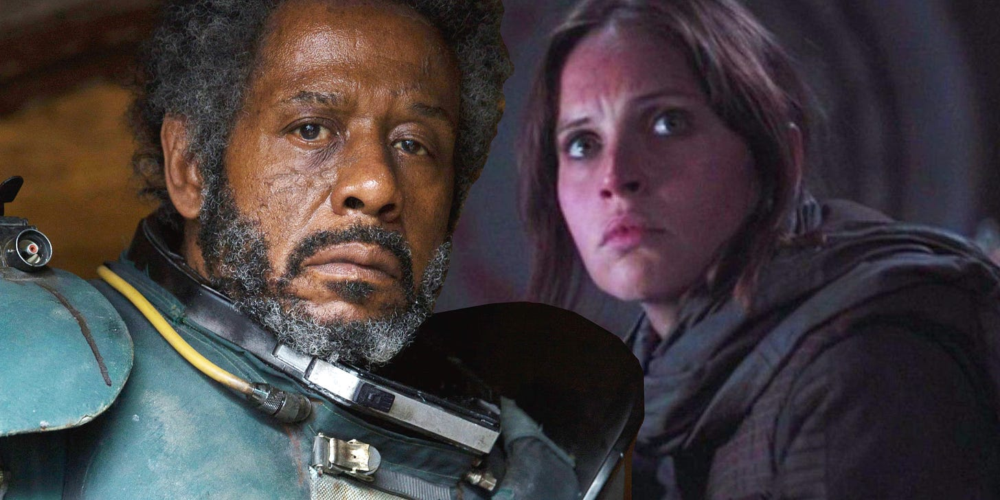
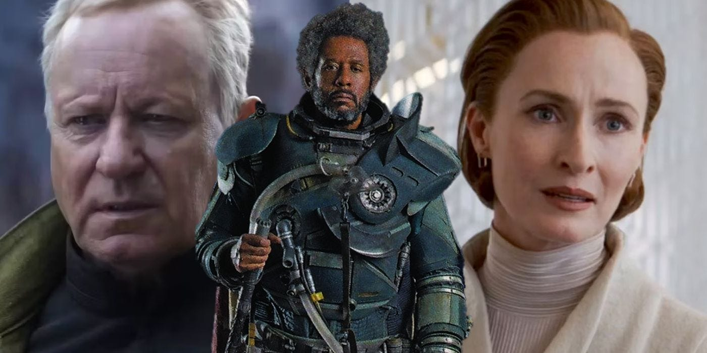

_You may wish to read[the first](https://peacefulrevolutionary.substack.com/p/star-wars-radical-origins), [second](https://peacefulrevolutionary.substack.com/p/andors-political-inspiration), [third](https://peacefulrevolutionary.substack.com/p/nemiks-anarchist-manifesto), [fourth](https://peacefulrevolutionary.substack.com/p/the-origins-of-nemiks-manifesto) and [fifth article](https://peacefulrevolutionary.substack.com/p/saw-gerrera) in this series if you have not already._

## Means Vs Ends

No character in the Star Wars universe ever seems to question the good intentions of Saw Gerrera (at least not on the rebel side). They agree that his end goal of being free from the Empire is a worthy one. Where he becomes a controversial character is in how far he will go – what means he will use – to achieve these ends.

Among the other rebels – whose methods are less extreme – the question is whether Gerrera is a necessary evil, or if he does more harm than good. Something which even some of those whose lives he’s saved wonder about. He is part of the story of so many major characters, but often finds himself out of favour with those fighting to overthrow the Empire like him.

As to why he is so extreme, Forest Whitaker, the actor who plays Gerrera gives us some of his own insight into the character:

> ‘He understands that the universe could be destroyed and worlds could be destroyed if he doesn’t succeed. And he’s one of the only people who will do everything to make sure the Imperial forces don’t. He’s talking about how you maybe make compromises that may harm people, or may harm the situation, or people may question it, but if you’re doing it for the good, there’s a positive thing about that. But what does it make you become? And how do you change as a person?’1

To Anarchists the _means_ of revolutionary acts must be in harmony with the _ends_. Otherwise those who carry out revolution will become as evil as the evil Empire they hope to overthrow, and the extremes they go to will end up being justified to maintain the power they regain. This was one of the reasons Mikhail Bakunin opposed Marxism, as he accurately foresaw what it would lead to.2 There must be a moral high ground to stand on and stay, without resorting to the immortality of the oppressors, as Malesta wrote:

> ‘The end justifies the means. This saying has been much abused; yet it is in fact the universal guide to conduct. It would, however, be better to say: every end needs its means. Since morality must be sought in the aims, the means is determined.’3

The _how_ it is achieved is as - if not more - important than _what_ is achieved. This separates Anarchism from Leninism, in which it seems almost any means may be used in order to one day eventually achieve the ideal ends.

Having said this, most Anarchists are not pacifists, and they believe in the right of self-defence, and in what might be called defensive violence. That the unjustly imprisoned have a right to break free of their bars and chains, that those who have been stolen from - whether it is from their pockets, home or wages - have a right to get back what is rightfully theirs, and those who are being deprived of freedom have a right to fight to obtain it. 

So the question becomes of how much fire it is appropriate to use against the fire being used against you. At what point do you just spread the flames, or put them out. To Gerrera – who has personally seen more injustice, persecution, cruelty and death than most – almost nothing is too extreme if it is effective in putting out the raging, spreading fire of the Empire.

## Luthen Rael

The question of what and who and how you become when you go to such lengths is one that another revolutionary leader, Luthen Rael, also struggled with. He saw Gerrera as a useful tool, but an unpredictable one, a rough hammer to bludgeon with, when that was the only kind that might work. Yet Luthen felt in using such people and encouraging such acts that he was too becoming compromised, and losing the higher ground he sought to stand on

In episode 10 of Andor, Luthen meets with his informant, who expresses his fear and disillusionment with the dangerous double life he is leading. He wants to leave his position as a spy, but Luthen insists that he stay because of the critical intelligence he provides to the Rebellion, revealing the personal sacrifices he has made for the cause:

> ‘Calm. Kindness. Kinship. Love. I’ve given up all chance at inner peace. I’ve made my mind a sunless space. I share my dreams with ghosts. I wake up every day to an equation I wrote 15 years ago from which there’s only one conclusion, I’m damned for what I do. My anger, my ego, my unwillingness to yield, my eagerness to fight, they’ve set me on a path from which there is no escape. I yearned to be a saviour against injustice without contemplating the cost and by the time I looked down there was no longer any ground beneath my feet. What is my sacrifice? I’m condemned to use the tools of my enemy to defeat them. I burn my decency for someone else’s future. I burn my life to make a sunrise that I know I’ll never see. And the ego that started this fight will never have a mirror or an audience or the light of gratitude.’4

Was Luthen so different from Gerrera? He made decisions that included sending thirty innocent men to their deaths to maintain the secrecy of one Imperial spy, perhaps calculating that it would allow more lives to be saved later, but coming at a great cost for a possible outcome that might not happen. However, Luthen seems to maintain a better standing with the other rebel leaders, perhaps because he has a respectable side, and he doesn’t get his own hands as dirty. Although his actions and their consequences could be just as risky to himself and others. In answer to this, the showrunner, Tony Gilroy, gives us the insight that:

> ‘Well, he’s [Luthen’s] a chess player, man. He’s sacrificing a castle to protect his queen. So I don’t think the Kreegyr story is over yet. Luthen is in a very tough spot, and his position over the next five years is only going to get more complicated, because how do you build this network? Earlier on, he says that he’s been building it for 10 or 12 years, but all of a sudden, with Aldhani, they’re going loud. All of a sudden, they’re going to expose themselves. And in a classic political sense, he’s an accelerationist. He believes in the fact that you have to make it hurt really bad in order to bring people to change. Once you make that announcement [via the Aldhani heist], once you do that, you’re no longer in charge of the thing that you’ve put out there. So how do you juggle your paranoia? How do you maintain your secrecy? How do you go big and stay small and tight? How do you expand while expansion makes you more vulnerable?5

In the last article we spoke of Mon Mothmas repulsion toward Gerrera and her ultimately cutting him off. Yet, although she was initially hesitant to engage in a violent rebellion, through her interactions with Gerrera and Luthen she eventually came to the decision that active combat was necessary to overthrow the Empire. We do know though what ultimately happens to his character, Saw Gerrera, as shown in the film Rogue One. …

## Rogue One

We return to Saw after the arrival of a former Imperial cargo pilot, Bodhi Rook, who defects to the Rebel Alliance and makes his way to Gerrera’s base on Jedha. Bodhi carries a crucial message from Galen Erso, Jyn Erso's father, intended for the Rebellion. Galen trusts Saw to get the message to the right people. However, Saw, being distrustful, subjects Bodhi to interrogation to verify his story, leaving him incapacitated.

Knowing that Saw Gerrera is volatile, the Rebel Alliance leaders decide to send someone who has a personal connection to him: Jyn Erso, Galen Erso's daughter, who was once taken in and raised by Saw after her parents were taken by the Empire. Cassian Andor, a Rebel intelligence officer, is tasked with taking her to Gerrera to get this information (and to kill Jyn’s father if he finds him).

Upon reaching Jedha, Jyn and Cassian are captured by Gerrera's forces. Saw shows Jyn a holographic message from her father, Galen Erso, revealing the hidden flaw he has placed within the Death Star's design. Jyn laments how he had abandoned her at 16, leaving her disillusioned with his war:

> ‘The last time I saw you, you gave me a knife and a loaded blaster and told me to wait in a bunker 'till daylight.’
> 
> ‘I knew you were safe.’
> 
> ‘You left me behind.’
> 
> ‘You were already the best soldier in my cadre.’
> 
> ‘I was sixteen.’
> 
> ‘I was protecting you!’

―Jyn Erso and Saw Gerrera6

However, as they speak, in an effort to demonstrate the power of the Death Star and eliminate Saw Gerrera’s insurgency, Grand Moff Tarkin decides to test the Death Star's superlaser on Jedha City.7 The low-power shot from the Death Star obliterates Jedha City and causes a massive shockwave. Realising the danger, Saw releases Jyn, Cassian, and the other prisoners, urging Jyn to save the Rebellion with her father's message. But Gerrera refuses to run, staying in the Catacombs as the blast consumes him after removing his breath mask. Up until the end, he retained his belief in the revolution and hoped others would too, that they would see the day it succeeded, even though he didn’t. His final act expressed his commitment to the cause over his own life:

> ‘Save the Rebellion! Save the dream!’
> 
> ―Saw Gerrera, to Jyn Erso, as Jedha is ripped apart

## Rebels And Dreamers

Although Gerrera dies, his followers who escaped the destruction of Jedha carried on, although they changed the name of their group in tribute to his last words:

> ‘We call ourselves the Dreamers.’
> 
> ‘Dreamers? Azen said you were Saw Gerrera's partisans.’
> 
> ‘We can't be him. We're just following in his footsteps. We're keeping alive the Dream. Saw was the face, the voice, of our cause.’
> 
> ―Staven and Iden Versio8

Some may wonder whether in the final equation Gerrera did more harm than good, but without his mentorship of Jyn Erso would the Death Star plans have been found, and without those plans would Luke Skywalker have been able to bring down the Empire’s greatest weapon?

Mandelorian showrunner Dave Filoni considered Gerrera, ‘the original rebel. He is the first one in a long line of people that got trained by Jedi to fight for themselves; to save their planets during the Clone Wars. He's the beginning of what would eventually become the Rebel Alliance.’9

Thus this father of Rebel Alliance not only helps Anakin Skywalker, Ahsoka Tano, and Obi-Wan Kenobi, Sabine Wren, Ezra Bridger, but trained Jyn Erso, helped Luthien and Mon Mothma (even when she doesn’t want his help), and prepared the way for those who would come after to see his dream realised such as Luke Skywalker, Han Solo and Princess Leia (despite him almost accidentally killing her as a child).

## Conclusion

All of these articles are just my interpretations of the words of a fictional character created by a script writer. In the case of Cassian Andor and Jyn Erso they were writing about rebel martyrs, or in the case of Gerrera and Luthen, revolutionary leaders, or in the case of Karis Nemik an idealist who provides inspiration for revolutionary change. 

Gerrera was nothing like Karis Nemik in his personality or skills, or Cassian or Jyn for that matter, but they all shared the same goal: to overthrow the structures of power oppressing the people, which they each accomplished in their own way, even if it ultimately came at the cost of their lives.

However, whatever the intentions of the scriptwriters, words mean something and they come from somewhere. Words carry weight and meaning. They emerge from our cultures and histories, they are loaded with meaning and associations and concepts we've attached to them over time. While those connections are sometimes coincidental or misunderstood, words can also deliver intended messages to those attuned to them, to those who listen and understand

I can't be certain that the message I took from this fictional world were the ones that the writers intended, but I believe my conclusions fit into the context of the characters, their words and their actions, and that these are consistent with a way of looking at the world that rejects hierarchy and prioritises freedom, in a way that is unique to Anarchism. But I leave you to your own interpretation. Either way the stories Andor and Rogue One have given us have been a fascinating and entertaining story.

We don’t know what part Gerrera may play in Andor, Season 2, but Forest Whitaker has confirmed he will be returning to play the part again.10 It’s my hope that Andor Season 2 will continue to explore these ideas, as well as continue to tell a relatable human story, one which – the way the world is going right now – seems very relevant.

> There’s already so much politics in the show to begin with, and we’re trying to tell an adventure story, really. So adding strong alien characters means that all of a sudden, there’s a whole bunch of new issues that we have to deal with that I don’t really understand that well or I just couldn’t think of a way to bake them into what we’re doing. You’ll see more as we go along, … There is a more human-centric side of the story and the politics of it. There’s certainly no aliens working for the Empire, so that kind of tips it one way, automatically.11

  * Have I missed anything relevant out over this article series? Anything you would have liked to have seen expanded upon?

  * Would you want to see a similar series about Anarchy / Communism in Star Trek   
(Original Series / Next Generation / Strange New Worlds)?

 _I also wrote a relevant article on the Last Of Us TV show:_

Subscribe

[Share](https://peacefulrevolutionary.substack.com/p/radical-star-wars-conclusions?utm_source=substack&utm_medium=email&utm_content=share&action=share)

1

https://ew.com/article/2016/08/11/rogue-one-forest-whitaker-saw-gerrera/

2

‘The Marxists console themselves with the thought that this dictatorship [of proletariat] will be temporary and brief. According to them, this statist yoke, this dictatorship, is a transitional stage necessary to reach the total emancipation of the people: anarchy or freedom is the goal, the State or dictatorship, the means. So, in order to liberate the popular masses, one must begin by enslaving them. … To this we reply that no dictatorship can have any other end than to endure as long as possible.’ See https://theanarchistlibrary.org/library/daniel-guerin-bakunin-a-libertarian-communist-before-the-term-was-coined

3

Ends and Means’, Errico Malatesta, 1922. Thirty years earlier in 1892, Peter Kropotkin wrote, ‘If the coming revolution is to be Revolution is to be a Social Revolution, it will be distinguished from all former uprisings not only by its aim, but also by its methods. To attain a new end, new means are required.’ - Peter Kropotkin, ‘The Conquest Of Bread’, Chapter 5.

4

Andor, Episode 10, ‘One Way Out’, first broadcat 9th November 2022. Written by Beau Willimon. This episode earned him an Emmy Award nomination for Outstanding Writing for a Drama Series.

5

https://www.hollywoodreporter.com/tv/tv-features/andor-tony-gilroy-talks-luthen-rael-monologue-easter-eggs-1235258961/

6

Rogue One, 2016. Screenplay by Chris Weitz and Tony Gilroy.

7

Tarkin is portrayed by Peter Cushing in the original Star Wars movie (A New Hope), and digitally reproduced in Rogue One, with Guy Henry providing the physical and vocal performance

8

‘Star Wars Battlefront II: Inferno Squad’, 2017. A novel by Christie Golden.

9

The Original Rebel: Saw Gerrera Returns | Star Wars Rebels on the official Star Wars YouTube channel.

10

https://comicbook.com/starwars/news/forest-whitaker-confirms-saw-gerrera-return-in-andor-season-2/

11

https://www.hollywoodreporter.com/tv/tv-features/andor-tony-gilroy-talks-luthen-rael-monologue-easter-eggs-1235258961/
