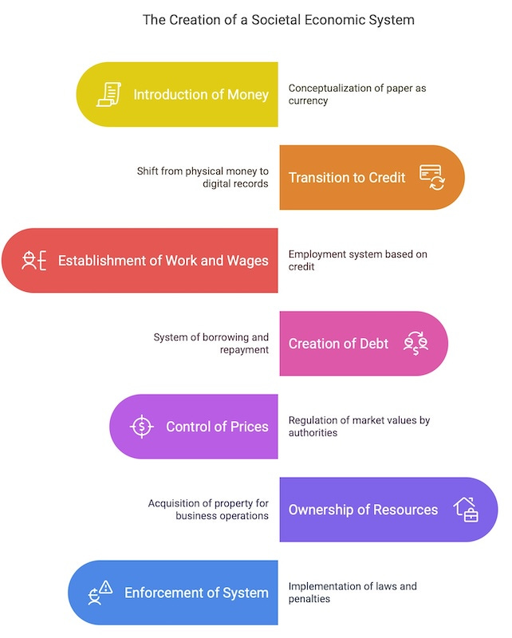
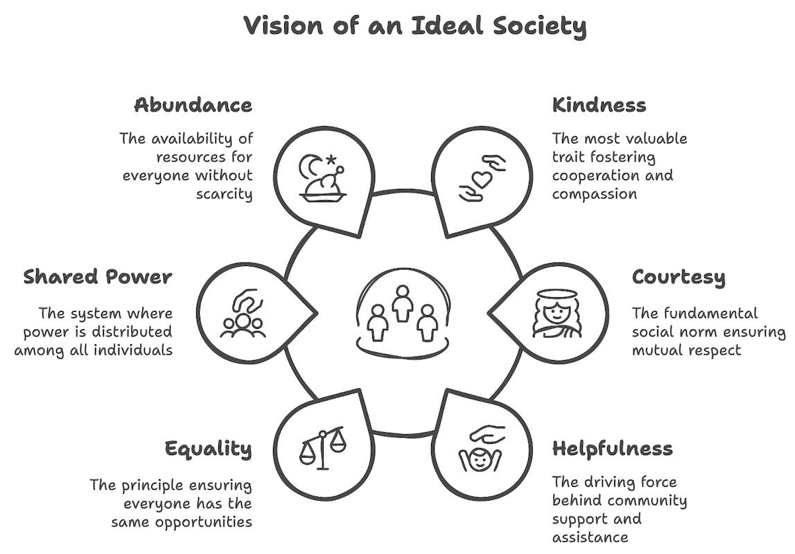

## Let’s play pretend

 _ **Economic Control**_

We'll pretend that pieces of paper have value and call it **money**.

Then we'll take the paper away and just record the amount of this made up concept and call it **credit**.

We'll make people work for these made up numbers to produce and use things that they could have had access to without these imaginary units of value. This we'll call **work** and **wages**.

Then when they don't have enough of this money, we'll give them some in return for them giving us back more (and working more to do so) and we'll call this process **debt**.

Of course we control the prices so we can determine how much people pay, which we will call doing **business**.

And we will own the places where people get things, which we'll call our **private property**.

Then before long nothing will be available without going through our pretend system. Not food or clothes or a place to live.

Some might try to rebel but there are ways we can enforce this fictional system. At first we'll threaten people's access to their pretend money with a new thing called **laws** and call what they have to pay when they break them **fines**.

 _ **Social Control**_

We won't use violence, not us personally. But if they don't comply we will offer pretend promissory notes to those who will threaten others on our behalf, and call them **police**. 

If they don't fall in line we'll stop them taking part in our new imaginary system altogether and put them in a place called **prison**.

If others overseas oppose or undermine us, or they have something we need, we will use what we’ll call our **military,** so we can conquer and steal from other regions, and stop others doing the same to us.

We'll fund this process through **taxes** \- some of which will be for bread or circuses to distract the masses, but also to direct more money to our friends through public-private partnerships and lucrative **contracts**.

 _ **Ideological Control**_

But most people will be pacified by our newly invented newspapers and television stations through which we can use a process called **propaganda** \- where we give them imaginary fears and stoke their desire for useless things to keep them distracted.

If there is any danger of a great number of them starting a revolution against us we'll pacify them by inventing a special group called **politicians** , who will say they act on their behalf.

We'll even eventually give them a pretend process called **democracy** , to let them think they are really making a choice, when we are really the one who pick the candidates and their policies.

To keep people from leaving to get away from such a system - to somewhere where it might be better - we'll mark out imaginary lines to keep people inside and others out, and call them **borders** , and our region a **nation**.

We'll tell them other nations are less civilised, that they are **foreigners** , that they are a threat to us, and call this **patriotism** when we do it, and **racism** when others do.

Even though in reality we share the same planet and are part of the same family, we are scared of what will happen if we don't have enough pretend money.

That all seems more like a nightmare, than a fun game of let's pretend. Just imagine if a few people gained enough power to make such a horrible story come true, and to even convince people that it's the only possible reality. 

If that really happened then we could begin to take back our power by envisioning what might be possible when we wake up from that nightmare.

## Let's pretend again

 _ **A Different Reality**_

Now imagine a world in which no-one pretends those harmful made up things are real.

A world without money where the most valuable thing is life and the most profitable is **kindness** , rather than selfishness and greed.

A world without debt - where you do not owe anyone anything except **courtesy** \- where nothing you need is owned by someone else who restricts its use, in order to make profit.

A world where you are not owned by anyone or anything yourself, nor do you rent yourself out to them for their benefit, so they can be rich while you stay poor.

Where you don't work out of the fear of starvation or homelessness, but out of a desire to be **helpful** and useful, rather than just to be free from financial insecurity.

A world without rulers, where no-one is born with special advantages. Where power is shared and distributed by everyone, where no-one has power over another, and everyone has all the power they need to do all they need to for themselves, so we can live authentically full and free lives.

A world without countries and borders, where there are languages and customs, but that can be experienced and **enjoy** ed by any and all who appreciate them. Where the human family isn't divided by artificial lines and colours, but all enjoy the world alike.

A world without the hoarding of excess property, where everyone has a home and food, because there is **enough** for all, more than enough, and no one is denied what they need to live, as is artificially the case now.

 _ **A True Story**_

Actually this isn't pretending at all. This is what is possible when we stop believing in the silly story a few people want us to believe to keep themself powerful, and we stop play pretend and going along with it.

It is what will happen when we take back our power from them, when we make our own choices rather than letting them make them for us.

Of course they'll oppose this if they can, but they're at best just 1% and we are the other 99%, and they can only win by continuing to convince us their made up story is the real one, and getting us to go along with it.

It doesn't take much imagination to see what might happen if we stop playing their game of let's pretend. The real magic isn't in maintaining their illusion - it's in our collective power to imagine and create something better. 

Their story only works because we accept it. Our story - one of genuine freedom, cooperation, and shared abundance - works because it's what happens naturally when we stop pretending.

The choice is simple: continue playing their game of make-believe, or start building the reality we've been pretending we can't have.

Subscribe

[Share](https://peacefulrevolutionary.substack.com/p/playing-pretend?utm_source=substack&utm_medium=email&utm_content=share&action=share)

 _Some of these concepts are also covered in the article A Better World Is Possible:_

 _Other concepts are also covered in the article Countries and Borders:_
