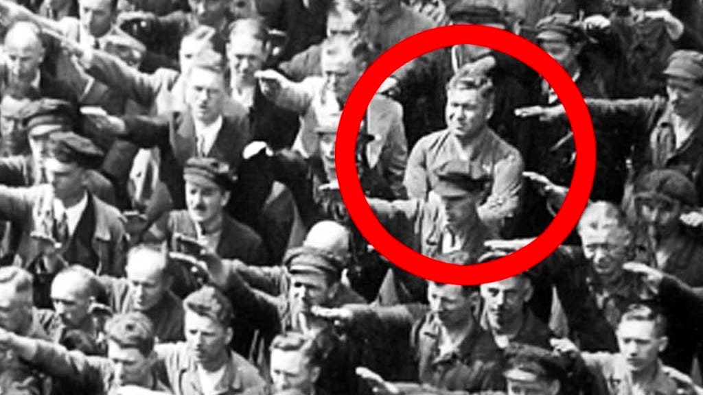
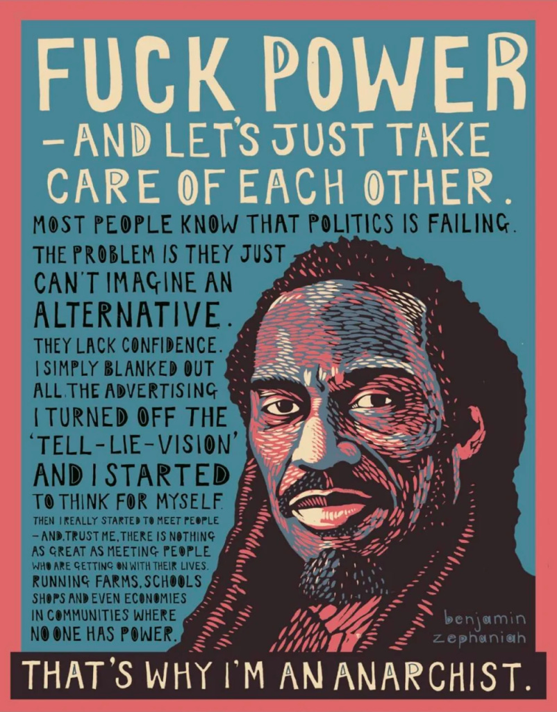

When I was working at Birmingham public library around 1994, the Afro-Caribbean poet Benjamin Zephaniah was there for a poetry event, and I was tasked with helping him get some of his work online, as I worked in the Internet Cafe. He was a lovely fellow, we chatted about a number of things for a few hours, and I remember how impressed I was with his thoughts. Years later, before he became a TV star on the show Peaky Blinders, I discovered more about his politics, and found that (by then) we shared a similar outlook on the world. I’d hoped to meet him again, but this week sadly he passed away.

It has me wondering that when my time on earth one day comes to a close what legacy will I leave behind, and how I’ll be remembered?

I edited [a book by another poet, Heathcoate Williams](https://peacefulrevolutionary.substack.com/p/the-anarchist-jesus), earlier this year for a local publisher. He was someone who spoke up for the environment and against injustice, and somehow became a TV and film actor too (even appearing on an episode of Friends). I’m not seeking the limelight, but I’d like it if my words somehow survived me. Yet I’d trade that to be well remembered by those I love, to know that I encouraged them to find happiness and to do good.

Looking back on my life I have regretted the times I didn’t speak up, being silent when I should have called out something wrong, and avoiding saying what I should have said when I had a chance to, or trying to avoid an argument when I should I have stood my ground.

Of course there are times a bad argument does more harm than good, and its not always easy to know in a moment what is right, but I fear I’ve erred more on the side of avoiding conflict when it would have been right to risk it. In my experience we tend to do what we plan to, if we focus on the fear of facing a difficult situation and prepare for avoiding a difficult outcome, we’ll do that to the expense of telling the truth and facing the consequences.

One of my favourite films is, This Land Is Mine, starring Charles Laughton as a meek teacher who avoids conflict, until one day the person he admires most is killed for raising his voice. He has everything to gain by staying silent, including perhaps the company of the woman he secretly loves, but he refuses to stay silent when put on the stand, and goes to his death because of it, but with the respect of that woman and his students.

As someone who sees in the wrong in the world too, I want to raise my voice, as quiet as it is in comparison to those which boom around me. I’m reminded of a famous photo in which one man is refusing to raise his arm to ‘heil Hitler’ when all around him are doing so. I hope we have the courage of that man’s convictions.

>  _Mourn not the dead that in the cool earth lie –  
>  Dust unto dust –  
> The calm, sweet earth that mothers all who die  
> As all men must; …_
> 
>  _But rather mourn the apathetic throng –  
>  The cowed and the meek –  
> Who see the world’s great anguish and its wrong  
> And dare not speak!_
> 
>  _ **Ralph Chaplin**_

That just about sums it up for me!

Subscribe

[Share](https://peacefulrevolutionary.substack.com/p/speaking-up?utm_source=substack&utm_medium=email&utm_content=share&action=share)
