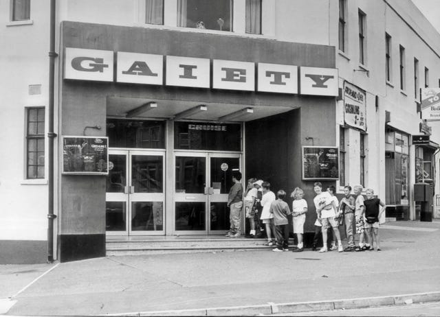

The Gaiety was a cinema in Knowle West, on the Wells Road in Bristol, England. It opened in 1933. When my grandparents went to the Gaiety it could seat 800 people, the walls had paintings of the landing of King Charles in Morocco, and it had a dance hall upstairs. It had begun to lose some of its sheen when my parents went there, and was run down the first time I went. But it was the closest cinema to us and it was cheap.

It had always been an independent cinema, and I was excited when a family decided to renovate and expand it in 1992. It felt nice and new and I enjoyed knowing my grandparents and parents went on dates there, as did I. I saw Army of Darkness with my friends there when it came out and a lot of other movies there that year.

It was local enough and some people went regularly enough that I’m sure the family that ran it knew some of their names. It was a part of the community, and was run for more love than money.

Then in 1994 The Showcase Cinema in Avonmeads, Brislington opened. It was part of a cinema chain and had 14 screens, and initially had very cheap ticket prices. The cost of going was so low that no other cinema could compete. But there was no real art on it’s walls, no dance halls. It was just a big box, selling overpriced popcorn.

The newly renovated Gaiety held on for about a year, but closed after getting just ten customers for ‘Four Weddings And A Funeral’. Other cinemas soon followed suit, and as soon as they were gone The Showcase of course greatly increased the prices of its tickets, with much less competition around.

There are flats (apartments) there now where the cinema once was (the building was demolished in 2000). All that is left of the cinema is a blue plaque which says, ‘On this site stood the Gaiety Cinema, the last family owned cinema in Bristol which showed films to an estimated eight million people.’ Thats all thats left of a place where people dreamed of other lives and other worlds, and laughed and cried together with their friends and family, and even fell in love in front of the silver screen.

Capitalism and greed killed the Gaiety. A company whose sole purpose was to make profit could afford to artificially lower their prices to kill the competition. They didn’t care what other jobs were lost, how far people would have to go to, or what history they were destroying. All they cared about was their profits. One day they will shut down when it isn’t making enough money, and no-one will put up a plaque, because it won’t be worth caring about.

I don’t believe that this the way the world should work. But back then I didn’t fully understand the powers and forces and systems in place that make and keep things like this happening. I’ve had a lot of time to think about it and ask questions and find answers about it since.

A few weeks ago I helped organised a meet-up where we put on the film, ‘La Belle Verte’, a funny French movie with a serious message about a better world, one without money, and how silly us humans are for centring our lives on something so imaginary. I made popcorn and brought some treats, and everyone had fun, and not a penny was charged for entry or snacks.

Subscribe

[Share](https://peacefulrevolutionary.substack.com/p/capitalism-killed-the-gaiety?utm_source=substack&utm_medium=email&utm_content=share&action=share)
