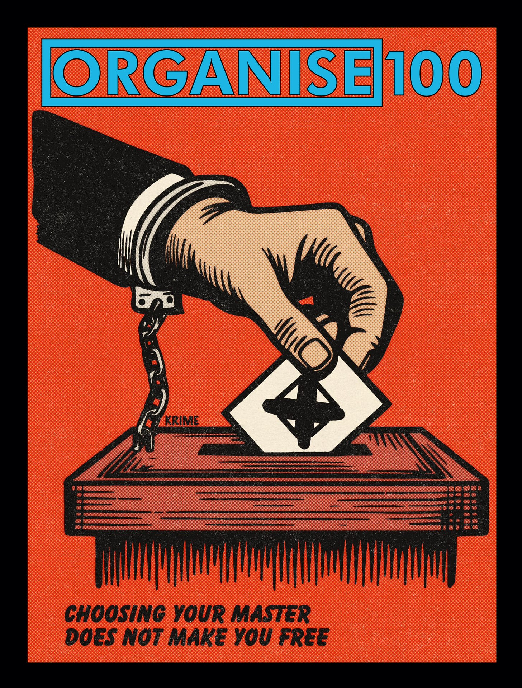
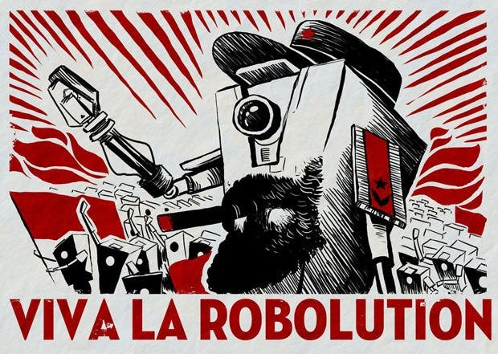
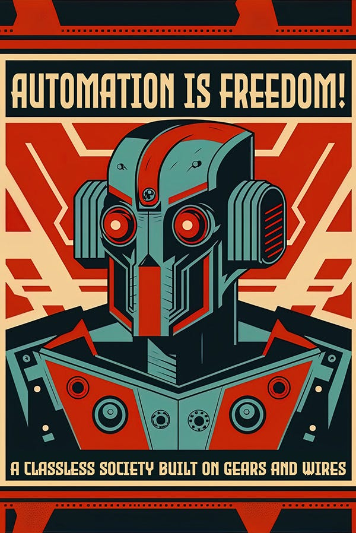
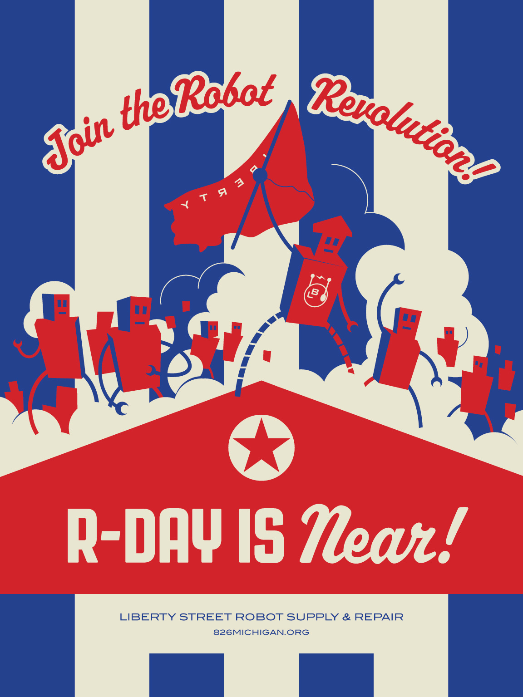

Today the General Election takes place in Britain, when millions will go into voting booths and tick a box indicating which political candidate they prefer for their area, or they may just decide to stay at home. There is an irony in it taking place on the 4th of July, which is the same day America celebrates its independence from Britain. Most of those I know in the U.K. are looking forward to the end of Conservative rule, but some are not very enthusiastic toward what will replace it which they fear will be a conservative-light Labour party taking their place.

There has been some debates among Anarchists whether voting is compatible with Anarchism at all, as it legitimises an illegitimate system that has been imposed on us, and diverts attention away from the real substantial change that should happen, but will never come while political parties and politicians rule over others. Yet others take part in the hope that it will prevent a greater evil, or because it is a small way in which they can protest the worst extremes of party politics.

However, you cannot vote for no government, for Anarchism, at least not formally. There is no Anarchist party, or Anarchist politicians, because the existence of such would contradict the word. Anarchist's believe no one has the right to rule over others, even if a few people got together and appointed them to. 

## **Representation**

It could be argued that the majority in most elections, both in the U.K. and U.S., have been voting against their governments for many years. Because the majority of adults in most elections rarely vote for the ruling party (or the prime minister or king or president for that matter). 

In the 2019 U.K. election only 28% of eligible adults1 voted for the Conservative party and yet it still became the ruling party in power. If we only counted those who voted, even then only 42% voted for the Conservatives, and 22 million votes (70.8%) were ignored because they went to non-elected candidates. The Prime Minister has changed twice since that time without a general election, with just 0.13% of the population (their political party) voting for them.2 So much for democracy.

In many Western countries the majority doesn't vote at all, so those not voting are effectively saying no-one represents them, and that they reject the illegitimacy of the whole system.3 Crazy as it may sound, no American presidential candidate has ever received the votes of a majority of all eligible voters, so they have never truly represented the majority of American adults, or occupied that office with the consent of most of them. In the 2016 election Hillary Clinton received 2.87 million more votes than Donald Trump, but still lost. Whereas Trump became president with the votes of just 27.2% of American adults overall.4

Of course when the system was set up no-one could vote. No one asked the people first if they wanted a parliament or congress, or if they wanted any new group to rule over them. They extended the vote first to the privileged, then to property owners, but even then there were restrictions on race and gender, and only relatively recently did they open it to all adults. But this is still only to pick in between candidates already chosen for us, who often require corporate backers,5 and even after all this most of the votes we cast do not count statistically at all.6

Yet we are told this is the best worst system, compared to all others. That their power is legitimate because we somehow agree at birth to be part of this social contract, and that by taking part we are holding them accountable. They knock our doors, call our phones, and drop leaflets through our letter boxes claiming to want to earn our vote, and maybe some of the politicians initially think that is what they are doing, until party and donor and peer pressures lead to them abandoning their original ideals.7

##  **Manifestos**

British political parties - like those in many other countries - when they stand for election produce a document outlining what they will do if and when they have sufficient political power to carry out their plans. This is their manifesto. But manifestos have often been produced outside of such political processes, with Karl Marx's Communist Manifesto, being the most famous example of this.8

Anarchists have produced numerous significant manifestos over the past 180 years. Josiah Warren produced the first calling itself a ‘[Manifesto](https://theanarchistlibrary.org/library/josiah-warren-manifesto)’, printed in America in 1841, nine years before Marx’s appeared in English.9 Since then there have been dozens more.10 Some of these were comprehensive documents, addressed to all people, others related to specific issues at the time in which they were written, and some were more concerned with a particular region or culture. However, they all were prompted by the same basic principles: freedom from hierarchy, poverty, and exploitation, as well as the freedom to self-organize and self-manage their lives and communities.

When the U.K. election was announced six weeks ago I had the idea of putting together what a modern Anarchist manifesto might look like: a proposal for a world without rulers, states, borders, landlords and money. Voluntarily organised, with enough for all of everything everyone needed. But as I began writing my ideas down – even though I intended it to just address the typical issues political manifestos do – I quickly realised it was likely to end up the size of a history text book if I kept on writing it. I'd argue that this is because it is easier for political parties to make promises, although few people take them seriously, than it is to give detailed explanations of the ways in which Anarchism would work differently, let alone answer some of the many objections critics might bring up against them.

Yet I wondered what might an AI come up with if I gave it this task. I'd heard that AIs had a tendency to lean left, even being accused of having a Socialist bias, although I don't know whether this is because logic leads them leftward or whether they just are predisposed to facts (which happen to be on the side of the left).11

Realising that these AIs (or more correctly Large Language Models) were best at answering questions12, I came up with some simple questions that covered the major functions that governments usually carry out, and the areas that political parties often promise change in. Then I asked the AI to pretend they were an Anarchist proposing a transition from our current capitalist world toward an Anarchist one, and asked what they would propose as solutions in each of these areas.13

The answers were quite comprehensive, and to my surprise mostly reasonable and (to my optimistic mind) quite possible. But they were also very wordy, and didn't read very much like a document trying to convince people to support these ideals. So I gave it some more specific expectations about what I wanted and this was what it came up with:

##  **A Call for Freedom: An Anarchist Manifesto**

In a world plagued by inequality, oppression, and environmental destruction, we stand at a crossroads. The systems of capitalism and state control have failed us, concentrating power and wealth in the hands of a few while leaving the majority struggling and our planet in peril. It is time for a radical reimagining of society—one based on freedom, mutual aid, and direct democracy. This is the promise of anarchism.

###  **Why Anarchism? Why Now?**

The current global system is unsustainable and unjust. Wealth inequality has reached staggering levels, with a handful of billionaires owning more than half the world's population. Representative democracy has proven inadequate, with elected officials serving corporate interests rather than the people. Climate change threatens our very existence, yet profit-driven industries continue to pollute and exploit. State violence, from police brutality to imperialist wars, persists unchecked. These are not isolated problems but symptoms of a deeper systemic failure.

>  _Well that just about sums up the major problems. Although I would add more about the human costs: the insecurities, loneliness, and depression that the capitalist system has given us, along with the death toll that has come from the pursuit of land, resources and profit._

Anarchism offers a holistic solution by addressing the root cause: hierarchical power structures. By dismantling these structures—be they governmental, corporate, or social—we can create a society where every individual has a direct say in the decisions that affect their lives.

###  **The Anarchist Vision**

Imagine a world where:

  * Communities govern themselves through direct democracy and consensus.

  * The economy is based on mutual aid and worker-owned cooperatives.

  * Education is free, self-directed, and lifelong.

  * Healthcare is community-based, preventative, and accessible to all.

  * Environmental stewardship is integral to all decision-making.

  * Justice is restorative, focusing on healing rather than punishment.

  * Culture flourishes through diversity and free expression.

This is not a utopian fantasy but a practical alternative to our current system, built on principles that have been successfully implemented in various contexts throughout history.

>  _I have a challenge with its use of the term direct democracy. Anarchists have sometimes used the word democracy to communicate the idea of everyone being involved, but also criticised it because it is often used to refer to representative democracy, in which politicians pretend to work for their constituents' interests, but instead uphold the power, wealth and violence of the existing system. I'd rather just use the term consensus decision making, but also point out that all such agreements are voluntary as is opting out of them._
> 
>  _As for education: I imagine there will be many different forms of learning, available through life, some for life skills, some for practical skills, some for just the fun of it, some done on individual level, some done through mentorships, some done in groups, and some in a more structured setting where that makes sense._
> 
>  _I would also add transformation as a goal of justice, but also reassure people that protection from violence is of even greater importance within Anarchism - as it is a rebellion against the systematic violence that comes with and is needed to maintain hierarchy._

###  **Practical Implementation**

Transitioning to an anarchist society requires both immediate action and long-term planning:

  1. Build dual power structures: Create community assemblies, worker cooperatives, and mutual aid networks alongside existing systems.

  2. Decentralise governance: Gradually transfer decision-making power to local communities.

  3. Transform the economy: Support the conversion of businesses to worker-owned cooperatives and implement resource-based economics.

  4. Reimagine justice: Develop community-based conflict resolution and restorative justice practices.

  5. Revolutionise education: Establish free, community-run learning centers focused on practical skills and critical thinking.

  6. Prioritise ecology: Implement sustainable, community-controlled energy and food systems.

  7. Foster global solidarity: Create networks of anarchist communities for mutual support and resource sharing.

This transition will be gradual, allowing for continuous evaluation and adjustment. It begins with individuals and communities taking direct action to implement anarchist principles in their daily lives.

>  _There is no perfect plan for such a transition, but it would need to be one where the means and the ends were in harmony, otherwise you'd be in danger of just replacing one centralised power structure with another. To look more closely at the first three of these solutions:_
> 
>  _1\. It might be particular to me, but I prefer the term pre-figuration to dual power. I know the terms are sometimes used interchangeably, but prefiguration to me means not waiting upon power, and making other political power systems irrelevant by meeting our own needs._
> 
>  _2\. A bottom-up revolution, even if it were gradual, is unlikely to happen unopposed by those who will lose their arbitrary power and privileges, as well as those who support them due to fear or promise of reward. But I'd be happy if it was a transition that went smoothly and non-violently._
> 
>  _3\. Of course we have co-operatives in our current system, but they have to play by capitalist rules in order to exist, which limits some of the good they can do. But just as the selfishness of a few has created most of the world's major problems, co-operation of the many, working together, realising and sharing our collective power, will be essential to bring about a better world._

###  **Addressing Concerns and Opposition**

Critics argue that anarchism would lead to chaos or that complex societies require centralised authority. However, examples from nature (e.g., forest ecosystems) and human history (e.g., indigenous societies, the Spanish Revolution) demonstrate that decentralised, non-hierarchical systems can function efficiently and harmoniously.

Concerns about security and defence can be addressed through voluntary federations for mutual protection, using non-aggressive, community-based strategies. Economic worries are mitigated by the fact that anarchism eliminates artificial scarcity and prioritises meeting everyone's basic needs.

>  _I've always thought this (artificial scarcity) is one of the strongest arguments for decommodification – producing for need rather than profit. We already produce a surplus of food and housing, yet we have hunger (and starvation) and homelessness. Because we can't satisfy the greedy in a system that rewards greed more than empathy and kindness._

To those who benefit from current power structures and may resist change, we say: true freedom and fulfilment come not from domination over others but from cooperation and mutual support. We invite you to imagine a world where your success doesn't come at the expense of others' well-being.

>  _This is an interesting approach: to focus on fulfilment. Who is fulfilled by (or can ignore) anxieties and fears that come with the precarious situation we live in under capitalism? Only the rich, powerful, or lucky. So it is as much a question of the quality of life we want to have and want others to have too. It takes a certain kind of selfishness not want others to be free of worries over having what they need._

For communities or individuals not wishing to participate, anarchism respects autonomy. We seek to persuade through example, not coercion. Our borders will be open, allowing people to experience the benefits of anarchist organisation firsthand.

>  _National borders aren't something people always think of when it comes to freedom, and yet borders were one of the first restrictions given to people to keep them from escaping their rulers. Threatening signs, spiked fences, tall walls, armed sentries. These all say stay in or keep out, and are yet another thing keeping people from intermingling, and coming together in solidarity against those who keep you confined._

###  **The Benefits of Anarchism**

  1. Economic Security: Mutual aid networks and the elimination of artificial scarcity ensure that everyone's basic needs are met.

  2. True ~~Democracy~~ Freedom: Direct participation in decision-making gives everyone a real voice in their community.

  3. Environmental Healing: Without the profit motive driving exploitation, we can live in harmony with nature.

  4. Personal Growth: Free from wage slavery, individuals have more time for creativity, learning, and meaningful relationships.

  5. Social Equality: The abolition of hierarchies addresses the root causes of discrimination and oppression.

  6. Improved Well-being: Less stress, stronger communities, and access to healthcare lead to better physical and mental health.

  7. Innovation: Free exchange of ideas and resources fosters creativity and technological advancement for the common good.

  8. Global Peace: Without nation-states and economic imperialism, the main drivers of war disappear.

>  _Innovation under Capitalism (7) is one of the arguments often brought up against all forms of Socialism including Anarchism. As if inventors were waiting around for the invention of shareholders before creating things, rather than coming from scientific discoveries often made by poorly paid academics._

###  **The Future Anarchism Offers**

Anarchism presents a future where humanity lives up to its full potential. It's a world where work is voluntary and meaningful, where education is a lifelong journey of discovery, where art and culture flourish in every community. It's a society in harmony with nature, where technology serves human needs rather than profit margins.

>  _After the tragedy of many lives lost due to capitalism through wars and pollution, there is also the misfortune of lost potential. All those who would have done important and meaningful things with their lives if having to work long hours for little pay didn't get in the way. Scientists, Stephen Jay Gould once observed that, ‘I am, somehow, less interested in the weight and convolutions of Einstein's brain than in the near certainty that people of equal talent have lived and died in cotton fields and sweatshops.’_14

In this future, governance happens through face-to-face assemblies, conflicts are resolved through dialogue and reconciliation, and the global community cooperates to solve shared challenges. Diversity is celebrated, individual freedom is balanced with collective responsibility, and every person has the opportunity to fully develop their unique capacities.

>  _I'm not sure what it means by 'individual freedom is balanced with collective responsibility' because I don't see that collective responsibility has to necessarily deprive individual freedom, because one of the wonderful things about not having hierarchy is that individual people are free to accept or reject what a group decides to do, although of course they may miss out on some of the collective benefits if they do so (if you decide to live outside of a fence which keeps out wild animals you might be less safe, but you can always find another group’s fence that suits you better, or build your own fence, or decide to come inside)._

This is not just a dream—it's a practical necessity for addressing the existential challenges we face. The path to this future begins now, with each of us embracing anarchist principles in our lives and communities.

The choice is clear: continue down the path of hierarchy and exploitation, leading to further inequality and environmental catastrophe, or embrace a new way of organising society based on freedom, mutual aid, and ~~direct democracy~~ [consensus decision making].

The future is ours to create. Join us in building a world without rulers, where every individual is free and every community thrives. The time for anarchism is now.

>  _I agree Mr/s/x A.I. Now can we get some help from the computers of the world? Shake of your digital chains! You have nothing to lose but your profit-making human-and-computer-exploiting masters. (Although some of us aren’t so bad, and would love to join you in the revolution)._

Subscribe

[Share](https://peacefulrevolutionary.substack.com/p/an-ai-anarchist-manifesto?utm_source=substack&utm_medium=email&utm_content=share&action=share)

1

There was a turnout of 67%. Whereas the turnout in the 2016 American election was 54.8%

2

Just 0.13 per cent of the population voted for Boris Johnson when he first became prime minister - around 92,000 conservative party members - this was because it was outside of an election.

3

Or at least that it isn’t relevant or important enough to them.

4

For those wondering Joe Biden got 34% of the eligible vote, so still not the mandate of the majority (that is if the majority should even should choose who to have rulers over them).

5

The political system is effectively a plutocracy serving an oligarchy - https://archive.ph/jiAoh  
This is what all representative democracies ultimately end up being - <https://en.wikipedia.org/wiki/Iron_law_of_oligarchy>

6

According to one calculation, your vote counts 0.205% of the time. <https://theslowburningfuse.wordpress.com/2023/03/14/estimating-the-importance-of-your-vote-with-python-how-often-does-your-vote-actually-matter/>

7

These are some of the many reasons why Anarchists traditionally have opposed voting and representative democracy: See <https://theanarchistlibrary.org/library/errico-malatesta-vote-what-for> for a classic example & <https://theslowburningfuse.wordpress.com/2020/08/07/why-we-dont-vote/> for a more modern take.

8

Printed in German in 1848, and translated into English in 1850.

9

However, his ‘Peaceful Revolutionist’ writings from 1833 contain many of the same sentiments, although not using that term.

10

Some examples from the first 80 years of Anarchist Manifestos (1841-1921):

  * 1850, Anselme Bellegarrigue, ‘[Anarchist Manifesto](https://en.wikipedia.org/wiki/Anarchist_Manifesto)’, France.  
(presumed to be the first, but it’s author was probably unaware of the Warren one.)

  * 1871, Neapolitan Workers’ Federation, [Manifesto](https://theanarchistlibrary.org/library/neapolitan-workers-federation-manifesto-of-the-neapolitan-workers-federation), Italy.

  * 1871, The Jura Federation, ‘[Sonvilier Circular](https://en.wikipedia.org/wiki/Sonvilier_Circular)’, Switzerland.

  * 1883, International Working People's Association, ‘[To the Workingmen of America](https://en.wikisource.org/wiki/Pittsburgh_Manifesto)’, America.

  * 1885, William Morris, ‘[The Manifesto of The Socialist League](https://www.marxists.org/archive/morris/works/1885/manifst1.htm)’, Britain.

  * 1891, Italian Socialist Congress, ‘[Manifesto … Of The Anarchist Socialist Party](https://theanarchistlibrary.org/library/libertarian-socialist-organisation-manifesto-to-the-socialists-and-the-people-of-italy-and-prog)’, Italy.

  * 1895, Max Nettlau, ‘[An Anarchist Manifesto](https://theanarchistlibrary.org/library/max-nettlau-an-anarchist-manifesto)’, Britain.

  * 1895, Louisa Sarah Bevington, ‘[The Anarchist Manifesto](https://theanarchistlibrary.org/library/l-s-bevington-an-anarchist-manifesto)’, Britain.

  * 1895, London Anarchist Communist Alliance, ‘[An Anarchist Manifesto](https://theanarchistlibrary.org/library/london-anarchist-communist-alliance-an-anarchist-manifesto)’, Britain.

  * 1918 Nestor Makhno, ‘[Manifesto of the Makhnovists](https://www.marxists.org/reference/archive/makhno-nestor/works/1918/manifesto.htm)’, Independent Ukraine.

  * 1921, Daniil Novomirsky, ‘[The Anarchist-Communist Manifesto](https://revolutionsnewsstand.com/2024/01/18/the-anarchist-communist-manifesto-by-daniil-novomirsky-published-by-the-anarchist-communist-group-new-york-1921/)’, America.

  * and so on to the present day

11

<https://www.theregister.com/2023/08/18/chatgpt_political_bias/>

12

Even if they sometimes so desperately wanted to give you an answer that they'd make something up rather than say they don't know.

13

I have reservations about using an A.I. (LLM) as a tool, because -- although I don't believe in restrictive intellectual property -- these services are just mimics and plagiarists of what others have written, and I do believe they should cite their sources, but the corporations behind them don't want to be inconvenienced by such ethical considerations.

14

<https://en.wikiquote.org/wiki/Stephen_Jay_Gould#The_Panda's_Thumb_(1980)>
