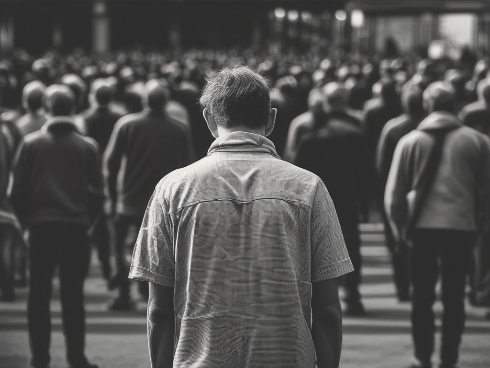

I’ve always regretted the times I didn’t speak up, the times I didn’t act, the times I didn’t stand out, and the times I didn’t go against the flow more than the times I stayed away from the fray.

 _On that subject here is a poem I wrote, to add to my silly verses pile:_

‘This has to change’ they said  
but Tommy had a plan  
he’d studied the theory  
he knew how this problem began

‘Does anyone know what to do?’  
the request went out  
but when they looked in the crowd  
Tommy was no longer about

‘Anyone here have any idea?’  
in unison people cried  
but Tommy had run away worried  
and the army came and people died

‘If only he’d answered’ they wondered  
what if Tommy had spoken  
maybe the people might’ve rallied  
the barriers might’ve been broken

‘What if we knew what to do?’  
if Tommy had shared his plan  
his hopes and ideas for a world  
a better future might be at hand

‘What if we had better ideas?’  
what if he’d taught what he knew  
maybe they’d each have fought by him  
and would’ve won the battle too

‘What is the answer?’ you ask  
does anyone know what it could be?  
cause we are all scared Tommies  
still needing to fight to be free

 _Note: I’m not saying we should all get behind one person, but that sometimes we could be the one person who could make a difference in a situation, even if it is to let others know we see and understand the same injustice they suffer too._

 _I’m not sure why I used the name Tommy, maybe because of its association with the common drafted soldier, who didn’t ask to be in a fight._

Subscribe

[Share](https://peacefulrevolutionary.substack.com/p/tommies?utm_source=substack&utm_medium=email&utm_content=share&action=share)
