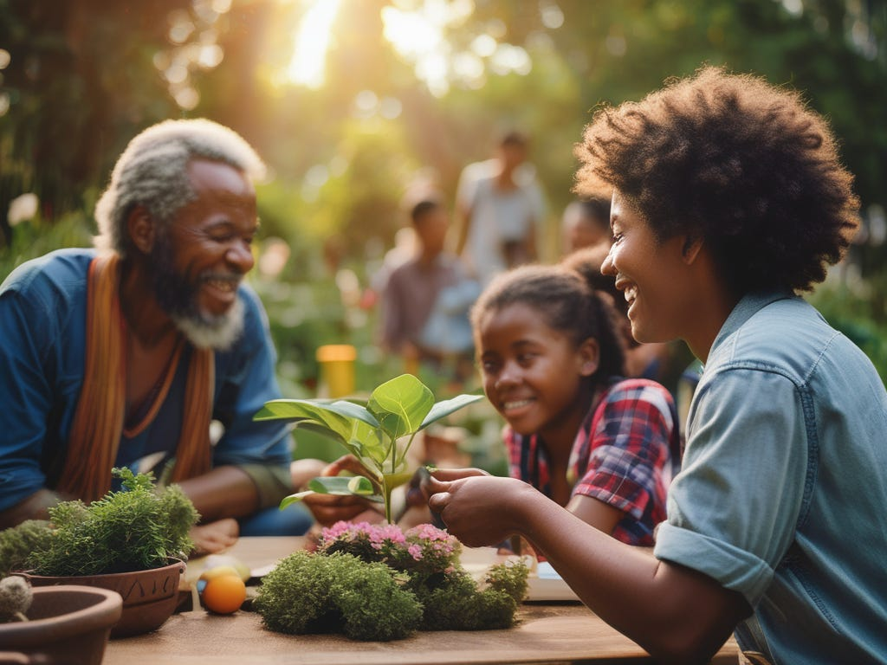

Sometimes I try to imagine the future. What might it be like? When I was a kid I hoped for portable devices you could speak to anyone with, an international network of information you could tap into to find anything out, and cars that could drive themselves. Crazy ideas that were unlikely to ever come true!

Now I'm older I hope for outcomes that are less technological. In fact I'd happily see current Social media replaced with ways if bringing people and communities together in real life, websites not being full of adverts for trying to sell us crap we don't need, and I'd like to see an end to most cars (except for a few needed for the disabled and emergencies) and replaced with trams, trains and blimps. I'd love to see a world without celebrities too, at least the kind who have no talents and do no good in the world.

But this is only the beginning of my hopes for the future: I'd like to see an end to corporate religion, to leaders and churches taking in massive amounts of money and doing little good in the world, to be replaced with personal and community spirituality, service given freely with kindness and empathy.

I long for the day when adults will make relationships based on respect and kindness and common interests, expressing that love in any consensual form they like, with love keeping them together and not laws, with no-one being the property of another. With children growing up in extended families, where many in the community take on parental responsibilities, and where schools will be places to enjoy learning and learn life skills as well as intellectual pursuits, but without tests, homework, and a focus on co-operation.

When people begin working, it will be doing something of their own choosing, rather than something they do to avoid poverty. There will be no bosses they have to please or risk starving. Sure there'll be co-ordinators and experts, but they won't rule over employees. The workplace will belong to the workers, satisfaction and safety will be more important than profit, and they will not have to look busy, work overtime, and try to satisfy shareholders. Without the incentive for producing a world full of plastic crap and pollution.

Scientists and poets, doctors and writers, teachers and singers will all be honoured equally. A person's value won't be based on their bank account, there'll be no debt, and no-one will ever go hungry or homeless. There'll be no propaganda of any kind, so society will be free from the prejudices of racism, sexism, homophobia, national bigotry, and against those with disabilities. Depression and mental health issues will be far fewer, but treated with greater compassion and support than ever before.

There'll be no landlords, no military, no politicians (or rulers of any kind), no borders, no police or prisons. People will make their decisions without fear of punishment, but with every incentive to help others, to develop themselves, to live in harmony with nature, and to find creative purpose and emotional healthiness.

There are two ways for this dream to come true: co-operation or collapse. Whether it will come about because of determination or desperation I do not know, but the world can't go as it has, and there are good examples in the past of what we can do together, if we stop fearing each other. So my bet is still on cooperation bringing about such a world.

* * *

Here is one of my articles detailing what such a future might look like -

Subscribe

[Share](https://peacefulrevolutionary.substack.com/p/a-better-future?utm_source=substack&utm_medium=email&utm_content=share&action=share)
