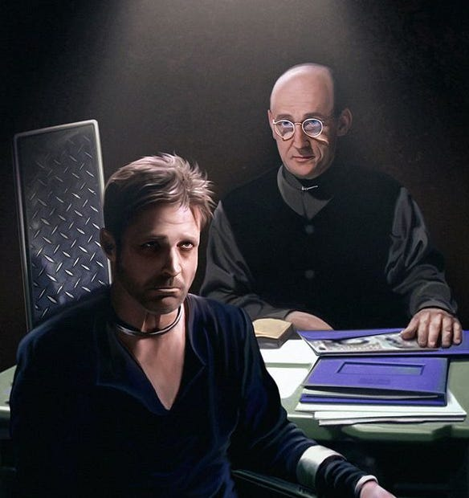

Last year I went to an event called Bristol Transformed (this year I was out of town). It was a series of get togethers, classes, discussions, challenges and social activities. All with the purpose of changing the world, or at least this part of it, this city, or even just the neighbourhood we live in, or ourselves. It was encouraging to see other people committed to good causes, many of them already engaged in them, and with ideas on how to make things better and ways of doing so.

There is a lot of bad in the world, but sometimes we forget that the evil comes from only a few sources: a few people whose insecurities lead them to seek power over others, to take what isn't theirs (our choices, our time, our attention, our means, our work) and use it against the rest of us. But there are more of us than there are of them, and inside each of us is something that makes us who we are, something that can't be stolen: our ability to think and feel, and our capacity for love.

Sometimes I worry that fear holds me back, that I lack confidence, that I don't have the strength, that I don't know enough or know how to express myself well enough, or that when the time comes I wonder if I'll make the hard decisions. But I know I decide those things each and every day, but determining in my mind what I will do when I have the chance, and by the steps I take now to learn, grow and share.

I used to love us watching Babylon 5 with my kids. It could be silly, and the special effects and even filming quality make it now seem somewhat dated, but it had grand themes, strong and complex characters, and asked big questions, as it told an epic story.

There was one particular episode that comes to mind when I think of people in difficult circumstances, when there doesn't seem to be a way forward, and that is when Sheridan is taken captive. He has been betrayed by his friend, he is in the hands of his enemies, and the firmness of his resolve has become a threat to him. At his seemingly lowest point, physically and mentally, his torturer has run out of ultimatums except to give up on him if he doesn't concede.

>  _Torturer:_ Your credibility has become a threat to their credibility. So one of them has to go. The best way out for everyone … is for you to confess … and lay the blame for what's happened on [someone else]. Whether it's true or not doesn't matter. Truth is immaterial. …
> 
>  _Sheridan:_ You know … it's funny. I was thinking about what you said. The preeminent truth of our age … is that you cannot fight the system. But if, as you say, the truth is fluid … that the truth is subjective … then maybe you can fight the system. As long as just one person refuses to be broken … refuses to bow down.
> 
>  _Torturer:_ But can you win?
> 
>  _Sheridan:_ Every time I say no.
> 
> BABYLON 5 (1994–1998): SEASON 4,   
> EPISODE 18 - INTERSECTIONS IN REAL TIME

Sometimes we can't even say ‘no’ out loud. But we can say it inside. ‘No, I won't give up … hope, trying, fighting.’ We can decide to keep being the better part of ourselves, even when it is difficult to do. Even if we can't express ourselves in one situation, we can know inside what we would do if we had the chance, and when we have that chance dare bravely, be courageous, even if we feel vulnerable, and make the difficult choice. But some days the difficult choice is waiting for another day, and it's okay if it's hard, if we get sad or angry, thats part of what makes us human.

* * *

Another article pointing out that we don’t have to do what they tell us to -

Subscribe

[Share](https://peacefulrevolutionary.substack.com/p/saying-no?utm_source=substack&utm_medium=email&utm_content=share&action=share)
