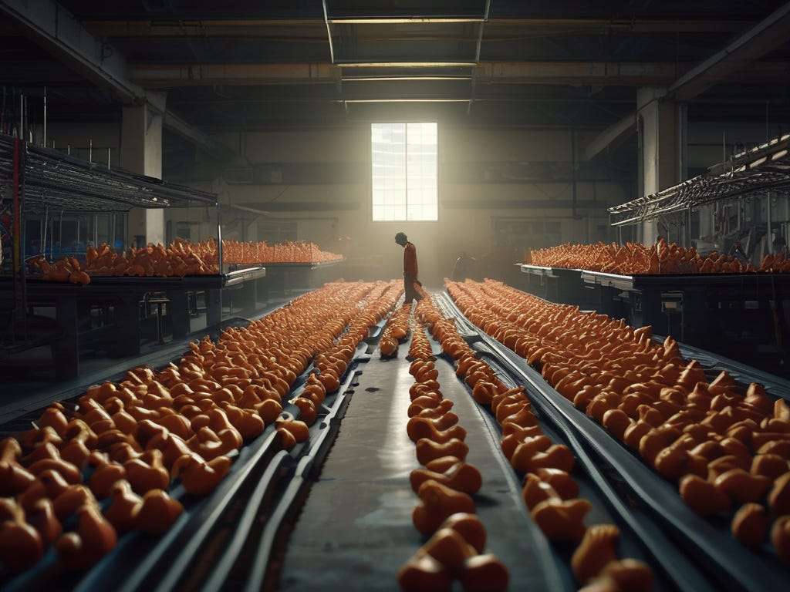

_For a while I’ve been playing with writing the lyrics of this satirical song set in the 80s:_

In the rubber chicken factory I toil all day  
A cog in the machine, working for lousy pay  
The work is fowl, I couldn’t give a cluck  
But I punch my card, hoping for better luck

My friends make fun of my conveyor-belt job  
But what do they know, that bunch of yobs  
Least I’m not picking rubbish and cleaning loos  
I don’t smell of crap when the day is through

At least it’s honest work putting in the stuffing  
For a kid who left school achieving nothing  
They say these days you can’t rely on society  
So I guess my success is going to be down to me

 _Chorus –_  
One day I’ll be part of the petit bourgeoisie  
Working at the rubber chicken factory  
My boss will bow and scrape, I’ll be rich and free  
No more filling up rubber chickens for me  
Working at the rubber chicken factory  
Working at the rubber chicken factory

I see the salesmen in their snazzy suits  
Hear about their wild parties, what a hoot  
See their Ford Cortinas shiny and new  
I can sell chickens if thats what I gotta do

Now I’m on the up – I look quite the yuppie  
Those old friends want nothing to do with me  
But I don’t care I’ve got a new fancy bird  
To drink babycham with, while they shovel turd

 _(Chorus)_

These new chicken models they are all the rage  
They’ve started a rubber chicken craze  
The lager flows freely and the money too  
Benidorm’s calling, a holiday’s overdue

But I’m not stopping at just sales manager  
I want the prestige only being CEO could confer  
Then I’ll rule on the rubber chicken throne  
& won’t need anyone, I’ll enjoy my riches alone

 _Chorus –_  
Now I’m part of the petit bourgeoisie  
Ruling over the rubber chicken factory  
I’m the boss, I’m rich and free  
No more filling up rubber chickens for me  
It’s my rubber chicken factory  
All my rubber chicken factory

I've got no friends, my employees all hate me  
And my plastic wife says she wants to be free  
At least she'll do well from the alimony  
But no one will lay flowers at the cemetery

That's what I gave to capitalism, you see  
My life for the rubber chicken factory

 _Note: the attitudes the character has in this poem are not my own._

* * *

Here is some better poetry by someone else -

Subscribe

[Share](https://peacefulrevolutionary.substack.com/p/rubber-chicken-factory?utm_source=substack&utm_medium=email&utm_content=share&action=share)
