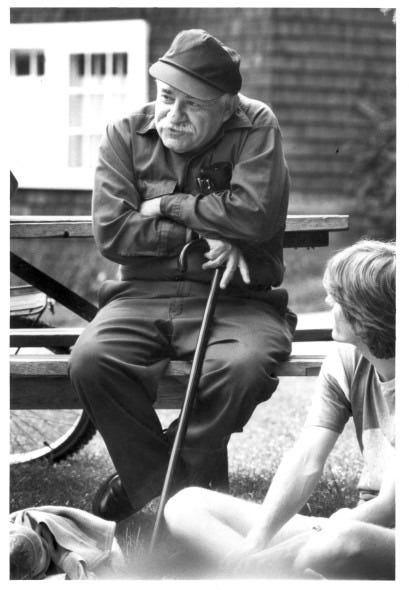

To be a Libertarian is to be a Libertarian Socialist. That is to believe in being free of hierarchy and class, free of others owning you, or others owning what you need to survive.

The word ‘Libertarian’ has always meant this. It still does to most people throughout the Spanish and French speaking world, and among those who the word was created to describe.

French Libertarian communist Joseph Déjacque first used the word in America in a letter to mutualist anarchist Pierre-Joseph Proudhon in 1857.1 It was the antithesis of Capitalism, and was a reject of Capitalist coercion, commodification and exploitation.

From Benjamin Tucker in the 1870s to Murray Bookchin in the 1950s, and Noam Chomsky to the present day it has been and continues to be used by American Libertarian Socialists.2

However, in the 1970s along came right wing proponents of unregulated capitalism like (antisemitic misogynist fascist-loving) Murray Rothbard.3 He knew what the word meant. He knew what an Anarchist and a Communist was. But he and others couldn't come up with their own cool word for their selfish ideology, so they stole the word 'Libertarian', co-opted it, and boasted of doing so:

> ‘One gratifying aspect of our rise to some prominence is that, for the first time in my memory, we, “our side”, had captured a crucial word from the enemy. “Libertarians” had long been simply a polite word for left-wing anarchists, that is for anti-private property anarchists, either of the communist or syndicalist variety. But now we had taken it over.’4

But us on the Left need to take it back, and give it back it's original meaning. As Murray Bookchin did and encouraged others to do:

> ‘This movement never created the word: it appropriated it from the anarchist movement of the [19th] century. And it should be recovered by those anti-authoritarians... who try to speak for dominated people as a whole, not for personal egotists who identify freedom with entrepreneurship and profit.’5

They will have to call themselves something else. One commentator suggested they used the word ‘Propertarian’, from Ursula K. Le Guin's Anarchist Utopian book, The Dispossessed.6 That seems a much more appropriate term, because they believe that property ownership is more important than anything, even human life.7

The only negative I can see from taking this word back is that these great quotes (about right-wing so-called Libertarianism) might lose their meaning and become irrelevant over time:

> ‘He always pictured himself a libertarian, which to my way of thinking means “I want the liberty to grow rich and you can have the liberty to starve.” It's easy to believe that no one should depend on society for help when you yourself happen not to need such help.’ _(Isaac Asimov)_

> ‘That's libertarians for you — anarchists who want police protection from their slaves.’ _(Kim Stanley Robinson)_

> ‘A simple-minded right-wing ideology ideally suited to those unable or unwilling to see past their own sociopathic self-regard.’ _(Iain Banks)_

> ‘Many times when I identified as Libertarian, people said to me, “It’s just rich white guys that don’t want to be told what to do,” and I had a zillion answers to that — and now that seems 100 percent accurate.’ _(Penn Jillette)_

> ‘I have always found it quaint and rather touching that there is a movement [Libertarians] in the US that thinks Americans are not yet selfish enough.’ _(Christopher Hitchens)_

Subscribe

[Share](https://peacefulrevolutionary.substack.com/p/taking-back-libertarianism?utm_source=substack&utm_medium=email&utm_content=share&action=share)

> ‘But you see, “libertarian” has a special meaning in the United States. The United States is off the spectrum of the main tradition in this respect: what's called “libertarianism” here is unbridled capitalism. Now, that's always been opposed in the European libertarian tradition, where every anarchist has been a socialist—because the point is, if you have unbridled capitalism, you have all kinds of authority: you have extreme authority. If capital is privately controlled, then people are going to have to rent themselves in order to survive. Now, you can say, “they rent themselves freely, it's a free contract”—but that's a joke. If your choice is, “do what I tell you or starve,” that's not a choice—it's in fact what was commonly referred to as wage slavery in more civilised times, like the eighteenth and nineteenth centuries, for example.
> 
> The American version of “libertarianism” is an aberration, though—nobody really takes it seriously. I mean, everybody knows that a society that worked by American libertarian principles would self-destruct in three seconds. The only reason people pretend to take it seriously is because you can use it as a weapon. Like, when somebody comes out in favour of a tax, you can say: “No, I'm a libertarian, I'm against that tax”—but of course, I'm still in favour of the government building roads, and having schools, and killing Libyans, and all that sort of stuff.
> 
> Now, there are consistent libertarians, people like Murray Rothbard—and if you just read the world that they describe, it's a world so full of hate that no human being would want to live in it. This is a world where you don't have roads because you don't see any reason why you should cooperate in building a road that you're not going to use: if you want a road, you get together with a bunch of other people who are going to use that road and you build it, then you charge people to ride on it. If you don't like the pollution from somebody's automobile, you take them to court and you litigate it. Who would want to live in a world like that? It's a world built on hatred.
> 
> The whole thing's not even worth talking about, though. First of all, it couldn't function for a second-and if it could, all you'd want to do is get out, or commit suicide or something. But this is a special American aberration, it's not really serious.’
> 
>  _(Noam Chomsky, Understanding Power: The Indispensable Chomsky)_

Some books on real Libertarianism:

  * Manifesto of Libertarian Communism, 1953

  * Anarchism: A History of libertarian ideas and movements, 1967

  * Anarchism: A Documentary History of Libertarian Ideas: A Documentary History of Libertarian Ideas, 2005

  * Libertarian Socialism: Politics in Black and Red, 2017

1

 _Le Libertaire, Journal du Mouvement Social_ , New York, 1858.

2

‘Benjamin Tucker was the first American to really start using the term “libertarian” as a self-identifier somewhere in the late 1870s or early 1880s.’ _Libertarianism_. Cato Institute.

3

<https://en.wikipedia.org/wiki/Murray_Rothbard>

4

 _The Betrayal of the American Right_ , 2007, p. 83.

5

 _The Modern Crisis_ , pp. 154-5. However, others think it a fruitless task -

‘There are libertarians who try to retrieve libertarianism from the Libertarian Party just as there are Christians who try to reclaim Christianity from Christendom and communists (I’ve tried to myself) who try to save communism from the Communist parties and states. They (and I) meant well but we lost.’ _(Bob Black)_

6

 _The Dispossessed_ , Ursula K. Le Guin. 1974.

See <https://theanarchistlibrary.org/library/anarcho-150-years-of-libertarian>

7

So much for their Non-Aggression Principle! When their property is threatened they take it as an attack on themselves personally, and then are prepared to be very aggressive - to the point of killing someone - to protect what they own. Even if what they own is everything anyone else might need to live.

‘Property and authority are merely differing manifestations and expressions of one and the same “principle” which boils down to the enforcement and enshrinement of the servitude of man. Consequently, the only difference between them is one of vantage point: viewed from one angle, slavery appears as a property crime, whereas, viewed from a different angle, it constitutes an authority crime.’ ( _No Gods, No Masters_ , quoting Emile Pouget, vol. 2, p. 66.)
