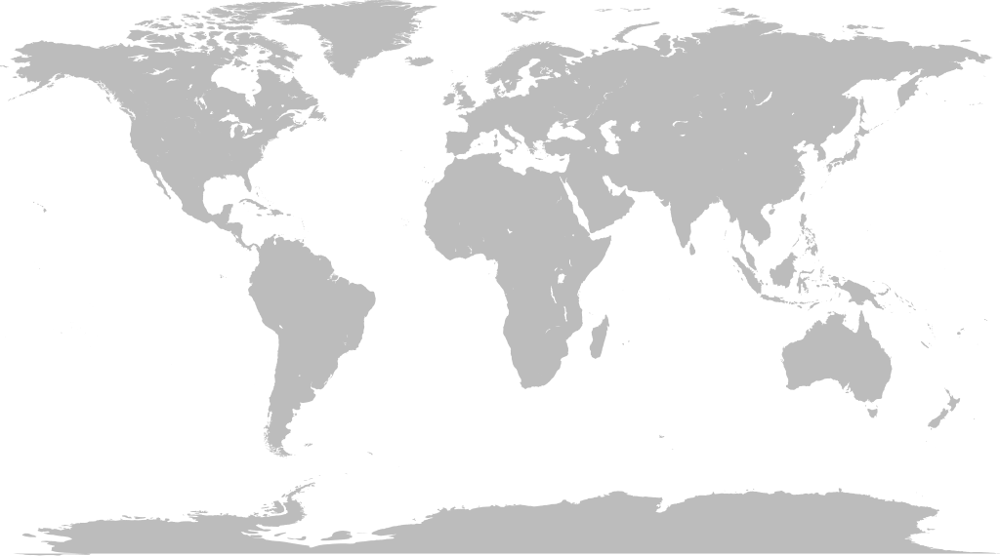
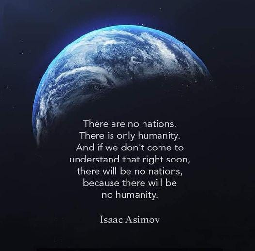

## There are no countries.

There is no Great Britain (or England, Scotland, Wales, or Northern Ireland for that matter). Of course there is an island (or set of islands) that goes by that name, and it is true that there are people upon it who others (and they themselves sometimes) call British. But that doesn’t convince me of the existence of countries. 

I agree that there are several things people on these islands have in common. The people in this region eat similar food, they may even call it British food (even if critics might just call it bland food). These so-called Brits may wear broadly similar clothes, which get inconveniently wet in the rainy weather. They may watch the same television channels, and often drive on the same congested roads, and pay for things with the same multi-coloured money, with the King's head on it. However, any region where people associate and share the same language will develop their own unique customs, whether we call it a country or not.

Although people call this island a country (a nation state) I contend that this is just an agreed upon fiction. The idea of countries is something we have been brought up to believe, like a fairy story: There is a place called Britain, defined on an artist’s map by imaginary borders, but those borders are quite recent, as is the idea of the people living there being labelled British. There is nothing in nature to say what defines Britain, beyond the sea, and for most of its history that wasn't a determining factor either.

The idea of this island being Britain and its people being British is something that has been imposed on us, decided by others long ago, out of our control, and without asking our ancestors if that is what we wanted, and still exists without us individually having much of a choice in it now.

Britain is a symbolic title, one that represents a certain system of power. If we were to try to split that power, claim it, or say it shouldn't exist we would soon find how violently those who hold the power would defend it. So we must pretend it exists, and go along with its imaginary limits, or risk the consequences of not acting as if it was real.

## Don't Be So Silly

‘Don't be so silly’, I can imagine some people saying if they read this far. I'll concede that of course there are people who call themselves English, Scottish and Welsh on this island. Of course there is the isle of Great Britain on a map, as there is a legal entity of the United Kingdom, including a country called Northern Ireland. It says so on our passports. 

But who says so? How do they have the power to say so? What makes it so? Why – despite this – am I insisting countries like Great Britain don't exist? My question is, ‘why should we take anyone seriously who says it does exist?’ If a bunch of people get together and say there are fairies or there is an imaginary place called Cloud Cuckoo Land does that make it so? You have to prove it. A shared delusion is still an illusion.

## Britain & England

Originally and for the majority of its history this island originally had no name, then as different people settled it (when it was part of the mainland) it had had several different names, then a while after it became an Island the Romans decided it needed a consistent name and they called it Britain (Brettaniai), maybe from the Celtic word ‘Pritani’, which referred to the Celtic tribes living on the island. So it went from meaning, ‘all us Celts’, to ‘all those Celts on this Island’ whether they were Celts or not.

But there were distinct areas even then, with their own chiefdoms, and lots of regional variations which exist to today. Places where the accents are markedly different, and where there are distinct identities.1

But those Celtic tribes were not a nation and they extended beyond the sea, perhaps as far as Turkey. When the Roman empire collapsed, the Germanic tribes, the Saxons, invaded in the early 5th century, and it became known as England, the land of the Angles, which likely comes from the region of Angeln in what is now Schleswig-Holstein, Germany. So England was a German word, and the Celtic and Roman languages were largely replaced by a Germanic one.2

Over time the English language developed into something close to what it is today, so that by 937 an English speaking king, Æthelstan, conquered the territories that roughly make up England today. (Of course outside of this people kept speaking Welsh & Scottish Gaelic languages (among others like Manx and Cornish)).

But Britain didn't yet exist, and for most of the first four hundred years of England's existence - following the Norman conquest - the Kings and royal court spoke French, which is the only official language England has ever had (English is not and has never been the official language, as England has no official language now).3

By 1532 the English king lost Brittany to France, and a few years later Wales became part of Britain. By the late 17th century we were practically part of the Netherland for a short while, with our Dutch King, William Of Orange, and then in 1707 Scotland became part of Britain, and Great Britain was formed. It has been a messy history of different claimants to the throne, who came from many different places and often didn’t speak English at all.4

## Homo Sapiens Inhabitants

But the people who lived in these places still lived there no matter what label they lived under and no matter what nation others claimed they were members of. Even if they were Scottish one day and British the next. It may have changed their taxes, and some of the laws imposed upon them, but they existed independently of whether they were called English, Scottish, Welsh or French.

What choice did the regular people have in all of this? Working men and women couldn't vote at all until 1918, and even then they were just voting on whoever filled seats in the parliament they never approved of creating in the first place, with no option to remove the structures of power themselves. They became subjected to such laws and borders without any consent, and anyone who'd challenge these systems was liable to be labelled a traitor (a crime punishable by death).

Someone born in the British isles is still of the same species as other Homo Sapiens. The same blood runs through their veins as all other people wherever they may live. No-one asked to be born in this particular region, with the advantages and disadvantages that come with that. They didn't request to be confined by lines on maps, even if some like the idea of using them to keep some people out.5

These designations of country, state, government, and monarch, with military and police and prisons to enforce them are all artificially contrived, made up like any other story. They are all ideas someone or a small set of people thought up, and demanded acceptance of and payment for (in the form of taxes). What accepting that a country is real does is allow people to be considered good or bad citizens, loyal or traitor, privileged or excluded. It confers legitimacy on its power structure and laws. While the idea of a country can change with rulers, natural disasters, and by invasions, without any input from those who are confined there.

This is as true for the United States of America, or China or India or Russia or anywhere else in the world. No-one has a natural right to mark out lines and prevent someone else from walking over them. No-one has a natural right to rule over another person – even if someone in their family declared themselves king a thousand years ago, no matter what they call their kingdom.

## Borders

Borders are imaginary and artificial. They only exist in the minds of humans and then for only limited time periods and are only recognised by tradition and enforced by the threat of violence. They are upheld by compliance and patriotism, and disappear in times of catastrophe or being conquered by outside forces.

Birds aren't limited by borders, neither are fish. They cease to exist once you fly a certain distance above the earth, and they can't be seen from space or underground for that matter. 

To the rich borders rarely apply. They can almost always get a visa to go to a country poor refugees can’t get into, and can often buy citizenship through investing in or starting a business in the country they want to live in.

Borders exist because of one person -- a king, warlord, or a landlord -- wanted to be in sole control of a natural resource, or wanted to profit from it, or wanted to deprive another group of access to it -- put up a fence, a wall, or guards to force or keep others out. They may allow some in to visit if they think they'll spend money or have skills they want, but don't want to let many in because they profit or otherwise benefit off of the scarcity or safety or exclusivity the borders create and the way in which this maintains their power.

This power extends into other countries, taking their resources to maintain the armies and excesses needed to protect this power, and ultimately creates the problems that lead to migration, and to demonising 'foreigners' from other countries. Because borders let you assign someone as foreign, as somehow different because they are on the other side of an imaginary line.

No one has the right to force someone else by threat or violence to be stuck where they are, to prevent them going where they want to. In the case of one person and their farm, there may be good reasons to keep animals within a fence (as they would rather run away than be eaten), but I don't think any of us like to think of ourselves as being cordoned in because we are being similarly exploited. Maybe one of these days enough of us human animals will stop believing in such silly ideas, and tear down the fences others have put around us.

The whole idea of borders is challenged when someone gets past a border, whether in order to escape danger and find safety, or to be able to avoid starvation and secure food for their family. The irony is that the conflict or famine they are escaping from is often caused or aided by the countries they are escaping to, and they are often the countries which demonise refugees the most. But those who spend the most time with these new immigrants are the least likely to be prejudiced against them, and most likely to feel that people deserve dignity wherever chance determines they are born.

However, those within a country are also subject to smaller borders too: paywalls and tollgates. With capitalism being just another form of internal border control, and money – or lack thereof – restricting access to places, needs, and access. People will never really be free as long as such restrictions exist.

Capitalism is challenged too when someone takes something they need to survive, like food (or housing) which was previously freely available to all, but is now restricted (even to the point of sometimes being wasted) to maintain profit or power. When someone tries to take back what once was free then they are called thieves (or squatters), then the hitmen of capitalism the police step in, and they are jailed at the expense of the poor's taxes. But our wise ancestors understood this earth and all things in it were made for everyone's benefit, and the wise now see that the world would be better for everybody if this truth was still honoured, and the needs of life were not restricted by countries and borders.

* * *

All of this is just a way of playing Let’s Pretend, but we can play a different game -

Subscribe

[Share](https://peacefulrevolutionary.substack.com/p/countries-and-borders?utm_source=substack&utm_medium=email&utm_content=share&action=share)

## This land was made for you and me

There was a big high wall there that tried to stop me;   
Sign was painted, it said private property;   
But on the back side it didn't say nothing;   
This land was made for you and me.

Well, one bright Sunday morning in the shadow of the steeple   
By the relief line I saw my people   
As they stood there whistlin' they stood there hungry   
Don't they know that this land was made for you and me?

Nobody living can ever stop me,  
As I go walking that freedom highway;  
Nobody living can ever make me turn back - I'm free  
This land was made for you and me.

 _Woody Guthrie, 1940_

King Shahdov : In this country, rules are not imposed, they are wish of all free citizens.

Rupert Macabee : Travel around a bit, then you'll see how free they are. They have every man in a straitjacket and without a passport he can't move a toe. In a free world they violate the natural rights of every citizen. They have become the weapons of political despots. If you don't think as they think you're deprived of your passport. To leave a country is like breaking out of jail. And to enter a country is like going through the eye of a needle. Am I free to travel?

King Shahdov: Of course you're free to travel.

Rupert Macabee: Only with a passport! Do animals need passports?

1

As can be seen by supporters of the local football club, who are fiercely loyal to the team that represents their city. But these are artificial distinctions too, as the football teams are not made up of people from the local community. They are made up of whoever the team can afford to pay wherever they are originally from, and will move elsewhere as soon as they are sold to another team in another city.

2

Although Germany doesn't exist either.

3

To be English is to be English speaking no matter where you live - that is how the word used to be used. Americans used to speak of themselves as Englishmen, even decades after the revolution (or ‘insurrection’ from the P.O.V. of those on the other side of the pond). So Americans and Australians and Canadians and New Zealanders are English in this way too.

4

In more recent history our royal family has been Austro-Hungarian (the Saxe-Coburgs - but they changed their name to Windsor later).

5

Although in the event of Britain suddenly being unsafe they would find other’s borders are a major inconvenience when seeking safety elsewhere.
