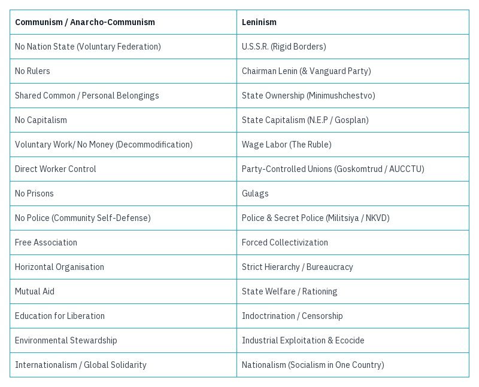
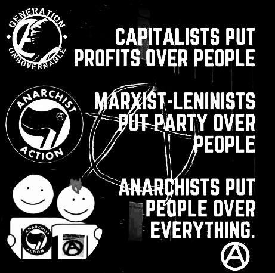

## Is Anarchism a viable path to achieving Communism?

 **Can a stateless, classless, ownerless, moneyless world be realised by Anarchism?**

Recently, I found myself engaged in a debate on Mastodon regarding the accuracy of Vladimir Lenin's criticisms of Anarchism in his book 'State and Revolution'. As the discussion progressed, I realized that the platform's short-form messages were inadequate for addressing such complex topics thoroughly. The conversation quickly branched into various sub-topics, making it challenging to present a comprehensive argument. This experience has prompted me to write a longer post to express my views more fully and address these issues in depth.

The quote shared from Lenin was the claim that:

> ‘The distinction between Marxists and the anarchists is this: (1) ... The latter want to abolish he state completely overnight, not understanding the conditions under which the state can be abolished. (2) ... The latter, while insisting on the destruction of the state machine, have a very vague idea of what the proletariat will put in its place and how it will use its revolutionary power. The anarchists even deny that the revolutionary proletariat should use the state power, they reject its revolutionary dictatorship.’1

Here, Lenin claims the Anarchists do not 'understand the conditions' and only 'have a very vague idea', as if he is completely unware of both Anarchist theory and history. But as to the charge of rejecting dictatorship Anarchists plead proudly guilty. At least he got that right.

However, to begin to answer this question in more detail we must first define, 

## What is Anarchy, Communism, and Leninism?

Anarchy isn't chaos. It proposes a world without rulers, with organised voluntary communities and regions taking the place of governments and nations, in which people have individual freedom and collectively share free access to food, housing and health.

Communism is a stateless, classless, moneyless world. This is a definition which even Marx and Engels accepted. It is not the Leninist Soviet Union or Maoist China. They were states which had political parties they hoped would will one day achieve Communism, but as Communism is achieved when there are no states (or even political parties) then those countries definitely did not meet that ideal.

Leninism is a political theory which advocates for a 'vanguard party' to seize state power and establish a 'dictatorship of the proletariat' as a transitional stages towards achieving communism. This approach involves centralized economic planning (state capitalism), an authoritarian single-party state, and an imperialist army, to extend it's control and develop the conditions for an eventual Communist society.

Anarchists are (mostly) Communists, but not Leninists, even though most Communists believe that ultimately the world will be Anarchist. What these groups sometimes disagree on is how this will be achieved.

## Achieving Communism

Leninists claim that because Leninism was successful in achieving power for a few decades using this method that ultimately it can achieve full Communism if it can just regain power again, even though they failed to do this originally. Yet Lenin argued that Anarchists don't have a good method of achieving their aims. This is simply not true. 

Anarchists believe in revolutionary methods such as prefiguration (building a better world in the shell of the old), syndicalist revolution (workers taking back their workplaces), insurrection (undermining the power of the state), and mutual aid (to address the injustices of capitalism now), and to rebuild society after capitalist collapse. These methods have worked and continue to do so, and have even been used by Leninists at times.

So ... Is Anarchism a viable path to achieving Communism? Can a stateless, classless, ownerless, moneyless world be realised by Anarchism? Yes. It can. 

Not convinced? How about turning this question around:

  * Can statelessness be achieved with a nation state? No. 

  * Can classlessness be achieved with a ruling class? No.

  * Can ownerlessness (without landlords or commercial property) be achieved with (state or commercial property) ownership? No.

  * Can moneylessness be achieved with money? No.

Anarchists don't believe any of these things can be achieved by doing becoming the very things they seek to overthrow. Leninism has shown itself incapable of achieving Communism, and because of its structure and power dynamics Anarchists believe it never could.

Why?

  * Because statelessness can only be achieved by removing the state.

  * Because classlessness can only be achieved by removing classes.

  * Because ownerlessness can only be achieved by removing owners (landlords and building and business owners).

  * Because moneylessness can only be achieved by removing money (and owners and classes and the state).

  * Because a world without hierarchy can only be achieved by anarchy (no hierarchy).

## Broken Buckets & Spiders Swallowing Flies

To use a somewhat silly analogy, but the ineffectiveness of using the state to get rid of the state is sort of like that old folk song, 'There's A Hole In My Bucket'.2

> Henry: There's a hole in my bucket, dear Liza, dear Liza, 
> 
> There's a hole in my bucket, dear Liza, a hole. 
> 
> Liza: Then mend it, dear Henry, dear Henry, dear Henry, 
> 
> Then mend it, dear Henry, dear Henry, mend it.

Henry has a hole in his bucket, Liza gives him ways to fix it, but each solution just adds to the problem: Liza suggests he tries to mend it with straw, but Henry complains it's too long. Liza suggests he cut it with a knife, but Henry points out it's too dull. Liza suggests he sharpens it on a whetstone, but that needs water. So Liza suggests he go fetch some water in his bucket, but Henry reminds her he can't because he still has a hole in his bucket, and the cycle repeats itself. It just isn't fit for the purpose.

If the hole is hierarchy - the conduit through which power flows (and the abuses of power which come out of it), and the attempts to fix it just include more hierarchy then the hole won't be fixed. When it comes to hierarchy you can't get rid of it without plugging up the hole, by removing hierarchy, no matter how much money, classes or states you try to use to fix it.

Another song the pro-state communist argument reminds me of is ‘There Was An Old Woman Who Swallowed A Fly’.3

> There was an old lady who swallowed a fly,
> 
> I don't know why she swallowed a fly – perhaps she'll die!

To catch the fly she swallowed a spider, then a bird to catch the spider, a cat to catch the bird, a dog to catch the catch the cat, a goat to catch the dog, and a cow to catch the goat, then in the end ...

> There was an old lady who swallowed a horse...
> 
> She's dead, of course!

This is the result of swallowing hierarchy in all it's forms in order to deal with the fly, the unwanted power system which ends up getting reproduced. Anarchists predicted this was what would happen with Soviet Russia, if it got rid of the actually Socialist and Communist features and groups that existed early in the revolution. As Mikhail Bakunin warned, ‘Take the most radical revolutionary and place him on the throne of all Russia, or give him dictatorial power, and before a year has passed he will become worse than the Czar himself.’4 I believe most on the left (and right for that matter) would agree that is exactly what happened.

## Anarchy: A Moral Matter

However, for many Anarchists Anarchism is a moral matter. No amount of possible future freedom from rulers can make up for lack of freedom due to rulers now, no amount of possible future freedom from injustice can make up for the inherent injustices that would come from hierarchy (and states). No amount of immoral or unjust acts to try to bring about Communism can achieve their aims without betraying the ideals of Communism. In Anarchism we call this the harmony of means and ends: the means determine the ends, and good ends never justify bad means.

Leninists say we are naïve idealists. But once you sacrifice all your ideals how can you ever hope to achieve them? How can you be certain that the good ideals you value will be upheld by those who end up ruling over the party?

Maybe it's because I'm simple - I admit it - but anarchism seems a much simpler and straightforward proposition to me: No one is ruler, no one is ruled over. What can be simpler? There is no middle or centre ground. If you believe in having no rulers you are an Anarchist, and if you believe in having some you are a Hierarchist.

According to some Anthropologists, Anarchism was the default for most of human history.5 In many ways it is still the default now. We don't insist our friend group has to have a ruler over it, we don't charge our family for helping fix something around the house. When we lend a book to a friend, we don't require them to sign a contract or pay a fee. We often help strangers with directions or small favours without expecting anything in return. In social gatherings, people naturally take on different roles (cooking, cleaning, entertaining) without being assigned tasks by an authority figure. Even in larger societal contexts, we see examples of spontaneous organization: people form lines at bus stops or in stores without being directed, and in many communities, neighbours look out for each other's homes without being paid or ordered to do so.

Hierarchy is an artificial invention. Without rulers imposing their will (or the threat of violence for not conforming to their will), then hierarchy wouldn't exist. Hierarchy is might makes right, or rather might makes you do what they want out of fear of being punished no matter how right or wrong it is.

## Achieving Anarchism

Far from being impractical Anarchism achieves some of its aims here and now. To give an example I rarely see mentioned: Romantic relationships. If you are in a hierarchal relationship - lets say an old patriarchal fashioned marriage - and you are able to leave (through divorce or separation) then you are free from being ruled over by that person. If you enter into another relationship in which you are a full and free partner then that relationship is free from such hierarchy. 

This is a simple change in the nature of relationships which was revolutionary, as women had previously been considered the property of the man. But it happened without a change of law or overthrowing of state (although laws did later change to reflect the changes). Some of the most ardent campaigners for this change were Anarchist women.6

We act as Anarchists every time we refuse to take power over another person, every time we don't threaten or force someone to do what we want, every time we don't monetise our interactions with friends, family or comrades, or act out of kindness with no hope of financial reward. We act as Anarchists when we don't exploit others helping us, or take advantage of their precariousness to make a profit. These are moral choices which oppose and thwart hierarchy and systems of power and capital.

 **[Are You An Anarchist? The Answer May Surprise You!](https://davidgraeber.org/articles/are-you-an-anarchist-the-answer-maysurprise-you/)**

Many other major changes have come from below, such as those in the workplace which happened due to Anarcho-Syndicalist unions. Such unions and ideals have been part of revolutions (in Spain, Korea, Ukraine, Mexico, Kurdistan etc.), which - at least until put down by Capitalists and even Leninists - achieved many of their aims. Id, as some claim, such non-hierarchal decentralised advanced societies were the norm for most of human history, then we are just living through a recent aberration.

 **Stateless 20th-21st Century Examples:**

  * Revolutionary Ukraine, 1918-1921, 7 million people

  * Shinmin Prefecture, 1929-1931, 2 million people

  * Revolutionary Spain, 1936-9, 3.2 million people

  * Zomia, until 1940s, 10s of millions people

  * Zapatista-run Chiapas, 1994-present, 300,000 people

  * Rojava, 2012-present, 2.5 million people

  * Abahlali baseMjondolo, present, 115,000 people7

Whatever the future holds, Anarchism works here and now when it is applied and lived. We see examples of this in cooperative communities, mutual aid networks, and horizontal decision-making processes in various grassroots organizations. These demonstrate that people can effectively organize and meet their needs without hierarchical structures. It is hierarchy that has to be maintained artificially and violently, through laws, police, prisons, and often military force. In contrast, Anarchy - in the sense of voluntary cooperation and self-organization - tends to be the state that society returns to in the absence of hierarchy. This is evident in how communities often come together to support each other during natural disasters or social upheavals, organizing spontaneously without waiting for top-down directives. From neighbourhood mutual aid during the COVID-19 pandemic to worker-run factories in Argentina, these real-world examples show that anarchist principles can and do function effectively when given the chance.

So I'd like to extend a warm welcome to my leftist friends (Leninists included) to come over to the warm waters of Anarchism. There is no fee, no membership process, and no exams to be admitted. You'll never need to worry about those you backed with your noble ideals turning into dictators and taking away your freedoms. Of course - for the near future - we'll still be living under capitalism, but in the meantime we can fight it and undermine it together, until we replace it completely, and achieve the stateless ideals of Communism.

 **Anarchist Responses To State And Revolution:**

 _Means and Ends: The Anarchist Critique of Seizing State Power, Zoe Baker_

 _The State is Counter-Revolutionary, Anark_

 _State and Revolution by VI Lenin , Radical Reviewer_

  * [The State and Revolution](https://theanarchistlibrary.org/library/iain-mckay-anarcho-the-state-and-revolution-theory-and-practice), Iain Mckay, 2018

  * [Socialism and Strategy](https://theanarchistlibrary.org/library/anthony-zurbrugg-socialism-and-strategy), Anthony Zurbrugg, 2014

  * [Contra State and Revolution](https://theanarchistlibrary.org/library/chris-wright-contra-state-and-revolution), Chris Wright, 2001

  * [A Look At Leninism](https://theanarchistlibrary.org/library/ron-tabor-a-look-at-leninism#toc6) (Chapter 4), 1988

  * [Review of ‘State and Revolution](https://theanarchistlibrary.org/library/luigi-fabbri-state-and-revolution-on-lenin-s-book)’, Luigi Fabbri, 1921

 **Broader responses to Leninism in general:**

  * [Listen, Marxist!](https://theanarchistlibrary.org/library/murray-bookchin-listen-marxist), Murray Bookchin, 1971

  * [The Abolition of the State](https://theanarchistlibrary.org/library/wayne-price-the-abolition-of-the-state), Wayne Price, 2007

  * [In Defense of Anarchism](https://theanarchistlibrary.org/library/ron-tabor-in-defense-of-anarchism), Ron Tabor, 1996

  * [Marxism or Anarchism?](https://theanarchistlibrary.org/library/anarcho-marxism-or-anarchism), Anarcho, 2003

  * [The State Is Counter-Revolutionary](https://theanarchistlibrary.org/library/anark-the-state-is-counter-revolutionary), Daniel Baryon, 2020

Subscribe

[Share](https://peacefulrevolutionary.substack.com/p/hierarchy-and-revolution?utm_source=substack&utm_medium=email&utm_content=share&action=share)

A follow on to this article was written:

### Hierarchy Series

If you liked this consider reading more of the **[Hierarchy Series](https://peacefulrevolutionary.substack.com/about#§hierarchy-series)**

1

State And Revolution, Chapter 6, Section 3.

2

<https://en.wikipedia.org/wiki/There%27s_a_Hole_in_My_Bucket>

3

<https://en.wikipedia.org/wiki/There_Was_an_Old_Lady_Who_Swallowed_a_Fly>

4

As paraphrased by Noam Chomsky, Government in the Future, The Poetry Center in New York, New York on February 16, 1970.

5

See The Dawn of Everything: A New History of Humanity, David Graeber & David Wengrow, 2021.

6

Their Socialist comrades were a major part too, but this supports the point that I'm making: they didn't wait until they had control of a state to implement such changes. Soviet Russia had its own campaigners for women's equality, such as Alexandra Kollontai, who I believe was betrayed by Lenin in this regard.

7

See <https://anarchyinaction.org/#Anarchist> for more and earlier examples.
