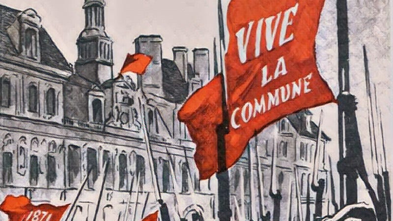

In one of the contemporary reviews of Ursula K. Le Guin's utopian novel, The Dispossessed, the book was compared to ‘The Lord Of The Rings’ in how authentically its fictional world was realised on the page, with its own language, places, and back history.1

However, unlike Tolkien's more wordy epic ‘The Dispossessed’ is notably absent genealogies, lore and magic. It is also very light on poetry, with two small exceptions, the first being a poem illustrating the expressiveness of her fictional language of Pravic (albeit translated into English)2, and the second being a revolutionary hymn we are only given the first stanza of:

> ‘He did not know their songs, and only listened and was borne along on the music, until from up front there came sweeping back wave by wave down the great slow-moving river of people a tune that he knew. He lifted his head and sang it with them, in his own language, as he had learned it: The Hymn of the Insurrection. It had been sung in these streets, in this same street, 200 years ago, by these people, his people:
> 
> O eastern light, awaken  
> Those who have slept!   
> The darkness will be broken,  
> The promise kept.’3

This is the only revolutionary song that is included in the book, but despite 200 years of separation it is a song with which both Shevek and the people of Anarres are familiar. As such it holds a similar place in importance to ‘The Internationale’, perhaps the most famous and most popular revolutionary song here on earth:

> Arise ye workers from your slumbers  
> Arise ye prisoners of want  
> For reason in revolt now thunders  
> And at last ends the age of cant

This 1864 anthem uses a 9898 metre which gives room to express its concepts, but the English translation has been considered awkward and dated by some, and has often been changed in different adaptations.4

However, Unlike ‘The Internationale’s 9898 syllable metre, Le Guin's 'Hymn' follows a 7474 one which means its concepts have to be expressed in fewer words. This is not a popular timing for hymns or folk songs, but there are a few that do use it, most famously ‘Michael Rowed The Boat Ashore’, and the traditional English Christmas carol, ‘How Far Is It to Bethlehem’. These are lovely tunes, but not very rousing.

I have found one Appalachian folk song that uses a similar metre, ‘Cumberland Gap’, but it uses a longer fourth line:

> L-a-a-ay down boys  
> Let's take a nap  
> Thar's goin' to be trouble  
> In the Cumberland Gap5

It seems that if it is ever going to be sung this revolutionary anthem will need a new tune, but — if it ever is — I’ve tried to write some extra verses, following the themes of from ‘The Internationale’ which inspired it:

O Eastern light, awaken  
Those who have slept!  
The darkness will be broken,  
The promise kept6  
Rise up, ye tired and weary  
Free from the night  
Cast off the chains so dreary  
Embrace the light7

Look at the world around you  
Now light has shone  
Your comrades held in shackles  
Their hope is gone  
Take up your hammer, break them  
Debt’s chains are weak  
Crush poverty’s cruel burden  
And free the meek

No more we’ll be driven  
From homes, to street!  
The promise once was given:  
Safe shelter, sweet8  
The jailer’s key is breaking,  
His walls will fall  
The dawn of freedom waking  
Will free us all

From ruler’s grasp we’re tearing  
Our lives and will  
This light we’re proudly bearing  
No force can kill  
None will remain slaves then  
All will be free  
The world will be saved when  
there's anarchy.

I’m sure someone could come up with better words, but I had some fun trying. Let me know if you come up with your own version.

Subscribe

[Share](https://peacefulrevolutionary.substack.com/p/hymn-of-the-insurrection?utm_source=substack&utm_medium=email&utm_content=share&action=share)

## Dispossessed Article Series

\- [How Anarres Works](https://peacefulrevolutionary.substack.com/p/how-anarres-works)

\- [The Utopian Pravic Language](https://peacefulrevolutionary.substack.com/p/the-utopian-pravic-language)

\- [Odonian Hymn Of The Insurrection](https://peacefulrevolutionary.substack.com/p/hymn-of-the-insurrection)

\- [Antillia’s Utopia (Anarres On Earth)](https://peacefulrevolutionary.substack.com/p/antillias-utopia)

1

‘Le Guin is a writer of phenomenal power. … she invites, as Tolkien does, total belief.’ The Observer.

2

‘O child Anarchia, infinite promise  
infinite carefulness  
I listen, listen in the night  
by the cradle deep as the night  
is it well with the child’ (Chapter 4)

3

Ursula K. Le Guin, The Dispossessed, Chapter 9, 1974.

4

https://en.wikipedia.org/wiki/The_Internationale

5

https://en.wikipedia.org/wiki/Cumberland_Gap_(song)

6

I considered changing it to ‘Those sleeping, rise! / The promised skies’, or even making the lines longer, but felt I would be defiling a sacred text if I did so.

7

Or ‘... ye tired and worn / ignore the world's scorn’.

8

Or ‘rest, long, and sweet’
