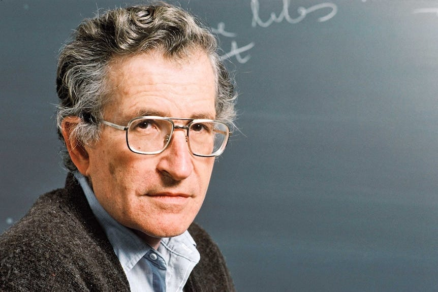

**Is anyone justified in having power over someone else?**

 **In making their decisions for them?**

These are questions over which philosophers have argued for centuries, and are still debated today. On the one side are the statists represented by: Hobbes, Locke, Rousseau, and Hegel. On the other side are the anarchists (anti-hierarchists) represented by: Proudhon, Bakunin, Kropotkin, and Goldman.

One of the most well known modern political philosophers who has expressed an opinion on this topic is American academic, Noam Chomsky. Known for his ground-breaking research into linguistics, he has also been a very public in his criticism of capitalist media and imperialism. He defined Anarchism quite well when he said that:

> ‘the term anarchism is quite a range of political ideas, but I would prefer to think of it as the libertarian left, and from that point of view anarchism can be conceived as a kind of voluntary socialism, that is, as libertarian socialist or anarcho-syndicalist or communist anarchist, in the tradition of say Bakunin and Kropotkin and others. They had in mind a highly organized form of society, but a society that was organized on the basis of organic units, organic communities.’1

## The Burden Of Proof

That is quite an uncontroversial assessment that most Anarchists would accept. However, Chomsky subsequently made some other remarks on Anarchy that have been the subject of some debate:

> ‘The core of the anarchist tradition, as I understand it, is that power is always illegitimate, unless it proves itself to be legitimate. So the burden of proof is always on those who claim that some authoritarian hierarchic relation is legitimate. If they can't prove it, then it should be dismantled.’2

On another occasion he elaborated further on this idea:

> ‘Primarily, [Anarchism] is a tendency that is suspicious and sceptical of domination, authority, and hierarchy. It seeks structures of hierarchy and domination in human life over the whole range, extending from, say, patriarchal families to, say, imperial systems, and it asks whether those systems are justified. Their authority is not self-justifying. They have to give a reason for it, a justification. And if they can't justify that authority and power and control, which is the usual case, then the authority ought to be dismantled and replaced by something more free and just. And, as I understand it, anarchy is just that tendency. It takes different forms at different times.’3

One of the challenges with Chomsky’s statement is his use of the word ‘authority’. However, when he is speaking specifically about ‘authoritarian’ power he is not speaking about the king of ‘authority’ that comes with expertise.4

No Anarchist claims that a Herbalist is as well qualified (whatever else their possible merits) at heart surgery as someone who has spent sixteen years training to be a heart surgeon. Nor do they suggest we should determine who will carry out such surgery based on the result of a vote. 

The kind of authority Chomsky takes exception to is the kind that makes decisions for others based on state, corporate, class or legal position, regardless of whether someone submits themselves to the other person voluntarily or not.5

Likewise, the word ‘power’ is open to misinterpretation. If he had used the word 'force' instead of 'power' it would have definitely made his point clearer, but such is the ambiguity of the English language. The power he was speaking of is when someone takes power over someone else, to make decisions for them, or even to compel them to do what they say.

But the major reason that these statements have become so controversial is because of the idea that someone who has, is seeking or supporting hierarchal power might think they can ‘prove’ the legitimacy of it, and that there could be legitimate ‘justification’ for such a claim. 

Because of this some say that Chomsky's argument has no merit at all. That it excuses bad justifications for such hierarchy. After all, states can and will give you a (fallacious) reason as to why their hierarchal authority is justified nonetheless, and likewise make arguments for the necessity or rightness of their use of 'force' too, and for their monopoly over both.

## Children & Hierarchy

In response to this Chomsky gives one of the rare occasions in which he think’s such a hierarchy might be necessary:

> ‘the basic principle I would like to see communicated to people is the idea that every form of authority and domination and hierarchy, every authoritarian structure, has to prove that it’s justified—it has no prior justification. For instance, **when you stop your five-year-old kid from trying to cross the street, that’s an authoritarian situation: it’s got to be justified. Well, in that case, I think you can give a justification**. But the burden of proof for any exercise of authority is always on the person exercising it—invariably. And when you look, most of the time these authority structures have no justification: they have no moral justification, they have no justification in the interests of the person lower in the hierarchy, or in the interests of other people, or the environment, or the future, or the society, or anything else—they’re just there in order to preserve certain structures of power and domination, and the people at the top.’6

Here he takes the extreme case (limited in scope and time) of rescuing a child from potential harm, suggesting this as one of the few occasions when domination might be justified. It is an exception a lot of people would agree with. As a parent your natural instinct is to stop them coming to harm, and to prevent them of being in danger. But is this hierarchy?

If that is what Chomsky is arguing then I disagree with Chomsky on his conclusion. Not because I don’t think an adult shouldn’t protect a child, but because I don't think of the parent / child relationship as necessarily hierarchal. Although I may feed or protect or teach someone who can't feed, defend, or learn themselves, that doesn't mean I rule over them. In fact it is my role as a parent to ensure they can make free and informed decisions and actions as soon as they are capable of doing so.

Perhaps Chomsky was conceding that the law holds us responsible to rule over children whether we think we should or not. Perhaps he was pointing out that children live in a more dangerous world due to Capitalism, and this world faces us with imperfect choices that we might not be faced with under a different situation. In our current system we can be held accountable for the actions of our children even when we think they are old enough to make some decisions themselves, but the law makes no allowance for their individual maturity or our circumstances in such cases. 

## Illegitimate Authority

I do not believe we should rule over anyone, even children, in any circumstances. But I do think that as a general rule his test of hierarchy can be a good and useful one:

> ‘So I think that whenever you find situations of power, these questions should be asked—and the person who claims the legitimacy of the authority always bears the burden of justifying it. And if they can’t justify it, it’s illegitimate and should be dismantled.’7

For me personally, the idea that a ruler - whether they call themselves a leader, priest, politician, president or prime minister - had to justify their right to rule over someone else was revelatory. I took for granted my powerlessness and their position, until I began to ask ‘who gave them that right?’, and found none of the answers satisfactory. 

Ultimately I found no justification for someone ruling over another to be sufficient, not voting, nor gods, nor merit. Because with every argument there were counter arguments and counter examples of bad rulers and atrocities that happened directly because of them, even when it seemed some of them started with good intentions, or there were systems that tried to keep them in check. Even the supposedly good rulers were guilty of injustices, even if fewer of them, and always of the injustice of asserting the right to rule over others, a position for which no-one could ever qualify.

 **But am I an Anarchist only because I can't find an argument justifying hierarchy?**

No. It is because I value freedom. I value it to the point that I think no-one should be able to take it from anyone else (unless in the extreme case that person poses a threat to the freedom of others).

We are born free. At least we are born without any limits except those imposed on us by nature or necessary to keep us safe. But for most of us we can only remain free in those areas rulers allow us, and are restricted if we go beyond those, and in many other areas. Yet for most of humanity's history there were no such limits, until warlords began imposing them, and religion (and later some philosophers) began excusing them. States with their offices, traditions, and legal procedures legitimised the process, and votes gave people a nominal and mostly pacifying part in the process.

Now we are at the point where most people take it for granted, and rarely question whether we should have rulers, just wonder once every few years which choice between two rulers might be better. But I don't believe most people are hierarchists. I don't believe they have reasoned that this is the best system. They are often unware there are other possibilities. But in their daily lives they often live without hierarchies, and are free of them in their relationships and friendships, and in many of their day to day interactions outside of work or the law.

But this doesn't still doesn't cover the justification argument entirely, so in order to address any ambiguity I'd add that:

No one is born with a right to rule over someone else, and no-one consents to being subject to another's hierarchy from the moment they are born. (At least not if you don't believe the gods pick kings, or that some people are born with special blue blood, or that we somehow chose which caste to join when reincarnated). Thus, the default position is anarchy - no hierarchy.

Of course the reality is that (almost) everyone is born into a region ruled over by others who enforce that rule with violence (at least if it's challenged). But, that power is illegitimately gained and illegitimately exercised. It is always an unjust hierarchy. Such hierarchies are never consented to by everyone, and - even if they were consented to by a majority (which rarely happens) - nothing gives a majority a right to rule over a minority who do not accept their legitimacy.

So, no one is born without the right to determine their own lives. Even their parents can't forfeit that for them. They will (usually) have the potential and capacity to make their own decisions as they become older. That doesn't mean they are completely capable of making some decisions as infant, or that a small number of people don't develop that far. But in such situations that just means they are in need or care, not hierarchy. 

Subscribe

[Share](https://peacefulrevolutionary.substack.com/p/justification-for-hierarchy?utm_source=substack&utm_medium=email&utm_content=share&action=share)

### Hierarchy Series

If you liked this consider reading more of the **[Hierarchy Series](https://peacefulrevolutionary.substack.com/about#§hierarchy-series)**

A related article:

1

Noam Chomsky, On Anarchism, 2005.

2

Activism, Anarchism, and Power, Noam Chomsky interviewed by Harry Kreisler, Conversations with History, 22 March 2002.

3

The Kind of Anarchism I Believe in, and What’s Wrong with Libertarians, Noam Chomsky interviewed by Michael S. Wilson, Alternet, 28 May 2013.

4

‘Does it follow that I drive back every authority? The thought would never occur to me. When it is a question of boots, I refer the matter to the authority of the cobbler; when it is a question of houses, canals, or railroads, I consult that of the architect or engineer. For each special area of knowledge I speak to the appropriate expert. But I allow neither the cobbler nor the architect nor the scientist to impose upon me. ... But I recognize no infallible authority, even in quite exceptional questions ... So there is no fixed and constant authority, but a continual exchange of mutual, temporary, and, above all, voluntary authority and subordination.’ - Mikhail Bakunin, What is Authority, 1870.

5

As this question is often asked about how this relates to romantic relationships: Anarchism doesn’t prevent people entering into whatever relationship arrangements and dynamics they want, as long as a person is making a free choice and can voluntarily leave such situations if they want to.

6

Noam Chomsky, On Anarchism, 2005.

7

Noam Chomsky, Understanding Power, 2002.
