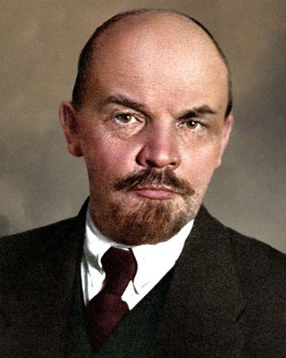
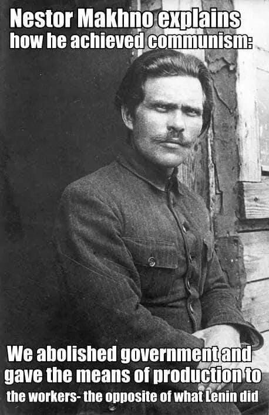
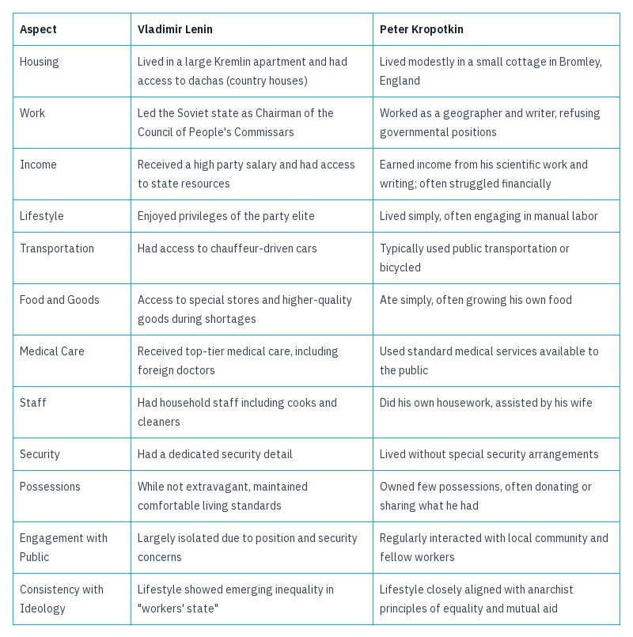
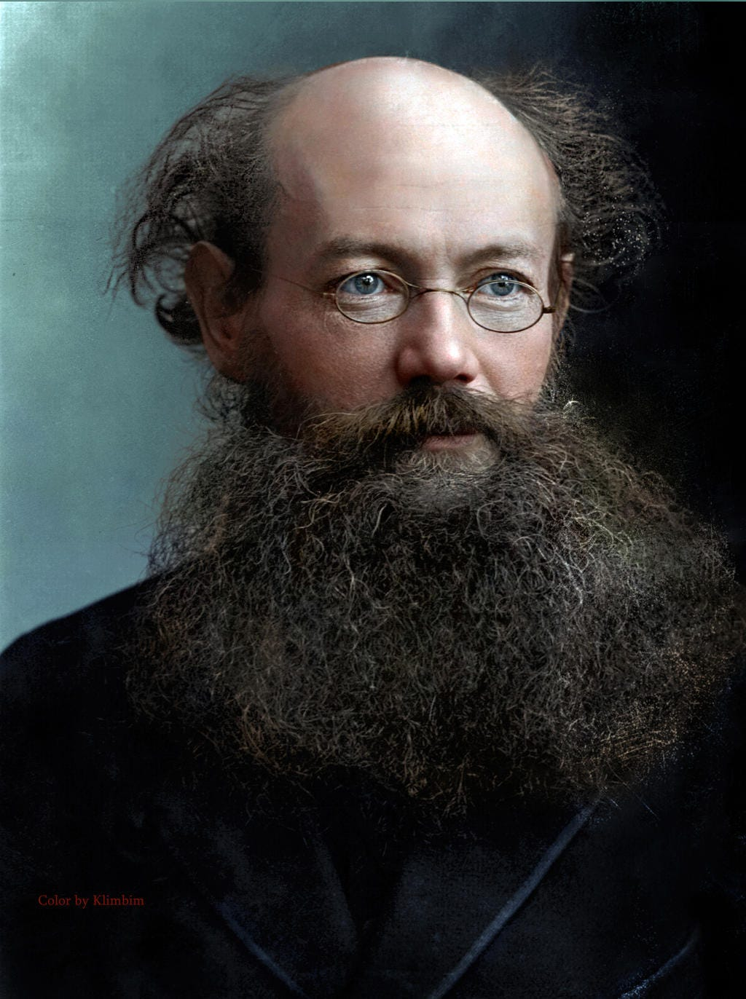

In **the[previous article](https://peacefulrevolutionary.substack.com/p/hierarchy-and-revolution)** I tried to answer a question that was raised by a Leninist about the effectiveness of Anarchist revolution that stemmed from misconceptions Lenin had about Anarchism.

Having **[just commented](https://peacefulrevolutionary.substack.com/p/justification-for-hierarchy)** on the topic of when hierarchy might be justified (if it ever is) has left me a question in return for Leninists - ‘When is hierarchy and it's actions not justified in a Leninist state?’ In other words, ‘What is not justifiable under Leninist authoritarianism?’ and ‘At what point is its position and power completely unjustified?’

Forgetting that I'm an Anarchist who believes that no-one should have power over anyone else, lets pretend for a moment that Lenin and his state is somehow a special exception to this for the sake of the argument.

Let's Imagine Lenin is a man whose intentions are entirely pure, he is aided by a committee of similarly minded men, and they are supported by a party equally as honourably motivated. Regardless of how they obtained their power, they are determined to exercise it wisely and fairly, in the interests of the people of Soviet Russia, and according to the ideals they believe they are accountable to.

## Promises vs Fulfilment 

How could we be sure that they maintained their good intentions and acted according to their noble ideals? How could we be sure that they were still doing more good than bad, whatever their intentions and ideals were?

Does their system bring about the changes they promise?

  1. ‘All Power to the Soviets’: The ‘Soviets’ were the workers councils or communes. This slogan, popularized by Lenin, promised direct worker control. Did Leninism keep this promise? No. In reality, power was quickly centralized in the Bolshevik party apparatus, effectively side-lining the Soviets.1

  2. Land redistribution: The Bolsheviks supported the Socialist Revolutionary Party's land reform policy. Did Leninism keep this promise? No. They later implemented forced grain requisitioning and collectivization.2

  3. Anti-Capitalism: Capitalism was condemned as a Western imperialist crime that would be opposed and defeated. Did Leninism keep this promise? No. The New Economic Policy (NEP) was introduced, initially presented as a temporary measure, but was a return to capitalist practices.3

  4. Press freedom: A free press was promised. Did Leninism keep this promise? No. The Bolsheviks quickly moved to censor and shut down opposition newspapers.4

  5. Self-determination: National self-determination was going to be respected, they claimed. Did Leninism keep this promise? No. The Bolsheviks forcibly incorporated many regions into the Soviet state.5

  6. Worker control: This essential feature of Socialism was going to be upheld, after without this it isn’t Socialism at all. Did Leninism keep this promise? No. The Bolsheviks actually implemented top-down management in factories and suppressed independent union activity.6

  7. Withering away of the state: It was argued that the state would begin to wither away after the revolution. Did Leninism keep this promise? No. Instead, it grew more powerful and intrusive.7

It is one thing to not fulfil a promise, it is another to do the exact opposite. We might have some sympathy for those who try their best to do something good, but are prevented by outside forces. However, when someone in a position of power does the exact opposite of what they promised we might question what the point of their promise or position is in the first place.

So, to find out if Leninism was a force for good we need to ask, ‘Do they avoid repeating the evil deeds they were rebelling against?’ and ‘Were they guilty of evil deeds against their ideals?’

## Ideals vs Deeds

So, to find out if Leninism was a force for good we need to ask, ‘Do they avoid repeating the evil deeds they were rebelling against?’ ‘Were they guilty of evil deeds against their ideals?’

To find that out lets start by looking at the one value that many consider the most important: the protection of preservation human life. Did Leninism value this? Do their actions show they did?

  *  **Red Terror** : Launched by Lenin in 1918, this campaign resulted in the execution of thousands of perceived ‘class enemies,’ many of whom were civilians not actively opposing the regime.

  *  **Suppression of peasant uprisings** : The brutal crushing of peasant rebellions, such as the Tambov Rebellion (1920-1921), led to mass killings, including the use of chemical weapons against villages.

  *  **Decossackization** : This policy aimed at eliminating the Cossacks as a distinct group led to mass executions and deportations.

  *  **Kronstadt rebellion** : The suppression of sailors and workers demanding greater democracy in 1921 resulted in thousands of deaths.

  *  **Cheka operations** : The secret police, established by Lenin, conducted arbitrary arrests, torture, and executions of suspected counter-revolutionaries, often on flimsy evidence.

  *  **Deportations** : Forced relocations of ethnic groups and ‘kulaks’ (wealthy peasants) resulted in many deaths due to harsh conditions.

  *  **Prison camps** : The early development of the gulag system under Lenin led to deaths from overwork, malnutrition, and disease.

  *  **Elimination of political opposition** : Members of rival socialist parties, including Mensheviks and Socialist Revolutionaries, were imprisoned or executed.

  *  **Suppression of Anarchists** : Despite initial cooperation, Anarchist groups were violently repressed, with many activists killed or imprisoned.

  *  **Civilian casualties in the Civil War** : While not all attributable to Leninism, the Bolshevik's prosecution of the war led to many civilian deaths.

Weren't these atrocities similar to the crimes Leninism accused the Capitalist nations of? As Mikhail Bakunin pointed out, ‘When the people are being beaten with a stick, they are not much happier if it is called “the People's Stick”’8 To any Leninists reading this: ‘Would you still think the Leninist state was good and its actions were justified, if you were one of the innocent bystanders who died as a result this?’

## Values vs Results

Some might argue that sadly innocent lives are sometimes lost in the fog of war and the confusion of necessary upheavals. But what about the other policies that Leninism espoused and pro-actively implemented?

  *  **Women** : While the early Soviet state under Lenin made some progressive reforms for women's rights: The state's approach was top-down and paternalistic, women remained underrepresented in high-level party positions, traditional gender roles persisted in many areas, and the state's policies often prioritized women's role as workers and mothers over their individual autonomy.

  *  **Homosexuality** : The Leninist state's treatment of homosexuality was problematic: Initially, Soviet Russia decriminalized homosexuality, but this was largely due to the abolition of the old Tsarist legal code. Homosexuality was still often viewed as a bourgeois deviation or mental illness, and by the late 1920s, repression of homosexuals increased.

  *  **Book banning** : The Leninist state engaged in extensive censorship: ‘Glavlit’ was established in 1922 to control all printed materials, and books deemed counter-revolutionary or anti-Soviet were banned.

  *  **Unions** : The relationship between the Leninist state and unions was complex: Unions were subordinated to party control, independent union activity was suppressed, and the state argued that unions in a workers' state should focus on increasing production rather than defending workers against management. This approach contradicted the idea of it being a Socialist movement at all.

  *  **Communes** : Initially, some worker-run factories and agricultural communes were tolerated. However, these were gradually brought under centralized state control, and the suppression of the Kronstadt commune in 1921 showed the state's opposition to genuine worker self-management.

  *  **Anarchists** : The Leninist state was openly hostile to anarchists: Initially allies in the revolution, Anarchists were later persecuted. The Cheka carried out raids on anarchist organizations, prominent anarchists were arrested, exiled, or executed. The suppression of the Makhnovist movement in Ukraine exemplified this hostility.

  *  **Inequality** : Despite claims of equality, the Leninist state saw the emergence of new inequalities: Party officials often enjoyed special privileges and access to luxury goods, the NEP period saw the rise of a new class of wealthy entrepreneurs (NEP men), while Many workers and peasants continued to live in poverty.

## Inequality

This last value is perhaps one of the most visible signs of hypocrisy and insincerity when it comes to living according to noble ideals. Let’s contrast this with Anarchism. Anarchism doesn't have any official leaders or spokesman, and discourages adoration or deference to anyone based on their position. However, if we contrast a notable Anarchist such as Peter Kropotkin with Vladimir Lenin in regard to how they lived up to this one ideal we see quite a difference:

 _This doesn’t even cover all the other ideals that someone like Kropotkin was more consistent in, despite the support of a large number of people and the opportunity to take power if he wanted to (he was even offered a cabinet seat in Russia)._9

## The Danger Of Hierarchy

But none of this comes as a surprise to an Anarchist. We see it is as the inevitable result of the corrupting influence of hierarchal power. Hierarchy does not lend itself well to:

  *  **Accountability** : Was there an effective mechanism to ensure the party remained accountable to the people? The suppression of independent soviets, free press, and opposition parties removed potential checks on power. Can any hierarchal power ever be accountable enough? Can any mechanism ever be effective enough at keep them in line or removing them if they fail? 

  * **Measuring outcomes** (honestly): Without free flow of information or independent assessments, is it possible to objectively measure whether the regime was doing more good than harm?

  *  **Avoiding Systemic issues** : The centralization of power creates a system where even well-intentioned individuals can become corrupted or disconnected from the realities of working-class life.

  *  **Transparency** : The secretive nature of the party apparatus makes it difficult for ordinary people to know what was really happening or to influence decisions.

Perhaps it shouldn't come as a surprise that Leninist State Capitalism has the same results as Oligarchic Capitalism - they are both Capitalism after all. Communism cannot be established by a state, because the moment there is a state it ceases to be Communism.

 _Do you agree with the points made? Do you take issue with the conclusions? Please let me know._

Subscribe

[Share](https://peacefulrevolutionary.substack.com/p/justification-for-hierarchy-under?utm_source=substack&utm_medium=email&utm_content=share&action=share)

 _This is the sequel to an earlier article:_

### Hierarchy Series

If you liked this consider reading more of the **[Hierarchy Series](https://peacefulrevolutionary.substack.com/about#§hierarchy-series)**

1

  * October 1917: Bolsheviks seize power with the slogan ‘All Power to the Soviets’

  * July 1918: Left Socialist Revolutionaries expelled from the soviets after their uprising

  * By 1919: Most soviets had Bolshevik majorities, often through manipulation or force

  * March 1921: Kronstadt uprising demanding ‘All Power to the Soviets and not to parties’ brutally suppressed

2

  * November 1917: Decree on Land promised land redistribution

  * June 1918: Committees of Poor Peasants established, bypassing village soviets

  * January 1919: Prodrazvyorstka policy of forced grain requisitioning introduced

  * March 1921: New Economic Policy (NEP) allowed limited private farming

3

  * 1918-1920: War Communism period, attempted to eliminate private enterprise

  * March 1921: NEP introduced, allowing private businesses and foreign concessions

  * April 1923: Lenin defends NEP as ‘state capitalism,’ a retreat from earlier anti-capitalist rhetoric

4

  * November 1917: Decree on the Press closes down ‘counter-revolutionary’ papers

  * August 1918: All non-Bolshevik publications in areas under Soviet control shut down

  * 1919: Centralized state control over paper supply and printing facilities

5

  * December 1917: Finland's independence recognized

  * 1918-1921: Forcible incorporation of Ukraine, Georgia, Armenia, and Azerbaijan

  * 1919-1926: Battles against ‘basmachi’ rebellion in Central Asia

6

  * November 1917: Decree on Workers' Control issued

  * March 1918: Management boards in factories now appointed by state bodies

  * April 1918: One-man management introduced in railways

  * 1920: Trotsky advocates militarization of labour

  * January 1922: Trade unions officially defined as ‘schools of communism’ under party control

7

  * 1917: Lenin promises in ‘State and Revolution’ that the state will start withering away  
(from [Wikipedia](https://en.wikipedia.org/wiki/The_State_and_Revolution): ‘Lenin believed that after a successful proletarian revolution the state had not only begun to wither, but was in an advanced condition of decomposition.’)

  * December 1917: Cheka (secret police) established

  * 1918: Red Army formed as a standing army, rather than a militia

  * 1919: Politburo created, centralizing power in a small party elite

  * By 1921: State apparatus had grown enormously, with no signs of withering

8

Statism and Anarchy, Mikhail Bakunin, 1873. 

9

Admittedly, however, Kropotkin was born into wealth, and Lenin was born into an upper-middle class family.
