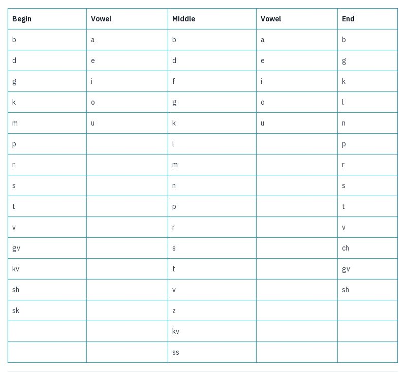
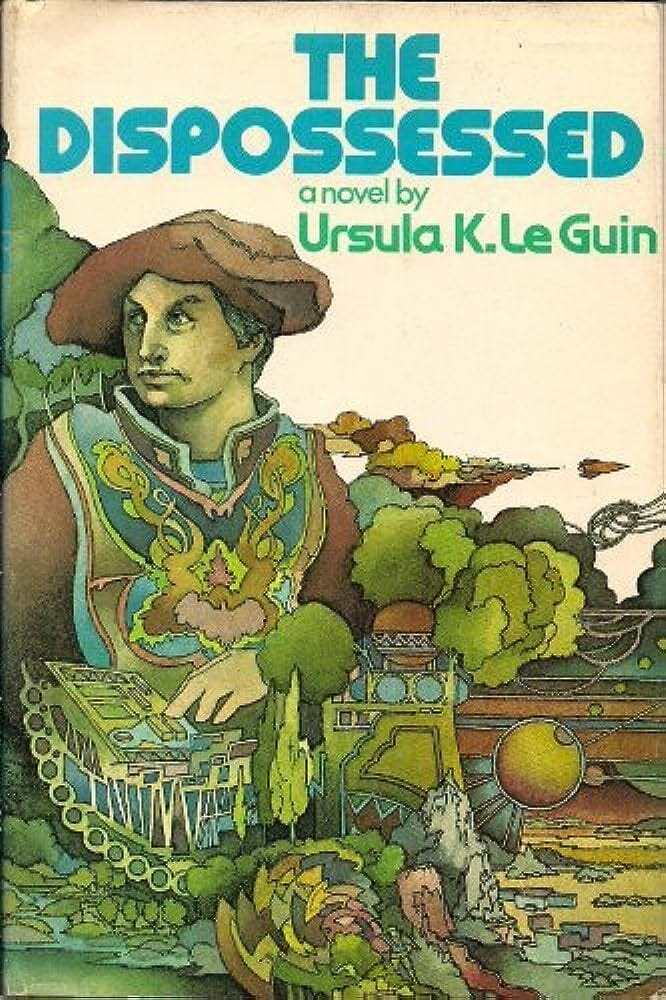

_A[shorter version of this article](https://justutopias.com/fictional-utopian-languages-part-ii-speedtalk-pravic/) previous appeared in ‘Just Utopias’._

Pravic is an artificial language constructed to achieve egalitarian ideals. Invented by Ursula K. Le Guin for her 1974 novel, The Dispossessed, Pravic isn’t unique in the way in which things are said, instead it seeks to influence the way its speakers understand concepts such as non-hierarchical relationship of people to property, possessions, and other people.

The fictional creator of the language is mentioned only once as Farigv, and we learn nothing about him except his aversion to curse words and his reliance on computers for creating the vocabulary: ‘Farigv didn't provide any swear words when he invented the language, or if he did his computers didn't understand the necessity.’ However, their ideals also made swearing difficult, as ‘It is hard to swear when sex is not dirty and blasphemy does not exist.’

Computers, which assisted in developing the language, were also involved in organisational and distributional processes, and still influence the vocabulary, at least where proper nouns were concerned, by assigning names at birth, usually following a two syllable pattern: Shev-ek, Tak-ver, Ru-lag, Bed-ap for example.

 _You can create your own Pravic name using the chart below:_1

But the ideological concepts of the language go back to the founder of their society2, Laia Odo, who was already an influence on how language was used among her comrades3 before they felt an entirely new language was necessary to adequately convey their ideals, following their forced migration to the planet Anarres.

Odo’s ideals were what we would call Anarcho-Communism in human political terms4, in that they reject the state, money, property and class, while organising communally, associating and working voluntarily, and sharing access to the necessities of life freely. Their language embodies these ideals in several notable ways.

To a people who believed ‘where there's property there's theft’ the whole way they spoke about possessions was entirely different than societies in which private property is the norm. In fact two of the worst curse words to them are ‘propertarian’ and ‘profiteer’. Unlike us, the Anaresti people don’t assert ‘this one is mine and that's yours’, instead they say ‘I use this one and you use that.’ The daughter of the protagonist, Shevek, tells him, ‘You can share the handkerchief I use’, showing a fundamentally different understanding of ownership.5

This lack of possessiveness is not limited to objects, but applies to people too. Even in romantic relationships,6 although feelings of intense attachment still existed they ultimately recognised they still did not own or have claim on each other.7 There was no sense of hierarchy in work or civic relationships either, indeed ‘there was no rank, no terms of rank, no conventional respectful forms of address.’ Everyone called eachother ‘Ammar’ a word which could be translated ‘sibling’ and ‘comrade’.

When it came to work it was voluntary, and the word for work and play, ‘kleggich’, was the same. But those with specialised skills could still be given assignments in areas they were needed. They could refuse, but such refusal did not come without a reputational consequence, leading to the lazy being called, ‘nuchnibi’, a word describing those able to work who refused to do so. Yet no-one was denied food or shelter even if they didn’t participate in taking part or contributing to the rest of society.

The language is designed to help form the thoughts of it’s speakers,8 a process which is not entirely natural to children, as Shevek comments, ‘Nobody's born an Odonian any more than he's born civilised!’ A child starts out saying ‘my mother’, but in time learns to say, ‘our mother’ or ‘the mother’ (or ‘mamme’ in Pravic). Likewise, they are trained to speak only about matters that interest others; anything else is ‘egoizing’.

Pravic has four different categories of vocabulary, which seem to correspond to Dante’s four modes of allegory: the literal (physical, technical, verbal), the allegorical, (symbolic, economic), the moral (ethical), and the anagogical (or religious). It comes as a surprise to those Shevek visits on the neighbouring planet of Urras that there is a spiritual aspect to the Pravic language at all, as they are atheists. But he chides his hosts for not thinking his people were capable of loftier thoughts, ‘​​the Modes are built of the natural capacities of the mind, you could not seriously believe that we had no religious capacity? That we could do physics while we were cut off from the profoundest relationship man has with the cosmos?’

The book is full of philosophy, often repeated from Odo’s texts (one of which is even called ‘Analogy’), but sometimes from Shevek himself, such as ‘You cannot keep doors open. You will never be free.’ Which shows that the vocabulary is not purely functional. Although it may have begun that way: ‘The Odonians' first efforts to make their new language, their new world, into poetry, were stiff, ungainly, moving.’ Yet, the theatre was always an important part of their society, ‘There were many regional and traveling troupes of actors and dancers, repertory companies, very often with playwright attached. They performed tragedies, semi-improvised comedies, mimes.’ But, it wasn’t long before they were composing verse too, such as:

> ‘O child Anarchia, infinite promise  
> infinite carefulness  
> I listen, listen in the night  
> by the cradle deep as the night  
> is it well with the child’

Unlike some other constructed languages in fiction (and in recent history) Pravic is not a regulated language,9 due to the nature of the society lacking structures of hierarchy. There is a dictionary, probably compiled by a committee, with the help of computers, but no-one is obliged to use it.

However, new compound words are possible to get across unfamiliar concepts: ‘The word he used was not “wallowing,” there being no animals on Anarres to make wallows; it was a compound, meaning literally “coating continually and thickly with excrement.” The flexibility and precision of Pravic lent itself to the creation of vivid metaphors quite unforeseen by its inventors.’

Yet the Anarresti people were not averse to using some of the Iotic language of their previous home when needed, usually in the form of curse words, such as ‘hell’ and ‘damn’, which while still used have changed their meaning devoid of their religious usage,10 or to refer to alien concepts such as betting: ‘“It's an Iotic verb,” Shevek said. “A game the Urrasti play with probabilities. The one who guesses right gets the other one's property.”’

Despite the seemingly unbridgeable gulf between the anarchist Anarres and capitalist Urras (which is much like our own world), in the end Shevek is able to find others on Urras who share the same ideals and hopes, and discovers that even across different languages some concepts remain unchanged: ‘“We are the children of time,” Shevek said, in Pravic. The younger man looked at him a moment, and then repeated the words in Iotic: “We are the children of time.”’

Although perhaps no Science Fiction book better embodies the ideals portrayed in The Dispossessed, these principles existed long before it was written, and it has helped inspire many to accept and share the same outlook. Six years ago, one academic took the language concepts of Pravic and applied them to English in the form of ‘Pravlish’, and found that within a couple days students were able to adapt to speaking without pronouns and possessiveness,11 supporting the theory that if we change the way we speak about the world we can change the way we understand and live within it too.12

Subscribe

[Share](https://peacefulrevolutionary.substack.com/p/the-utopian-pravic-language?utm_source=substack&utm_medium=email&utm_content=share&action=share)

 _You may also be interested in:_

## Dispossessed Article Series

\- [How Anarres Works](https://peacefulrevolutionary.substack.com/p/how-anarres-works)

\- [The Utopian Pravic Language](https://peacefulrevolutionary.substack.com/p/the-utopian-pravic-language)

\- [Odonian Hymn Of The Insurrection](https://peacefulrevolutionary.substack.com/p/hymn-of-the-insurrection)

\- [Antillia’s Utopia (Anarres On Earth)](https://peacefulrevolutionary.substack.com/p/antillias-utopia)

1

Or the code here - <https://github.com/AnarDocs/anarres_name_generator>

2

Nowhere is the word founder used in the book, but those who share her ideals were initially called Odonions by outsiders, and have reappropriated the term since for themselves.

3

Although Odo herself didn’t always conform to those ideals: ‘The word she should use as a good Odonian, of course, was “part-ner.” But why the hell did she have to be a good Odonian?’

4

The inhabitants of Anarres refer to themselves as ‘Anarchists’, and a human (Terran) commentator refers to the planet of Anaress as practising ‘non-authoritarian communism’ and them being ‘socialists’ and ‘libertarian’ (which meant the same thing as anarcho-communism until liberal capitalists co-opted it in the mid-1970s).

5

“Nobody owns anything to rob. If you want things you take them from the depository.”

6

The consummation of such relationships was one of the few private acts that takes place in private rooms, yet they would not consider it their room, just ‘the bed I sleep in.’ As for sex there are no idioms for the act itself, it is just ‘copulation’.

7

‘Certainly he had felt that he owned Beshun, possessed her, on some of those starlit nights in the Dust. And she had thought she owned him. But they had both been wrong; and Beshun, despite her sentimentality, knew it; she had kissed him goodbye at last smiling, and let him go. She had not owned him. His own body had, in its first outburst of adult sexual passion, possessed him indeed – and her. But it was over with. It had happened.’

8

‘“The Settlers,” said another. “They had to learn Pravic as adults; they must have thought in the old languages for a long time.”’

9

Such as Esperanto or the Académie Française - see https://en.wikipedia.org/wiki/List_of_language_regulators 

10

‘Old words changing meaning - like hell - because don’t have original reference.’

11

See <http://martinedwardes.me.uk/pravic/pravlish_teaching.html> \- A Pravic learning guide & dictionary is available by the author too.

12

The Sapir-Whorf hypothesis (named after Edward Sapir & Benjamin Lee Whorf), also known as linguistic relativity, suggests that the structure and content of a language influence the way its speakers perceive and think about the world.
