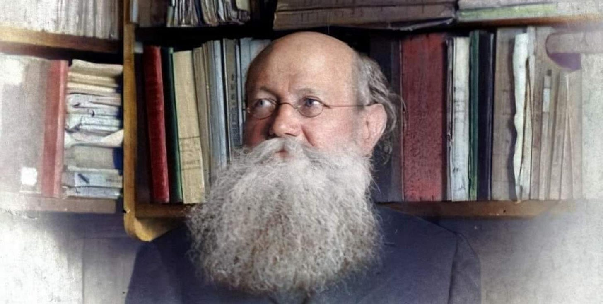

_There is perhaps no book more influential in the history of Anarchism than Kropotkin’s 1892 ‘The Conquest Of Bread’. It inspired revolutionaries and revolutions across the world and continues to do so. Although some find its language and references a little dated, if we were to attempt to modernise the language I fear it would lose too much of its beauty. So I have added some summaries, questions and footnotes of my own to add additional explanation if needed to the first chapter below:_

# Our Riches

## I - The Progress of Human Civilisation

>  **‘Truly, we are rich⁠—far richer than we think; rich in what we already possess, richer still in the possibilities of production of our actual mechanical outfit; richest of all in what we might win from our soil, from our manufactures, from our science, from our technical knowledge, were they but applied to bringing about the well-being of all.’**

 _Humanity has progressed dramatically from primitive times, accumulating vast knowledge and resources. Modern agriculture and industry have exponentially increased productivity, creating potential abundance for all, though benefits often accrue to few. Society possesses far greater wealth and productive capacity than commonly realised, with immense potential to improve everyone's well-being._

The human race has travelled a long way, since those remote ages when men fashioned their rude implements of flint and lived on the precarious spoils of hunting, leaving to their children for their only heritage a shelter beneath the rocks, some poor utensils⁠—and Nature, vast, unknown, and terrific, with whom they had to fight for their wretched existence.

During the long succession of agitated ages which have elapsed since, mankind has nevertheless amassed untold treasures. It has cleared the land, dried the marshes, hewn down forests, made roads, pierced mountains; it has been building, inventing, observing, reasoning; it has created a complex machinery, wrested her secrets from Nature, and finally it pressed steam and electricity into its service.1 And the result is, that now the child of the civilised man finds at its birth, ready for its use, an immense capital accumulated by those who have gone before him. And this capital enables man to acquire, merely by his own labour combined with the labour of others, riches surpassing the dreams of the fairy tales of the _Thousand and One Nights_.2

The soil is cleared to a great extent, fit for the reception of the best seeds, ready to give a rich return for the skill and labour spent upon it⁠—a return more than sufficient for all the wants of humanity. The methods of rational cultivation are known.

On the wide prairies of America each hundred men, with the aid of powerful machinery, can produce in a few months enough wheat to maintain 10,000 people for a whole year. And where man wishes to double his produce, to treble it, to multiply it a hundredfold, he _makes_ the soil, gives to each plant the requisite care, and thus obtains enormous returns. While the hunter of old had to scour fifty or sixty square miles to find food for his family, the civilized man supports his household, with far less pains, and far more certainty, on a thousandth part of that space. Climate is no longer an obstacle. When the sun fails, man replaces it by artificial heat; and we see the coming of a time when artificial light also will be used to stimulate vegetation. Meanwhile, by the use of glass and hot water pipes, man renders a given space ten and fifty times more productive than it was in its natural state.

The prodigies accomplished in industry are still more striking. With the cooperation of those intelligent beings, modern machines⁠—themselves the fruit of three or four generations of inventors, mostly unknown⁠—a hundred men manufacture now the stuff to provide 10,000 persons with clothing for two years. In well-managed coal mines the labour of a hundred miners furnishes each year enough fuel to warm 10,000 families under an inclement sky. And we have lately witnessed the spectacle of wonderful cities springing up in a few months for international exhibitions, without interrupting in the slightest degree the regular work of the nations.3

And if in manufactures as in agriculture, and as indeed through our whole social system, the labour, the discoveries, and the inventions of our ancestors profit chiefly the few, it is none the less certain that mankind in general, aided by the creatures of steel and iron which it already possesses, could already procure an existence of wealth and ease for every one of its members.

 **Truly, we are rich⁠—far richer than we think; rich in what we already possess, richer still in the possibilities of production of our actual mechanical outfit; richest of all in what we might win from our soil, from our manufactures, from our science, from our technical knowledge, were they but applied to bringing about the well-being of all.**

  *  _How has human progress since prehistoric times expanded our ability to produce wealth and resources?_

## II - The Paradox of Wealth and Poverty

>  **‘It is because all that is necessary for production⁠—the land, the mines, the highways, machinery, food, shelter, education, knowledge⁠—all have been seized by the few in the course of that long story of robbery, enforced migration and wars, of ignorance and oppression, which has been the life of the human race before it had learned to subdue the forces of Nature.’**

 _Despite vast societal wealth and productive capacity, poverty persists due to historical exploitation where a minority controls resources and production. Socialists argue that this system perpetuates inequality by limiting access to necessities and prioritising profit over general well-being, even as collective human efforts have dramatically transformed and improved our world._

In our civilised societies we are rich. Why then are the many poor? Why this painful drudgery for the masses? Why, even to the best paid workman, this uncertainty for the morrow, in the midst of all the wealth inherited from the past, and in spite of the powerful means of production, which could ensure comfort to all, in return for a few hours of daily toil?

The Socialists have said it and repeated it unwearyingly. Daily they reiterate it, demonstrating it by arguments taken from all the sciences. **It is because all that is necessary for production⁠—the land, the mines, the highways, machinery, food, shelter, education, knowledge⁠—all have been seized by the few in the course of that long story of robbery, enforced migration and wars, of ignorance and oppression, which has been the life of the human race before it had learned to subdue the forces of Nature.** It is because, taking advantage of alleged rights acquired in the past, these few appropriate today two-thirds of the products of human labour, and then squander them in the most stupid and shameful way. It is because, having reduced the masses to a point at which they have not the means of subsistence for a month, or even for a week in advance, the few can allow the many to work, only on the condition of themselves receiving the lion’s share. It is because these few prevent the remainder of men from producing the things they need, and force them to produce, not the necessaries of life for all, but whatever offers the greatest profits to the monopolists. In this is the substance of all Socialism.

Take, indeed, a civilized country. The forests which once covered it have been cleared, the marshes drained, the climate improved. It has been made habitable. The soil, which bore formerly only a coarse vegetation, is covered today with rich harvests. The rock-walls in the valleys are laid out in terraces and covered with vines. The wild plants, which yielded nought but acrid berries, or uneatable roots, have been transformed by generations of culture into succulent vegetables or trees covered with delicious fruits. Thousands of highways and railroads furrow the earth, and pierce the mountains. The shriek of the engine is heard in the wild gorges of the Alps, the Caucasus, and the Himalayas. The rivers have been made navigable; the coasts, carefully surveyed, are easy of access; artificial harbours, laboriously dug out and protected against the fury of the sea, afford shelter to the ships. Deep shafts have been sunk in the rocks; labyrinths of underground galleries have been dug out where coal may be raised or minerals extracted. At the crossings of the highways great cities have sprung up, and within their borders all the treasures of industry, science, and art have been accumulated.

  *  _Why does poverty persist despite the abundance of wealth and resources in society?_

### The Historical Accumulation of Wealth

>  **‘Whole generations, that lived and died in misery, oppressed and ill-treated by their masters, and worn out by toil, have handed on this immense inheritance to our century.’**

 _The wealth and progress of modern civilisation is built upon the immense suffering and labor of countless generations who toiled in misery. Every aspect of our current infrastructure and societal wealth represents an accumulation of human effort, often under oppressive conditions, and continues to derive its value from being part of a larger interconnected system._

 **Whole generations, that lived and died in misery, oppressed and ill-treated by their masters, and worn out by toil, have handed on this immense inheritance to our century.** For thousands of years millions of men have laboured to clear the forests, to drain the marshes, and to open up highways by land and water. Every rood of soil we cultivate in Europe has been watered by the sweat of several races of men. Every acre has its story of enforced labour, of intolerable toil, of the people’s sufferings. Every mile of railway, every yard of tunnel, has received its share of human blood.

The shafts of the mine still bear on their rocky walls the marks made by the pick of the workman who toiled to excavate them. The space between each prop in the underground galleries might be marked as a miner’s grave; and who can tell what each of these graves has cost, in tears, in privations, in unspeakable wretchedness to the family who depended on the scanty wage of the worker cut off in his prime by firedamp, rockfall, or flood?

The cities, bound together by railroads and waterways, are organisms which have lived through centuries. Dig beneath them and you find, one above another, the foundations of streets, of houses, of theatres, of public buildings. Search into their history and you will see how the civilization of the town, its industry, its special characteristics, have slowly grown and ripened through the cooperation of generations of its inhabitants before it could become what it is today. And even today, the value of each dwelling, factory, and warehouse, which has been created by the accumulated labour of the millions of workers, now dead and buried, is only maintained by the very presence and labour of legions of the men who now inhabit that special corner of the globe. Each of the atoms composing what we call the Wealth of Nations owes its value to the fact that it is a part of the great whole. What would a London dockyard or a great Paris warehouse be if they were not situated in these great centres of international commerce? What would become of our mines, our factories, our workshops, and our railways, without the immense quantities of merchandise transported every day by sea and land?

  *  _How have past generations contributed to the wealth and infrastructure of the modern world?_

### The Collective Nature of Progress and Innovation

>  **‘Each discovery, each advance, each increase in the sum of human riches, owes its being to the physical and mental travail of the past and the present.’**

 _Our current civilisation is the result of collective effort by millions of people throughout history, including countless unknown inventors, thinkers, and workers. Every discovery and advancement is built upon the accumulated knowledge and labor of past generations, making it impossible to truly claim individual ownership of any idea or invention._

 **Millions of human beings have laboured to create this civilisation on which we pride ourselves today. Other millions, scattered through the globe, labour to maintain it.** Without them nothing would be left in fifty years but ruins. There is not even a thought, or an invention, which is not common property, born of the past and the present. Thousands of inventors, known and unknown, who have died in poverty, have cooperated in the invention of each of these machines which embody the genius of man.

Thousands of writers, of poets, of scholars, have laboured to increase knowledge, to dissipate error, and to create that atmosphere of scientific thought, without which the marvels of our century could never have appeared. And these thousands of philosophers, of poets, of scholars, of inventors, have themselves been supported by the labour of past centuries. They have been upheld and nourished through life, both physically and mentally, by legions of workers and craftsmen of all sorts. They have drawn their motive force from the environment.

The genius of a Séguin, a Mayer, a Grove, has certainly done more to launch industry in new directions than all the capitalists in the world.4 But men of genius are themselves the children of industry as well as of science. Not until thousands of steam-engines had been working for years before all eyes, constantly transforming heat into dynamic force, and this force into sound, light, and electricity, could the insight of genius proclaim the mechanical origin and the unity of the physical forces. And if we, children of the nineteenth century, have at last grasped this idea, if we know now how to apply it, it is again because daily experience has prepared the way. The thinkers of the eighteenth century saw and declared it, but the idea remained undeveloped, because the eighteenth century had not grown up like ours, side by side with the steam-engine. Imagine the decades that might have passed while we remained in ignorance of this law, which has revolutionized modern industry, had Watt not found at Soho skilled workmen to embody his ideas in metal, bringing all the parts of his engine to perfection, so that steam, pent in a complete mechanism, and rendered more docile than a horse, more manageable than water, became at last the very soul of modern industry.5

Every machine has had the same history⁠—a long record of sleepless nights and of poverty, of disillusions and of joys, of partial improvements discovered by several generations of nameless workers, who have added to the original invention these little nothings, without which the most fertile idea would remain fruitless. More than that: every new invention is a synthesis, the resultant of innumerable inventions which have preceded it in the vast field of mechanics and industry.

Science and industry, knowledge and application, discovery and practical realisation leading to new discoveries, cunning of brain and of hand, toil of mind and muscle⁠—all work together. **Each discovery, each advance, each increase in the sum of human riches, owes its being to the physical and mental travail of the past and the present.** By what right then can anyone whatever appropriate the least morsel of this immense whole and say⁠—This is mine, not yours?

  *  _How does the world depend on the collective efforts of past and present generations?_

## III - The Monopolisation of Resources

>  **‘We cry shame on the feudal baron who forbade the peasant to turn a clod of earth unless he surrendered to his lord a fourth of his crop. We called those the barbarous times. But if the forms have changed, the relations have remained the same, and the worker is forced, under the name of free contract, to accept feudal obligations.’**

 _Throughout history, the means of production have been seized by a minority, who now control land, mines, machinery, and infrastructure, despite these resources being the result of collective labor and societal needs. This system forces workers to surrender a large portion of their produce to owners and middlemen, perpetuating a form of feudalism under the guise of free contract._

It has come about, however, in the course of the ages traversed by the human race, that all that enables man to produce and to increase his power of production has been seized by the few. Some time, perhaps, we will relate how this came to pass. For the present let it suffice to state the fact and analyse its consequences.

Today the soil, which actually owes its value to the needs of an ever-increasing population, belongs to a minority who prevent the people from cultivating it⁠—or do not allow them to cultivate it according to modern methods.

The mines, though they represent the labour of several generations, and derive their sole value from the requirements of the industry of a nation and the density of the population⁠—the mines also belong to the few; and these few restrict the output of coal, or prevent it entirely, if they find more profitable investments for their capital. Machinery, too, has become the exclusive property of the few, and even when a machine incontestably represents the improvements added to the original rough invention by three or four generations of workers, it none the less belongs to a few owners. And if the descendants of the very inventor who constructed the first machine for lace-making, a century ago, were to present themselves today in a lace factory at Bâle or Nottingham, and claim their rights, they would be told: ‘Hands off! this machine is not yours,’ and they would be shot down if they attempted to take possession of it.6

The railways, which would be useless as so much old iron without the teeming population of Europe, its industry, its commerce, and its marts, belong to a few shareholders, ignorant perhaps of the whereabouts of the lines of rails which yield them revenues greater than those of medieval kings. And if the children of those who perished by thousands while excavating the railway cuttings and tunnels were to assemble one day, crowding in their rags and hunger, to demand bread from the shareholders, they would be met with bayonets and grapeshot, to disperse them and safeguard ‘vested interests.’

In virtue of this monstrous system, the son of the worker, on entering life, finds no field which he may till, no machine which he may tend, no mine in which he may dig, without accepting to leave a great part of what he will produce to a master. He must sell his labour for a scant and uncertain wage. His father and his grandfather have toiled to drain this field, to build this mill, to perfect this machine. They gave to the work the full measure of their strength, and what more could they give? But their heir comes into the world poorer than the lowest savage. If he obtains leave to till the fields, it is on condition of surrendering a quarter of the produce to his master, and another quarter to the government and the middlemen. And this tax, levied upon him by the State, the capitalist, the lord of the manor, and the middleman, is always increasing; it rarely leaves him the power to improve his system of culture. If he turns to industry, he is allowed to work⁠—though not always even that⁠—only on condition that he yield a half or two-thirds of the product to him whom the land recognizes as the owner of the machine.

 **We cry shame on the feudal baron who forbade the peasant to turn a clod of earth unless he surrendered to his lord a fourth of his crop.7 We called those the barbarous times. But if the forms have changed, the relations have remained the same, and the worker is forced, under the name of free contract, to accept feudal obligations.** For, turn where he will, he can find no better conditions. Everything has become private property, and he must accept, or die of hunger.

  *  _How does private ownership of productive resources affect workers?_

### The Consequences of Capitalist Production

>  **‘A vast array of courts, judges, executioners, policemen, and gaolers is needed to uphold these privileges;’**

 _The current economic system prioritises profit over community needs, leading to trade fluctuations, industrial crises, and global conflicts for market dominance. This system also perpetuates social inequality, limits education, and necessitates a vast apparatus of control, ultimately fostering a culture of hypocrisy and sophistry that threatens societal existence._

The result of this state of things is that all our production tends in a wrong direction. **Enterprise takes no thought for the needs of the community. Its only aim is to increase the gains of the speculator.** Hence the constant fluctuations of trade, the periodical industrial crises, each of which throws scores of thousands of workers on the streets.8

The working people cannot purchase with their wages the wealth which they have produced, and industry seeks foreign markets among the monied classes of other nations. In the East, in Africa, everywhere, in Egypt, Tonkin or the Congo, the European is thus bound to promote the growth of serfdom.9 And so he does. But soon he finds that everywhere there are similar competitors. All the nations evolve on the same lines, and wars, perpetual wars, break out for the right of precedence in the market. Wars for the possession of the East, wars for the empire of the sea, wars to impose duties on imports and to dictate conditions to neighbouring states; wars against those ‘blacks’ who revolt! The roar of the cannon never ceases in the world, whole races are massacred, the states of Europe spend a third of their budgets in armaments; and we know how heavily these taxes fall on the workers.

Education still remains the privilege of a small minority, for it is idle to talk of education when the workman’s child is forced, at the age of thirteen, to go down into the mine or to help his father on the farm. It is idle to talk of studying to the worker, who comes home in the evening wearied by excessive toil, and its brutalizing atmosphere. Society is thus bound to remain divided into two hostile camps, and in such conditions freedom is a vain word. The Radical begins by demanding a greater extension of political rights, but he soon sees that the breath of liberty leads to the uplifting of the proletariat, and then he turns round, changes his opinions, and reverts to repressive legislation and government by the sword.10

 **A vast array of courts, judges, executioners, policemen, and gaolers is needed to uphold these privileges** ; and this array gives rise in its turn to a whole system of espionage, of false witness, of spies, of threats and corruption.

The system under which we live checks in its turn the growth of the social sentiment. We all know that without uprightness, without self-respect, without sympathy and mutual aid, human kind must perish, as perish the few races of animals living by rapine, or the slave-keeping ants. But such ideas are not to the taste of the ruling classes, and they have elaborated a whole system of pseudoscience to teach the contrary.

Fine sermons have been preached on the text that those who have should share with those who have not, but he who would carry out this principle would be speedily informed that these beautiful sentiments are all very well in poetry, but not in practice.11 ‘To lie is to degrade and besmirch oneself,’ we say, and yet all civilised life becomes one huge lie. We accustom ourselves and our children to hypocrisy, to the practice of a double-faced morality. And since the brain is ill at ease among lies, we cheat ourselves with sophistry.12 Hypocrisy and sophistry become the second nature of the civilised man.

But a society cannot live thus; it must return to truth, or cease to exist.

  *  _What are some of the negative consequences to society of a profit-driven economic system?_

## The Call for Communal Ownership

>  **‘All is for all! If the man and the woman bear their fair share of work, they have a right to their fair share of all that is produced by all.’**

 _The consequences of monopoly permeate all of social life, necessitating a return to collective ownership of the means of production and their fruits. The principle of ‘All things for all’ should replace individual appropriation, as it is impossible to evaluate each person's contribution to the world's wealth._

Thus the consequences which spring from the original act of monopoly spread through the whole of social life. Under pain of death, human societies are forced to return to first principles: the means of production being the collective work of humanity, the product should be the collective property of the race. Individual appropriation is neither just nor serviceable. All belongs to all. All things are for all men, since all men have need of them, since all men have worked in the measure of their strength to produce them, and since it is not possible to evaluate everyone’s part in the production of the world’s wealth.

All things for all. Here is an immense stock of tools and implements; here are all those iron slaves which we call machines, which saw and plane, spin and weave for us, unmaking and remaking, working up raw matter to produce the marvels of our time. But nobody has the right to seize a single one of these machines and say: ‘This is mine; if you want to use it you must pay me a tax on each of your products,’ any more than the feudal lord of medieval times had the right to say to the peasant: ‘This hill, this meadow belong to me, and you must pay me a tax on every sheaf of corn you reap, on every brick you build.’

 **All is for all! If the man and the woman bear their fair share of work, they have a right to their fair share of all that is produced by all** , and that share is enough to secure them well-being. No more of such vague formulas as ‘The right to work’, or ‘To each the whole result of his labour.’ What we proclaim is **The Right to Well-Being: Well-Being for All**!

  *  _How should we meet people’s needs instead of the current system of private ownership?_

 Image taken from https://autonomies.org/2021/11/the-legacy-of-peter-kropotkin/

 **Please read the rest of the[Conquest Of Bread](https://anardocs.github.io/thebreadbook.org/).**

Subscribe

[Share](https://peacefulrevolutionary.substack.com/p/our-riches?utm_source=substack&utm_medium=email&utm_content=share&action=share)

1

The use of steam power and electricity marked major technological advancements during the Industrial Revolution of the 18th and 19th centuries, transforming manufacturing, transportation, and daily life.

2

Also known as ‘Arabian Nights,’ this is a collection of Middle Eastern folk tales compiled during the Islamic Golden Age (8th-13th centuries). It was widely popular in Europe following its translation in the early 18th century.

3

This likely refers to World's Fairs or Universal Expositions, popular in the 19th and early 20th centuries. These large international exhibitions showcased cultural and technological achievements, often featuring specially constructed pavilions and even entire ‘exhibition cities’.

4

Marc Séguin (1786-1875) was a French engineer known for inventing the wire-cable suspension bridge and improving the steam engine. Julius Robert von Mayer (1814-1878) was a German physician and physicist who was one of the founders of thermodynamics. Sir William Robert Grove (1811-1896) was a Welsh judge and physical scientist who anticipated the general theory of the conservation of energy and invented the Grove fuel cell.

5

James Watt (1736-1819) was a Scottish inventor who significantly improved the steam engine, making it more efficient and adaptable for industrial use. Soho refers to the Soho Foundry in Birmingham, England, where Watt and his business partner Matthew Boulton manufactured steam engines.

6

The lace-making machine, likely referring to the bobbin net machine invented by John Heathcoat in 1808 or the Leavers machine developed by John Leavers in 1813, revolutionized the lace industry. Nottingham, England, and Basel, Switzerland, were significant centres of lace production in the 19th century.

7

This refers to the feudal system prevalent in medieval Europe, where peasants (serfs) were bound to work on a lord's land and pay taxes or tribute from their harvest. This system began to decline in Western Europe from the 14th century onward.

8

This passage refers to the boom-and-bust cycles common in 19th century capitalism, particularly the recurring economic depressions that caused widespread unemployment and hardship.

9

This passage refers to European colonial expansion in the late 19th century. Tonkin was the northern region of Vietnam under French colonial rule, while Congo likely refers to the Congo Free State, privately owned by King Leopold II of Belgium. The author is critiquing the exploitative nature of colonialism.

10

Here, ‘Radical’ refers to political reformers who initially advocate for democratic rights but often revert to conservative positions when faced with the prospect of genuine social change.

11

This is likely an allusion to Christian teachings on charity and sharing wealth, particularly referencing Luke 3:11 in the New Testament. The author is pointing out the hypocrisy of those who preach such ideals but do not practice them in reality.

12

Sophistry refers to the use of clever but false arguments, especially with the intention of deceiving.
