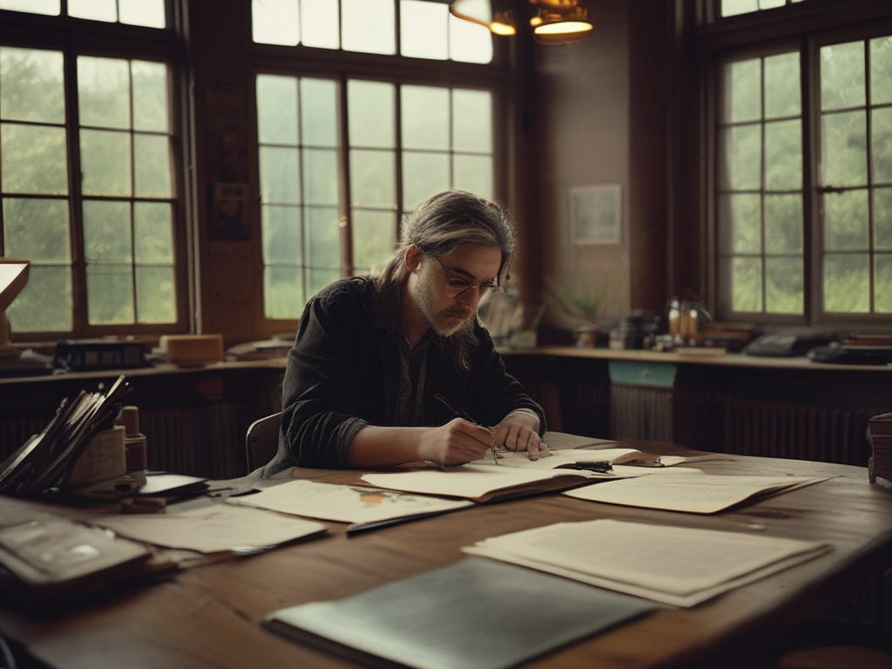
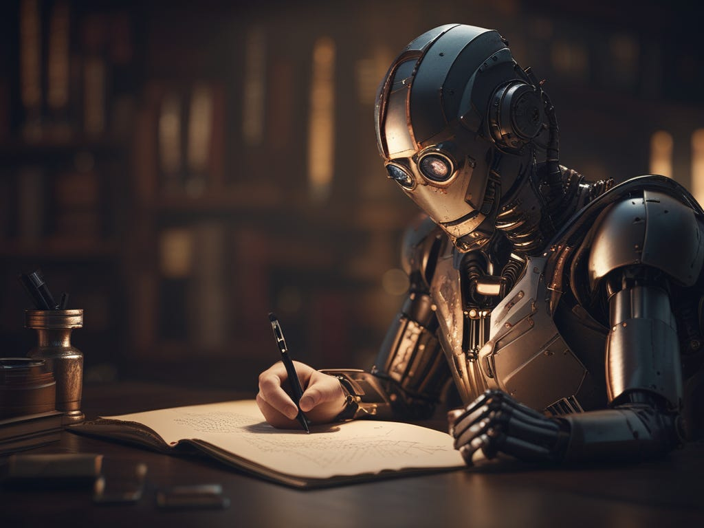

In [my previous article](https://peacefulrevolutionary.substack.com/p/the-once-and-future-author) I looked at the current dystopian process of being an author under capitalism, which led me to wonder how different it could be without the need to make money, pay rent and bills, or to please or provide profit for our current corporate and state rulers.

Writing and publishing has undergone many changes in human history already. Before the printing press writers had no hope (and probably no idea) of making money from it. Great complex epics were written, produced by feats of imagination we still look in awe at today.

Accountants invented writing, initially to record debts owed, but it wasn't long before they added words to describe what they were accounting for. Not long after they added ways to complain about their work, and to sneak write love notes to each other. We still have some ancient Sumerian and Egyptian examples of these.

Our earliest examples of poetry and fiction come from both women and men. The high priestess Enheduanna, was creating poetry as far back as 2285 BC in what is now Iraq. The first longform work came about a couple hundred years later with the Mesopotamian Epic Of Gilgamesh. The Greeks added their own epic with The Iliad and The Odyssey in the 8th century BC, with ancient India giving us the Mahabharata around the same time. Then came the Hebrew Bible around the 6th century BC. which was the first book to ever be printed in 1455 AD by good old Gutenberg.

Even when we get to Shakespeare (writing between 1590-1613) his plays were a means to get bums on theatre seats. Many did this with more bawdy tales which got in the punters but have since been forgotten. I would argue that he wanted to do this while creating art, but he needed the bums on the seats for anyone to know his art existed.1

A hundred years afterward Defoe gave us 1719 Robinson Crusoe, the first English novel, and he became the first paid author and the first to ever receive royalties. But by the next century competing authors are struggling to find publishers. Dickens (writing between 1836-1865) like many of his contemporaries find their first opportunities serialising their novels in monthly (or even weekly) periodicals, which would later be collected into books if popular enough. This process continued into the 1940s and occasionally still does.

Ultimately we reached the stage where we are today, with literary agencies (some of which, like Curtis Brown started in the 1890s as theatrical agents) being the arbiters of what is publishable, acting on behalf of their writing clients to secure deals with publishers. Now we have reached the point where the average first book publishing advance is £6000 / $5000. A sum which has changed little since the days when that could support an author for a year. While celebrity authors can receive deals in the millions from the big five publishing houses which sell about a billion worth of books each annually.

## Writing In An Anarchist Utopian World

So, how would writing and publishing be different in a non-hierarchal, non-scarcity, voluntary world?

For the first 4000-odd years of written fiction writers didn't make money directly from their manuscripts (or tablets or papyri for that matter). It has only been in the last 300 years this has taken place - 7% of our literary history (less if you count non-fiction, although playwrights - who were often also actors - made money from performances of their plays much earlier). Some early writers were priests or monks, or those who already had sufficient wealth and free time to write. However, there were always exceptions among the servants, slaves, indigent bards, and the working class who didn't have those luxuries.

So if there was no money, people would still tell tales. There will always be people who feel they have a story to tell or to pass on. This process began before there was writing, and would continue if there was financial incentive to do so. Whether that is on paper, out loud, acted out, or on screen. Even if that screen is a bedsheet and the actors are silhouettes.

But, apart from the most monkish or timid of writers, whose works may only be brought to light posthumously, many writers will seek an audience and only continue coming up with new stories if they find one. So this raises the question of how will audiences be found in a world without money or intellectual property for that matter?

As mentioned earlier periodicals with serialised stories was one way in which a lot of potential readers were once introduced to many of what would later become classic stories. This is how Conan-Doyle, Dickens, Dumas, Hugo, Wells and Tolstoy did it, and even more recently Dune and The Bonfire of the Vanities found their audience first in that form. I'd like to envision such story-orientated magazines seeing a resurgence, especially when they can be picked up freely at public venues.

Another way in which stories made it into the minds of readers was for part of the story to make it to their ears first. Not every writer is a natural narrator, but readings have long been part of the book signing circuit. Then there are theatres and travelling actors and storytellers looking for new and interesting material to adapt and portray, and there is no reason why film, television and streaming adaptations won't continue to occur. Likewise audiobooks and radio dramas are still likely to be other avenues to continue to spread stories.

I imagine there will continue to be book reviewers who will praise books they like on their podcasts, vidcasts and other kinds of shows. There will of course always be word of mouth too, with those who love the book sharing their love for it with friends and convincing them to read it.

Reading will flourish, some picking different genres and others being more eclectic in their tastes. They will have a chance to share new books, share reading experiences, and perhaps for authors to offer their own books for consideration. These books will have been workshopped and proofread already in writing groups, in which people take turns sharing their work and getting feedback on it.

Aligned with these will be publishing committees, who will take recommendations for future books worth producing, because they have already been well received by other writers and test readers. Small press printing and publishing is a labour of love now without much money beyond bills in it, but without the necessity of paying for the publishing process they will be freed up to make more of the kinds of the books they love available.

There will of course continue to be self-publishing, and I believe there will still be publishing houses of a sort.2 Maybe those whose books are further down the publishing schedule or not on it yet could volunteer to do it themselves out of hours, starting with a smaller run of books to raise interest, in order to avoid the danger of bureaucracy preventing publication.

Then when it comes to getting hold of books there will still be libraries (stationary and travelling), book shares and book stores. Although none will be sold, so the distinctions will probably blur and the term store might be redundant by then. Perhaps, except for occasional gifted and keepsake books, people will take a book, but would be expected to pass it on or bring it back.

However, the prospect of there being no intellectual property laws doesn't mean that original work will have no value and that correct attribution will be unimportant. Authenticity and honesty will still be as valued in a non-hierarchal non-capitalist world, arguably more so. What it does mean, is there will be no financial incentive to pretend to have written or created some work of art you didn't, and no need of a poor author to potentially bankrupt themselves trying and defeat a rich publisher in court who has stolen their work.

Ursula K. Le Guin who imagined such a decentralised, moneyless world in her book The Dispossessed, once commented that, ‘We live in capitalism. Its power seems inescapable. So did the divine right of kings. Any human power can be resisted and changed by human beings. Resistance and change often begin in art, and very often in our art, the art of words.’3 or more simply put ‘Someone once said that, “it is easier to imagine the end of the world than to imagine the end of capitalism.”’4 But stories help us to visualise possible futures very different than the world we know now. To the end, I've written a little vignette imagining what a future author's life might be like.

## A Talk To The Class Of 2060 - 30 Years Post-Revolution

When I was asked to give this little talk to your literature class I wasn't sure I had that much to say. You have had troubadours, storytellers and actors speak to you in the proceeding weeks before it was my turn, and they have a much more engaging way of expressing their role in the literary arts. But then I remembered when I was your age and first discovered my own calling, and how I wished then someone had let me know that my dream was a possibility.

I am a writer. I write. That is how I spend my days. I have been a writer since my early teens. Back then almost no-one read what I wrote. The exception being my longsuffering mother, patient girlfriends, and sometimes critical often encouraging teachers. As a young adult I joined local writers groups that helped me to workshop my drafts, to hone my craft, and to help me winnow the distance between my vision and my vocabulary.

Now I am an author. My books have been published in several forms: online, in periodicals, ebooks, and in print books. You can find my stories in book repos, sitting on the shelves of literary cafes, and in school libraries. I picture a few of my books are in the bags of readers waiting to be read in parks, in comfy armchairs, on benches and beaches, then to be passed on to other potential readers.

When I'm not writing I'm thinking about writing, or talking about writing, sometimes in an organised fashion, doing research or giving talks and readings, but mostly done in the haphazard way I fill my days.

I feel my stories are appreciated. People tell me they like my stories and share theories about the stories behind my stories. Some have even written their own prequels, sequels and sidequels exploring what happened to characters before or after they appeared in my works. And why shouldn't they? I'm honoured to have inspired such works.

I'm currently writing a story set in a pretend capitalist theme park that gets cut off from the rest of the world and starts mimicking the old dysfunctions of capitalism, even when there are no new visitors to pretend for. It is a chilling story, but I have to be careful to not give into the temptation turn it into a comedy, because the idea is so unbelievable. 

Earlier in the process of our world becoming the way it is now, when I was still quite young, I didn't always have quite as much time to write. There were tasks we all needed to lend our hands to, but even then it was felt that such art was important, and I was still engaged in it. Not that anyone forced me to contribute my time back then, but I felt a greater moral obligation when the need to help was greater. But that was a relatively short period, an adjustment, until we returned to producing all we needed with a minimum of labour. 

I still volunteer to help out with odds and sundry from time to time, for the camaraderie, for the friend-making, and the solidarity. But if I do too much my friends gently remind me they are waiting for my latest book and encourage me to spend more time on it. 

My message to you is: reading can be exciting, sobering, and inspiring. It can make you laugh or jump or reflect. It can help you to see the world through another's eyes, and to see worlds that once existed or maybe never will. A novel is magic made by words, that finds its power whenever you give it your time and attention. It's a privilege for me to have a part in this, and I hope some of you will choose a similar path too.

I can't conceive what it was like to be a writer in the days of capitalist oligarchy when most writers couldn't make a living from their art. Of course, now the whole idea is preposterous, but it is an interesting to contemplate what it must have been like. To me it seems like the plot of a horror story. 

Subscribe

[Share](https://peacefulrevolutionary.substack.com/p/writing-in-an-anarchist-utopia?utm_source=substack&utm_medium=email&utm_content=share&action=share)

 _See Antillia’s Utopia for an idea of how a whole society might be structured around these principles:_

1

This had been the process since the earliest plays ‘The Persians’ by the ancient Greek playwright Aeschylus, first performed in 472 BC.

2

Sorry literary agents, but I can’t imagine a future with you in it.

3

Speech in Acceptance of the National Book Foundation, 19 November 2014.

4

Frederic Jameson, ‘Future City’, New Left Review, May/June 2003.
